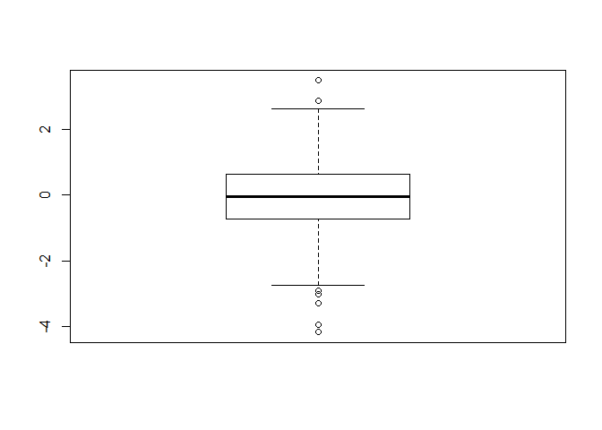
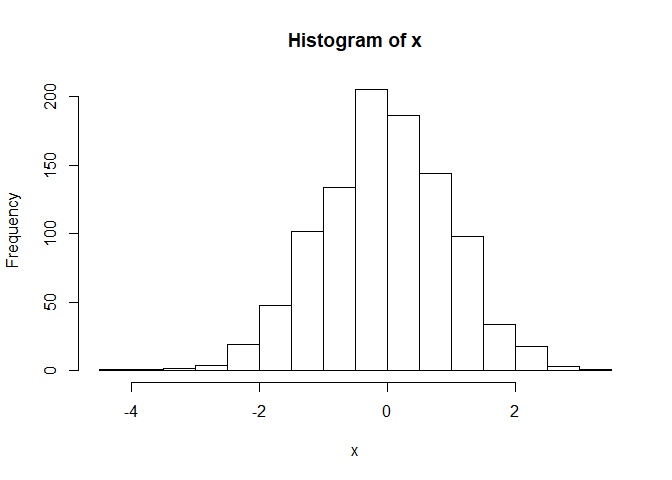
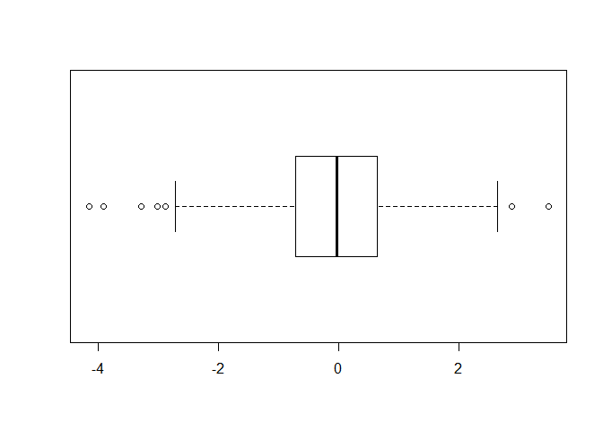
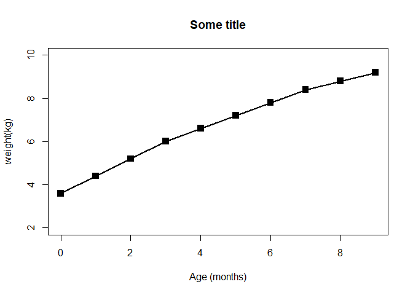
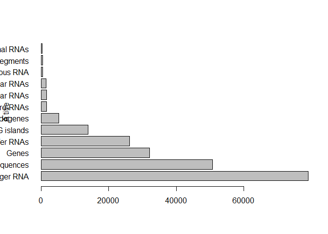
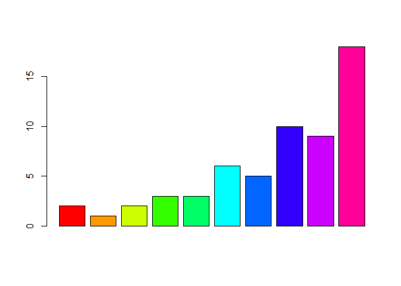
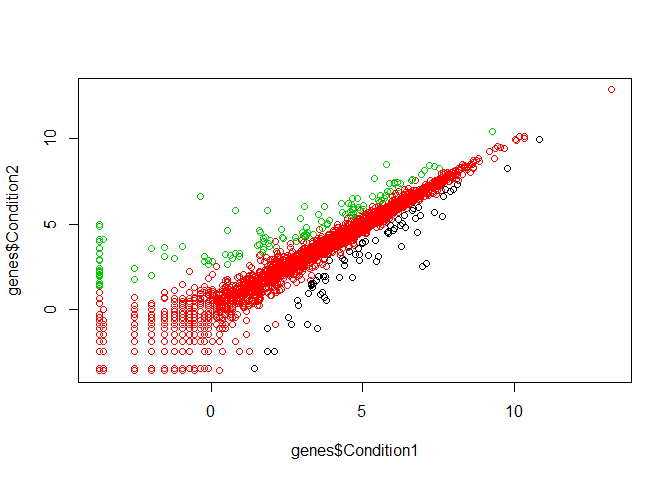
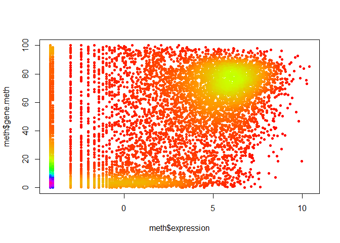

Class05
================
Ryan Park
January 24th, 2019

``` r
#class05 graphics intro

#my first boxplot
#` x is `2*4``
x <- rnorm(1000,0)
boxplot(x)
```



``` r
summary(x)
```

    ##     Min.  1st Qu.   Median     Mean  3rd Qu.     Max. 
    ## -4.15925 -0.72783 -0.03541 -0.03880  0.63750  3.48098

``` r
hist(x)
```



``` r
boxplot(x, horizontal = TRUE)
```



``` r
weight <- read.table("bimm143_05_rstats/bimm143_05_rstats/weight_chart.txt", header = TRUE,sep = "")
plot(weight$Age,weight$Weight, type = "o", pch = 15,cex=1.5,lwd=2,ylim=c(2,10),xlab = "Age (months)",ylab = "weight(kg)",main = "Some title")
```



``` r
feature <- read.table("bimm143_05_rstats/bimm143_05_rstats/feature_counts.txt", header = TRUE,sep = "\t")
par(mar = c(5.1,4.1,4.1,2.1))
barplot(feature$Count,horiz = TRUE,ylab = "A title", names.arg = feature$Feature,las = 1)
```



``` r
hist(c(rnorm(10000),rnorm(10000)+4), breaks = 100)
```


``` r
counts <- read.delim("bimm143_05_rstats/bimm143_05_rstats/male_female_counts.txt", row.names = NULL, sep = "")
barplot(counts$Count, col = rainbow(nrow(counts)))
```



``` r
genes <- read.delim("bimm143_05_rstats/bimm143_05_rstats/up_down_expression.txt")
table(genes$State)
```

    ## 
    ##       down unchanging         up 
    ##         72       4997        127

``` r
plot(genes$Condition1,genes$Condition2, col = genes$State)
```



``` r
meth <- read.delim("bimm143_05_rstats/bimm143_05_rstats/expression_methylation.txt")
colorss <- densCols(meth$expression, meth$gene.meth, colramp = colorRampPalette(rainbow(10)))
plot(meth$expression, meth$gene.meth, pch  = 20, col = colorss)
```


