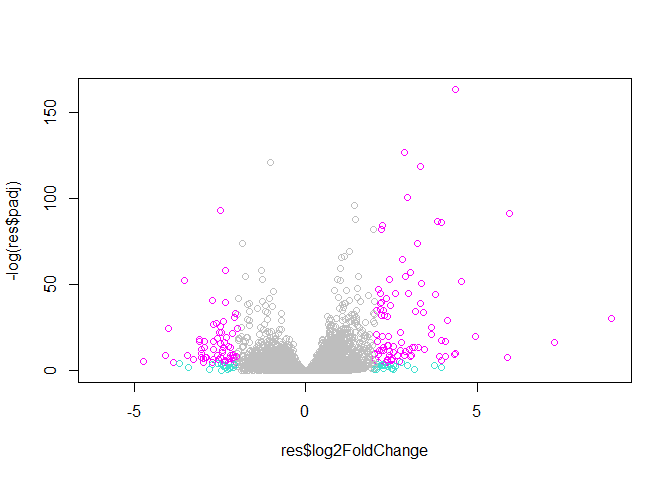
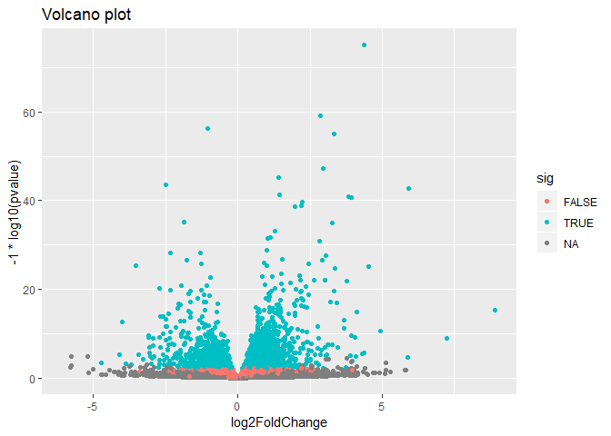

Untitled
================

``` r
counts <- read.csv("data/airway_scaledcounts.csv", stringsAsFactors = FALSE)
metadata <-  read.csv("data/airway_metadata.csv", stringsAsFactors = FALSE)
```

``` r
dim(counts)
```

    ## [1] 38694     9

``` r
head(counts)
```

    ##           ensgene SRR1039508 SRR1039509 SRR1039512 SRR1039513 SRR1039516
    ## 1 ENSG00000000003        723        486        904        445       1170
    ## 2 ENSG00000000005          0          0          0          0          0
    ## 3 ENSG00000000419        467        523        616        371        582
    ## 4 ENSG00000000457        347        258        364        237        318
    ## 5 ENSG00000000460         96         81         73         66        118
    ## 6 ENSG00000000938          0          0          1          0          2
    ##   SRR1039517 SRR1039520 SRR1039521
    ## 1       1097        806        604
    ## 2          0          0          0
    ## 3        781        417        509
    ## 4        447        330        324
    ## 5         94        102         74
    ## 6          0          0          0

``` r
head(metadata)
```

    ##           id     dex celltype     geo_id
    ## 1 SRR1039508 control   N61311 GSM1275862
    ## 2 SRR1039509 treated   N61311 GSM1275863
    ## 3 SRR1039512 control  N052611 GSM1275866
    ## 4 SRR1039513 treated  N052611 GSM1275867
    ## 5 SRR1039516 control  N080611 GSM1275870
    ## 6 SRR1039517 treated  N080611 GSM1275871

all function: returns true if everything inside is true:

``` r
all()
```

    ## [1] TRUE

``` r
View(metadata)
```

``` r
control.inds <- metadata$dex == "control"
head(counts[,control.inds])
```

    ##           ensgene SRR1039509 SRR1039513 SRR1039517 SRR1039521
    ## 1 ENSG00000000003        486        445       1097        604
    ## 2 ENSG00000000005          0          0          0          0
    ## 3 ENSG00000000419        523        371        781        509
    ## 4 ENSG00000000457        258        237        447        324
    ## 5 ENSG00000000460         81         66         94         74
    ## 6 ENSG00000000938          0          0          0          0

``` r
#incorrect, its pulling treated because one of the collumns is off by

#correct way:
control.ids <- metadata$id[control.inds]
```

mean counts value

``` r
rowSums(counts[,control.ids])/ ncol(counts[,control.ids])
```

    ##     [1]    900.75      0.00    520.50    339.75     97.25      0.75
    ##     [7]   5219.00   2327.00    755.75    527.75    226.75   3169.50
    ##    [13]    589.50    110.50    695.25     11.25   2146.00   1117.50
    ##    [19]    936.00    251.25      2.25    735.00   1249.25   8802.75
    ##    [25]      1.75      1.25      9.75    125.00    385.25   7889.00
    ##    [31]    237.50    498.75   1962.25    581.25    149.25      9.00
    ##    [37]    146.50    900.00    107.00   2244.25   6153.75    338.25
    ##    [43]   3384.25     24.25     33.75   1562.75    341.00   1498.50
    ##    [49]   4037.50   1376.50      5.50    664.00   1510.25   1563.50
    ##    [55]    100.00   1390.00    550.50  13843.75    126.25    380.75
    ##    [61]    270.50      1.50     23.00     35.75      0.00    158.75
    ##    [67]    686.75   1894.75     11.50      0.00    499.25   1199.75
    ##    [73]      0.00   2255.50    779.50   1430.75    211.25      0.75
    ##    [79]    640.25    481.50      1.00      9.00    347.25    399.50
    ##    [85]     31.50     96.25    476.00    711.25    815.00   1093.75
    ##    [91]    250.50    472.25   2897.25    160.00      4.50      0.25
    ##    [97]    305.25    228.00    490.25     48.75   1994.75    968.75
    ##   [103]      5.50    641.00    258.75   3123.00   1365.50      4.50
    ##   [109]   1192.00   1232.00    839.25   5427.25     13.50      8.00
    ##   [115]   2644.00    412.50    151.50    209.00   3365.00      0.75
    ##   [121]      0.00    333.75      0.00      0.75    592.25   7030.25
    ##   [127]      0.25    570.25     11.25   1533.25     90.25    660.75
    ##   [133]      0.00      8.25   1410.00    248.25    436.25    211.25
    ##   [139]    298.75   1073.25      6.00   1311.00      5.25    815.50
    ##   [145]      0.00    198.75    112.00     79.50   1185.25      1.75
    ##   [151]    183.00    315.75   1302.75   2495.25     46.00    931.50
    ##   [157]     27.25    585.25    182.00      2.75   1075.00     84.50
    ##   [163]      2.50      0.75    891.75      3.25    655.75      0.00
    ##   [169]   4213.00      1.75      2.50   6982.00      0.00    549.25
    ##   [175]    125.75      3.00      0.00      1.75      1.00    278.50
    ##   [181]      0.00     38.75    265.50   1887.00    761.75     18.75
    ##   [187]     12.75    604.50    645.75    632.50   1410.50      0.00
    ##   [193]   1066.75    871.75    437.50      8.00      4.00   1596.75
    ##   [199]     14.75    272.25    426.50      9.75    563.00   1319.25
    ##   [205]      1.75      0.00      8.75   2458.00     20.25   1898.25
    ##   [211]    557.00   3317.25     86.25    475.25     10.25    103.75
    ##   [217]    163.50   4053.00    292.75      0.50  12969.25   2022.50
    ##   [223]     27.00    162.50   4750.75     18.25   1248.25    793.25
    ##   [229]    739.50   5380.50  11842.25  17268.25   2132.00   6053.50
    ##   [235]      6.25      0.00     48.00      5.50    160.50      5.50
    ##   [241]    441.50    970.50      5.75   3183.25   1781.75     21.75
    ##   [247]    199.00   1015.25    278.75   2863.25   1628.25    834.50
    ##   [253]   3249.75      0.00   1319.50   1310.25     25.75     74.50
    ##   [259]      0.50   3015.50      1.50    249.50      1.75   2923.75
    ##   [265]     18.25    152.50     71.75    174.75      0.75    543.00
    ##   [271]    815.00   1827.25   1820.00     25.50   1371.75    486.75
    ##   [277]    727.75  19624.75    287.25      0.50   3505.50    635.25
    ##   [283]    233.75    188.25    801.50      0.75    885.75    436.50
    ##   [289]    405.75   1849.25    430.75   3398.25     14.75    204.25
    ##   [295]    455.00   1492.00    403.75    281.50   1529.50   2157.25
    ##   [301] 331697.00    119.50    901.00    858.00   1116.25      4.00
    ##   [307]      1.75    864.00      0.50    378.50   1245.25      3.75
    ##   [313]   1683.50    765.25    125.25      0.75   1327.00      0.00
    ##   [319]   2189.50      0.00    778.75   5672.75    366.75   2301.00
    ##   [325]   1701.50    473.00   3350.25    376.75   5568.00   1060.50
    ##   [331]   8592.50   1569.25   1648.25    269.25   2537.50    333.00
    ##   [337]    455.25    918.50    596.75    269.00   1369.50    701.50
    ##   [343]   1047.00      8.50     91.25    975.75    204.25    471.25
    ##   [349]   3381.50     23.25   1640.00   1330.25    666.25    699.00
    ##   [355]      2.75    255.50   2409.00      7.00      0.50    368.50
    ##   [361]   6074.75     32.00    713.25    182.50      0.50   1735.00
    ##   [367]      0.25    155.00     15.25      0.50      0.25   1654.00
    ##   [373]   3271.00    920.75    611.00   2937.75   1129.00     60.25
    ##   [379]     17.00   2914.25    840.00      0.25    318.00   1092.50
    ##   [385]    281.75     63.75      5.75   3287.25      0.00     26.50
    ##   [391]    280.00      1.25   3054.50     55.75   1773.50   1556.25
    ##   [397]   1324.00  11392.75      0.50    379.50    253.25   2014.00
    ##   [403]     86.25    537.50     20.00    562.25      3.25      4.25
    ##   [409]    533.00     21.75   1231.50   1362.25    379.50      0.00
    ##   [415]   9314.50   2153.50      0.00      4.25    158.75   2759.00
    ##   [421]    194.25    677.00    129.25   2482.00   1803.00   2860.50
    ##   [427]   1390.75   1139.75     61.25   2043.00     93.25    335.00
    ##   [433]    478.00   1957.25     16.00      6.25    658.00   1221.25
    ##   [439]   1364.50  11539.50     23.50    229.00      9.00    293.25
    ##   [445]   1615.25    295.00    402.50    114.00    383.75    982.00
    ##   [451]   3879.00   2180.00 110608.00    250.25   1210.00    266.75
    ##   [457]  26231.50     32.25    429.50      0.75    955.75    699.75
    ##   [463]     80.25      1.00   1331.25    472.25      0.50    278.25
    ##   [469]    405.25   1301.75     88.25    619.50   3785.25    540.00
    ##   [475]    372.50   3714.50   1564.25    105.50      1.25    119.00
    ##   [481]   2063.25    740.75    992.25    184.75     32.50    213.75
    ##   [487]  12420.25   1498.00    456.75     86.50   3590.75   2004.50
    ##   [493]    730.50    226.25   1522.00    304.50    567.00    414.50
    ##   [499]   1224.75   2486.50     10.25   1814.50   1161.25   1205.50
    ##   [505]    871.25   1071.25   3367.75     33.25    901.00     11.00
    ##   [511]  14673.75    161.50    865.75    418.50   1303.50    474.25
    ##   [517]    591.50    369.75  12770.25     17.75    395.00   1248.50
    ##   [523]   1004.25      0.00  58821.00   1124.25   1236.25   1889.75
    ##   [529]      4.75      0.25     49.00    916.75      3.00     15.00
    ##   [535]      0.00    480.25    286.75     11.25    803.25    608.75
    ##   [541]    460.25    364.25    109.25     23.25    712.75    368.25
    ##   [547]   2522.25   1492.75     13.25   1090.25   6787.25  11054.25
    ##   [553]    776.25    202.25     10.00   1544.75    247.00   1249.25
    ##   [559]   1797.25     10.50   4653.25      3.50    373.50      2.75
    ##   [565]    319.75    270.50    814.75    230.25    563.50      2.50
    ##   [571]    941.50    116.50    765.50    115.75   1358.50      2.50
    ##   [577]    586.25    391.25   4931.00    209.50   1476.50    253.00
    ##   [583]    489.00      3.25    242.50    417.25   1503.00   1048.00
    ##   [589]   1165.25      4.75      0.00     37.25     11.75      1.25
    ##   [595]    728.50   1492.75      0.00      0.00    265.00      1.00
    ##   [601]      0.00   1511.75   8465.00    419.75    594.00     51.25
    ##   [607]  16004.75     41.25    346.75    585.00    323.00      0.75
    ##   [613]     61.50    516.25    715.00    341.50    890.00   2555.50
    ##   [619]    806.25     65.25   5134.50     17.00    926.25    244.00
    ##   [625]      0.75      8.75    514.50    439.50   1476.50    484.50
    ##   [631]      6.25  16617.50   1732.25      1.75    537.50    482.25
    ##   [637]    895.00    171.25    992.25   1547.50    343.00      0.50
    ##   [643]   1920.75     43.00    782.75      8.25   1744.00   2546.00
    ##   [649]   4300.75   4403.00    631.00     98.50   3269.25    191.50
    ##   [655]    188.75   5652.00   3417.25    405.00      1.25     26.00
    ##   [661]     16.75  16639.50   6573.50   5546.00    166.25   1949.75
    ##   [667]   1134.00   1990.50      2.25    104.50   4768.25    402.75
    ##   [673]      0.00   1071.25  17283.25    370.75    229.25    549.25
    ##   [679]   9929.50   1020.50    124.25     91.00    386.25      9.75
    ##   [685]    992.25      0.00   1196.50    445.50   1906.75   1108.50
    ##   [691]     31.25     31.25    348.25    642.75    173.75   1067.75
    ##   [697]    281.50   1741.00      2.25    685.00    395.50    581.00
    ##   [703]    345.00   2704.00     19.50      4.00   3584.25     14.00
    ##   [709]    946.00    352.00     45.50    332.50     43.75     45.50
    ##   [715]    806.00    722.75    573.00      0.50    751.50   3102.50
    ##   [721]    986.25      3.00     32.75   1274.75    321.25    249.75
    ##   [727]     26.75     55.75   1640.50    536.75    647.50   1806.25
    ##   [733]     25.25   3191.50      0.25      0.00    136.50   2176.50
    ##   [739]     17.25    694.25    519.50   3674.75     21.50   1268.00
    ##   [745]    553.25    385.50   1736.25   2295.25   2280.00    855.00
    ##   [751]   2308.75    123.25     97.00   2324.75    754.00     19.00
    ##   [757]      0.00    348.25   3085.00    191.00      0.50      0.00
    ##   [763]    208.25   1354.75    107.00    502.50    257.25   2905.00
    ##   [769]      0.00   1032.00     12.75      4.50      6.50   3588.25
    ##   [775]    160.50    531.25     20.25    543.25    999.00    457.00
    ##   [781]   1667.00     55.75   1491.50  12534.75   1756.50      3.50
    ##   [787]      4.25    640.25    520.25  12119.50   4413.25    457.25
    ##   [793]    423.50    276.50      6.75   1334.00    573.50     16.50
    ##   [799]    260.75   1739.75    414.25    389.50    208.25   1034.25
    ##   [805]    306.00   1262.00    179.25    465.25   4401.25      2.50
    ##   [811]   6097.00      0.00   1724.50    971.75      0.50      0.25
    ##   [817]    289.50    420.50    498.25      0.50    129.25   1121.50
    ##   [823]    272.25    790.50   2791.50   2677.75     98.75   1147.25
    ##   [829]      0.00     81.25   5454.75    556.50   1745.75    880.75
    ##   [835]    592.50   1536.25      8.25      1.50   1213.25     35.00
    ##   [841]    174.75   2036.50      2.00    691.50   1217.50   1139.25
    ##   [847]   2824.00   1934.50    163.75      2.50  14520.25     33.50
    ##   [853]    264.75    314.50   8800.75    149.25    402.00   2241.25
    ##   [859]   2392.25   1521.00    814.00      0.00    568.50    781.75
    ##   [865]   5604.50    120.75    378.25   1246.75    395.50    429.50
    ##   [871]    415.50   1074.75      0.00    204.75     30.00   2733.00
    ##   [877]      0.00     46.00      7.25      1.50    618.25    829.00
    ##   [883]   2242.50   1457.25    110.50    384.75    327.50     43.50
    ##   [889]  11122.00   1749.75    540.75    265.50    104.25   7533.50
    ##   [895]    199.75     94.75    317.00   2141.25    274.25     11.75
    ##   [901]      0.00   1433.00    579.25    406.50   1155.25     44.25
    ##   [907]    278.00    709.50   4389.25    487.00    964.00    128.50
    ##   [913]    431.25   1973.50   4815.75   3001.50    548.75   1491.75
    ##   [919]    269.00   9972.50   3726.50      4.75     10.75   1041.50
    ##   [925]     28.25      0.25    307.50   1992.50    285.00    850.50
    ##   [931]    388.00    863.00   1205.00  19881.75   1020.00    633.50
    ##   [937]    110.75      0.75   1881.00    372.75      4.75     99.00
    ##   [943]    178.25      0.50    195.00   1170.75   3443.50    902.50
    ##   [949]    758.25   1176.50    693.75   1309.00    802.25  11348.75
    ##   [955]    713.25    720.50      2.25   1138.75      6.00   1124.50
    ##   [961]    856.25   1238.00    500.25     22.25    153.50      3.00
    ##   [967]    166.25      8.50    924.00      1.25     20.50     24.25
    ##   [973]     30.50    633.00    742.00   1472.25     52.50    334.25
    ##   [979]    314.75   2947.50    247.75    819.00   1082.00      4.00
    ##   [985]   1630.75   1649.25     16.50    256.75    318.50    205.00
    ##   [991]    565.50   1139.25   1043.00   2305.25    432.50   2290.00
    ##   [997]   2327.25   2424.00   1286.50  12205.75    379.25   4177.50
    ##  [1003]    158.25    753.50    416.75  26249.75   1317.25    902.25
    ##  [1009]    377.25   2805.25    910.75    285.25   9739.00   1132.50
    ##  [1015]     14.50     17.75    286.50   2873.75     14.00    381.50
    ##  [1021]    867.50    209.75     17.25      5.00   2369.00    561.50
    ##  [1027]     59.00    753.25    596.50    674.00      8.00    368.00
    ##  [1033]    421.00    850.75    414.00   1546.50   1448.75   2401.75
    ##  [1039]    325.50   4613.75    860.00    352.00    670.75    419.75
    ##  [1045]    115.50      0.25   1068.50   1191.50   9795.75   1150.00
    ##  [1051]    953.25     90.25    356.50    654.75     46.00   1502.00
    ##  [1057]   1990.50    632.50   1951.50    499.25     36.00      0.00
    ##  [1063]    112.25      0.00   1040.75      5.75     18.00      0.00
    ##  [1069]   1110.00   6981.75   3480.00   1344.00    463.75    187.75
    ##  [1075]    824.75      7.50    126.00    159.25    255.25    529.75
    ##  [1081]      3.75   4146.75    177.25      2.25      8.50   1831.00
    ##  [1087]   1486.75    320.50   1019.75    844.75    683.50    363.50
    ##  [1093]    807.25   1118.75      3.75      1.00    303.00   1101.75
    ##  [1099]   2070.25   2986.00     87.00      3.00      0.50    203.00
    ##  [1105]   3540.00    552.25   1781.00   1672.50    204.00      3.50
    ##  [1111]    887.25   2506.50    299.25    854.00    352.50    275.25
    ##  [1117]    139.25      0.75   3587.00      2.50    769.25   7882.25
    ##  [1123]    610.25    497.50      3.50    457.50      0.00  20813.75
    ##  [1129]    122.00    367.25   1505.25   1607.75    315.25     41.75
    ##  [1135]    856.75   3727.50   1708.25      0.00      1.25    203.50
    ##  [1141]   1462.75      0.25    568.25  13802.25     14.75  11587.50
    ##  [1147]   8003.50   1410.25      0.00    797.00   8504.25    155.25
    ##  [1153]    389.50   2178.25    814.25   5622.00     64.25   1767.50
    ##  [1159]   1540.00    446.50   1011.25   1486.50      0.00   1021.75
    ##  [1165]   1387.50    724.25   1688.50     24.75  30753.00      2.25
    ##  [1171]    666.00     59.75    931.75   1795.00    502.00     12.25
    ##  [1177]  11617.25   1338.50    327.50   1083.75    371.50    422.00
    ##  [1183]      2.00   1442.50    228.50   1395.50   4318.00   2174.00
    ##  [1189]      4.75   3816.75    579.50    945.50    785.50   1434.25
    ##  [1195]    473.25    449.75     24.75    562.25   1631.00   4744.50
    ##  [1201]      2.25    592.50    326.75   3532.75    714.75   1813.50
    ##  [1207]     65.25    610.25   3312.50    704.75      7.50    162.75
    ##  [1213]   5114.75     79.50   1530.50   2040.50    499.75    397.50
    ##  [1219]      1.50    218.00    122.00     79.00    421.25      2.50
    ##  [1225]    715.75      4.50    716.50    542.75    414.50   2338.00
    ##  [1231]   3532.00      2.25    221.50   1761.25     43.25    904.50
    ##  [1237]   3284.75      0.00      0.00      0.25    111.00   1899.25
    ##  [1243]    293.25     31.25      0.00      0.00   1245.75   3891.00
    ##  [1249]    530.00    458.25   1672.25    573.00    743.25   1260.75
    ##  [1255]      8.50    778.75    250.50      7.75      0.25   1060.25
    ##  [1261]   1125.25     73.25   4070.25   3932.75   3030.25    347.25
    ##  [1267]    273.75   1367.00    507.00   3294.25     10.50   4382.25
    ##  [1273]   2349.25     33.75   1952.25      0.00  13533.75     19.50
    ##  [1279]   1519.50    193.75    360.75    779.25      4.75      0.50
    ##  [1285]      0.00      9.25    303.50    107.75   1355.50   3906.25
    ##  [1291]    511.50   1105.75     16.75   3681.50    484.50   1158.00
    ##  [1297]    799.50     13.75      2.00   2069.50    275.00    324.25
    ##  [1303]      8.00      0.00    882.00    660.75   1050.50   1314.25
    ##  [1309]   6573.75   4951.25   3075.50      0.00      0.00   1055.75
    ##  [1315]   2157.00   3220.75  64531.00    237.75   1025.75      0.25
    ##  [1321]     27.25   1358.50   9073.25    966.75    378.50   1003.50
    ##  [1327]      8.75      6.75      0.00    440.25   1047.00    844.25
    ##  [1333]    572.50   1954.00    633.75   1890.75   2172.75   1438.00
    ##  [1339]    660.00    368.75    130.00    917.25    276.50    157.25
    ##  [1345]    320.50     72.75   5641.50      2.25    405.50    408.75
    ##  [1351]    343.25    193.50    128.00   1860.25     52.25    330.25
    ##  [1357]    165.75      0.00      9.75    805.25   1181.75     73.50
    ##  [1363]    807.50      0.25    122.50    500.00      0.00    342.75
    ##  [1369]   3681.00   5160.75    572.75     55.25   1481.25   3908.00
    ##  [1375]   2863.25    464.00   2159.25    127.25      1.75      2.75
    ##  [1381]    507.00      0.00     65.75   3335.00    485.00    657.00
    ##  [1387]    370.75    215.00      1.25    452.75      4.25   4858.00
    ##  [1393]    617.00     52.50   1148.75    528.25   1560.75  16950.00
    ##  [1399]      4.75      4.00 175177.75    322.75      0.25   1360.25
    ##  [1405]    703.75    248.00    923.00    496.00     17.75   3382.75
    ##  [1411]     16.00    252.50   1024.25   1051.25    414.75    408.75
    ##  [1417]   1414.00   1403.00     36.75   2511.25     56.75      0.00
    ##  [1423]   7482.75      0.00     18.00    718.75    188.75      2.25
    ##  [1429]      1.00      0.00      5.00   3502.25   1223.75   3507.75
    ##  [1435]    543.75    657.25     43.50   1555.25      5.00    716.50
    ##  [1441]   5023.00     35.00      0.00     13.00   1194.00    377.00
    ##  [1447]     24.75   1149.00     12.00    423.50    806.50     36.50
    ##  [1453]     77.50   5157.75   2477.00      7.75    593.50   8891.75
    ##  [1459]    384.00   3279.25     80.50    128.75      8.00    447.00
    ##  [1465]      0.25   2585.25     37.75   1029.50    122.75    366.75
    ##  [1471]      0.00    200.50      0.00   1000.50   1455.50   1935.25
    ##  [1477]   2432.25   9034.00     33.25   6763.00   1335.75    544.75
    ##  [1483]   1652.00     35.00     41.75      7.00    790.00   2213.50
    ##  [1489]      0.00      0.25    151.50   1337.75   1136.75    411.00
    ##  [1495]   3746.25      1.50    870.00    163.75      1.25    247.00
    ##  [1501]   2632.00    469.50      0.50      0.50      7.00    632.25
    ##  [1507]   1598.00    538.75    926.25    168.50  18538.00    156.00
    ##  [1513]   2539.50      0.75      0.00    189.75     43.75    552.75
    ##  [1519]    379.50    359.25      3.25      5.75     90.00     71.50
    ##  [1525]   1072.00      5.75     11.50   3086.75    459.50     14.50
    ##  [1531]    170.25     10.25      0.00      0.25   1011.50   1054.00
    ##  [1537]   1811.75    345.00      8.25    214.50    327.50    260.00
    ##  [1543]    427.50   1144.00      0.25    656.00     18.75      6.25
    ##  [1549]    406.00    230.00    264.75   1556.00      2.00    873.25
    ##  [1555]    632.75      7.00     15.75    833.50   5678.00      8.50
    ##  [1561]     28.00    546.00    452.00    714.75    266.75      6.50
    ##  [1567]    578.25    956.75    546.25     58.25      7.50    433.50
    ##  [1573]    244.25    456.75      1.00  11807.75      0.50   1626.50
    ##  [1579]   7664.25   1082.75   3099.25   1035.75     20.75    242.75
    ##  [1585]    668.25    662.75    308.50   1565.25   1003.25    999.75
    ##  [1591]      1.00   5132.25   6993.75     10.00    241.75   1076.50
    ##  [1597]    344.50    307.50    139.75   1011.50    778.25    499.50
    ##  [1603]      1.50   1324.50    100.25    249.00    178.75    121.00
    ##  [1609]     63.00    227.25    379.50   8997.50   9343.00    650.25
    ##  [1615]    848.75    540.50    577.25   1877.50   2387.00    621.75
    ##  [1621]    959.25      5.50   2770.00   3805.50  27189.75    230.75
    ##  [1627]      5.50   1286.25   2822.25      3.75   3935.25   3550.00
    ##  [1633]    127.25   1283.00    700.00     43.50    714.25   2863.25
    ##  [1639]      5.50   4624.50    419.00   1078.50  11377.75   1467.00
    ##  [1645]    466.50   3863.25     91.00     14.25    447.75   1525.50
    ##  [1651]   1187.00    558.25    371.00    316.50    577.50   1886.25
    ##  [1657]     38.50    899.75    978.00     31.25      5.50    137.25
    ##  [1663]    376.00   3168.00   2493.75    368.00   9952.00      7.75
    ##  [1669]    535.00   1103.50     10.50   2140.75     10.75    141.00
    ##  [1675]    838.75    272.75   1263.50   1125.25     12.50   2150.00
    ##  [1681]   4288.00   4200.50   1440.50   1348.50      1.75    465.50
    ##  [1687]    604.00      4.00   2178.25      0.00   1172.25      3.00
    ##  [1693]    900.50    661.75      1.00    831.00      0.00     17.50
    ##  [1699]    561.50   5540.25    129.00   1141.25     62.00    599.00
    ##  [1705]      1.00     39.25   9022.25    350.50    563.50      4.25
    ##  [1711]     42.75    389.50    764.50   1652.00    322.75   2017.25
    ##  [1717]      6.75 246681.00   1699.50   1598.75    218.75   1139.25
    ##  [1723]   3716.75      0.00   1084.75    734.50   1465.00    495.75
    ##  [1729]      6.25 150634.50      1.25    982.00      8.25    715.50
    ##  [1735]    610.00    840.50   7533.50    146.75    258.00   2039.25
    ##  [1741]   6736.75    285.75   4525.25    727.25  16997.50   1130.75
    ##  [1747]     49.75      4.00   1233.25      6.75    201.50    377.75
    ##  [1753]    269.75    278.50    300.50    269.50      7.75    189.00
    ##  [1759]    776.75      0.25    388.50   1102.75   2847.25   1807.00
    ##  [1765]    977.00    685.00     69.25      1.00    354.25    137.25
    ##  [1771]    230.75   1583.00      5.25    413.50   1727.00    115.50
    ##  [1777]     40.50    540.25    581.50      3.75     64.50   1169.75
    ##  [1783]    334.75      0.00    171.00   3183.50    353.00      2.75
    ##  [1789]   4218.00   1161.00     64.25   1485.75    329.25     88.25
    ##  [1795]     80.00   2477.00    250.25      0.00   2992.00    735.75
    ##  [1801]   2409.00      1.75   2199.75  17167.75      0.00    515.00
    ##  [1807]    247.50    413.50    431.25   2347.00   1027.50    818.25
    ##  [1813]   2675.50     47.50    576.75      2.75      0.00    108.50
    ##  [1819]     29.50   2775.75  42593.75   4713.25     28.00      8.00
    ##  [1825]    571.75    183.00      5.00   3877.75    823.50    583.25
    ##  [1831]   2309.25     17.75   2320.25   1235.75   1059.50    710.00
    ##  [1837]    885.50      1.00   3409.25    501.50     33.75      0.50
    ##  [1843]   9532.25    168.00    289.00     46.25      5.00   2673.25
    ##  [1849]     59.50    250.75    311.00    519.75     34.75     61.00
    ##  [1855]    641.00    548.75   1235.75  32594.25    845.00   1305.50
    ##  [1861]   1803.25   3542.00    800.75   1100.00      0.00    908.25
    ##  [1867]    437.25    598.50   1095.75   1345.50    289.25   1322.75
    ##  [1873]    500.75      0.25      0.00    721.00    165.75    575.50
    ##  [1879]   1989.00      0.25    911.75    116.00     25.25    267.50
    ##  [1885]    260.00    896.50   1521.50    568.25   2422.25   4566.50
    ##  [1891]      1.75    209.00    569.25   1822.75    700.00   1794.50
    ##  [1897]   3731.75   6529.00     35.50   3083.50   1223.00      3.25
    ##  [1903]    311.00    536.75   1561.25    592.50      0.25   5654.75
    ##  [1909]    191.25      9.50    151.50      5.75    213.50  24228.75
    ##  [1915]     10.50      0.00    908.25    548.75   1471.50      2.00
    ##  [1921]     79.75   1904.25    292.00     57.25   5318.50      0.00
    ##  [1927]    887.00   2073.00     37.75   3975.75     58.75   1749.75
    ##  [1933]      1.25   1950.75     40.25    808.25     93.00    995.00
    ##  [1939]      0.00      6.25    276.75     52.00    113.25      9.50
    ##  [1945]    464.00     71.50 181002.50      2.25   1637.00    421.50
    ##  [1951]    453.75      1.75      0.00      0.00   1466.75    367.75
    ##  [1957]    453.50    732.50   1142.75    337.50   6875.00   5420.75
    ##  [1963]      6.75   2658.00   1709.25     88.50     18.25    850.50
    ##  [1969]      1.00      0.00     55.25   2018.25    577.50    112.00
    ##  [1975]    180.25   1294.50      3.25   1918.00      4.75   1692.25
    ##  [1981]  10660.75   1235.00      2.50     65.25    447.00     39.75
    ##  [1987]    475.25   4422.25    372.25    298.75   1366.75     11.00
    ##  [1993]   2802.50    767.00     17.75   1217.50   1758.75   1270.25
    ##  [1999]    113.50    580.75      0.00     28.25      0.00     36.75
    ##  [2005]    157.00    652.75    797.50   2945.75   2080.00    855.75
    ##  [2011]    487.00    386.50    496.25    257.25      1.50   4295.00
    ##  [2017]    111.50    255.75   1126.00   1232.75   1216.75   1618.75
    ##  [2023]      5.25    510.25    247.25    154.25      3.25    241.25
    ##  [2029]    183.75   1600.50    395.00     45.75      7.50      0.00
    ##  [2035]      1.50     27.00      0.00    105.75     56.00      0.25
    ##  [2041]   2560.25    272.00    523.25      0.00      0.75    607.00
    ##  [2047]      2.00      0.00      0.00    354.75    775.50   1081.50
    ##  [2053]    291.75      0.00    379.75    723.75   4414.00    200.75
    ##  [2059]     94.50      0.00  12558.75      0.75   1047.50   2568.00
    ##  [2065]    205.25    107.00    517.75   1816.50    315.00    581.50
    ##  [2071]     12.25   6630.00    565.25   3135.25     60.75    130.00
    ##  [2077]    506.25   2503.50    424.00    500.00    563.50   1727.25
    ##  [2083]   7516.00     23.75    466.50    162.75      1.50    465.75
    ##  [2089]   5121.00    409.00    493.50    164.25   2932.00    315.50
    ##  [2095]     17.50   1756.00    334.50    127.50    368.50    594.75
    ##  [2101]    577.50      0.00      0.25   3364.50    589.00     76.50
    ##  [2107]      4.75      0.00    379.00      2.75   2786.00    389.50
    ##  [2113]    666.25    751.75    480.50    673.75    665.50      3.00
    ##  [2119]    960.75   3019.00    478.50     40.75      3.00     25.75
    ##  [2125]     25.00    220.25   2086.75      9.75   1504.50    245.25
    ##  [2131]    567.75    607.00   1051.75    539.25   1958.00      0.50
    ##  [2137]   1165.25   1520.00   1556.50    175.00      5.25    543.25
    ##  [2143]     82.00      1.75     14.25   1512.25     25.25    234.50
    ##  [2149]     11.75      0.25   1394.50    357.75     61.25   2071.50
    ##  [2155]    199.50    339.75    202.50      2.00   2330.75   1010.75
    ##  [2161]      9.50     97.50    883.75   1211.75   3400.75     54.75
    ##  [2167]      7.25   1343.75     92.25    368.75      0.00      4.75
    ##  [2173]    352.75    217.50      0.00     90.50     34.75   1123.50
    ##  [2179]    118.25      1.00     12.75    811.25    915.25    197.75
    ##  [2185]      0.00  19466.00    805.25   2694.25      0.00    290.75
    ##  [2191]    444.75   6498.75    733.75    102.50      1.50      1.25
    ##  [2197]    235.00   7558.50   1218.50    782.75    429.50      1.00
    ##  [2203]     47.75    269.75     85.25   2764.75      2.75     13.25
    ##  [2209]     28.25      2.25      0.00   1445.00     10.00  12735.75
    ##  [2215]     24.00    125.75    227.50    536.00    818.25      1.00
    ##  [2221]   1264.50   1224.75   1152.50   1793.00    980.50   1823.75
    ##  [2227]    170.75  67704.50   1255.50   3152.50   1958.25  13495.00
    ##  [2233]    284.25      3.75      1.00   1564.75    325.75    883.50
    ##  [2239]    295.50      0.25   1402.00    685.25   1020.50     31.75
    ##  [2245]    598.00      0.00   3652.00    182.50    792.25    230.00
    ##  [2251]      1.75    992.25   1848.25     60.75    500.25    805.75
    ##  [2257]      0.50      0.25      4.25  34135.50    279.50   6639.50
    ##  [2263]    762.25    676.50   1031.75   1824.00   1025.00    189.25
    ##  [2269]     20.50   1128.00    106.25  40827.25      2.00    836.50
    ##  [2275]   1256.75    733.75      0.00   3824.50   1145.25    707.75
    ##  [2281]    682.00      0.00   2380.50      0.00      0.00    242.25
    ##  [2287]      0.00    954.75    308.75   7520.25      5.75    613.50
    ##  [2293]   2501.75    587.25     36.00   1874.50   4261.75    270.50
    ##  [2299]   1797.00    986.00    341.50    774.25    582.50   1658.50
    ##  [2305]    771.00    302.50     18.00    341.75      3.50   2425.50
    ##  [2311]   1765.00    711.50    484.25      0.00      0.00      0.00
    ##  [2317]   1137.25    847.00      4.25     99.25     26.75     75.50
    ##  [2323]    821.75    231.50   1790.25   1151.25     66.25    909.00
    ##  [2329]    805.25   1242.75     54.25   2127.00    193.25    902.25
    ##  [2335]      4.75      6.25    191.50      0.00    911.50   2411.75
    ##  [2341]    314.25    244.00    391.00    378.00     19.25   1171.25
    ##  [2347]   1118.25      3.25    911.50    746.25   1017.00    144.25
    ##  [2353]   1188.25      0.50    285.25    820.75   1271.00    701.25
    ##  [2359]    758.75     18.75     65.75   1182.00   6572.25    705.25
    ##  [2365]   5459.75      0.00   4975.75      0.00      3.00   1620.50
    ##  [2371]   1412.00    993.75      2.00   1335.75    357.50   2777.50
    ##  [2377]    346.50    446.75     84.75   1138.75    196.50    300.75
    ##  [2383]   1225.50    201.75   1792.75   2605.25   5451.75    557.00
    ##  [2389]   1610.00   1980.00   2177.50    339.75   1929.50    494.75
    ##  [2395]     11.50    955.50      0.00   1873.50    422.25    429.00
    ##  [2401]   1067.75   1058.25    436.00     96.50    804.50    192.00
    ##  [2407]     40.75   1312.50   4173.00   1126.75   1871.25    327.00
    ##  [2413]   4627.25   7960.50    570.75    724.50      0.00      3.00
    ##  [2419]   2455.50   2588.50   1200.25    307.50     40.25    560.50
    ##  [2425]     77.50    804.25    637.50     20.25    861.50      7.75
    ##  [2431]      0.75      4.00   1086.75      2.75    562.25      5.50
    ##  [2437]     23.50    404.25    926.50     26.00   1977.25    425.75
    ##  [2443]    443.50    665.75      0.50    498.25   3632.75   1942.25
    ##  [2449]    906.75   2285.00   2027.75      7.00    706.00      0.00
    ##  [2455]    432.00   1553.00     15.50      1.00    378.00    474.25
    ##  [2461]   1677.00    788.00     77.50      0.75      0.25   1703.50
    ##  [2467]      0.00      0.75      0.00     24.25      8.75    355.50
    ##  [2473]    515.75      5.50   3374.25     37.75   2335.75    482.50
    ##  [2479]    138.75      1.25    406.50   2355.50   2086.75      2.50
    ##  [2485]      3.25      5.25      1.50   1786.50      0.00   2735.25
    ##  [2491]    328.75      0.00     28.25    549.50     64.50      0.00
    ##  [2497]      0.00      0.00    524.50  14931.25      0.75   2156.25
    ##  [2503]      6.25    692.75   2443.00   1951.25      0.00   2367.50
    ##  [2509]     75.25   1090.00   1020.50    805.75   1735.50   1595.25
    ##  [2515]    251.75    409.75      0.00    409.75     37.50    638.25
    ##  [2521]    374.25   2318.25     15.25      0.00      0.00   3784.50
    ##  [2527]      1.75      0.00     92.25      0.00   1385.25      0.50
    ##  [2533]      0.00    108.50     14.00    325.25    399.00    404.50
    ##  [2539]      0.25    272.00     29.50    448.75   2491.00      7.50
    ##  [2545]   1063.50      3.25    546.00    259.50   1351.50   2381.50
    ##  [2551]    170.75   1501.50   1997.25     98.25   4081.25    119.25
    ##  [2557]     10.25    727.00   1263.00    244.25     25.25    171.25
    ##  [2563]     21.50   1487.75      0.50    632.25   1687.50    470.50
    ##  [2569]   1275.75    206.50     12.25   7398.00      7.50    759.75
    ##  [2575]    233.50   2192.25    775.50      0.00   4108.25    255.25
    ##  [2581]   3452.50    429.25      0.50    250.00      0.00      4.75
    ##  [2587]     15.25    430.75    493.00      0.75    915.00    297.50
    ##  [2593]    134.75   1182.75     64.50      0.00   3177.25      7.00
    ##  [2599]    987.75   2203.00   1222.25      2.75      0.00    481.75
    ##  [2605]    251.00      2.25     27.00    899.50      0.25      0.50
    ##  [2611]   7168.00    668.50     21.25    593.00   3230.50      9.75
    ##  [2617]      6.25    104.00   1980.50      0.00    189.25      0.00
    ##  [2623]    127.50    788.00     51.75     62.75    335.75    504.50
    ##  [2629]      0.00      7.75    887.50    319.00      2.75   7188.75
    ##  [2635]      0.00   2602.00   1330.25    282.75    588.75   3419.75
    ##  [2641]   3310.50      0.00    376.25    312.75   1711.75   1687.75
    ##  [2647]      4.00      0.00   1579.50      0.00      1.00  18873.50
    ##  [2653]      2.50    222.75      3.25    625.25    266.50    205.00
    ##  [2659]      0.00   3787.25   3272.25    105.50    985.50    331.00
    ##  [2665]     27.00     55.75    158.75     13.75    412.50    309.50
    ##  [2671]   3485.75    345.50    413.25     98.50    269.75     22.75
    ##  [2677]    639.25     90.00   2619.25      0.50    194.50    535.00
    ##  [2683]     48.00   1367.00     63.25   1960.25    940.25   1470.25
    ##  [2689]    202.00     17.75   2994.00    908.25    208.50     91.00
    ##  [2695]   1302.50     38.75    247.25    705.00    392.25    596.00
    ##  [2701]    726.25      0.00    114.25   1339.50   3605.75   1163.75
    ##  [2707]      0.75      1.75   1315.75    970.25    320.50    217.00
    ##  [2713]     16.25   2870.00     73.50     19.25      0.00   1616.75
    ##  [2719]    378.25   1376.00    564.75    714.75     53.50   2607.50
    ##  [2725]   2427.75    972.00      0.00   1545.75    101.25     58.00
    ##  [2731]      7.25    107.50      0.00    820.25    236.50    940.00
    ##  [2737]     30.50    140.50    104.00    604.75   1156.00    189.00
    ##  [2743]      0.00    255.75    225.75   1222.25    186.75    764.00
    ##  [2749]   1049.75     16.00    237.25   1595.00     48.25    595.50
    ##  [2755]   1035.75    918.75      3.50      0.00    702.75    998.25
    ##  [2761]    187.00    505.75   1107.00    778.25    254.00   1022.75
    ##  [2767]      1.50    485.00    622.00    462.50    143.75    109.50
    ##  [2773]   2118.75    901.75    930.50   2395.00    331.25      0.00
    ##  [2779]   1799.50   2984.50     44.00    301.50   1718.50    320.25
    ##  [2785]    371.75   2114.50     77.00    103.00    667.25    302.50
    ##  [2791]   1305.25   1302.75     40.00    237.75   2435.75      0.25
    ##  [2797]     10.25     20.25   1213.50    559.00   3869.25   2509.25
    ##  [2803]    199.50    797.25   2438.75      0.00    396.75   1803.75
    ##  [2809]   1584.75      0.25    575.50    249.50    247.25    382.75
    ##  [2815]      2.25    651.25     33.75      0.00     38.00   2474.75
    ##  [2821]   1285.25   1056.25    196.75    314.50   1472.75    710.00
    ##  [2827]   2571.25    950.25    481.50    353.75     14.00     12.50
    ##  [2833]      5.00    417.25   1708.75      0.25   1892.25    319.50
    ##  [2839]      0.00    828.00     49.75    513.75    821.75    571.75
    ##  [2845]   2089.50    365.75    228.50   1526.75     57.00     30.25
    ##  [2851]    629.25   2089.25    907.50      0.50    527.00   2998.25
    ##  [2857]    484.75  88985.50    503.00     75.00    653.25    891.25
    ##  [2863]  10177.75    180.00    965.75      0.00   2066.75      4.75
    ##  [2869]      0.50    643.50   1243.25    293.50    909.50      8.00
    ##  [2875]    159.25    581.75   1945.75      0.50    814.75     13.00
    ##  [2881]    449.25   2225.25    284.75    266.25    328.75    479.25
    ##  [2887]   1435.75    341.50    399.50    327.50      0.25      0.00
    ##  [2893]     12.75    262.00    326.00    145.25    901.50   1092.75
    ##  [2899]   1644.00    982.50     17.25   2495.75  11854.25   1371.75
    ##  [2905]    444.00    208.25   1570.75   1064.00    896.50      0.00
    ##  [2911]      0.00    841.50    152.00   2767.75   5978.00    607.50
    ##  [2917]      0.25    623.50   3433.75    398.00     17.00      1.75
    ##  [2923]    640.75    548.00     46.50    578.50     50.25    230.25
    ##  [2929]      0.00   4251.75    320.50    259.00     61.00   3242.50
    ##  [2935]      7.50    390.75   1117.75    879.00    474.00   1320.00
    ##  [2941]    454.00    659.50    434.25    328.00    866.25     55.75
    ##  [2947]    188.25   1668.50    305.75     55.00   1562.00    994.00
    ##  [2953]    289.75    680.00      0.00   1420.00      0.00   3283.50
    ##  [2959]   8472.75   3275.75      5.00     15.50   7514.50      1.75
    ##  [2965]   1463.50      7.50      0.00    677.25   1698.25    198.25
    ##  [2971]      0.50      0.25      1.25     91.50      9.75   4138.50
    ##  [2977]   2080.00    152.00    439.25     45.25    664.25   2932.00
    ##  [2983]    596.25      1.75    838.75    146.50     40.50    454.00
    ##  [2989]    369.25    462.00     23.75     89.50      8.75     37.75
    ##  [2995]    619.75     11.25      5.50      5.00  10383.25    413.75
    ##  [3001]    643.75      0.00      0.00   1513.25      1.00      0.25
    ##  [3007]   1272.75     12.25     10.50    390.50   1917.25   5147.75
    ##  [3013]      5.50   1060.50      2.00      0.00    709.50      0.00
    ##  [3019]    286.00   1048.00    427.00    113.75     54.25     13.50
    ##  [3025]     21.75    501.75   1607.00   1680.25    261.75    179.25
    ##  [3031]     83.50      1.50    589.75      1.25    820.50    269.50
    ##  [3037]   1265.25      5.25     21.50     40.75    483.50     72.00
    ##  [3043]   1494.25    681.50    493.25   8797.50    675.25      0.00
    ##  [3049]    484.50    263.50      0.00      5.50   3843.00   3237.00
    ##  [3055]   6716.00    254.75    262.50   2915.50      1.25    187.00
    ##  [3061]      0.00    885.00     65.75    240.50      0.00   2960.00
    ##  [3067]      6.00   5187.50    503.25      5.75    115.75    542.25
    ##  [3073]    379.00   5734.75    867.25    406.50   2220.50    505.25
    ##  [3079]    600.00      0.00   2907.00      3.50    540.00      6.75
    ##  [3085]      5.75      0.00     35.25  16445.00   4027.75      0.00
    ##  [3091]     67.50    738.75      1.25      2.25     18.75   1074.75
    ##  [3097]   1114.50      5.00   2599.50   1864.50   1689.75      7.25
    ##  [3103]    786.75   3272.25      1.25      0.00   4330.25   3278.25
    ##  [3109]   1081.50    403.75     13.50      0.00    855.75     10.25
    ##  [3115]    496.00    244.25      0.00    295.50    222.50      0.00
    ##  [3121]      0.25      2.75    266.75    167.50    451.00    210.75
    ##  [3127]   1046.50      1.00     58.00      0.00      0.00    401.50
    ##  [3133]    349.00   1515.50   6227.75   2660.25   1211.50     53.25
    ##  [3139]    173.50      2.75      0.00   1037.75      9.00      2.50
    ##  [3145]    418.50     42.50     79.25  13016.75      4.50      4.25
    ##  [3151]    256.75   2583.25     45.25     92.25    157.25    364.00
    ##  [3157]    805.75      6.25     22.00   1627.75    472.00     12.50
    ##  [3163]      0.00    392.00    918.50     38.00      0.00      0.00
    ##  [3169]     75.50      6.00   1273.75     23.25   1458.25   5767.00
    ##  [3175]    545.25      4.25    107.00    175.25     14.50    615.25
    ##  [3181]    944.75    851.50    304.00    181.25    336.00     32.25
    ##  [3187]    950.50     52.50    740.25    849.50     78.25    234.25
    ##  [3193]    399.75    534.75   1929.00    994.50    452.00    492.50
    ##  [3199]    483.00   1862.25    324.75      0.50      0.00   1298.50
    ##  [3205]   2360.50   2462.50     80.50    153.00    374.50     30.00
    ##  [3211]    476.50      4.25   4715.25    103.00   7303.50    313.75
    ##  [3217]    879.75      0.25   1547.00    190.50   1229.50      0.75
    ##  [3223]     12.00      5.00   1515.75   1286.25  10504.50    788.25
    ##  [3229]     45.75    868.25      0.00    617.00     26.00   2104.25
    ##  [3235]     82.00    237.75     30.25    155.50      0.75    498.50
    ##  [3241]    903.50      8.50      4.75     30.25    552.00      0.25
    ##  [3247]   1658.50      0.00   1597.50   3712.25      2.75     15.50
    ##  [3253]    680.25    103.00      1.75   1300.25    387.00    186.50
    ##  [3259]    265.25   3417.00      1.25    517.00    168.25      0.25
    ##  [3265]    186.50    427.25   2090.50      1.00   7600.50      1.25
    ##  [3271]   2125.00    857.25    194.00     90.25   3614.50   2701.25
    ##  [3277]    971.75    177.00      3.00   1244.00   1346.75      2.00
    ##  [3283]      0.00    217.75      9.75      0.00    349.50      0.00
    ##  [3289]  11649.00     30.00      0.00    526.50    273.75    778.50
    ##  [3295]    162.75    303.75   5240.00    980.00     10.75    666.00
    ##  [3301]   1699.25    122.50    842.00    176.25      0.00    215.50
    ##  [3307]      1.00    723.50    276.50   1768.50    140.00    256.00
    ##  [3313]    807.75    687.50   1657.75      6.50    459.75      9.25
    ##  [3319]      1.00     22.75   2866.75      0.75      0.00   2165.00
    ##  [3325]    782.00     10.00    811.50    992.25    954.50    565.25
    ##  [3331]    488.50    495.75    677.00   3078.50    104.50   1592.25
    ##  [3337]    570.00  13329.50   1108.25      0.75     34.75    652.25
    ##  [3343]   2235.75    722.50      0.00   2236.00   6477.50   1412.50
    ##  [3349]     16.75    547.50      0.00   1327.00    129.25     21.25
    ##  [3355]   2280.75    250.25   2276.75   4509.75   1301.50    270.50
    ##  [3361]     16.75   3949.25    846.50    254.75   3463.50   1961.25
    ##  [3367]   1088.00    975.50      0.00   1583.00    508.00      6.25
    ##  [3373]    760.25      0.25   1637.50   4084.00   1464.25    356.50
    ##  [3379]      0.00      0.00    210.75   1083.75   1755.50    447.25
    ##  [3385]     23.75    837.75      5.75   1367.75    707.00      1.75
    ##  [3391]     33.75   1278.00      0.00   1030.00   1415.25   1958.00
    ##  [3397]      0.00    382.75   2628.75      0.50    706.25    627.50
    ##  [3403]   1778.00    823.75    413.25   3217.25      1.00   5356.00
    ##  [3409]   1493.25    484.75   1776.25    169.75    222.75   4250.25
    ##  [3415]   1072.25   2355.50    133.25      0.00      0.50     21.00
    ##  [3421]   2042.75    767.50    727.25   1050.75    777.25  46189.75
    ##  [3427]   1846.25   9010.00      0.25     77.50    140.50    982.00
    ##  [3433]    546.00   1327.75    676.50    177.00    648.00     21.00
    ##  [3439]    792.75     10.25   4513.75      9.50   1805.00   1637.00
    ##  [3445]   1385.50   1068.50    597.00   4016.50   1305.00      0.00
    ##  [3451]    129.75   2959.50   1984.00    679.75    501.25      0.75
    ##  [3457]    258.75   2701.75      2.00   2796.50   5453.50     45.25
    ##  [3463]    131.50    919.25    937.00    368.75    780.00    275.00
    ##  [3469]   1093.75    744.75    376.50    486.75    274.50     10.25
    ##  [3475]   8710.75   1703.25    290.00    363.50    463.25    243.75
    ##  [3481]    706.25      0.00   1472.25   1245.25   1578.25   1249.75
    ##  [3487]    444.00   1539.50    890.25   2032.00    269.75  11220.50
    ##  [3493]   4336.75     24.50    575.75    203.50    935.25     46.75
    ##  [3499]    733.50      0.25      0.25      1.00   2648.25   1046.50
    ##  [3505]  19813.00    634.25     18.25   2643.00      0.50   1906.50
    ##  [3511]   2164.00     77.50     39.75     24.50     39.00    333.50
    ##  [3517]    189.25     15.50    946.75    992.50      0.50   1662.25
    ##  [3523]      0.00     66.75   5452.25    729.25    329.50      0.00
    ##  [3529]    856.50    197.50      0.75   1516.25   1824.25    414.50
    ##  [3535]    191.25    192.50    262.00   1290.75   1656.00    100.00
    ##  [3541]     78.00      0.00   6067.75   1294.00    616.75     36.00
    ##  [3547]     13.00    911.25    433.00    638.75      4.75    444.50
    ##  [3553]   7075.75    920.25   1579.25    154.25    554.00   1265.75
    ##  [3559]    757.25     18.25   1357.75     19.25    305.25    223.75
    ##  [3565]    602.50  15216.25    201.75    396.50   1083.50   4112.25
    ##  [3571]     14.00     24.25   1147.25     31.50      0.25    289.25
    ##  [3577]      0.50    290.50    634.00   3409.00   1606.75     31.00
    ##  [3583]    450.25    638.00   2446.25      1.00   1235.25      2.25
    ##  [3589]   2094.25 155987.25      9.25      5.25    400.00  16029.50
    ##  [3595]   1825.00    366.00     72.50   2475.50    304.75   3319.00
    ##  [3601]      0.00    173.00   3905.75   1901.75      0.00   1151.00
    ##  [3607]     30.75     38.50   9736.50    105.75    768.75   3338.00
    ##  [3613]      0.00    912.25    260.50    620.75    105.25    297.25
    ##  [3619]   3958.75      3.50      0.00    247.25     33.50    540.25
    ##  [3625]    518.75     26.25   1096.50    506.25    168.00    609.00
    ##  [3631]   8183.25      0.00    497.75    493.50   4281.00   2403.25
    ##  [3637]    915.50      0.00    770.50      0.50      6.25   1038.00
    ##  [3643]   1951.00      0.00      0.00   1145.75    552.25      1.50
    ##  [3649]      0.00      0.00    238.75      0.00    127.25    644.50
    ##  [3655]      1.75   1248.75      4.00   2025.75   5718.75   1024.00
    ##  [3661]    837.50    417.50      0.25    950.50    634.00    262.75
    ##  [3667]   1075.25    411.75      0.00  10186.25   5870.75   1736.75
    ##  [3673]      2.00    315.50    142.25    206.50   2164.25    163.00
    ##  [3679]    454.75   2532.50   4927.00    282.00   1619.00   1819.50
    ##  [3685]    128.50    466.75     76.50    855.00      8.50   1027.00
    ##  [3691]   4855.75   1653.25      9.00    924.50    432.00    406.25
    ##  [3697]   1601.00      3.75    412.25     48.25    464.75   1657.25
    ##  [3703]   1732.25    155.75     97.75   1769.50    177.25      7.25
    ##  [3709]   1575.25      0.00    526.00   2969.50    100.25     14.75
    ##  [3715]    164.00    467.00   1185.00   1352.25     40.50    473.75
    ##  [3721]      2.00    157.50      3.00  23940.75      1.25   1191.25
    ##  [3727]    485.25   1835.00    327.25    136.50    731.75    783.00
    ##  [3733]   1950.50   1782.50    286.00    186.25    276.00    618.25
    ##  [3739]    278.25   1470.25      5.75      3.25      0.00    720.50
    ##  [3745]   1844.00  15923.00    311.00   1484.00   1999.50      0.50
    ##  [3751]     25.00    398.00    567.75      9.00    293.00     30.00
    ##  [3757]    678.75   2602.50      1.00      0.00      0.00    911.00
    ##  [3763]   1428.00    520.75  31162.00      1.00     73.50   1483.50
    ##  [3769]   1756.75   3294.50      3.75    851.25    218.50   2248.00
    ##  [3775]    190.00    742.00    560.75    313.50    553.25    325.25
    ##  [3781]      0.00    476.75      0.00   1950.25    695.75    782.25
    ##  [3787]    434.50    501.25    839.00    115.50  17755.75     49.00
    ##  [3793]      1.00      3.00      0.50     12.75   2916.25    671.00
    ##  [3799]   6094.75    680.00   2308.00    533.50    912.75    157.50
    ##  [3805]    379.25    560.00   1269.50     21.50      0.25     27.75
    ##  [3811]    740.25   1772.50   1982.25    353.00      0.00    728.75
    ##  [3817]    190.75    425.25    105.25   7673.00    344.00      0.00
    ##  [3823]    755.50    421.25   2663.75    979.75   5391.75    118.00
    ##  [3829]    599.75   1149.75      1.00     13.75   6613.00   2952.00
    ##  [3835]      1.25    125.25   1350.75      4.25      0.50      0.00
    ##  [3841]    474.75     40.25    796.75   3731.75     26.50     31.00
    ##  [3847]   1960.75   1715.75   1922.50      6.25   1315.25    160.00
    ##  [3853]    136.00    364.75    255.75     14.75      2.50    305.25
    ##  [3859]   2348.25    202.50    853.75      0.00      0.00     33.00
    ##  [3865]      0.00   1107.50     26.25    442.00      1.75    325.50
    ##  [3871]   1929.75    599.00   2634.50   1070.25      1.50    469.50
    ##  [3877]     37.75     11.25   3132.75    262.25   2897.75    268.25
    ##  [3883]    119.50      1.00   2774.25      1.75     18.00    498.00
    ##  [3889]    837.75    314.75   2002.00      0.50      7.50    834.00
    ##  [3895]   1099.25      0.25    156.50    964.25   7153.50   2403.50
    ##  [3901]     26.00   3275.25      0.50      0.00   3802.00    226.75
    ##  [3907]    596.25   1152.50    228.25   1327.00   1023.25   1091.25
    ##  [3913]  52546.00    369.75   6420.25      7.25    802.25   1927.75
    ##  [3919]    604.75     58.50     57.00   1068.25   1960.75   7643.25
    ##  [3925]   3811.25    147.25   1395.25   5100.00    930.25      2.75
    ##  [3931]    864.25    241.50      0.00      0.00     16.75    826.25
    ##  [3937]    851.75      0.75   6026.25    529.50    509.75    899.25
    ##  [3943]    314.50     10.25    818.50      5.75   1073.25   1086.75
    ##  [3949]   1483.25      5.50      1.00    299.00   1366.50     27.50
    ##  [3955]    653.25      0.50  51185.75    982.50    754.00    350.25
    ##  [3961]   4577.75    913.75      9.50      8.25   1518.50    218.50
    ##  [3967]     33.75    137.25    999.50    446.25      9.75    316.75
    ##  [3973]    195.75     11.00    318.00   4447.75      3.50  10415.75
    ##  [3979]    701.00    304.50    483.50   1244.75    108.25   3337.50
    ##  [3985]    738.00      3.25     85.00    107.75    565.25   1054.25
    ##  [3991]      4.25    119.25      3.75      7.25   1267.75      0.00
    ##  [3997]   2098.25   1407.50   2008.75  13908.50    634.50      0.00
    ##  [4003]      0.00    598.75    376.25     53.50   1333.25    714.50
    ##  [4009]   1368.75    120.00   1389.25      0.00    281.50      0.25
    ##  [4015]    117.25     51.25    412.75      0.25    936.25   2149.00
    ##  [4021]   2324.50      0.75      0.00     37.25      0.25    627.50
    ##  [4027]    623.75      0.00    353.25   1783.75      1.50   2353.75
    ##  [4033]      0.00    381.75      1.00    904.50    550.25     14.25
    ##  [4039]     16.25    290.50     21.00      5.50    580.50    808.75
    ##  [4045]  14939.50   2804.50      5.50    128.25    789.75    449.50
    ##  [4051]      2.25   3807.00      0.00   1254.00   1380.75    111.25
    ##  [4057]    233.75    561.25   7091.25     10.25     19.75    895.75
    ##  [4063]    627.00   1677.00    124.25      0.00      0.00      0.00
    ##  [4069]    606.25     12.75      1.00    398.75      0.00      0.25
    ##  [4075]     37.75   1328.00      4.00   3163.00      0.00     19.25
    ##  [4081]      5.00    121.50      5.50    444.25    187.00    590.25
    ##  [4087]    226.50      8.50    182.50    567.50   1269.25    252.25
    ##  [4093]   8586.50    961.75    797.00    181.00    678.50    952.00
    ##  [4099]    662.25   6826.00    427.50   1811.00     11.00   2873.00
    ##  [4105]   1731.25     22.75    766.25      5.50    566.25  21356.75
    ##  [4111]    792.50      0.00    420.75     66.25      0.00      2.50
    ##  [4117]      0.00   4301.00   2590.75    170.75    542.25    334.75
    ##  [4123]     27.75   2112.75   5385.75    404.50    539.25    122.00
    ##  [4129]    386.75   4406.00     42.75   1507.75     50.00   1965.00
    ##  [4135]    544.50   3548.50   1206.50    862.00     15.00      1.25
    ##  [4141]  13018.00      0.00      1.00    365.50    130.25  40058.25
    ##  [4147]   2088.75    419.00   1627.25   1724.00      0.00     24.75
    ##  [4153]     39.50     16.00     75.25     46.25    653.25     28.00
    ##  [4159]      2.00     10.00     22.50   1348.00    279.50   1770.75
    ##  [4165]   1698.75     48.25    685.50      3.25      0.75    723.50
    ##  [4171]    444.50    611.25      0.00   5819.75    185.00   1242.00
    ##  [4177]   3564.00     74.00   1239.25   2883.50   2600.75   3312.75
    ##  [4183]   1063.00      6.25   1714.25      0.00   1147.75    333.75
    ##  [4189]    818.50    375.25      0.00      6.00    296.25      0.50
    ##  [4195]   2009.50      2.75      4.50   2063.25     42.00   5470.25
    ##  [4201]    494.25   1891.25    137.50   3951.50   1684.75    673.25
    ##  [4207]    699.50    454.25    355.50      3.50   1063.75   1270.25
    ##  [4213]    217.75   1538.25    103.00   2146.25    940.00   6127.25
    ##  [4219]   2233.25   6390.50   1159.00   5455.00  18974.25     16.75
    ##  [4225]   3301.50    148.25  11021.25    631.00      2.50   4068.25
    ##  [4231]    282.50      0.00    158.00    572.00   1259.50    364.00
    ##  [4237]    735.25    171.50   1135.75    740.25      0.50      7.50
    ##  [4243]   1442.25      2.00      0.50    207.00    867.00      0.00
    ##  [4249]   2827.75    634.25    852.75    422.50   1509.75    453.50
    ##  [4255]   1568.50    686.75    242.25      1.00     31.25   2144.00
    ##  [4261]      2.00    717.00   1679.75   1745.00    728.25     73.75
    ##  [4267]      0.00    455.00      0.25   5663.25    150.50    999.75
    ##  [4273]      3.50   1313.00      1.25   1409.75   2472.50    426.75
    ##  [4279]      0.00   7379.50   2178.75   1142.75     19.75    324.25
    ##  [4285]    299.00   7001.25    173.75    115.50   3259.25    624.25
    ##  [4291]   2422.25    907.00   1486.50      4.00    275.50   3343.25
    ##  [4297]      0.00    371.00   1606.50    371.50     27.00     15.00
    ##  [4303]    960.75      1.25   3034.25   2613.25    889.00     38.75
    ##  [4309]      0.75      3.25    408.25   1507.50      0.75     16.25
    ##  [4315]    264.50    915.25   2044.25    608.00     53.75    678.25
    ##  [4321]    103.50   1344.25    536.25    869.00     22.75    149.50
    ##  [4327]   1068.75      3.00    966.00    593.00     12.75     32.75
    ##  [4333]   1348.00      2.25      0.00    303.50   2666.25   2221.75
    ##  [4339]      2.75   1806.75     79.75   2127.25   7649.25   1228.25
    ##  [4345]    518.75    201.25    406.75   6158.75    537.75    516.00
    ##  [4351]   2830.00   2057.75    459.50    286.00   1388.75      0.75
    ##  [4357]      0.50   1340.50    138.50    411.25   9579.75    879.50
    ##  [4363]   1450.75      1.50   3224.75    396.75    761.50      1.00
    ##  [4369]    733.00    947.50    185.25      2.50   1042.00      0.50
    ##  [4375]    714.25      9.00      0.50   1736.25   1428.75     10.25
    ##  [4381]   1234.25    897.75    631.00   2315.75      5.25    514.75
    ##  [4387]   2105.75    752.50   2153.25    539.00   1326.50    361.75
    ##  [4393]     50.50     62.50      0.00    116.25    227.50   5087.50
    ##  [4399]    108.50    230.00    830.25    433.50    565.75    225.75
    ##  [4405]     37.25   1699.25      0.00  12267.00   1290.75  16649.75
    ##  [4411]    337.00    614.50    386.50     22.50    259.50      1.25
    ##  [4417]   1505.00     13.50     92.25    572.50   1642.75    676.25
    ##  [4423]  23964.00      0.00    184.25 341732.50   7064.25   3004.25
    ##  [4429]    387.50      8.50    138.25    634.75    833.00    421.25
    ##  [4435] 208702.25   3726.00      3.75      0.50   2036.50   1216.75
    ##  [4441]      0.00   5952.50     24.25    437.75    535.75      2.00
    ##  [4447]   8490.75    414.00    195.00    109.00    522.00    717.50
    ##  [4453]   1244.50    190.50   3457.25    498.00      2.00      2.50
    ##  [4459]      0.00  11881.00      0.00     34.00      7.75     36.00
    ##  [4465]      0.00      0.25   4417.50     92.75    987.50    655.75
    ##  [4471]    432.25    516.25      0.50  26417.00    987.00     61.50
    ##  [4477]   1620.00      1.75      0.50   1422.50    382.00    303.75
    ##  [4483]    456.50   3074.75    523.00   1462.75   2345.50    893.00
    ##  [4489]    816.00   2060.25    455.25    235.00   2962.50    442.00
    ##  [4495]    145.75      0.75      0.00   1752.00    889.00    624.75
    ##  [4501]    376.50    188.25   3386.50    115.00   1590.25    348.50
    ##  [4507]   1607.75    198.50    578.75      2.25  23442.00   1047.25
    ##  [4513]    754.50   1314.50   4016.25    231.75   1850.00   7729.75
    ##  [4519]      0.25  29837.75    451.25   1709.75      0.00     67.00
    ##  [4525]     12.25     16.25   7001.50   1072.50    404.50    320.75
    ##  [4531]    173.00   1968.50    456.50    409.25    635.75   7546.50
    ##  [4537]   4001.50    630.00     43.00      9.75     88.00    256.25
    ##  [4543]    896.00   3560.00      0.25     65.75   3114.25     98.25
    ##  [4549]    595.00   1768.00    483.75   4484.50    551.25    320.50
    ##  [4555]      0.00    941.00   2726.75   9446.75      8.75 216533.00
    ##  [4561]    898.00    637.00   1107.50   2406.00     68.00     20.00
    ##  [4567]   1225.00   1601.25    249.00    162.75   1613.00    448.00
    ##  [4573]   1943.75   1069.50   1495.50   3215.50    644.00    219.75
    ##  [4579]    550.00    197.50   2976.75      4.75   3528.50    315.75
    ##  [4585]   1164.75   3288.75    442.75   1602.00   3070.50    992.00
    ##  [4591]     42.75    127.75   2113.75    202.50    333.50     29.25
    ##  [4597]    817.75    980.25   1194.25   3077.00     13.00    190.75
    ##  [4603]   1142.50      4.75      1.50    483.00    194.50   1552.75
    ##  [4609]      0.00      0.25   4504.25   1186.50    208.50      0.00
    ##  [4615]    839.25      0.00    353.25    421.75   4762.00     43.25
    ##  [4621]     15.25   3872.75     12.00      5.00   3784.25    546.50
    ##  [4627]    550.75    445.25     71.75     21.00      0.50    393.00
    ##  [4633]      3.00      1.50    980.00    392.50   3341.00    400.00
    ##  [4639]      0.75    130.75    674.25    399.00    858.50    877.25
    ##  [4645]    332.75   1412.50    238.75   5151.00   1382.00      0.00
    ##  [4651]      0.25   1992.25     12.75      5.00    240.25      0.00
    ##  [4657]    625.75     11.00     64.75      2.75     71.25   1189.25
    ##  [4663]    543.75    448.75     15.50      0.00      0.00   2422.25
    ##  [4669]      6.25    823.00    938.25    380.25   2262.00   1350.25
    ##  [4675]     11.50    700.25    173.75    907.50      0.00    760.75
    ##  [4681]    725.50      1.75    591.00    613.50   1114.25     33.50
    ##  [4687]    404.75    108.25   1044.00     22.50   7322.25    723.50
    ##  [4693]     93.25     60.25      7.75   5536.50    603.00   2195.25
    ##  [4699]   1704.75   2365.25    570.75     36.50      0.50      6.75
    ##  [4705]    775.00    596.00   1273.50    713.75     48.50    919.00
    ##  [4711]   4355.00    359.75      5.25    513.25      9.00    179.50
    ##  [4717]     28.00    326.50   2099.50      0.00   1145.00      6.50
    ##  [4723]   6133.25   6576.50    478.50   1110.75   1395.75    428.75
    ##  [4729]      1.25    353.25     40.00   3345.00    339.00    539.25
    ##  [4735]     59.75    631.00      2.25     69.25      2.00    273.25
    ##  [4741]   1208.25   1479.50    457.00    881.75   1380.50   1390.50
    ##  [4747]   1200.50     15.75      6.50    694.75    805.25    431.25
    ##  [4753]     16.50   1722.00    163.25    643.25    775.75   1346.25
    ##  [4759]    300.00     19.25   1497.50   1093.00   4440.75     70.00
    ##  [4765]   1628.25   1649.25      6.00      6.50   9938.50      5.25
    ##  [4771]   2021.75      7.50   1197.75   3230.25      2.25    466.50
    ##  [4777]      2.75      0.75      6.75      1.00    175.50   4379.25
    ##  [4783]     21.75      2.50    224.50   1777.50   1400.75      0.00
    ##  [4789]     98.00      0.00    490.50   1473.00   1005.00    543.00
    ##  [4795]      0.00     59.00    224.50     10.75     10.50      2.50
    ##  [4801]     13.50   1211.50    501.75    119.50    243.75    444.25
    ##  [4807]    678.50     61.50      0.00      0.00    783.25    894.50
    ##  [4813]   2057.50      0.25     14.50   1605.25    908.75    319.75
    ##  [4819]     82.50    839.50      1.25     11.25   2430.25   1147.00
    ##  [4825]      0.00   7214.00   6638.00      7.00    987.75   1287.75
    ##  [4831]   1244.00    287.50    114.50     28.50    133.25   5155.50
    ##  [4837]   3342.75     58.00      0.00   5609.25    318.00     25.50
    ##  [4843]      0.00   3020.50     33.75      0.75    307.00   5176.00
    ##  [4849]   2906.50   2627.50   1485.00    148.25   5180.50   1382.75
    ##  [4855]      0.00    926.75    385.75      1.00    977.25    385.50
    ##  [4861]    506.75   3976.75     14.75      0.25   6271.00      0.00
    ##  [4867]    129.50    728.25    423.25    770.00    346.25   1291.25
    ##  [4873]     13.00     12.00    688.50   2444.75      1.00   1764.00
    ##  [4879]    670.00    159.25    741.50    293.25   2513.75      6.50
    ##  [4885]   1440.25    732.75   8251.50   1342.75   1619.50    315.25
    ##  [4891]    394.00   4509.50   2103.75    622.25   1951.75    285.50
    ##  [4897]    760.50   2171.50    740.75   3170.00      2.25   1102.50
    ##  [4903]    409.25    132.75      0.00    484.00      1.75   1726.50
    ##  [4909]   2985.50     88.25    367.50    632.75    502.75    745.75
    ##  [4915]     10.25   2311.25   1321.50      2.25    474.50    301.25
    ##  [4921]   2448.75    227.50     16.75      0.00    985.75   1112.00
    ##  [4927]    356.50    192.00   4024.00    174.75    302.75   4605.25
    ##  [4933]      0.00    296.75   1523.25    324.00  34904.00   1222.25
    ##  [4939]    394.50    497.00     60.50    677.75   4603.00     50.00
    ##  [4945]    248.50     39.50    296.25   2982.00    454.75    113.25
    ##  [4951]      1.75    655.75    412.25    253.75    706.75   5405.00
    ##  [4957]     16.00    938.50    896.25    505.00   2147.25    282.00
    ##  [4963]     52.25    386.00   2289.75   1046.00   1247.75    564.00
    ##  [4969]     42.25    641.00      4.00    310.25      0.50   1315.25
    ##  [4975]    792.75   1056.25   1101.75      0.00     30.00    876.50
    ##  [4981]      0.00    492.00    396.75    171.25   4464.50    273.50
    ##  [4987]     56.25   1628.75    622.25    221.50    106.75      1.25
    ##  [4993]   2635.00   1480.00    717.00   2071.50    637.75     40.25
    ##  [4999]     15.50    377.50      0.00      0.00   1206.00      8.50
    ##  [5005]    107.75    108.25      0.00   1254.75      0.00    843.50
    ##  [5011]   1446.50    213.75    260.50    111.50    296.00      0.00
    ##  [5017]     24.00      3.00      1.50      9.50    148.50      0.00
    ##  [5023]      0.25      1.25    502.50   1824.50   1251.00    106.75
    ##  [5029]    995.00    583.50      4.50      1.25      0.00    497.50
    ##  [5035]    622.75    384.00     43.25     90.50    133.75     20.00
    ##  [5041]      0.00      0.75    438.25    115.75      1.75    327.50
    ##  [5047]    430.00      0.00    199.00   2855.00      0.75   3471.75
    ##  [5053]     13.50    221.00      0.00      0.75     10.00    625.50
    ##  [5059]    139.25    204.75    714.75    238.75     68.00      1.50
    ##  [5065]      0.00    774.00    560.75     15.25    160.25    532.75
    ##  [5071]    260.00      0.25    138.25     29.75    628.50    539.75
    ##  [5077]   2002.25    372.00   1089.50    508.75   1435.25    198.00
    ##  [5083]    455.50    246.75   2954.00  13818.25   1391.25   1193.75
    ##  [5089]   1183.00      3.00   2005.25    912.50   2094.50     16.50
    ##  [5095]    215.00    529.50    724.00    680.25   2668.50   1184.25
    ##  [5101]    269.75    114.25   1364.75    936.25    575.00      6.00
    ##  [5107]  16895.25   2982.75   3213.00    274.00      0.75      3.75
    ##  [5113]    355.75   2819.00     59.75    649.00      0.00    240.00
    ##  [5119]   3038.75      1.25      0.00    822.50    467.75     10.25
    ##  [5125]    982.25   8863.75      2.00    429.75    282.25   1927.25
    ##  [5131]   2939.50    987.50   3047.25    505.25    703.75      4.25
    ##  [5137]      5.50    212.00     11.50     29.00    587.75      5.00
    ##  [5143]    210.50      8.00    334.25    243.75    614.25   1022.50
    ##  [5149]   1052.00      0.00     48.25      1.75      1.50    331.75
    ##  [5155]      1.75    177.00      0.00      1.75      0.00      0.00
    ##  [5161]    669.75    186.00    171.25    790.25    247.75   2946.00
    ##  [5167]      3.00    108.50    404.25    628.50    355.00     83.00
    ##  [5173]     17.75     20.25    514.50   2723.75      1.25     51.00
    ##  [5179]      0.00   1419.00    321.75    663.00    257.25    117.75
    ##  [5185]   1653.25    330.25   1686.00      0.00    152.50   1109.00
    ##  [5191]    672.75      0.00    604.75    108.50   2230.50    281.25
    ##  [5197]      0.00      0.00    548.75      0.00    344.25    448.50
    ##  [5203]      0.00    997.25   2501.75      6.75    139.25   2941.50
    ##  [5209]    439.00    146.00    808.00      3.75    256.50      1.25
    ##  [5215]    979.75    519.25    400.25      0.00    139.00    264.25
    ##  [5221]    692.25      4.25      0.25   9642.75    501.75    753.25
    ##  [5227]    340.75   1185.75   1455.75    610.50    363.25      0.25
    ##  [5233]   1336.50      0.75      0.00    521.00      0.00  16590.25
    ##  [5239]      0.00      5.00     17.75   2610.00   7728.00      0.00
    ##  [5245]      7.50      1.25   1310.25   1317.00      0.00   1159.25
    ##  [5251]   7458.50     10.75      0.00    373.50    105.25    209.50
    ##  [5257]    745.50  13504.25    659.25   2376.25     12.50    302.00
    ##  [5263]     20.25    182.25    691.25    107.75    920.00    679.00
    ##  [5269]    667.75    300.75   1135.75      2.00   8629.50    236.50
    ##  [5275]    827.50    831.50   2191.25   7910.50      4.50      0.00
    ##  [5281]      0.00   3827.75      0.75    642.50   7250.75    254.00
    ##  [5287]    221.50   1056.25    385.50     16.00    361.00    504.00
    ##  [5293]   1326.25   1399.00    281.00   2523.50  13311.00      0.25
    ##  [5299]      0.00      1.00   3281.00     17.75      2.00   1081.75
    ##  [5305]      0.75    328.00    329.50    665.25  18673.00      2.75
    ##  [5311]      7.75      0.00      0.00   1078.25    219.75    796.25
    ##  [5317]   4299.50      0.25    268.25     31.50    507.00   3202.75
    ##  [5323]    363.25     79.25   1399.00    669.75    499.00    500.00
    ##  [5329]    376.00     98.00      0.00    853.50   3305.50    533.50
    ##  [5335]   2672.00   1052.25    110.50    734.50    170.50    457.25
    ##  [5341]     82.25    946.25    849.75   1625.25    352.50   2812.75
    ##  [5347]   1521.50    635.00    129.50   1186.50      0.00      0.00
    ##  [5353]    163.25    311.00    107.50   3194.75      0.00    429.25
    ##  [5359]     52.25   5663.00  18747.75    495.50    289.75      0.00
    ##  [5365]      1.75     29.00    593.00   4458.25    823.00    204.75
    ##  [5371]    148.00      5.75      0.00    328.75  95099.00      0.00
    ##  [5377]    580.75     23.25      0.00    310.50    288.00  11147.50
    ##  [5383]    171.75    459.25      0.00     40.75      2.25    860.50
    ##  [5389]    120.25     22.00    260.50     33.50    554.00    141.00
    ##  [5395]    268.25     12.25      0.00   3572.00      0.00     72.00
    ##  [5401]     63.50    666.75      0.00      0.00      0.00    580.00
    ##  [5407]    621.25    433.00    280.50    585.25     35.25    878.00
    ##  [5413]    604.25   1060.25     18.75     80.25    980.75    637.00
    ##  [5419]    408.00    744.50     59.00    445.25    360.50      4.75
    ##  [5425]     32.50     40.50     37.75      7.50   1539.00   4091.00
    ##  [5431]     12.50    263.50      4.00   3275.50   2946.00   1884.50
    ##  [5437]     14.50      0.50   1493.75      2.75   1916.25    269.00
    ##  [5443]      0.00      7.00     12.00      1.00   2966.00      0.25
    ##  [5449]      3.75   1462.00     14.50     16.75    897.50    276.00
    ##  [5455]     50.50      8.75      0.00   6709.25    979.50   5377.25
    ##  [5461]      0.00      3.50    725.00   1228.50     20.75   2504.25
    ##  [5467]   1767.00   1712.00    257.25   3151.25      2.50      0.00
    ##  [5473]   1551.50   3308.50      0.00      0.00   1396.00    220.50
    ##  [5479]   1285.25  12940.75   3248.00      4.50     84.50    210.75
    ##  [5485]   2007.00    286.00    211.50   2011.50      0.00    918.00
    ##  [5491]      0.00      0.00      0.00    425.50    334.25     12.75
    ##  [5497]      1.50      7.50     79.75      4.75    585.50    122.50
    ##  [5503]   1808.75      0.00    320.25   1006.25      1.00   1186.75
    ##  [5509]    683.50   1482.75    187.25     22.25    553.75    573.50
    ##  [5515]      0.25      0.00     40.75   6252.00      0.50     94.00
    ##  [5521]    193.25      0.25    311.00     31.75      8.25      5.75
    ##  [5527]      4.50   5096.75      0.00      0.00      7.25    657.50
    ##  [5533]      3.00    285.75    221.50    354.25    777.75    512.75
    ##  [5539]    163.50      0.25    728.50      0.00      0.00   1862.25
    ##  [5545]    637.25    569.25      1.00    673.75    408.25    109.75
    ##  [5551]    361.75      5.25    512.25      0.00    149.25   9240.00
    ##  [5557]    472.25     35.75    386.00      0.25    474.00      0.00
    ##  [5563]      2.50    280.25      0.75    874.25      5.75      0.75
    ##  [5569]      0.50    890.25      2.75    135.75  11485.50   2307.25
    ##  [5575]   1615.25      9.50      0.75    665.50   3202.25    337.50
    ##  [5581]     13.75    665.25     70.50   1619.25   1189.75   2851.50
    ##  [5587]    143.00      0.00    156.75      0.00      0.75   1880.25
    ##  [5593]      5.50     26.00     14.25      0.00     17.50      0.00
    ##  [5599]      0.00  91535.25   1204.25     22.75      0.00      8.25
    ##  [5605]   4152.75     47.50   1289.50      6.25   1405.25    367.00
    ##  [5611]    882.00    459.00      0.00      0.25     30.25    358.00
    ##  [5617]    802.00      0.25   1177.75   1115.25      0.00   3064.75
    ##  [5623]     28.50      1.25    638.25    300.25    171.75    271.00
    ##  [5629]      7.75    686.25      0.00    474.50   2777.00    273.25
    ##  [5635]      0.00    737.50    155.00    846.50     12.50      0.25
    ##  [5641]    244.00    106.50    450.50    602.75    176.00    422.25
    ##  [5647]     74.50    160.50    305.50    371.00      6.50    325.50
    ##  [5653]   1072.75    193.75      0.25      0.00   2181.00    887.50
    ##  [5659]      1.50     66.75   1254.25      0.00     17.00      0.00
    ##  [5665]   2364.75      1.50     24.00      0.00    185.00     44.50
    ##  [5671]    410.00    301.50      1.25   1947.00    119.25   1714.00
    ##  [5677]     53.25   1631.75    256.75    490.25     22.25    548.50
    ##  [5683]   1653.00   1426.75  12505.25      2.00    260.75      0.00
    ##  [5689]   9058.75     45.25   1606.75   1306.25     14.00     22.00
    ##  [5695]    558.00   1927.25    386.75    523.50    867.25   1322.50
    ##  [5701]    407.75     39.25    682.00      0.25      1.50      0.00
    ##  [5707]      0.00      3.75    325.00      0.00    220.25      0.00
    ##  [5713]      0.00   1928.75   1816.25      0.00    534.50      1.25
    ##  [5719]   1520.25   2006.25      0.00    556.50    757.00   1337.75
    ##  [5725]    338.25  12704.25    123.25    292.75    337.50      0.00
    ##  [5731]   1395.00      0.00    588.00     57.75  12060.75      0.75
    ##  [5737]    606.50    293.50      0.75   1827.25    383.25      0.00
    ##  [5743]      0.00    169.25      0.00      2.00     74.75      0.00
    ##  [5749]    253.75      0.00      0.50   1233.25      0.75   1002.75
    ##  [5755]    474.25   1171.00     61.75    236.50    691.50     62.25
    ##  [5761]    253.00     42.25   2561.25   1478.25      0.00   2215.75
    ##  [5767]   4100.00    385.50      0.25      5.00      3.75   1023.25
    ##  [5773]    357.00   1055.00      6.75   1916.25    731.50   1253.75
    ##  [5779]   1360.25    583.50   1393.75    251.25    108.75   1282.75
    ##  [5785]   2448.75    154.50    531.00      6.75    239.75    942.00
    ##  [5791]      2.50      0.50    299.25     28.25   6794.00     55.25
    ##  [5797]      0.00    905.25      0.00   1633.75      3.25      9.50
    ##  [5803]      2.25   1589.50      0.50   1666.25     24.75    488.00
    ##  [5809]    547.75   2505.25    120.50    592.00   1322.75   1745.00
    ##  [5815]      7.25   1300.25    723.75      8.25      7.50    403.50
    ##  [5821]   2316.00      0.25      0.00     14.25    662.50     35.00
    ##  [5827]   1478.50      1.50    743.75    332.00    784.75   1989.00
    ##  [5833]    750.75    578.00      1.25   1002.25    308.25      0.00
    ##  [5839]    708.00      7.75    598.00    217.50   1812.25    956.50
    ##  [5845]   6828.50    562.25   1078.00     20.50    495.75    152.75
    ##  [5851]    748.00    520.75    561.75    269.50      3.50     12.75
    ##  [5857]    568.50     76.50    520.00    592.75    161.25     27.25
    ##  [5863]   1252.25      0.00      0.25    783.75   2737.50   2181.00
    ##  [5869]   1366.50   1248.75      0.00     86.00    233.00  15369.75
    ##  [5875]   1132.75      3.50    186.75     88.75    140.50      0.50
    ##  [5881]     19.75    541.25      0.25      0.25   2306.75    174.25
    ##  [5887]    345.50   9238.00      8.50      0.75    130.25   3379.00
    ##  [5893]      0.00      3.25      3.75     57.50     27.75    804.00
    ##  [5899]    137.00      1.50     15.50      8.50     10.75      9.75
    ##  [5905]      0.00    550.25    677.75    465.50     10.50    654.25
    ##  [5911]    481.50   1629.00     16.25   9065.50   5383.50     12.00
    ##  [5917]   1410.75      0.00   1342.00    651.25    130.75      0.00
    ##  [5923]      0.00     17.75   1004.25    347.50     24.25     10.75
    ##  [5929]      3.00    333.75      9.25    108.50      0.00      3.75
    ##  [5935]  12054.50   1731.00   1377.25    245.75    104.00      0.75
    ##  [5941]    219.75      0.00    767.00    408.50      0.25   1426.00
    ##  [5947]    413.00   2622.50    792.75   1202.00     10.75   1518.75
    ##  [5953]    820.75    773.25      3.50   1266.75   1577.00    837.25
    ##  [5959]    294.50    428.00     34.25    478.00     68.75    481.25
    ##  [5965]    163.00   1948.00    234.75    354.25    144.25     17.00
    ##  [5971]   1546.75    169.00      0.00     16.75   1224.25      1.25
    ##  [5977]    207.25   1106.50    113.00    693.50    738.50     49.00
    ##  [5983]      0.75    113.00      4.75   1458.25      1.75      0.00
    ##  [5989]     91.25     11.50     13.75      4.25   6728.50   1097.75
    ##  [5995]      0.00   1694.00    421.50     12.75    363.75     23.00
    ##  [6001]    437.25      0.00    194.75      0.00      0.50   1047.50
    ##  [6007]     80.75    273.25    188.75      2.50    109.00      7.50
    ##  [6013]      3.25      6.50   1045.00     27.75    188.50    300.50
    ##  [6019]   1068.50    379.75      0.00   1290.50    363.25     92.75
    ##  [6025]    593.25      1.25     13.25    513.25     93.25    472.25
    ##  [6031]   2070.00    573.25  14021.25     36.50  26822.50    314.25
    ##  [6037]    401.75      1.75   2151.50    932.25    924.00      0.00
    ##  [6043]     60.75    119.75   2760.25      0.00      0.75    454.50
    ##  [6049]      8.25   2667.00      2.50      0.00    132.25   1279.75
    ##  [6055]    530.25      0.00      0.00      0.00      0.00   1788.75
    ##  [6061]   1457.25    753.25  10983.25    475.25     28.50   2750.25
    ##  [6067]      7.25     70.25    798.50    759.00     36.00    308.50
    ##  [6073]   1119.50    775.00     11.25      6.75   1031.25   1174.75
    ##  [6079]    107.25    797.00    116.50    208.00   2202.50   2764.75
    ##  [6085]     21.50   4507.25     87.00   5384.00   2213.75   1099.50
    ##  [6091]    601.50   4373.50   1607.25   2818.00  17481.50   2858.75
    ##  [6097]      4.25      0.00    189.25      4.25     10.25      0.25
    ##  [6103]      4.25   2155.50     22.25     14.25    473.50    123.00
    ##  [6109]     34.75    734.50      0.50   1828.75    337.75      6.75
    ##  [6115]    762.75   7321.75    747.75   1569.50     57.25    721.25
    ##  [6121]    617.25    514.00   3075.00   3539.50      1.00     67.25
    ##  [6127]    548.25      1.50      0.00      4.50      0.00    262.75
    ##  [6133]     29.25    175.50    384.75   1635.75    678.25    225.50
    ##  [6139]    311.00   1589.50     12.25   2772.25    712.75    104.00
    ##  [6145]    468.25     11.25      0.00   1692.00   1607.25    940.75
    ##  [6151]    101.25     63.25   3153.25   2077.00     70.00      0.00
    ##  [6157]   1420.25     74.50      1.50    857.50    844.25    577.00
    ##  [6163]    771.50    172.75      0.00      7.00    229.50      5.75
    ##  [6169]   3632.00      0.00      0.00      0.00      9.50    210.25
    ##  [6175]   1825.25    152.25   1168.25    358.75     26.50      2.00
    ##  [6181]   1097.25     10.25     21.25      0.50      5.25    450.25
    ##  [6187]    324.25    219.75   1386.50     93.50      3.00     24.25
    ##  [6193]     56.25     35.50    204.00      0.00      3.00   2538.50
    ##  [6199]    188.25   3453.75    748.25    746.50    349.50    896.25
    ##  [6205]    587.50      0.50      2.75   5628.75    927.25   1516.50
    ##  [6211]      0.00    120.75      7.50   1173.75   2819.25    385.75
    ##  [6217]     58.25     19.75    298.50      1.00   2094.00      0.00
    ##  [6223]    203.25   1182.00   4934.00     79.00      8.00      3.25
    ##  [6229]      0.25    135.75      0.25     89.50    625.25    206.00
    ##  [6235]      8.00   1742.25    602.00    433.50   1070.50    354.25
    ##  [6241]    661.00   5724.50     70.25    320.75    207.25    381.50
    ##  [6247]      7.50      7.25   1657.75      0.00      0.00    719.25
    ##  [6253]   5613.00    103.00    718.25      1.50   2172.50      1.25
    ##  [6259]    705.25     22.75      4.50    585.00     13.75    200.75
    ##  [6265]  11814.75    796.00    802.25   1434.25    125.50    631.75
    ##  [6271]   1631.75      0.75    505.50      0.00     34.75    161.75
    ##  [6277]      2.00    208.25    639.75    523.25     12.00    290.50
    ##  [6283]    823.00     55.50     25.25      1.00      0.00      3.25
    ##  [6289]  11883.25   2230.25   1357.75      3.75     34.50    140.00
    ##  [6295]      0.00    465.00      0.00    525.25     94.75    121.25
    ##  [6301]      0.00      0.00   1332.00    767.25   1388.00   1430.50
    ##  [6307]      0.00    223.75    701.00    628.50    293.25   5493.00
    ##  [6313]   1382.25    717.75   3246.75    464.00    819.00    111.00
    ##  [6319]   2605.00     36.50    695.75     14.00      5.75    201.25
    ##  [6325]      2.25    772.00   1178.75      1.75    769.25    235.75
    ##  [6331]    108.25   5342.75     10.25    372.00    588.75    216.50
    ##  [6337]   2056.25      8.25    720.00   1921.75    616.75   1029.50
    ##  [6343]     13.50    532.00   1642.75      0.50    322.75    307.25
    ##  [6349]    383.00      0.00   1134.75    426.50    518.25   2449.25
    ##  [6355]     11.50     33.00      3.00      0.25   1132.75      0.50
    ##  [6361]    468.00    834.75   6516.50    136.25     66.00    807.00
    ##  [6367]    751.75     18.00  57531.50   3377.50     45.75    780.00
    ##  [6373]      8.50      0.00    685.50      5.50      1.25   5015.75
    ##  [6379]      0.00      0.00     86.50    677.00      0.00    664.50
    ##  [6385]   1586.00    696.25     37.25      7.25      3.25      1.00
    ##  [6391]   2148.25    324.75    541.00      2.25    151.75      0.50
    ##  [6397]   3960.50    352.00   1069.25     10.50     28.50   1506.25
    ##  [6403]   3161.75   1010.75      0.00     10.25     35.25    145.00
    ##  [6409]      0.50      8.00   6271.50    755.75     92.25   1183.50
    ##  [6415]      0.00    327.75    750.75     43.25      0.00    552.25
    ##  [6421]   1962.00    230.25   3832.00    774.25   1630.75      4.75
    ##  [6427]   1034.50   7814.50   1267.50      1.25     10.25      0.00
    ##  [6433]   1497.25     20.00    409.00    513.25   4225.25    622.25
    ##  [6439]    565.75   1607.00   8460.00     71.00    292.25   3760.25
    ##  [6445]    541.75      8.00     20.25      1.25    525.25   1370.50
    ##  [6451]   1645.00   2715.75   1148.00   2561.25   1380.25    138.00
    ##  [6457]   1237.50   1450.25    307.00      2.25    238.25   2995.00
    ##  [6463]      0.25    626.75     11.00    240.50   8000.25      0.00
    ##  [6469]   1870.50    544.50     22.00    736.00      0.00      0.00
    ##  [6475]      6.00    351.50    843.75    963.00    159.00    185.25
    ##  [6481]    835.50    529.75    102.25    885.75   1015.75    121.25
    ##  [6487]      0.00    762.00    564.50    524.25    331.75     67.25
    ##  [6493]    188.00      0.25    670.00    805.75    290.50      0.00
    ##  [6499]   1530.50      0.50      6.50    176.75    108.25    651.75
    ##  [6505]     89.75      1.25   1401.00     23.75     45.50   5714.25
    ##  [6511]      0.00    339.50   1903.75    126.75     93.00    183.75
    ##  [6517]     37.75     17.00    216.00    601.75      2.25     46.50
    ##  [6523]    497.25    292.25   2047.00     30.50   1177.00   2228.25
    ##  [6529]      1.25    365.50     10.50      2.25    107.75    495.50
    ##  [6535]    620.00    318.00    797.50    701.25      3.25   3517.00
    ##  [6541]    277.50    475.50   3133.00     33.25   1071.75   1217.75
    ##  [6547]    496.75     47.25    389.00    141.00    174.75    135.50
    ##  [6553]     47.50   2955.50   1900.75    650.25     43.25    825.00
    ##  [6559]    666.25    800.00   1451.00  10841.75   1050.50    197.75
    ##  [6565]   1404.00    344.25     44.00   3963.00    127.75    484.25
    ##  [6571]    375.00    211.50      0.00      0.00   1639.75     25.25
    ##  [6577]     52.25   2797.25    568.50     15.25   1631.00   4050.75
    ##  [6583]    456.50     94.25   2196.75   3449.25    891.25      0.00
    ##  [6589]      7.00      1.50    719.25    784.25    587.75    562.50
    ##  [6595]   3488.75     69.75   3691.00    397.00     96.25    792.75
    ##  [6601]   1778.00    537.75    550.25    257.25    521.50   1180.25
    ##  [6607]   2728.25    116.75    112.75      0.00    669.75    192.50
    ##  [6613]   1638.75   1170.00     77.25    163.50   1133.75   2468.00
    ##  [6619]      0.00   1323.00      3.50    724.50      4.25    975.00
    ##  [6625]      5.25      0.25   1365.75      0.25      0.75      0.00
    ##  [6631]     13.50   3088.50   2355.25    219.50      0.00      0.25
    ##  [6637]     12.00    135.00    159.50    113.25   1079.25    132.50
    ##  [6643]    536.50    169.25    136.75    175.25     24.00    805.50
    ##  [6649]   6450.00    141.50    149.75    555.25   1887.50    436.75
    ##  [6655]    244.00     10.25      0.50      0.00     15.75    443.75
    ##  [6661]     56.25    181.00      0.25   1640.75     12.50      3.50
    ##  [6667]      1.25    322.25    329.75    696.50      1.75    949.00
    ##  [6673]    298.25      6.25    239.75    912.75      0.50      1.75
    ##  [6679]      1.25      0.00  12986.00    217.75    806.50   5270.25
    ##  [6685]    334.50      3.25    260.50   1988.75      5.75   1291.75
    ##  [6691]      3.00    210.75    601.25      2.25    800.00   2265.00
    ##  [6697]      0.25    179.50     23.25   6494.25     83.25  70754.00
    ##  [6703]    490.25      0.00      8.00     81.75    855.00      0.00
    ##  [6709]   1267.25      2.50     36.75      0.00    880.25   1765.50
    ##  [6715]      2.00    646.00    304.00    657.75   1702.75   2263.00
    ##  [6721]      9.25    104.75    148.25     33.00    399.75   1118.50
    ##  [6727]    137.75   1004.25    152.00    284.75      1.00   3538.25
    ##  [6733]    534.00      0.50     84.75    496.00    461.00     71.75
    ##  [6739]    847.25   1052.50    209.00      1.00    128.50    396.50
    ##  [6745]      0.00     14.00      6.75      4.75      0.25      0.00
    ##  [6751]    264.75   2130.00   1143.25    261.25    291.50     89.50
    ##  [6757]      0.00   1281.75      8.25    280.75   4592.25      7.75
    ##  [6763]      4.75    325.75   5249.50    835.75   1531.25   2029.25
    ##  [6769]      0.25    286.75    186.25     99.75      2.00    293.25
    ##  [6775]   3142.00    249.00      5.75    669.25      2.50   3072.00
    ##  [6781]   1423.25   2595.75   2629.00   2131.50      4.50   3279.25
    ##  [6787]    147.75      2.75   1234.75    689.00    419.50      3.00
    ##  [6793]    752.75      9.25   1693.50      4.50      0.50    402.00
    ##  [6799]      4.50    350.00   1030.00      0.25   4233.25    605.50
    ##  [6805]     11.00      5.00   1038.25      8.75   1228.50    563.00
    ##  [6811]    244.50    110.75     52.50      2.75     69.75    377.00
    ##  [6817]    746.00    682.50    454.50   2344.50   1192.25      1.00
    ##  [6823]     84.50    987.75     94.25    357.00   1011.25      0.50
    ##  [6829]      2.00      2.75   1166.75      0.00     20.00      0.00
    ##  [6835]    515.25   1218.50      0.25      2.50      0.75     81.25
    ##  [6841]      0.00      4.50   2153.50    317.50   1730.25    881.75
    ##  [6847]      0.00  10447.75    245.00   1193.25      6.75      3.75
    ##  [6853]     70.00    220.50    445.50    952.00    907.75    317.50
    ##  [6859]   3160.75    636.50  14037.25     35.50   7285.25   3755.75
    ##  [6865]     73.25   3565.75     16.50      0.00   4025.25      4.50
    ##  [6871]    700.50  10508.75      2.50     55.75  48051.25   4513.50
    ##  [6877]      0.25   4695.50    914.50    704.75     21.50      0.00
    ##  [6883]      8.00   9146.25      0.00   2960.25      0.00    605.50
    ##  [6889]   1928.50   1401.75      4.00    134.25     49.50    511.00
    ##  [6895]    385.75      5.75    121.50    198.25   1089.00    193.00
    ##  [6901]   4360.50    137.00      7.75      0.00    130.00      1.75
    ##  [6907]     20.50      0.25    110.25      0.75   1377.25    524.25
    ##  [6913]      4.00   4237.75     16.50      3.50    327.75     63.50
    ##  [6919]      0.00    105.00      0.00   2496.50    655.75   1690.00
    ##  [6925]   1702.50     27.50    901.00    630.00      0.75     28.00
    ##  [6931]    749.75    978.75    522.25     11.50      3.25    170.50
    ##  [6937]   2242.00      0.25    171.00      0.00    445.25   3054.50
    ##  [6943]   2878.75    189.00   1564.25    186.50      0.00    237.75
    ##  [6949]      0.00   1958.25    861.75      0.00     26.00   1647.00
    ##  [6955]   1002.25  19982.75     88.00   3373.00      0.50   1997.75
    ##  [6961]   1334.25   2375.50    815.25   1350.25   1753.25    294.50
    ##  [6967]    811.25    537.25   3533.75   5993.00      1.25   1047.75
    ##  [6973]     35.25      7.00   2520.50   1252.50   1059.25   1448.50
    ##  [6979]    383.50    686.25   2300.75    448.25     89.50   8685.75
    ##  [6985]   5408.25    730.50    250.50   2415.50      0.00   1073.75
    ##  [6991]    648.00    661.50     23.25      9.75   1323.75    444.75
    ##  [6997]      2.75      1.25      2.25   1191.75   2246.75      7.25
    ##  [7003]     10.50     23.75    439.00      4.00      0.00   1071.00
    ##  [7009]   1165.75      0.00    301.25     99.25    266.50     44.75
    ##  [7015]      0.00      0.00      0.00    836.25    217.00      2.50
    ##  [7021]    445.00   1070.50     12.50   1459.25   1373.50    488.00
    ##  [7027]      1.50    144.00      1.50    111.00    395.75   3103.50
    ##  [7033]   1483.00   5721.00      2.50      0.50    851.75    712.00
    ##  [7039]    256.75   1608.25      2.25      0.00     72.00      3.75
    ##  [7045]   1467.25    779.50      0.75      1.75     21.00   6786.25
    ##  [7051]   2024.00   1038.25  25871.00      7.75     92.75      0.00
    ##  [7057]      0.00    833.50      4.75   2770.00      5.25     13.25
    ##  [7063]    340.50    234.25    696.00      0.00   2543.50      0.50
    ##  [7069]      8.50    518.75     14.50    602.75    149.50    280.00
    ##  [7075]    471.50     49.00      1.50    174.75    264.75  11840.25
    ##  [7081]     33.00    697.25   8788.75      1.75      5.50    370.00
    ##  [7087]     49.00   7582.00     85.75    569.75    576.75      0.75
    ##  [7093]      7.50      0.00      4.50    114.50   1223.00    441.25
    ##  [7099]      7.00     29.00    193.25    332.00   2572.50      0.00
    ##  [7105]   2018.75    491.25      5.75    141.75      0.50     18.25
    ##  [7111]    816.50  10994.00    488.25   4326.00   1624.75      4.50
    ##  [7117]    291.50      6.50   1632.50   4716.50    150.25    515.00
    ##  [7123]    308.25    130.00   1106.00     38.75    713.00     56.25
    ##  [7129]    156.25   1560.25      4.50    509.25    272.00    827.75
    ##  [7135]    296.25   4656.00    899.00      0.25    388.50   3708.25
    ##  [7141]    542.50   2717.25     51.50   2720.75    315.50  29218.25
    ##  [7147]    671.00      0.00    485.25    364.25      0.00      0.00
    ##  [7153]    548.75    218.50    206.25     24.75   4083.00     36.50
    ##  [7159]  12671.50   2203.00      0.75   4632.25   1183.25   1327.25
    ##  [7165]    941.50   1697.50   1097.50    451.50     40.25    214.50
    ##  [7171]   2307.75      0.00    708.00   1596.25    344.25      0.50
    ##  [7177]    569.50    345.25    688.50     40.00   2930.25   2537.50
    ##  [7183]      8.75    210.00   1306.50   4890.75   5092.50   2705.50
    ##  [7189]    937.75   6966.00   2047.75    467.75    171.00   1861.25
    ##  [7195]    234.75      0.00    787.00    363.50    446.00      0.00
    ##  [7201]    636.50    113.25     61.75    662.50    752.00   1046.75
    ##  [7207]    677.25    492.75     14.25    622.00   3625.75      0.00
    ##  [7213]  13537.75    205.50    239.50    542.75    305.75      7.25
    ##  [7219]    482.75   4485.00     60.25   9568.75     11.75    531.00
    ##  [7225]    349.00  32392.75     24.50   4865.00   5218.00    273.00
    ##  [7231]    215.25    738.25      0.00    513.75     32.50    504.50
    ##  [7237]    735.00    240.50    423.50   2159.75    674.00      1.25
    ##  [7243]   2988.25      0.00     20.25    312.75      0.00      0.00
    ##  [7249]     66.00    106.75   1306.00    449.25   1164.75     27.00
    ##  [7255]     24.75     72.50   2176.00    509.50   3352.00     43.25
    ##  [7261]   2561.00   1703.25     19.00    266.75   2074.25   1774.75
    ##  [7267]      0.00      0.25     73.75     92.75    850.25     67.00
    ##  [7273]    518.00    936.00    333.00   1432.25    374.25      0.75
    ##  [7279]   2109.00      3.25   3000.50   2887.50   1033.00      2.50
    ##  [7285]      0.00    957.25   3209.25    375.00    793.00      1.75
    ##  [7291]   1872.50    835.25    350.50      0.00      2.75      0.00
    ##  [7297]      0.00      0.00      0.00      0.00   1276.00   1202.75
    ##  [7303]    712.00    746.25    886.00    502.00   1304.75   2928.75
    ##  [7309]   1508.25   1041.25      0.25   1143.25   3530.00    605.25
    ##  [7315]    250.50   1480.50    851.75   3014.25    620.25   2752.75
    ##  [7321]    811.00   1016.75    605.50   1696.25    951.50    149.75
    ##  [7327]  15081.25      0.00      0.00    367.75    177.00   1803.25
    ##  [7333]   1550.25    152.00   9104.50   2002.00     73.50    139.00
    ##  [7339]    970.00    232.50    390.50      3.00    393.00    535.75
    ##  [7345]    869.25    616.75      0.50      1.00   1214.75    670.50
    ##  [7351]     62.50    265.00    393.75      1.25    561.75    121.75
    ##  [7357]      3.00   1928.25      0.00    172.50    383.50    791.00
    ##  [7363]    232.75    924.50   2484.00      0.00    520.00   5324.25
    ##  [7369]      4.25      3.00    385.25    663.00     84.75   1511.00
    ##  [7375]    572.50    806.25    978.50    355.50    529.75    476.25
    ##  [7381]    705.75    527.25    808.00    466.50    915.50  16866.75
    ##  [7387]      0.00      2.00      0.00      0.75    398.00     41.75
    ##  [7393]    862.50     62.25    569.75   1206.25    487.00    160.75
    ##  [7399]     37.75      0.25   1501.00  26478.00    588.75    370.00
    ##  [7405]    297.50    444.50   4506.00    138.50   1060.75      0.00
    ##  [7411]    200.50   1300.00    116.50      0.25   2349.00    664.50
    ##  [7417]   1003.00     79.50    654.50      1.50      0.00      0.00
    ##  [7423]     12.25    149.00    328.25    402.00    110.50      3.25
    ##  [7429]   3025.75    219.75   1036.00     48.50    467.50   3874.50
    ##  [7435]     17.00    437.25    155.00      0.00      0.00      0.25
    ##  [7441]     17.75    172.00     32.00      0.00    415.25      0.00
    ##  [7447]      0.00     71.25      0.00      0.00      9.50     23.00
    ##  [7453]   4555.50     75.50    455.00   1785.50      7.25      0.00
    ##  [7459]      0.00    252.50     22.75     34.75    230.75      1.00
    ##  [7465]      2.75    758.25    307.50      2.75    910.50    360.25
    ##  [7471]    100.75   9328.50   1118.50   1192.00    942.00   1294.25
    ##  [7477]   3594.50   3177.00    213.50    381.75    330.75      0.00
    ##  [7483]      3.50    238.50      6.00  16921.75    380.75   7285.25
    ##  [7489]    839.00    505.00      0.50     22.75     10.75    211.50
    ##  [7495]    309.00      0.25      0.00      3.25     80.25    313.75
    ##  [7501]   5075.25      3.75    174.75      0.50      5.75   2323.25
    ##  [7507]    995.25    243.25    166.00      5.25   1396.75      0.50
    ##  [7513]      1.25      8.00    322.50      0.00    196.00    546.75
    ##  [7519]     21.00   1695.75    573.50   1399.00  43944.75    711.50
    ##  [7525]    128.75    205.25    116.25   1972.50     49.25    495.75
    ##  [7531]   1782.00    816.50  20240.25    254.00    350.00    552.50
    ##  [7537]    610.50     15.25   3424.00    378.75      5.50    172.50
    ##  [7543]      2.00   3948.50     33.50     16.25      7.00     51.00
    ##  [7549]    785.50    410.75      0.75   1217.75     13.75      0.00
    ##  [7555]     38.50    672.50    539.00    528.50    613.00    340.75
    ##  [7561]      1.50    499.25     59.25     16.00   2934.25    288.75
    ##  [7567]      7.25      3.50    718.25      0.25    729.25    543.25
    ##  [7573]    659.75    334.00    242.00   2454.75     30.00   1523.25
    ##  [7579]    696.25    404.75    382.25     11.00    163.50   1921.00
    ##  [7585]      0.25   3386.25   5120.50   1173.25    302.25      0.25
    ##  [7591]   2285.50      9.25  12307.50   1454.75      0.75   1861.00
    ##  [7597]    253.75   2289.50      1.50    119.50   3226.75      1.75
    ##  [7603]     89.50      1.50  15490.50    967.75    291.25     63.00
    ##  [7609]      0.00    534.25      0.25    216.25     26.25    179.50
    ##  [7615]    247.25   1214.75    564.50     48.50    223.50   1092.00
    ##  [7621]    353.75    297.50      6.75    272.00   4464.75      0.75
    ##  [7627]   2517.50    815.75    499.50      0.50    240.25      0.25
    ##  [7633]   1439.00  12023.75     92.25     74.00     21.25   2601.75
    ##  [7639]   1177.50    720.75    112.00     17.00     77.50    334.75
    ##  [7645]   1070.00    354.25   1869.50    758.25    134.25   1447.00
    ##  [7651]    193.50     36.75     58.50   1684.25   1096.25    900.00
    ##  [7657]   3841.25      3.75    176.25    435.75   1466.75   6068.25
    ##  [7663]   6689.50    867.75    348.75    451.00      0.00      0.75
    ##  [7669]    146.75   1097.75     89.25   1618.00   2303.00   1891.25
    ##  [7675]   1778.00   1118.00    139.00    725.00    553.75    505.00
    ##  [7681]    227.50     87.00      0.25    273.75    753.75    557.75
    ##  [7687]   1071.50   1100.25    261.25    106.00    202.75      0.50
    ##  [7693]     88.75    252.75    723.75   1815.00    438.25     11.50
    ##  [7699]  10367.75   1783.25     84.25      0.50   1866.75    590.25
    ##  [7705]   4472.00     43.75   1188.50    219.75      0.75  11092.00
    ##  [7711]    326.25     16.75    173.25    666.50      0.25   2318.75
    ##  [7717]   3148.00  24664.25     17.75  10491.00   1514.75    525.00
    ##  [7723]   2616.00     11.25    999.50     77.75    493.00    197.75
    ##  [7729]    194.75    309.00     23.25    191.25    128.50    571.75
    ##  [7735]      5.75   1256.00   1115.00      6.50   1401.50    371.50
    ##  [7741]      1.50   6770.25   1566.25    998.50   1866.00      0.00
    ##  [7747]   1299.00    379.50      0.25      1.25      0.00      6.50
    ##  [7753]    550.00   6039.25     90.75    221.25    223.25    487.25
    ##  [7759]     57.00      1.00     55.50      0.00    838.75      1.00
    ##  [7765]    133.50    704.00    814.75    227.00    703.50   1909.00
    ##  [7771]    599.00    639.50     17.25    512.50    292.50     82.50
    ##  [7777]     88.25    846.75    446.00    219.50    207.00   2355.00
    ##  [7783]      0.00     31.25      0.00    667.50      4.50   2401.00
    ##  [7789]    183.50     31.25   2983.00     35.00   4194.75    591.00
    ##  [7795]      2.25    211.50    183.25    286.75   1139.25  18741.00
    ##  [7801]      1.00    264.25     41.75    509.00      9.00      0.00
    ##  [7807]    186.50     83.50    545.25    364.00    208.75     91.75
    ##  [7813]    147.75   1037.75   2319.00    395.50      6.75      0.00
    ##  [7819]    682.25    859.00    249.25    637.75      0.00    147.50
    ##  [7825]    402.50     23.50      0.50    331.25     19.00      0.00
    ##  [7831]    693.25      0.00      0.00    386.25    201.00      2.50
    ##  [7837]   2778.25    103.25    369.25    647.75   1931.50      7.00
    ##  [7843]    220.50    418.00    653.50    547.50   3483.25  11124.25
    ##  [7849]   1613.00      0.00    905.50      1.50    309.50    111.75
    ##  [7855]    188.25   2045.75   1185.00   1383.25     71.25    968.50
    ##  [7861]    562.25    577.50    159.75   1241.00    159.00      2.50
    ##  [7867]   1001.50      3.75      2.25   1561.50      0.00      0.25
    ##  [7873]    336.50     84.00     64.75   2182.00      7.00    270.75
    ##  [7879]    212.50      6.50    315.75     41.75    398.00      1.50
    ##  [7885]      2.75   1126.00   6796.50    522.00     69.25    173.25
    ##  [7891]     22.50    516.00    604.25     16.25      5.00   1431.00
    ##  [7897]    287.25     98.50      8.75     22.25    398.00    140.00
    ##  [7903]      2.25    219.75   1601.00     13.50      0.00     14.00
    ##  [7909]   9027.75      7.50    213.50   4344.00      0.00    355.75
    ##  [7915]    858.75   1285.00      0.75    934.50   3358.00    297.25
    ##  [7921]   6893.00    626.25      0.00      1.50     62.50      2.00
    ##  [7927]  10854.75      0.50     17.75   1832.25    556.50   4289.25
    ##  [7933]    628.00    129.25    392.00    575.50    897.75    756.75
    ##  [7939]   1179.75     16.25   1231.00     24.50    802.00    315.50
    ##  [7945]   4979.25    573.75   1694.00    175.25   1820.25     84.50
    ##  [7951]    214.00   4224.25   4014.00   1692.00    141.50    542.75
    ##  [7957]     32.50    725.75   1429.25      0.50      4.50    138.75
    ##  [7963]    328.75      1.50    112.50      0.00     38.25   1270.00
    ##  [7969]     12.00      0.25     95.75      0.50    908.00      0.25
    ##  [7975]    273.50   1727.75      6.75     51.00     23.00    185.50
    ##  [7981]   6346.50    393.50   1864.75      0.00    185.00   2234.25
    ##  [7987]   7416.75   1452.00    542.25     19.75   2434.00      0.00
    ##  [7993]   1958.75    512.75      6.50      5.00   1550.50   1664.25
    ##  [7999]    242.00    469.75   1333.00   1998.75    736.00     16.75
    ##  [8005]   1328.25     56.75      0.00     61.00   1277.50    179.75
    ##  [8011]     11.75      0.25   1429.00      0.50    418.00    417.25
    ##  [8017]    363.00    701.25      0.25     81.25    233.75    682.75
    ##  [8023]      1.00  10958.75    299.25   3648.50   4301.50    664.00
    ##  [8029]   1572.50    453.75      0.25    199.50      0.25    976.25
    ##  [8035]     11.50    282.50  22912.00    992.00   1460.00     64.00
    ##  [8041]    981.50   2781.00    651.50    286.25    309.25   2950.25
    ##  [8047]      1.25    739.25    511.50    177.75    120.50    664.25
    ##  [8053]    471.75    587.50      0.50      0.50    344.75    769.25
    ##  [8059]    226.25      1.25    214.00      0.00    178.00      0.00
    ##  [8065]    551.50    941.25   1106.25      4.00   1905.00   5218.25
    ##  [8071]      0.50     16.25    414.75   1403.75      7.75      1.75
    ##  [8077]    554.75   4561.00    691.75  12240.00      1.50    690.25
    ##  [8083]    200.50   1636.25     60.00    809.75    124.50    239.00
    ##  [8089]     92.00   2937.75    651.00    203.25   1978.75     66.25
    ##  [8095]      0.25      2.00      0.00    154.25    324.00   2222.50
    ##  [8101]    205.50      2.75    331.50    917.00    817.25    130.25
    ##  [8107]    170.00      8.25     11.00    103.50   1962.75    776.50
    ##  [8113]     16.75      0.25   1068.00    120.25   4116.25      4.00
    ##  [8119]   1627.00     86.50     82.25    333.00   1031.00   3558.25
    ##  [8125]    661.50   1713.25    521.25    812.25    698.00    966.50
    ##  [8131]    357.50    153.50    865.25    158.25    217.50      1.75
    ##  [8137]   2083.75    359.25      2.75   1231.00      0.25    159.50
    ##  [8143]   1205.25   1633.50     16.25    345.25     51.75      0.00
    ##  [8149]    100.50    540.50    696.00   1039.50   1923.25      3.75
    ##  [8155]    486.75      0.00      3.75      4.50  89728.50   6998.50
    ##  [8161]    497.50    296.00     28.50    345.25   1428.00    342.50
    ##  [8167]   4467.50    174.25    103.50      4.25    249.50   3404.75
    ##  [8173]    445.50      2.25    392.00      0.00      0.00   2020.75
    ##  [8179]    238.25   1395.50      0.75    656.25    193.00    191.75
    ##  [8185]    363.75   9416.75    552.25     73.00  84496.75      0.00
    ##  [8191]   2400.50   3311.00  98618.25     15.75      0.00      1.25
    ##  [8197]   2068.50    390.50  30434.00    350.00    886.50   2737.75
    ##  [8203]      1.00   2919.25   1757.50     11.50     11.50    154.00
    ##  [8209]      0.00    529.75    450.75      0.25    898.25    251.00
    ##  [8215]     29.25    658.00      8.75    106.75    292.75    185.25
    ##  [8221]      0.00   1367.50    725.75      0.00     39.50   1070.75
    ##  [8227]      0.25      6.50      1.00      0.00    167.25      5.50
    ##  [8233]  16823.25      0.00      0.00  36040.00     31.00    482.75
    ##  [8239]      1.25   1951.50    225.75    157.25   3095.00      0.75
    ##  [8245]     16.75     64.50      2.00      0.00      2.50      0.25
    ##  [8251]     82.50     70.25    523.75    348.00   3236.25     23.75
    ##  [8257]   2818.00      3.25  13480.50      9.00    131.25    703.00
    ##  [8263]   2039.00   1053.50      3.75     16.50     35.75    789.75
    ##  [8269]      1.25    649.75      5.25   1615.50      0.00    951.50
    ##  [8275]  16706.50    206.00   5062.25    464.00   2565.25   1329.50
    ##  [8281]   1362.50    107.75     57.00  18268.75     34.50   2493.75
    ##  [8287]      8.00    401.25      1.75      1.50      0.00   1869.50
    ##  [8293]     60.50      0.00    192.75     95.50     13.50    295.50
    ##  [8299]   1488.50   1102.00      0.00    957.25      0.25      7.00
    ##  [8305]      0.00      0.00     69.50     53.25   1284.00   2740.25
    ##  [8311]    244.00    933.50    330.25    812.75    752.00   3462.25
    ##  [8317]   2688.50      0.25      1.25     81.50    780.75   1451.75
    ##  [8323]      0.25      0.00    403.75      0.50      3.75   1264.50
    ##  [8329]   1528.25      2.75    573.75      5.50   1088.75    161.25
    ##  [8335]     47.25     13.50    150.50   2226.50    308.75      6.25
    ##  [8341]    428.00      0.00    806.50     25.75    292.75    457.75
    ##  [8347]    308.75      4.00    449.50   2496.50   3741.50    979.00
    ##  [8353]   1183.50     13.50   4064.50      2.25   2175.75   1580.00
    ##  [8359]    222.00      0.00    318.75      0.75    267.25    959.25
    ##  [8365]   5011.75    650.75    329.25      3.00    838.75    673.00
    ##  [8371]   2701.50   5096.50  36391.50    821.50   2169.75   1177.00
    ##  [8377]    665.00    576.50     72.50   1769.75   3694.00   1607.25
    ##  [8383]    832.25    166.00    503.25   2141.50   1460.00    159.25
    ##  [8389]     20.25      0.75    628.25    386.50    281.25      4.75
    ##  [8395]     22.75    255.25   1486.25    401.25     28.50    122.00
    ##  [8401]    324.50      0.00    492.00     15.00   1099.75   8964.75
    ##  [8407]      5.50      0.00   1540.75   1359.00   4969.75      0.00
    ##  [8413]   3973.50      2.00    556.25    250.75      0.75   4131.25
    ##  [8419]   2129.25    915.75    133.50     28.00      0.25      4.75
    ##  [8425]   2721.00    294.00   1671.00    423.50   1352.25      0.00
    ##  [8431]     57.00    235.25      0.75    132.50   5634.25    191.75
    ##  [8437]    997.50   1010.00      4.00   1914.75   1008.50    649.75
    ##  [8443]   2508.75    361.25    266.50   2311.25    941.50   5504.75
    ##  [8449]      0.50    871.50   1708.50   2214.50   2626.00    114.25
    ##  [8455]    147.50    959.25   1740.00    246.00    652.25    584.25
    ##  [8461]    134.00   2782.25      3.00    197.25    282.25    596.25
    ##  [8467]    903.00      9.00      6.00    511.00    923.50    154.75
    ##  [8473]   5576.00   2206.50     18.50    818.25    762.25    103.75
    ##  [8479]      0.25   1127.75   6658.50     10.00   8172.00    250.75
    ##  [8485]    663.50      0.00   1717.50    440.50    428.25     22.00
    ##  [8491]   2141.25      0.25      0.00   1326.50    336.50   5089.50
    ##  [8497]    660.75     61.50    166.00      0.50   1763.75    315.00
    ##  [8503]   3584.00      0.25    420.75      7.50    198.75    139.75
    ##  [8509]    501.25   1106.25      0.00     82.25      0.00    347.75
    ##  [8515]    873.25     47.75      0.00    176.75     71.50      0.25
    ##  [8521]     46.00    158.00      8.75     21.75   3312.75      0.00
    ##  [8527]    440.25      0.00      9.25    404.00    665.75      4.50
    ##  [8533]   1468.25     94.00      1.75    578.50   2032.25      1.50
    ##  [8539]     31.75     40.25      3.75   1184.25     58.00   1312.50
    ##  [8545]   1950.00   2647.25     35.75    364.25    108.75      4.50
    ##  [8551]      6.00    656.75    419.25    244.25      6.25   1829.50
    ##  [8557]      2.50    760.00   1633.00      7.50     23.50     72.50
    ##  [8563]    160.25    627.75    256.25      2.50     60.50    103.50
    ##  [8569]    993.50   1182.00   2749.00   1967.00    569.00    166.00
    ##  [8575]    322.50    749.75      6.00    328.00      1.50    668.00
    ##  [8581]   1469.00     56.25    173.50    622.75     19.25    109.75
    ##  [8587]    103.75    477.50     30.00      0.25   3481.25    959.50
    ##  [8593]    232.50   1363.25    285.00  13551.00   2573.00   1086.25
    ##  [8599]    478.00    140.75   1198.75   5118.75   1410.25   1520.50
    ##  [8605]      1.50    111.25    768.25     31.50    348.00   2852.50
    ##  [8611]   1021.00      0.25      7.75   2222.75    446.50      0.75
    ##  [8617]     41.25    420.00     90.50      1.25    783.75      0.25
    ##  [8623]   1310.75    637.75      5.25     74.75     30.75   1398.25
    ##  [8629]      5.75    346.00    525.50    239.75      0.00      8.25
    ##  [8635]   4595.75    350.75    407.75    243.00    545.00    433.00
    ##  [8641]     11.00    588.50    670.50    373.75      0.00      5.50
    ##  [8647]      2.25      5.00      0.25   1209.75    587.25      0.25
    ##  [8653]     18.00      0.50    444.50    963.75    112.25    143.50
    ##  [8659]    373.25     48.00     89.00   1055.00    160.00      0.75
    ##  [8665]      8.50    580.00      7.50    449.25      0.00      0.00
    ##  [8671]     80.25    309.00     52.75    324.50   1517.00   4085.50
    ##  [8677]    354.50     55.00   2895.75    136.75     94.25      2.75
    ##  [8683]    139.25    568.00   2964.75   4345.50    164.50     54.00
    ##  [8689]     77.50  18418.25     20.25   1409.75    266.75      4.00
    ##  [8695]    659.50      5.50    517.75   2750.00     44.75     16.25
    ##  [8701]      5.00    503.75   7915.75      8.00  13245.50    477.00
    ##  [8707]   5781.25      0.50    734.00      0.25      0.00   1950.75
    ##  [8713]    949.50   2986.50    975.50      6.50     10.00    105.00
    ##  [8719]      0.75   1632.75      2.75     92.50   1295.00  12370.75
    ##  [8725]     64.75    106.50   1207.00   5715.25    557.25     18.75
    ##  [8731]    277.75   1286.00    659.50    232.75   1482.75      5.50
    ##  [8737]      7.75   2370.00    534.00      4.75      6.75      1.75
    ##  [8743]   1218.75      0.00      0.00      0.00   1059.75    133.00
    ##  [8749]      0.00      0.00    913.75      1.25    170.00      1.00
    ##  [8755]   2185.25   2950.25    162.50     99.75    601.75    559.75
    ##  [8761]   1242.75      0.50     11.50     11.50    120.75     45.25
    ##  [8767]      1.00    142.75    155.25    158.00    236.50     15.50
    ##  [8773]      2.25    140.25   1366.75      0.00     92.50     12.50
    ##  [8779]      0.50      0.00      0.00     29.00    923.75    733.25
    ##  [8785]   1095.25      1.25   1981.00    428.00    923.00      0.75
    ##  [8791]     43.75    256.00    978.00   1372.75    501.25      1.50
    ##  [8797]      2.50      4.50      8.00    163.50     24.00      0.50
    ##  [8803]      0.25     11.25   2450.75    106.50    101.25   1090.00
    ##  [8809]    162.75   1989.25    595.25    286.75      7.00      0.25
    ##  [8815]   2017.50    356.50   1027.50      3.00    182.00      1.75
    ##  [8821]      0.00    746.50     99.75    427.75      0.00      0.00
    ##  [8827]      0.00    143.00      0.00    222.75     13.25   1460.25
    ##  [8833]    683.25    741.00    848.75    265.50   1542.25      1.00
    ##  [8839]   1609.75   1715.50      0.00    609.00      4.75      0.00
    ##  [8845]   2747.00    349.75   1103.50    490.50    404.75    323.25
    ##  [8851]    397.50   1197.50      0.00   5698.25     43.25   3549.50
    ##  [8857]   1022.75      1.25      0.00      8.75   1884.00    117.00
    ##  [8863]      5.00    719.25   1829.75    228.25      0.00    102.75
    ##  [8869]    301.00    780.00      0.25    236.25    501.25   1617.50
    ##  [8875]   1022.75   1045.00      0.00    352.50     40.50      0.00
    ##  [8881]    124.50   1169.00    868.50     23.00    391.00      0.00
    ##  [8887]    300.50      0.00    127.50     44.00      0.00   1381.75
    ##  [8893]   2416.00      7.75   1712.50   8525.25     10.00     19.25
    ##  [8899]   1167.75    493.50     50.50  11073.00      0.00      8.25
    ##  [8905]    269.50   1619.25      5.00      5.50    169.75    249.00
    ##  [8911]    249.75    737.50    256.25      5.75   1291.00   1244.50
    ##  [8917]      0.00   6347.50    118.75     40.50    118.25      0.25
    ##  [8923]   6050.75   1660.50      3.50      3.75     31.75     24.75
    ##  [8929]      0.00   1078.50      1.00      1.25    746.00     53.75
    ##  [8935]     41.75      0.00   1917.25      4.50      0.00   1201.25
    ##  [8941]      0.00   3692.00    329.25    410.00    586.75      0.25
    ##  [8947]      0.00    257.00    147.50    870.00  22615.50    637.50
    ##  [8953]   2219.00   1022.50    340.50      0.00      0.00     88.75
    ##  [8959]    468.00      0.75   1026.25    706.00    958.00     12.50
    ##  [8965]    539.75   2120.50      1.25      0.75      2.50    110.00
    ##  [8971]   6508.75   1143.25    587.75    150.00   2062.75      3.75
    ##  [8977]      0.00      4.50    182.25    171.25      1.00    326.25
    ##  [8983]      3.50    751.75  18938.50      8.25      0.00      5.75
    ##  [8989]    429.75      5.75   3405.50    655.00    230.25    247.50
    ##  [8995]    511.50      2.50   3657.75    420.00    848.75    301.50
    ##  [9001]      6.00      2.25      2.00    358.00     97.00    101.75
    ##  [9007]    171.50   2026.75   2604.75   1313.75   1150.50      0.00
    ##  [9013]   3200.25      0.00    589.25    804.25      0.00   1055.00
    ##  [9019]     67.25      0.00    496.00    336.50   1243.50    280.75
    ##  [9025]    361.25     48.50     80.00   2828.00    276.00   1386.25
    ##  [9031]    435.75      0.00      0.25    312.50    500.75   1473.25
    ##  [9037]      0.25    996.75   7852.25  12394.75    444.75     11.50
    ##  [9043]      0.25      0.00   1831.00    298.50    213.25    494.50
    ##  [9049]   2732.75     53.25    229.25     68.50    318.25    417.75
    ##  [9055]    295.25  11538.00    718.00    528.50    488.75    365.50
    ##  [9061]   2980.50    320.75   1417.50    540.75    606.75      0.00
    ##  [9067]    419.25      4.75   3273.75    204.75      0.00    346.50
    ##  [9073]      0.00   2595.50    339.25    332.50      7.25   1175.50
    ##  [9079]     93.50    417.25    457.00    400.00     38.50    721.75
    ##  [9085]    583.50      0.00     14.00   2568.50      5.50   1013.50
    ##  [9091]      0.50  10168.75    227.25    708.75      1.25      0.00
    ##  [9097]      0.00      2.50    654.25   1611.50     52.00    928.75
    ##  [9103]    305.00   2844.00      0.75      5.50    353.00    407.50
    ##  [9109]   5946.50      0.25      0.00   1041.25   2686.50     14.50
    ##  [9115]      6.50    802.00    116.00     15.75      8.50    131.25
    ##  [9121]    272.50    297.00      0.00     79.00   1121.25     95.75
    ##  [9127]    691.25    522.00    471.25    873.25   2377.00    526.00
    ##  [9133]    627.25  14462.00      7.50      5.75    429.50      5.25
    ##  [9139]     67.50      0.00    332.50    301.00      0.00      0.25
    ##  [9145]     83.75     61.50   1378.50    261.00   7836.25   1265.00
    ##  [9151]   2131.50   7999.25      2.50  18483.00      0.00   2001.25
    ##  [9157]    554.00    383.00    453.75   1224.25   1589.50    408.75
    ##  [9163]     10.75   3575.50    892.25    585.25     19.75   1039.25
    ##  [9169]   8870.50   1710.00    573.00   1268.50  14331.25    346.50
    ##  [9175]    240.25      0.50      0.25     17.75      3.25    490.75
    ##  [9181]   2428.00    733.00      3.50    125.25   1552.75    257.50
    ##  [9187]     82.00      1.50    988.75      0.00   7375.75      0.00
    ##  [9193]    355.75    399.75   1317.25    522.00   1319.00     62.25
    ##  [9199]    154.75   1121.75    271.25      4.25      0.00      0.25
    ##  [9205]      4.25    126.50   1362.00      5.50    419.75   2058.00
    ##  [9211]     26.75    351.25   1760.25      6.75    446.00      1.75
    ##  [9217]    175.50   1101.75    226.00   8031.50     27.75      0.75
    ##  [9223]    724.75      9.75    401.25     25.75      0.00    225.25
    ##  [9229]   1611.75      8.75      0.00      0.75    927.75    848.50
    ##  [9235]    193.00    441.25      0.00      0.75    293.00    362.75
    ##  [9241]     16.75    719.75    952.00    876.00   3707.00     86.25
    ##  [9247]   1473.75     19.50   1076.25  19692.00      6.25     12.00
    ##  [9253]    203.50   1686.25   1120.00    601.75     73.25      7.00
    ##  [9259]      0.25      1.75      1.50     34.25     24.25     18.00
    ##  [9265]  49484.00      1.00      0.00      0.00      0.00      0.00
    ##  [9271]      3.00      0.00    298.25    785.75     10.00  10491.25
    ##  [9277]      0.00     16.25    275.00   3575.00    261.50    171.75
    ##  [9283]    135.50   2441.25   2146.50     10.00    434.75    296.00
    ##  [9289]      4.00    304.25    874.50      1.00      1.50   3598.25
    ##  [9295]     69.50     14.50     72.00      4.25   1598.50    115.25
    ##  [9301]     17.00      7.00     22.00     47.00      2.75      1.00
    ##  [9307]  10289.25    709.25     18.75      0.00      0.00   1925.50
    ##  [9313]    207.75   3309.00   1167.75    431.00     31.00    681.50
    ##  [9319]    281.25      3.50      1.00    366.50    721.00      5.25
    ##  [9325]      2.50    244.75   8198.50   2925.50    105.25    713.50
    ##  [9331]    314.75  31004.75   2356.75      0.00     57.75   1315.75
    ##  [9337]     48.00      4.25      2.50      0.00     33.50    488.50
    ##  [9343]   2581.00      0.00    416.00    436.25    111.25    703.00
    ##  [9349]    100.25     58.75   2507.25     19.50   1705.25     19.00
    ##  [9355]    286.00     35.25   5375.25   1707.00      0.25    380.00
    ##  [9361]    700.25   3291.25   1209.25    878.00    265.75    119.00
    ##  [9367]    880.00    152.75     88.50      4.25    682.25    421.00
    ##  [9373]    359.25   2724.25    505.00      0.00     34.75      2.75
    ##  [9379]   1580.50    470.25      0.00    992.00    249.75   2793.25
    ##  [9385]      0.00    933.50    526.00   1077.25   1262.75   1027.00
    ##  [9391]    185.25     87.25    112.25    511.50      0.00     81.25
    ##  [9397]   1547.50    428.25    497.00   1452.50    346.75    592.25
    ##  [9403]    440.75   1332.25     46.00    122.75    221.75      0.00
    ##  [9409]    234.75    724.50      0.00    206.00    115.00      0.25
    ##  [9415]   2113.00    158.50      6.00     28.75      4.00    228.75
    ##  [9421]    387.50     81.00    405.50    668.00     13.75   1241.00
    ##  [9427]   1250.75     41.75      3.25      2.25   1086.00     29.50
    ##  [9433]    786.50    291.50     83.50    346.00   1463.50    198.50
    ##  [9439]    138.25   1695.75    210.75     19.00    499.75      6.25
    ##  [9445]      1.75   4321.25      0.25      0.75    142.75    145.50
    ##  [9451]    227.75    111.25    393.25   2052.25    927.50  18534.50
    ##  [9457]    395.00   1310.75   1104.00      2.25      0.00      0.50
    ##  [9463]      0.00     62.75      2.00    330.50     34.00    642.50
    ##  [9469]    144.75     73.50    844.00      0.00      1.00      0.00
    ##  [9475]   3563.25   3191.50    288.50   3675.25      2.25    350.75
    ##  [9481]    785.50    163.50    102.00      0.00    334.00      5.75
    ##  [9487]      0.50      4.00      0.00   1571.50    599.75   3044.75
    ##  [9493]    169.25   5517.00    295.75    401.50      6.75      0.25
    ##  [9499]    926.25      0.00    511.25    517.25   8502.75      9.00
    ##  [9505]      0.25   2495.50    120.00    101.75   5415.75     40.50
    ##  [9511]    120.00    110.50    281.25   1012.50    143.25    116.25
    ##  [9517]      1.25     88.75    222.00    417.75     72.50    134.75
    ##  [9523]    277.25      2.00    161.00    756.50      2.50     40.25
    ##  [9529]    735.25   3175.25    121.00      1.50   6793.00    694.00
    ##  [9535]    803.50   1606.75   4883.25      3.25   9191.50    162.00
    ##  [9541]     95.75      0.00      0.25      0.00   4939.00      0.50
    ##  [9547]    365.75    203.75   2855.00      0.25      0.00      0.00
    ##  [9553]    763.25    546.25     26.75   1084.25      2.50    286.75
    ##  [9559]      1.00    123.25      0.25   2835.50    526.25     14.50
    ##  [9565]    118.25    993.75     10.75   3183.50    300.75   3955.25
    ##  [9571]      2.50   1541.00    558.50      0.00    544.25      1.00
    ##  [9577]      3.25     16.00    270.75    449.00   2758.25     68.00
    ##  [9583]     29.75      0.75      1.50    886.25      3.75    510.75
    ##  [9589]     13.50    512.00   1698.50    406.75     61.75    606.00
    ##  [9595]   1823.75      1.50     43.25    625.00  12613.50     10.00
    ##  [9601]     16.50    611.00    961.75   8044.75    874.50    206.25
    ##  [9607]    282.50   3058.25      5.50     96.50      7.00   1149.50
    ##  [9613]   7229.00   3442.25   1162.50    120.25    971.00      0.00
    ##  [9619]      3.50     57.50     44.50   1202.00   3809.25    416.25
    ##  [9625]      0.00      5.75    472.00     14.75      0.00      2.50
    ##  [9631]    231.75   3869.00   1212.00      0.00    142.50    394.75
    ##  [9637]      5.50    192.75    279.75     19.25     44.75    215.00
    ##  [9643]     18.75      1.00     62.00    153.75    266.50   1337.50
    ##  [9649]    491.00      0.25    165.00      0.00    638.00    880.75
    ##  [9655]    649.25    222.00   1027.25      0.00   4373.25      5.25
    ##  [9661]    102.50      0.50   1092.50    509.00      0.25      3.75
    ##  [9667]   1183.25   5434.50    113.75    496.25    164.75    134.25
    ##  [9673]     67.25     38.75   1884.75   1859.25    698.25      0.00
    ##  [9679]      6.50    127.75   1495.00    744.75   1588.75    129.50
    ##  [9685]    139.75     20.25   1066.25    930.25   1090.50      0.00
    ##  [9691]      1.50      1.50    613.00    130.75    919.75    499.75
    ##  [9697]    119.00      3.00  13680.00     10.75    102.00    645.00
    ##  [9703]      1.00    797.50    406.00    299.25      9.50    232.50
    ##  [9709]      0.00   1226.00     24.25     24.00      2.25      0.00
    ##  [9715]   1588.75   7097.00   2476.75      0.00    144.50    760.50
    ##  [9721]      0.50   3663.50   1584.50    258.00      0.00   1991.75
    ##  [9727]   1694.75    237.75    469.50      4.25      4.25   5241.50
    ##  [9733]   2632.00    522.75   1121.50      0.75     65.25    214.75
    ##  [9739]   2831.00      0.00    397.00    327.25    350.50   5042.50
    ##  [9745]      0.00    169.75      4.00    597.25     21.50   1485.75
    ##  [9751]      2.50     18.50      1.00      2.50   1873.25   1431.75
    ##  [9757]    105.25    540.75      9.75    184.50     29.50    691.00
    ##  [9763]    160.25     25.25      0.00      3.00     15.75    511.75
    ##  [9769]    279.50      2.50      0.00   1898.00      7.25    990.50
    ##  [9775]   1182.25    209.00    586.50    924.25    956.50  11456.75
    ##  [9781]   1572.50    151.25     38.75      0.75   2397.75    466.75
    ##  [9787]     38.50   1736.75    788.75    107.25    330.25    805.25
    ##  [9793]     20.00   1601.75    735.50    222.50    333.25    678.75
    ##  [9799]     10.00      5.50     60.25     21.25     12.75    303.00
    ##  [9805]   1133.00    193.75      0.00   1841.25     21.00    497.00
    ##  [9811]     20.25   1289.50      6.50    275.75      2.50     20.75
    ##  [9817]      0.50    178.50      0.25    885.50     18.00   2549.50
    ##  [9823]   1681.25    416.25    198.00    938.00    423.25    412.50
    ##  [9829]    214.75   1226.25      0.00   1379.75   2537.75    460.50
    ##  [9835]      0.25     37.25    195.50    550.00    786.25      0.75
    ##  [9841]   1932.00    456.75    173.00    120.75    996.50   4325.25
    ##  [9847]     14.00    753.50    443.50    206.75      6.75    422.00
    ##  [9853]   2142.50    148.75      0.50   4172.75    701.50   2162.00
    ##  [9859]      3.00     67.75    489.75   1010.00    248.75    261.25
    ##  [9865]      0.00     66.25    214.25    135.25    496.00      0.00
    ##  [9871]   4588.50     79.00      1.00      1.25    494.75    373.00
    ##  [9877]     13.00     33.00   1070.00   2136.50      0.75     42.50
    ##  [9883]    337.25   1567.50      1.50     18.75     19.50    647.00
    ##  [9889]    130.25    182.50      4.25   2023.00      7.50      0.00
    ##  [9895]    607.00     44.25    828.50    465.50      1.25      2.00
    ##  [9901]    862.50    556.75     13.25    584.75      5.25    288.75
    ##  [9907]      3.75    855.50     54.50      0.25      0.75   2615.25
    ##  [9913]    455.25    905.00    901.00    148.00     93.00    267.25
    ##  [9919]   1609.25      0.50      0.25      3.75     36.50    455.75
    ##  [9925]   1111.00      1.25    218.75    207.50    105.50   1250.25
    ##  [9931]    163.75   1486.25     57.25     73.75      0.75     99.25
    ##  [9937]      7.25      0.00    281.25      0.00    379.50    420.25
    ##  [9943]   1057.50   2312.75    513.75      1.25   1511.25      0.00
    ##  [9949]      0.00      0.75      5.75   1034.50    113.50    193.50
    ##  [9955]    178.00    230.25     83.00      0.00     67.00    751.50
    ##  [9961]      0.25     13.00     38.50     21.50     10.00     12.25
    ##  [9967]   2827.00    241.75   2839.75     13.50   9700.50    215.75
    ##  [9973]     79.50    372.50    452.25 299463.50      5.25      1.75
    ##  [9979]   2456.00    262.00    655.00   4012.25      0.00      2.25
    ##  [9985]      0.00   1479.00   2483.00    231.25   2290.75   2637.75
    ##  [9991]   1028.75   1353.75    967.50      0.00     42.00    374.00
    ##  [9997]    472.75    301.25    543.00      0.00      0.00    147.75
    ## [10003]     80.75    486.50   2503.50    285.50    217.00    445.00
    ## [10009]   1087.25    288.25    296.50   1046.25     76.75      0.00
    ## [10015]      5.75      0.25      1.25    294.75   1004.75    294.50
    ## [10021]      1.50     10.50     68.50     28.25    319.50   7145.75
    ## [10027]    410.50    297.75      7.75    826.75      6.75   1726.25
    ## [10033]      0.00    242.50    511.25      0.00     10.25    951.25
    ## [10039]      0.25      0.00      0.00   3449.75    782.50   2677.50
    ## [10045]     38.50      0.00      0.00     49.50     11.00    124.75
    ## [10051]    505.00    293.50   1313.75     99.00      0.00    384.25
    ## [10057]   1297.50   1277.25      0.00    694.00  32367.25   1992.75
    ## [10063]   1147.50      8.00     11.00      6.25    466.50      9.50
    ## [10069]      0.50     12.75    472.75    609.00    236.50     95.00
    ## [10075]    346.25     11.25     80.50    601.50     34.00    301.25
    ## [10081]     95.00    152.00    850.25     40.75      7.75   1779.00
    ## [10087]   1323.25      1.25    239.50    424.00   1636.25   1034.00
    ## [10093]     34.50     13.75      5.25   1206.50     53.50     32.00
    ## [10099]   1859.75    264.00    322.50   3987.75    660.50    710.50
    ## [10105]   2588.25     11.75    165.75    854.50    632.50    297.25
    ## [10111]      0.25     45.00    700.75    733.75      5.00    182.50
    ## [10117]    150.00     12.00   1597.50   1003.75    992.50   1423.25
    ## [10123]    209.75   1203.50      4.00      0.50    289.00    193.25
    ## [10129]    323.00     10.25      0.00      4.00    339.00    360.50
    ## [10135]   2491.50     56.50   2334.00   2025.25      0.00    560.00
    ## [10141]   1169.75      8.50     11.00    271.75     50.00     13.75
    ## [10147]    831.00      0.75    114.00    637.50      1.50      3.00
    ## [10153]    220.50      3.25    225.50     37.25    704.25     45.75
    ## [10159]      8.75   1920.50     34.50    649.25     20.75    159.75
    ## [10165]    221.25    649.50    158.25      8.50    266.25   1269.50
    ## [10171]   4364.00     74.75      5.75    119.75     25.25     51.50
    ## [10177]   4845.75    111.25   2685.00    869.25     86.00    514.75
    ## [10183]     38.75    513.25     63.00    150.50      6.00     76.00
    ## [10189]    362.00   3594.00     18.00     64.50      4.75    682.25
    ## [10195]    117.50      3.75      2.50    734.50   1415.25      4.25
    ## [10201]      0.00    313.50      0.00      2.25    131.75      0.00
    ## [10207]      4.50      0.00      0.00      0.50      5.50      2.00
    ## [10213]    759.50     71.75    918.75    442.50      0.00    488.25
    ## [10219]      9.75      1.25      0.25   1305.25    660.00    827.00
    ## [10225]    515.75      0.00   1957.50      4.25    182.25  10804.25
    ## [10231]   1012.75     12.50     14.50     98.00    187.25      0.00
    ## [10237]   9951.50      0.25      0.00     60.25    575.25      0.00
    ## [10243]     98.25    421.25    684.50    324.25     50.00     46.00
    ## [10249]      9.00      6.50     22.00   3261.00    296.00     48.00
    ## [10255]     82.50   1450.25   1432.75      1.25      3.25      2.50
    ## [10261]    230.50     18.50      1.00   1701.50      2.00    372.50
    ## [10267]    339.50   1244.00    528.25     87.50    423.50   2053.50
    ## [10273]    301.50    577.00    766.25    392.75    753.50    158.75
    ## [10279]   1072.50   6924.50    212.50    531.00      0.00    330.50
    ## [10285]      3.00   3186.75      0.00      1.50      0.00      0.00
    ## [10291]      2.00    355.25   1942.00   3155.00     89.50    867.50
    ## [10297]    517.75     75.50   3213.50    147.75      2.00   1388.75
    ## [10303]    279.75    123.25      0.00      0.25      4.75    787.25
    ## [10309]    107.75      1.25     23.50    784.50      1.25    150.00
    ## [10315]     42.00   1209.25   4100.25      2.25      0.50   1579.50
    ## [10321]    863.50   1729.75    363.50      2.50   2713.75      1.25
    ## [10327]   1116.75      0.00    824.00  47225.75      0.00    363.50
    ## [10333]    839.75    303.75      1.00      0.75    978.00   2425.75
    ## [10339]    527.00      0.25    124.00      0.00      0.00     32.25
    ## [10345]   1024.50      6.50   1313.50    699.25    489.25      0.25
    ## [10351]      1.50    178.75      4.00      0.00   3262.00  12444.25
    ## [10357]    130.75   2453.50     11.50      1.25     22.75    433.75
    ## [10363]   1815.00      0.50    214.75      3.00     70.50      1.00
    ## [10369]    267.25    507.50   1072.00   7673.50     50.50     10.75
    ## [10375]     29.00    612.50    104.75    386.75     79.50   1589.50
    ## [10381]      5.00     71.50     62.25     75.50    490.50     13.25
    ## [10387]      0.25   3268.75    102.75   6821.50   1091.75     95.75
    ## [10393]     72.00    250.25   1999.75    242.75    246.75   1835.75
    ## [10399]    642.75    762.25     20.75     52.50    394.50     22.50
    ## [10405]    127.75    770.75     62.75      5.25     93.00    170.75
    ## [10411]      0.00      0.25      0.00      0.25      0.00      2.75
    ## [10417]     48.75     10.50     88.50    684.75    433.75    138.25
    ## [10423]    468.25      0.00     19.75    695.00   2116.25   4294.25
    ## [10429]   1729.50    321.25   2151.75    775.00     50.25    281.75
    ## [10435]     25.50      1.25    667.75      8.00     59.50      6.50
    ## [10441]    110.50    764.75     16.25    126.50   4169.00    645.50
    ## [10447]   2033.00     73.25   1155.75   1002.00     17.00   2528.25
    ## [10453]      4.75      8.25     95.75    124.50     46.50    300.50
    ## [10459]      0.00     58.25      0.00     78.25   2368.75    153.50
    ## [10465]      9.75     25.75    114.00   3464.25   1092.75     62.00
    ## [10471]   2170.75    216.50     54.25    300.50    198.00      5.50
    ## [10477]      2.50      0.00    187.50   4084.75    299.25    285.00
    ## [10483]   1270.50      5.75      0.25    120.00     53.25   1717.00
    ## [10489]   1975.75     29.25     45.75    780.25      0.00    496.00
    ## [10495]    297.50   6948.25    649.00    455.50   5509.25    680.00
    ## [10501]   1381.25      2.00    571.50   1314.00    864.00    590.25
    ## [10507]    193.25    556.75     16.50    384.50    512.00  14937.00
    ## [10513]      3.00    142.00    251.00     61.75    706.75     11.00
    ## [10519]    124.25    302.25      0.50      2.75      0.25    408.75
    ## [10525]      6.50    279.00   1150.50      0.00      0.25     24.00
    ## [10531]    624.25    221.50    420.25   1943.50   1371.00    210.25
    ## [10537]     12.00   1000.00     90.25    604.50    396.75      1.25
    ## [10543]    419.25      6.00   1046.75    198.00      0.00     19.50
    ## [10549]    875.00  22951.00   6544.50  16068.50    965.00      0.00
    ## [10555]    233.50     15.75    202.75      0.00   1374.75      5.00
    ## [10561]    788.75     18.00      3.50      8.00     31.25     95.25
    ## [10567]      5.00   2957.75   8677.50    840.50   2369.00     97.50
    ## [10573]   1893.25    133.00     23.50      0.50    203.50    314.25
    ## [10579]    124.50     11.00    973.50    444.50     30.25      3.75
    ## [10585]    836.00    714.00    969.75    595.50   1692.75   2024.25
    ## [10591]    186.75    159.00      6.75      5.25      0.00    287.75
    ## [10597]      0.75   5060.25      4.00    673.25      0.75     79.50
    ## [10603]      1.25      4.00     56.25    803.00     99.00   1554.25
    ## [10609]    416.75    143.25    423.25    112.75   2440.50    723.75
    ## [10615]      0.50    385.75      0.00    810.00    226.25    602.25
    ## [10621]      0.00      0.00      5.00     79.75     35.75    948.50
    ## [10627]      1.00      0.00     45.75     60.00    185.75    244.50
    ## [10633]     32.25     11.00      3.25      0.25    115.50    770.00
    ## [10639]    372.75   7116.25  15101.50      1.75     76.25    274.25
    ## [10645]      0.00    334.00   1196.50     34.50      0.00      0.00
    ## [10651]    517.50      1.50      0.00     14.50     82.25    342.00
    ## [10657]    648.00     14.00      2.25     67.00    348.25      0.75
    ## [10663]    305.25   1924.25    212.25    146.25    252.75   1785.25
    ## [10669]     53.25     14.25      3.25   1699.00     90.50    367.50
    ## [10675]    221.75   1689.75    864.25    125.50  12368.75      2.75
    ## [10681]    974.50    529.25    858.25    687.50    362.50      0.00
    ## [10687]      0.75      1.75      2.75   2674.50      8.50      0.25
    ## [10693]    363.00   1280.25    412.00    880.75    239.00    256.00
    ## [10699]      3.00     96.50      0.25      3.00   2976.25  37300.75
    ## [10705]    351.00    271.25   2076.25    140.50    284.00    100.00
    ## [10711]   4455.25   1740.25   8241.00    296.25      6.50    431.00
    ## [10717]      3.75      0.00   1624.00      0.00     32.25      9.00
    ## [10723]     11.75    512.00      0.00   2508.50     17.75      2.50
    ## [10729]   3842.75    992.00   1737.00   2380.75    885.25     44.75
    ## [10735]    362.25      9.25   4856.75   1111.25      4.50      0.50
    ## [10741]    166.25  10948.75    748.25    688.00      1.50      0.50
    ## [10747]     96.50      2.50    569.25    303.25   1102.00    707.50
    ## [10753]    601.25   1522.50   2452.00    895.00    265.00      7.50
    ## [10759]      0.00    577.50      0.00    794.50     11.50     25.25
    ## [10765]    870.50     41.75     10.50    323.75    149.25   1550.50
    ## [10771]    105.00     94.75   1161.00      8.00      0.25      2.50
    ## [10777]      0.00    109.50    840.25   1007.75   1134.25    855.25
    ## [10783]      0.00    755.75   1966.25      3.75      6.25    849.75
    ## [10789]     63.50      0.50      0.00      1.75    367.25  20191.50
    ## [10795]  11005.25   1810.00   4732.75     15.50      4.25    214.25
    ## [10801]     13.00      0.00      0.00     13.00     51.75      0.00
    ## [10807]      0.00     95.00      0.00    181.00    162.75    213.00
    ## [10813]      2.50      0.00    826.50   3796.00    389.00     44.50
    ## [10819]    482.75   1112.00    585.75    214.75      0.00      1.25
    ## [10825]    181.00    169.25    728.75    516.25      0.25      2.00
    ## [10831]    891.50     10.75     59.75    194.75   2450.75      0.00
    ## [10837]      3.25     13.00      5.50      0.00  13047.25    279.25
    ## [10843]     11.75   3979.00    389.50    148.75    337.00    283.75
    ## [10849]     45.00    357.50    126.00      0.25      0.00    539.00
    ## [10855]    361.50    221.75    175.75      7.75    565.75    632.75
    ## [10861]      7.75      5.00      0.75     78.25     14.50     44.00
    ## [10867]     81.25    774.00     85.75     27.25      4.25    207.25
    ## [10873]      1.00    520.75    232.00    779.50      1.50    163.50
    ## [10879]   3182.25      1.75    586.25     67.25     14.00      1.25
    ## [10885]   2822.25   1009.25     11.50     18.75      0.00      4.75
    ## [10891]     67.75      2.50    343.00      0.00    843.75      0.25
    ## [10897]    731.00      0.00      3.25      0.25   1209.00     34.00
    ## [10903]    140.75     71.50    182.75      6.25    192.50      1.75
    ## [10909]    116.50    289.25      4.25    521.75   1062.75    747.00
    ## [10915]   1112.50    131.50    944.75   4077.75      0.00      1.00
    ## [10921]      0.00      0.00    603.00      0.00      0.00      0.00
    ## [10927]     22.25      0.00      0.00      0.25      0.00    475.25
    ## [10933]     18.75      0.00    623.75      0.00      0.75    568.50
    ## [10939]      0.25      0.00      0.00      0.25    334.00     11.75
    ## [10945]      0.00   5283.25    264.75    320.25   2110.25    488.00
    ## [10951]    325.25      2.00    342.50   3127.00      5.25    707.25
    ## [10957]   1437.50      1.00     19.00      2.25 101609.25      5.00
    ## [10963]   1090.25     20.25      0.00   1106.00      6.50    494.50
    ## [10969]    267.50    144.25   1999.25      1.00   6079.50     22.50
    ## [10975]    316.25      0.00      0.00   1006.50  54668.50   4576.75
    ## [10981]      5.00      0.00   1076.00     16.25   2791.75    146.50
    ## [10987]    766.00      0.00   4727.25      5.75   3056.50    207.50
    ## [10993]   3318.75    323.50    862.50     72.50    265.00     10.75
    ## [10999]      0.00      0.00      0.00    133.25      1.00    585.00
    ## [11005]   2107.75   7634.25      0.00    586.25    381.50      0.00
    ## [11011]      0.00  22009.75    275.00   3849.50    132.25      0.25
    ## [11017]   3023.75      3.25    206.25     59.25    797.00    851.75
    ## [11023]     59.75     29.50   1486.75      0.00      2.50   5185.25
    ## [11029]      1.25     73.50    475.00      0.25    322.00      0.25
    ## [11035]     93.75    164.75      0.00      0.00     63.25   1178.00
    ## [11041]      3.75    383.75   1053.75    268.75      0.75    204.00
    ## [11047]     10.50    802.75     10.50   2366.75    278.75   2979.25
    ## [11053]      2.00      2.50      4.25    157.00    625.50    575.00
    ## [11059]   1033.25    610.75     38.50    736.75      2.75      1.00
    ## [11065]   1244.50    352.00   1599.25   3710.00     17.00      0.25
    ## [11071]   1118.00   1796.50   2031.50    396.75     95.50      3.00
    ## [11077]     61.25     34.75   1796.25     31.50    653.25    666.25
    ## [11083]    226.75      0.75   1034.25   1813.75    525.50   1253.25
    ## [11089]      3.75      9.00      0.00      0.00     52.75     22.25
    ## [11095]    297.00      1.50     56.50      0.25   1087.50    901.50
    ## [11101]      0.25    768.50   1785.50    430.75      7.25      0.00
    ## [11107]     12.50    290.25    606.50     53.25     16.00    613.50
    ## [11113]     21.50      0.25    850.25    953.25    145.25    705.75
    ## [11119]     16.25    607.00   4800.00     17.50      0.50    155.50
    ## [11125]    308.75      3.25   1285.75   1447.00     23.50    393.75
    ## [11131]    419.50    625.50   1653.25      0.25    148.00   1217.50
    ## [11137]    400.00    382.50    396.50     50.50      1.25      8.75
    ## [11143]      7.00    279.00   3508.25    979.75      1.25    660.00
    ## [11149]      0.00    127.50    117.25   1478.50   6479.75    402.75
    ## [11155]    319.75    117.25   1223.75   1927.50    294.00   1789.50
    ## [11161]    796.75    722.25   2311.25      0.50     68.50   1817.25
    ## [11167]    399.50    178.75    287.50      0.25      0.75      1.00
    ## [11173]     94.00      1.25    136.00    998.75    154.75    892.25
    ## [11179]   1565.25    773.00   1111.25    785.75      6.00     23.75
    ## [11185]    389.75   1498.00   3407.50     18.50      0.00    254.00
    ## [11191]     13.50   2841.50    259.00    117.00   3530.00    711.25
    ## [11197]     24.00   1282.75    673.50    782.75    983.00    283.75
    ## [11203]    158.75      0.00    214.50     14.75    692.00    847.00
    ## [11209]      1.75    345.00     48.25    703.50      0.25   2598.50
    ## [11215]      9.25   2906.25   7480.00      4.50    688.25    347.25
    ## [11221]     20.25      8.75     75.50  24765.75    319.75      0.00
    ## [11227]    712.00    336.50    386.25    289.50      0.25      7.50
    ## [11233]      1.00    158.50   5154.25      0.00      0.00    831.75
    ## [11239]    157.25      2.25    824.75   1264.00     15.00    114.00
    ## [11245]   1196.50   1474.50    146.00   1214.00    231.75   1188.75
    ## [11251]   1198.50      0.25   2788.00    319.75      5.25    300.75
    ## [11257]      9.75    550.25      4.25   1839.50     25.00     12.00
    ## [11263]   1664.00    356.25    479.50   2907.50    181.25   3014.75
    ## [11269]    798.50     73.00   1866.00     55.25    882.25    636.00
    ## [11275]      0.50    716.25      8.75      1.50      0.25     31.50
    ## [11281]    244.00      5.50    389.50  10805.75   4396.50    180.25
    ## [11287]      0.00    697.50     15.50      1.25    413.50    262.50
    ## [11293]   1685.50    940.25    559.00     14.25   1216.75      0.00
    ## [11299]      0.00   1025.00    981.00    654.75    478.00    715.25
    ## [11305]      0.00    183.25    248.50      7.25   1824.75    476.25
    ## [11311]      0.00      0.00   1110.00    120.75      0.75     19.50
    ## [11317]      0.00      1.00   2414.25    283.00      4.25    956.50
    ## [11323]     13.50      1.25    502.75     34.00     65.25     13.75
    ## [11329]      0.00    293.00   4047.50      0.00      0.00   1456.00
    ## [11335]    844.00    808.25     24.75   1199.25      0.00      0.00
    ## [11341]    387.50      0.00   1691.50      0.00     72.25     11.75
    ## [11347]     19.00    179.25      0.00    348.00     60.50   1360.50
    ## [11353]    940.00      0.00   3112.50   1699.75   9071.50      4.50
    ## [11359]     24.00   1168.25      0.00    433.25     48.75   1396.75
    ## [11365]    160.00     98.75   1073.25      0.50    865.75     46.25
    ## [11371]      0.00     38.25    787.25    120.00      0.00   1018.75
    ## [11377]    572.50      0.00    260.25    113.25    339.50     23.25
    ## [11383]     89.25     44.25      1.75    196.25     29.50      1.25
    ## [11389]      4.00 257293.00    475.75      1.25     69.50      0.50
    ## [11395]   1964.75    367.25      0.00  28356.75      0.00      0.00
    ## [11401]   4103.75    618.00     58.75      1.25      0.75      2.00
    ## [11407]    850.00   2660.50      1.00     99.75  12726.25     20.75
    ## [11413]     39.50      0.25     19.25      6.00   1274.50    263.25
    ## [11419]      0.00    617.50      0.00      0.00    409.50      0.00
    ## [11425]   3043.25    996.50      1.50     51.25     27.25    135.25
    ## [11431]      0.00     10.75     12.75      0.00   1012.50      0.25
    ## [11437]   2459.75    209.50   2001.50      0.00   1199.25    380.75
    ## [11443]     48.50      0.00   1055.50   1142.75    895.75   1335.00
    ## [11449]   6194.00  10800.75    139.75   1016.75   1692.75    412.00
    ## [11455]    540.75      0.00   2322.00    703.75   1770.50      7.00
    ## [11461]   1760.75   1101.50    279.25   2387.00    185.25    434.00
    ## [11467]      4.00    921.25     78.75    310.50    615.00   2020.50
    ## [11473]    103.75   1232.00     18.75      2.00     25.75   8423.00
    ## [11479]    958.50     82.50    468.75      0.00     98.25      2.75
    ## [11485]      0.00      9.75    300.25      0.75     50.75    126.50
    ## [11491]      4.50    664.75    688.25   3207.75    146.00     38.25
    ## [11497]    150.75    353.50   9554.25      0.50     24.75  48219.00
    ## [11503]     12.00      0.25    780.25      0.50    353.25   1403.75
    ## [11509]      0.00      0.50   1325.00     84.00   1102.50      0.00
    ## [11515]      2.25      0.25     87.75      7.00      1.25      1.00
    ## [11521]      7.75    126.00    274.50      7.25      0.75    128.00
    ## [11527]      0.00   1051.25    309.25      0.00    746.75     26.75
    ## [11533]    587.75     92.75    384.25     16.50    754.00    257.25
    ## [11539]    198.00   6252.75    361.75   1014.00    529.00      9.00
    ## [11545]    153.75      5.75    173.75   1488.75     16.50      0.00
    ## [11551]    693.25      3.75    351.00    205.25      0.00      2.00
    ## [11557]     10.00     26.50   1989.00    368.25   1252.25      0.50
    ## [11563]   2341.25    993.25   1177.25   6562.50    399.25      0.25
    ## [11569]      4.50      0.00   2485.25      0.00      0.00      0.25
    ## [11575]    426.00   1970.00      2.25     11.00    768.75     18.00
    ## [11581]   1035.50     32.75      0.00    105.25   1897.25    193.25
    ## [11587]   9624.75      3.00    373.75   1273.50    170.50   1250.50
    ## [11593]    469.75   1596.50    946.50      0.00      0.00     14.25
    ## [11599]      0.00      3.00     26.50    332.25      1.00      0.50
    ## [11605]      0.00      7.00      0.25   1377.00    526.25      0.50
    ## [11611]      0.00    214.75   1256.50    260.25    356.25   1962.75
    ## [11617]   1930.50      0.00     50.75      5.75   1179.00   1284.75
    ## [11623]    445.50    339.50    706.50   1674.50   1867.50    303.25
    ## [11629]   2616.00      0.00    330.00     14.00    734.75    496.50
    ## [11635]      1.50     22.00    173.75   1677.00      2.25    277.00
    ## [11641]    179.50     23.75    219.25      0.75     13.75   1141.00
    ## [11647]    999.00    123.50   4090.50      0.00    790.50    523.25
    ## [11653]    538.25      1.25     52.50      1.00   2836.25   1157.75
    ## [11659]    846.25     56.25    493.75     14.25     10.25    575.50
    ## [11665]      7.50    737.75    513.00     18.00    408.75      1.75
    ## [11671]      0.00   1106.25      3.75    503.00     18.75     72.00
    ## [11677]    421.50     10.75     67.00    167.50    249.50     13.25
    ## [11683]      0.00    568.00    583.00   2549.00   1439.75      2.25
    ## [11689]     41.25     12.50   1641.75      1.50    160.50     87.50
    ## [11695]     37.50      0.00     22.00      3.50      0.00      8.50
    ## [11701]      0.00    181.75     12.50    121.00    202.75    460.50
    ## [11707]     43.50    370.25      0.25      0.00   1198.25      0.00
    ## [11713]    242.75    373.00   2254.50   3200.50     47.25   1003.50
    ## [11719]    334.50      0.00   1103.00      0.00   5213.25   2171.75
    ## [11725]      0.00      2.25      0.00     15.00   1288.75      4.00
    ## [11731]      0.00    400.75      3.00   2788.50   1276.00    136.00
    ## [11737]   1972.25    988.75    395.75      0.00      1.50  69090.00
    ## [11743]      5.75      0.00     15.75      0.25      0.00   1130.75
    ## [11749]    377.75    329.50    603.25    512.00    680.25    269.75
    ## [11755]   1409.00   2130.25      0.25    288.25    336.75     87.00
    ## [11761]   1129.00    238.25   1998.75     74.75      0.00      0.25
    ## [11767]    885.50   1275.75   1620.50    500.75   2038.75     18.75
    ## [11773]   8215.00     15.50    682.75    163.50     62.00    393.50
    ## [11779]      2.50    908.25      0.00   2110.50    418.50    307.25
    ## [11785]    475.75     22.75    920.50   3894.75   1469.75     16.75
    ## [11791]     73.75     17.25   3088.75      0.00   3399.75   1057.00
    ## [11797]   6985.75   2753.75     56.50     41.50    873.00    367.00
    ## [11803]     34.25      0.00    270.75     11.75      0.00      0.00
    ## [11809]    684.25    461.00      0.00    204.75      5.50    763.00
    ## [11815]    350.75    867.00      6.25      0.50      0.00    494.75
    ## [11821]     12.75      0.00      8.25     91.25    340.75    307.75
    ## [11827]    963.75  13742.25   2520.75    110.25    288.75     72.50
    ## [11833]     87.75    527.25   1870.75     27.50    464.75    251.50
    ## [11839]    466.00    272.75   2521.00  38663.00   2480.00    843.00
    ## [11845]     12.25      2.75   1481.00    605.25    905.25      3.00
    ## [11851]     85.50      2.75    533.25      0.25    204.00      0.00
    ## [11857]    903.50      7.25      6.25   1319.25   1730.50      0.00
    ## [11863]     97.75      3.00     12.50    401.50     30.25   1306.00
    ## [11869]    104.25      0.00    166.50    684.25      6.75  19986.75
    ## [11875]      0.00   1390.25      0.00     12.50     14.75     15.50
    ## [11881]      9.50   2755.75      5.00    742.25     12.00      0.00
    ## [11887]    209.75     23.00  22471.50    928.75   3526.50      0.00
    ## [11893]   2907.75      0.00   2132.25      0.00   5383.75     34.00
    ## [11899]      1.25   1167.25   1061.75      0.00    131.50    273.00
    ## [11905]   7848.75     11.75    367.50      6.50    873.25     40.50
    ## [11911]    323.00      6.00      4.50    159.25    172.75      4.00
    ## [11917]   2878.00      3.25     37.25   3627.25    556.75      7.50
    ## [11923]    112.75   2198.50   1422.75     46.00    929.25      0.50
    ## [11929]    215.75      1.25     10.75      0.00     21.00    616.25
    ## [11935]      0.00   1178.75   3002.50   6318.00   1189.00     65.75
    ## [11941]     11.50    309.50    459.50    440.50    525.75   5447.75
    ## [11947]     12.25    327.25  23274.00     26.25    775.75      0.00
    ## [11953]      2.25      0.00      0.25    663.00    920.50      2.50
    ## [11959]      0.00   6238.00      0.00     10.50      0.00   9591.75
    ## [11965]    195.50    469.25    901.50     78.50      0.00   2063.50
    ## [11971]    691.25    652.00  11410.00   2056.00      0.50      2.75
    ## [11977]     26.50      2.50    140.50    525.00      9.50    165.50
    ## [11983]   2409.00      0.50   1249.00    353.75      8.75      0.00
    ## [11989]     97.00     26.00      0.00     22.25   1334.75    417.75
    ## [11995]   2467.50    450.75    453.00    357.25    926.50   4391.00
    ## [12001]    166.00     27.00    118.50      0.75    592.75      0.00
    ## [12007]    330.50      7.50    380.00      1.75    340.75   1344.25
    ## [12013]   2259.50      0.00      0.00    892.50   8543.00      0.75
    ## [12019]      1.00      0.00    200.75    416.75    376.75   7042.75
    ## [12025]    428.25   1361.50      1.50    134.75    255.00    451.25
    ## [12031]      7.50   1662.50      0.00   2571.75    354.00     13.25
    ## [12037]     39.00   1194.00   1350.50   1035.25      4.00    418.50
    ## [12043]      0.00      0.00      0.00    105.50    394.00    436.25
    ## [12049]    510.25    430.25    154.00      0.00    104.50    281.00
    ## [12055]    596.75   2302.25      1.00      7.50      0.25    440.25
    ## [12061]  40652.25    980.00   7116.75   1117.75      7.00     43.00
    ## [12067]    146.00   1118.50      0.00    352.00     27.25    821.50
    ## [12073]   4776.75     80.00     51.75     46.00  19488.50    291.75
    ## [12079]      0.00   1376.00     67.75    436.25   2142.25    695.00
    ## [12085]     10.50  12535.00   2633.00    123.75    827.25    156.00
    ## [12091]    331.00    809.50    227.25      0.25      4.00    182.50
    ## [12097]     62.50   4905.25     45.75      1.00      2.75      3.25
    ## [12103]      1.25   2295.00     38.75      0.00     11.75    264.75
    ## [12109]    507.25      0.00      0.00   1230.75    156.75     67.25
    ## [12115]     50.50      0.00    426.50      6.25     35.00      6.50
    ## [12121]      0.00   1229.75  67166.50      1.25    155.25   2914.25
    ## [12127]   1433.50     71.50     50.75    475.50   1869.50    465.25
    ## [12133]    732.25    130.50     29.25    299.50    127.75     68.25
    ## [12139]      4.50    870.25    349.25   1249.25     44.00    195.50
    ## [12145]    633.00      2.50    321.25      0.25      2.00      1.75
    ## [12151]      0.00      0.00      5.50      0.25    941.00     10.00
    ## [12157]      0.00      0.25   1014.00     71.50    732.00     21.00
    ## [12163]    331.25    729.75   3818.75      1.50    491.00      0.00
    ## [12169]   1410.50    238.50      0.00     18.75      0.25     13.50
    ## [12175]   1362.50      0.00      0.00     84.50    278.00      0.00
    ## [12181]      0.00      0.25      9.25    227.00   1531.50      5.50
    ## [12187]      2.25   1459.25      6.25      1.00     83.50    304.50
    ## [12193]      0.75      5.50      0.00    146.25    368.50   2438.75
    ## [12199]      0.00      2.25    732.50     14.00    678.50    402.25
    ## [12205]     11.25    346.75      3.25    138.50    367.00  11565.50
    ## [12211]     87.25     38.25    181.25   9225.00    370.00    385.75
    ## [12217]   1007.75    488.50 156061.50    263.00    637.00   1815.25
    ## [12223]     28.50    398.75    289.75    578.25   1744.50    100.25
    ## [12229]  14795.50     68.50   5382.50     89.50    398.75   5844.00
    ## [12235]    168.25    100.75     40.25      1.75   2892.50    246.75
    ## [12241]      0.00     41.25   2764.75     30.75    204.50      0.25
    ## [12247]   1532.75   1479.50    342.00    223.00    217.25    749.25
    ## [12253]      0.00      0.75      0.00      0.00      0.00      1.00
    ## [12259]   2669.50   2287.50      0.75      1.00     94.50      3.50
    ## [12265]   1991.75   1456.75   1332.75   1545.00   8079.00   1031.25
    ## [12271]    203.00      0.50    455.50     47.25      3.00    815.25
    ## [12277]    897.25    621.75   1285.25      0.50   1787.25      0.00
    ## [12283]   1140.25      0.00     88.25    147.50      3.50   1130.75
    ## [12289]   1225.25    467.00   1600.25    847.25   1949.00      1.75
    ## [12295]   2251.25    134.00    290.50    515.25     21.00    665.50
    ## [12301]     10.50      1.25      0.00      2.50      0.00     13.00
    ## [12307]      6.50   5064.00      0.00      5.50  15318.75   2845.25
    ## [12313]      7.50    243.50    117.75    340.00    885.25  10650.50
    ## [12319]     70.75    114.00    388.75      0.25      6.25     11.50
    ## [12325]     12.25    416.25    637.50   1740.25      0.25     67.50
    ## [12331]   1066.00      1.50   2925.50    119.25    203.00   4840.00
    ## [12337]      2.00      0.00   2582.50   1943.00     59.50     15.75
    ## [12343]    607.25    135.75    968.00   2721.25      0.25      0.00
    ## [12349]      0.00    123.00   1284.50   1672.00      0.00   1150.50
    ## [12355]      0.25 114294.75      2.25    248.75    375.25    307.25
    ## [12361]    181.50   1112.25      0.00      7.00    945.50      5.25
    ## [12367]   6743.00    255.00  17578.75      0.00    105.25      0.00
    ## [12373]      0.00      1.75    304.50   1337.50      3.75     61.25
    ## [12379]      0.00     25.25      5.00     19.75    494.75     75.75
    ## [12385]    269.00      1.25      2.00   2923.50   1329.50   1931.75
    ## [12391]     42.00      0.00      0.75      2.50      0.00    719.75
    ## [12397]    435.00    346.75    462.50      0.00    336.50    234.00
    ## [12403]    486.25   3464.25      0.00    361.75    249.50   1888.00
    ## [12409]    241.25    170.00   2392.50     70.00    561.75    496.25
    ## [12415]     22.25     90.75    781.50      0.00      0.00    141.75
    ## [12421]      5.00   1015.75    440.50      0.00    216.00     16.00
    ## [12427]    945.75    573.50    429.75    372.25    831.25    979.00
    ## [12433]      0.00    293.25   4367.75      2.50      2.25    579.25
    ## [12439]    195.50     14.00    610.50      0.50      1.25      0.00
    ## [12445]   1400.00   1335.75     54.75    552.50    111.00     38.75
    ## [12451]   1967.00      2.50     33.00      2.00    200.50      5.50
    ## [12457]      2.75    931.00      0.00      0.00    240.00   1473.75
    ## [12463]    340.00    726.25    778.75     66.50     26.75   1216.75
    ## [12469]      1.25      0.25   3834.50   2969.25   1760.25      0.00
    ## [12475]   1212.00      0.00      0.00   1550.25      1.75   1411.75
    ## [12481]    496.75     28.50    134.25    681.00   7969.50    868.50
    ## [12487]     18.00    588.25    500.50      4.50     16.25    232.25
    ## [12493]   1863.50    789.75      0.00    371.75      0.00    664.75
    ## [12499]      5.25   2494.75      5.25   2100.25    275.75    642.75
    ## [12505]    112.50      0.75    277.25      0.00   2807.00      0.00
    ## [12511]   1177.75    356.75     91.25   1035.75   2308.25      5.75
    ## [12517]    543.00    891.50   1557.50    386.00    335.50     12.50
    ## [12523]      2.75    411.50     21.50      0.50    238.25   1006.00
    ## [12529]     16.25      0.00    244.00    101.50      7.25     29.25
    ## [12535]     44.75    225.50     11.25     15.75    286.75     50.75
    ## [12541]      2.50      5.25     20.25      0.00      0.00     50.75
    ## [12547]      0.50      0.00      2.50    821.75    530.00    170.00
    ## [12553]   1383.00    187.00      0.00      0.00      0.00   1969.25
    ## [12559]      5.75      5.75   1055.75      0.00     70.75      0.00
    ## [12565]     15.75   2854.25      7.50      1.00   1436.75      0.50
    ## [12571]    674.00      0.00      0.00      0.00      0.00   1119.25
    ## [12577]     20.50   1060.50  13682.75     50.25      0.00      0.00
    ## [12583]    402.25    375.75      0.00      0.75      1.00   4384.00
    ## [12589]      0.00   3482.00   1562.75    110.25      0.00     37.25
    ## [12595]    709.50    216.75     99.50    432.25  15647.75      0.00
    ## [12601]     22.50    571.50    274.25      0.50    143.25    127.25
    ## [12607]    197.50     99.25   1661.75    227.25      0.25     13.00
    ## [12613]      0.25     50.25   1065.50    183.25      9.50      0.00
    ## [12619]    175.25    507.00    303.50      0.00   1498.00   3536.00
    ## [12625]    219.75      0.00    583.75   1496.00    816.00    263.50
    ## [12631]    443.25   1100.75     43.50     17.50   1974.00     28.50
    ## [12637]     59.25    332.25      0.00   2400.25      1.25      1.50
    ## [12643]      0.00      0.00      0.00      0.00   2777.25    364.50
    ## [12649]   1344.25      1.50      0.00      0.00    247.00   2827.75
    ## [12655]      0.50    231.25    261.25      0.50   2745.25      0.75
    ## [12661]      0.00      3.00     16.75    154.75      0.25   1213.75
    ## [12667]      0.00      0.00   2474.50      1.00   1585.25      0.00
    ## [12673]    639.00    205.75     21.00    807.00    983.00    406.50
    ## [12679]     42.75    654.25    105.75      4.00    204.00    493.50
    ## [12685]      9.75    197.75   1300.50    214.50   1011.00     55.25
    ## [12691]      3.25    222.75   2273.50     18.25   9879.75     72.75
    ## [12697]      5.00   4779.75   3089.75   1886.00    620.00   1403.00
    ## [12703]      1.25     32.75      0.00      1.75      4.50    219.50
    ## [12709]    561.00     48.25      0.25     14.50      0.00    173.25
    ## [12715]    341.75      5.50      0.00   1775.25   4029.25   3250.50
    ## [12721]      0.00    340.50    475.25      0.25      0.50      1.00
    ## [12727]    107.00      0.00      1.50    547.50    202.75    223.50
    ## [12733]      1.75     32.25    154.50      0.00    330.00      2.50
    ## [12739]   2556.50   5076.75      0.00    192.75      6.00     93.25
    ## [12745]    545.25   2321.00     38.75   2066.50   8950.00    123.50
    ## [12751]      0.00      0.25      0.00    399.75     13.25   5564.00
    ## [12757]      0.00    512.25     69.00  10854.50    591.25      2.25
    ## [12763]      4.25    267.50    229.00     55.25   6300.00     99.00
    ## [12769]    462.75    630.75      0.00      0.00      3.25      1.00
    ## [12775]      0.00    179.00    168.00      4.75   1390.00    175.50
    ## [12781]    130.50      0.50     34.50    202.25      0.50     63.00
    ## [12787]      0.00    115.50      1.00    318.75     26.00      2.00
    ## [12793]   1071.25    221.25      0.00    561.00     17.75    540.25
    ## [12799]      0.00    193.00     27.75   2128.00    253.75      3.00
    ## [12805]      1.50      9.75      0.00    268.00      0.25      2.25
    ## [12811]      4.25    579.75     13.75   1549.75      0.00    187.00
    ## [12817]      0.00   2515.50     33.50   1470.25    158.50    217.50
    ## [12823]      0.00    380.00     52.25    250.50      4.50     18.00
    ## [12829]   7494.50    355.00    362.75      0.00   3380.00      0.50
    ## [12835]      0.00      2.25    264.75   3181.50      0.75    118.00
    ## [12841]    169.00    481.50    436.50    155.50    399.00     42.75
    ## [12847]   1425.50    218.25    548.75     47.25      0.00      4.00
    ## [12853]      0.00      0.50      8.00    954.75      1.75     58.75
    ## [12859]      0.50   3916.75    115.00   2513.50      0.00    104.50
    ## [12865]      0.00      0.00      1.25      0.00    322.00   1226.75
    ## [12871]    212.75      0.00      0.00      0.00      0.00      5.25
    ## [12877]   1504.75     25.00    545.75      0.50     16.00    619.25
    ## [12883]    617.00    383.00      0.00    475.00   1418.25    736.00
    ## [12889]   3546.75    822.25    564.50      1.50     39.00    116.50
    ## [12895]      0.50    569.75    510.25     56.50     15.25    215.25
    ## [12901]    147.00      0.00   1656.00      0.00      0.00      1.25
    ## [12907]      0.00      0.00    220.25      0.00    810.25      0.00
    ## [12913]      0.00    190.00    969.00      0.00      9.00    450.50
    ## [12919]   2222.25     10.50      0.25    394.50      0.00      0.00
    ## [12925]    526.25     81.50    398.00     15.25    186.75      1.75
    ## [12931]      0.75      0.00      0.00   1360.25      7.00      0.25
    ## [12937]    987.50     37.75      3.50     87.00    232.00      0.25
    ## [12943]      0.00    159.75    596.25    937.00      0.25     19.00
    ## [12949]      6.75     51.00      1.75      0.25    352.00    596.00
    ## [12955]      0.00    437.75      0.00   1793.00   1648.00    480.25
    ## [12961]    518.75    188.50    306.25    323.75    181.00     44.00
    ## [12967]      0.25     30.25      0.00      0.00      0.00    193.50
    ## [12973]    575.75   2832.50     77.50      0.00      5.50      9.50
    ## [12979]    419.75    925.25     13.75     21.50      1.75      5.25
    ## [12985]     69.00      4.00     25.75    547.50     97.25    187.50
    ## [12991]   3254.75   1527.00      5.50    808.25    116.75    356.00
    ## [12997]   6687.50      8.75     14.75     21.75      5.25     61.50
    ## [13003]      0.00    315.25      2.50     72.50    220.25      0.00
    ## [13009]      0.00      0.00      0.00      1.00   1140.75    260.00
    ## [13015]    364.50     87.25      0.00      0.00      1.50    140.75
    ## [13021]   1264.25      0.00    237.50      1.00   2563.00    229.00
    ## [13027]   2088.25      0.00     16.75    497.25    927.25    813.50
    ## [13033]   1087.00     17.00      0.00      0.00      0.25      0.00
    ## [13039]      0.00    304.75      0.50   2359.25    704.75      0.00
    ## [13045]      3.25    726.75      0.00    115.25   1153.50      0.25
    ## [13051]     59.75     12.75    385.25   1007.00      0.75     43.75
    ## [13057]      0.00      0.00   1974.25      0.00      0.00      0.00
    ## [13063]      0.00   1258.00     52.25    197.75      0.00      0.00
    ## [13069]      7.75   6522.00    885.75    385.00    331.50      0.00
    ## [13075]     64.25   1128.75    831.25      5.25   2134.25      0.00
    ## [13081]    151.00      7.50     83.00      0.25    196.75   1306.50
    ## [13087]      1.25    117.00    625.50      0.00      1.75    995.25
    ## [13093]      0.00    236.25     23.00    208.50    299.00      2.75
    ## [13099]     57.75      0.00    116.25      1.25      2.00      2.50
    ## [13105]      3.25      1.25     11.50    215.25    473.00    364.75
    ## [13111]      0.00     68.75      1.50     87.50     15.00    580.00
    ## [13117]    139.75     16.25     66.75      9.00    129.50   1309.75
    ## [13123]    228.25     36.00    529.50     18.25     72.50    705.25
    ## [13129]      0.00   2562.25      1.00    146.75    475.00   8019.25
    ## [13135]      5.75    465.25  10198.25      3.00     23.25    126.00
    ## [13141]      0.00      3.00   1515.75      0.25    591.75      4.00
    ## [13147]      0.00    697.25      0.00   1104.50      0.00     63.00
    ## [13153]    180.75      0.50      0.00    201.25     89.25     61.00
    ## [13159]     23.00      0.00   1707.50      1.25   5625.00      0.00
    ## [13165]     17.00      1.50    112.25    244.75    439.50      3.50
    ## [13171]      0.00      9.75      0.00     13.50  13899.00   1454.25
    ## [13177]   3736.75   1704.25     13.50    478.00    381.50     49.25
    ## [13183]    557.00      0.25    836.25    891.75    283.50    686.50
    ## [13189]      0.00    330.75     19.00      2.50      0.00      0.00
    ## [13195]      0.00      0.00      0.00    668.00     47.00    624.00
    ## [13201]     58.00    131.75    323.50    910.50      0.50     52.25
    ## [13207]      0.00      0.00     45.75      0.00     59.00      0.00
    ## [13213]      0.25      6.75    955.50      2.00      0.00      0.00
    ## [13219]   1633.25     14.00     43.25      2.75    863.75    500.50
    ## [13225]     65.00    534.25   7799.00    322.25      0.00      0.00
    ## [13231]      0.00    632.25      0.00    267.50      4.50   1037.00
    ## [13237]    413.00     31.50      0.00      0.25      0.00    778.25
    ## [13243]    213.25    169.00   1473.25      0.00    788.25    880.25
    ## [13249]    860.75    632.00     13.75      0.00   2366.25     21.50
    ## [13255]      0.25      1.00    120.00      0.00    168.50      0.00
    ## [13261]   1441.75   8950.25      0.00     39.25      6.75   4747.50
    ## [13267]      3.00    206.75      0.50      1.25      3.50     23.75
    ## [13273]    361.00    981.00    260.50      0.00    159.75      0.00
    ## [13279]      4.00      1.75      0.00    319.00   1111.00      0.50
    ## [13285]    504.50     46.25      1.00      2.00      0.00      0.00
    ## [13291]   1411.50     38.50    933.00     25.25      0.00      0.00
    ## [13297]    250.00   1124.00   1715.75      0.00      5.75      3.00
    ## [13303]      1.00      1.00      0.00    202.75      4.50     21.50
    ## [13309]    228.50    389.50   2098.50      7.25    149.50   6531.50
    ## [13315]      0.75    110.25   3029.25    282.75   5319.50    106.50
    ## [13321]      0.50      0.00     69.50      1.25   1204.00      1.25
    ## [13327]      0.75   1901.25    299.75    252.75    457.25     44.00
    ## [13333]     84.75      0.00      0.25    144.00      6.50   9282.25
    ## [13339]    550.50    309.50      0.00     24.00      0.00      0.00
    ## [13345]   1063.00    157.25      8.75    326.50      3.50      8.00
    ## [13351]    425.50      0.75     64.25   4115.00     13.50      0.50
    ## [13357]   1565.00     83.50     28.00    849.50   1694.75    343.00
    ## [13363]   2062.00     39.00      0.00   1310.00    174.50   1047.00
    ## [13369]     92.50   1501.00    300.00      6.50     30.50      0.00
    ## [13375]    355.75    496.25      7.00    356.50   2729.00    880.50
    ## [13381]      0.50   1106.25      0.25    615.25    705.25     33.25
    ## [13387]      0.75      0.75      2.75      2.25    537.00    611.25
    ## [13393]   1247.50      1.00    619.25      0.00    511.00     35.50
    ## [13399]    701.50   1389.25    441.00     89.00   1552.50    327.75
    ## [13405]   4002.50     13.25      0.25     34.75    130.00     25.75
    ## [13411]      0.00     24.25   1051.75     93.75   2759.00      1.50
    ## [13417]    119.25    352.50    368.75    322.00    269.50      0.00
    ## [13423]    462.50   1767.75   1339.50     47.50   1661.50     79.50
    ## [13429]     78.00    238.25      1.00   1669.00   2654.25     10.75
    ## [13435]      0.00     98.00    757.75   1314.75    249.25     14.50
    ## [13441]   5240.50      0.00      0.00      0.00      0.00      0.50
    ## [13447]     38.00      2.00      5.25    594.50     22.75     60.75
    ## [13453]    402.50   2152.50    383.25    271.25    759.75      0.00
    ## [13459]     86.75      0.00    111.50    539.75    189.00      0.00
    ## [13465]      3.25      0.00      0.00      2.50      0.00      0.00
    ## [13471]    102.50      0.50     63.00      8.25   2737.50      0.00
    ## [13477]     49.50    244.50    562.75     53.50      0.00      0.25
    ## [13483]    617.00   1366.00    154.00      0.75    969.50    701.00
    ## [13489]      0.25    389.00      0.00   1753.50    223.50   3031.00
    ## [13495]    587.00      0.00   1818.25   5773.50   1706.00    343.25
    ## [13501]    149.25    426.50    893.25    497.00   1310.25   2791.75
    ## [13507]      0.00   3076.00     22.25      0.00   2963.25      3.00
    ## [13513]    269.00      0.00    232.50    153.50   2303.25    558.50
    ## [13519]      2.00    828.50      0.00    392.50    253.00     25.50
    ## [13525]      0.00    102.25    529.50    138.50   1424.50      4.75
    ## [13531]      0.00   1619.75      5.00      0.00    369.25   2589.75
    ## [13537]     18.75      0.25      1.50     71.50  10221.25      5.75
    ## [13543]     77.75   3076.00      0.50   1727.25   1393.25      8.25
    ## [13549]      0.00   2503.75    244.25      8.50      8.00      0.00
    ## [13555]   6561.25    440.50   6339.25      2.00      4.50     12.50
    ## [13561]    234.00    503.00   1656.50      0.25    524.00      0.00
    ## [13567]   1791.50     26.75     39.50     24.00   3119.00      0.00
    ## [13573]    415.75    609.50    225.50    643.25     63.50     28.00
    ## [13579]      9.75   1473.00    118.50    471.00      0.00    635.50
    ## [13585]      0.00      0.75      2.25      8.25    627.75      9.25
    ## [13591]    100.25    262.25    179.25      0.00      0.00   1094.00
    ## [13597]    208.25    349.25      4.75    108.25   2178.75   2501.25
    ## [13603]    594.00     70.00      3.75     80.75     49.00    142.25
    ## [13609]   3667.00     31.00      0.00    450.75      0.00    431.25
    ## [13615]    232.25      0.00    192.75    892.25     97.75      1.25
    ## [13621]      0.75   1077.50   4031.25   2164.75      9.25   1683.75
    ## [13627]   1609.50      3.50     88.25      0.00   4401.50     97.50
    ## [13633]   2351.75   2359.00     25.25      9.75     40.75    118.00
    ## [13639]      0.00      0.25  12822.25    295.75      0.00     77.00
    ## [13645]     15.50    669.25     43.75    348.75      0.00      0.25
    ## [13651]      0.00    866.75      1.25   6424.50    338.75  33366.75
    ## [13657]    259.50      5.25      0.00      0.50    272.50      0.00
    ## [13663]      0.75      3.25      0.00   1269.25   1177.50      0.00
    ## [13669]      2.75      3.50    177.00      0.25     29.50    277.00
    ## [13675]      0.50      8.00     22.75    502.00      0.00     68.50
    ## [13681]      0.75      0.00    911.25      1.00    340.00    162.00
    ## [13687]     87.50      3.50    545.75     18.00      3.25    201.50
    ## [13693]      0.50    709.75      0.00     27.00     11.50      0.00
    ## [13699]      0.00    827.75   2159.50     29.50   3242.50      0.00
    ## [13705]    447.50   1089.75     19.25   1465.50    108.50    487.50
    ## [13711]  21112.50    452.75    169.25      0.00   2491.75      0.75
    ## [13717]    302.75      3.75    330.25    219.75   1318.00  17213.25
    ## [13723]     31.75     31.25      5.25    272.50    477.50    137.25
    ## [13729]     10.50    794.25      4.00      0.75      0.50   1633.75
    ## [13735]    475.00      0.50    218.50   2976.00      6.25      0.00
    ## [13741]    398.75    462.50     55.00      0.00      0.00    613.50
    ## [13747]     68.50      0.00    163.25     11.50     18.25      0.00
    ## [13753]      0.00      0.00     12.00   1029.50      0.00      0.25
    ## [13759]      0.00      0.50      0.00    618.00     15.00      1.75
    ## [13765]    501.00      5.75      0.25   1704.00    347.25    283.75
    ## [13771]    598.25     12.25      0.00    767.75    701.75      0.75
    ## [13777]    141.00     75.25      0.00      0.25    280.75    481.50
    ## [13783]    126.75    484.50   2410.75      0.00    919.00    706.25
    ## [13789]      0.00    599.25      3.00      7.75   4603.25      6.25
    ## [13795]      4.00    251.25    435.75      1.00    454.00    916.75
    ## [13801]    324.25      0.00   3080.75      6.00    212.75   8153.00
    ## [13807]   3347.25   4547.75    832.50   1922.75      0.25      3.50
    ## [13813]      0.75   1382.00     11.00   4394.75    169.25    433.25
    ## [13819]    526.25      0.25      0.00     18.00    644.75      5.50
    ## [13825]      1.75      9.00      0.00    116.50    471.00      0.00
    ## [13831]      0.00   1140.25      1.75      9.75   1214.75    162.00
    ## [13837]    323.50     90.75    314.50   1739.50   2404.75      0.00
    ## [13843]    424.50      0.00    641.00    870.25     15.50     18.00
    ## [13849]     28.75   2187.25     23.75   1130.00    552.00     72.00
    ## [13855]    521.75      0.25     19.50      1.25    141.00      0.25
    ## [13861]     13.75      0.00     10.75      0.00      0.00     12.00
    ## [13867]    237.75      7.25    246.00   1521.75      2.25     10.50
    ## [13873]     50.50   1204.75    378.00    232.75   2682.50      1.25
    ## [13879]    354.50    456.75    202.00    883.75    314.75      0.00
    ## [13885]    516.00     97.50      0.00      0.00   1567.50      2.50
    ## [13891]      0.00     49.25      7.25    147.50      0.00     51.75
    ## [13897]      0.00   1129.25      0.50      0.00   4933.25      0.75
    ## [13903]    680.00    145.50      0.00    561.25      0.00    533.75
    ## [13909]      0.25     46.00    630.00      2.50      0.25    227.75
    ## [13915]      0.00      3.25   1904.75     54.00      0.00    340.25
    ## [13921]      0.50    312.75      1.25      6.25      0.25      6.00
    ## [13927]      1.50    377.75      8.50    166.25  21929.25    213.00
    ## [13933]      1.00     24.00    485.25   1063.75     31.25   1950.50
    ## [13939]     97.75     14.50      0.00      1.25   3402.50    597.00
    ## [13945]      7.25    437.75     88.25      3.00      0.50      0.00
    ## [13951]   3446.50      2.75      7.50    137.00    190.50      7.00
    ## [13957]      0.50   1056.00      0.25   1467.75    454.75    478.75
    ## [13963]   1403.00    371.50      0.00     78.00     11.25      1.75
    ## [13969]      0.50    917.75    448.00      2.75    502.00      0.25
    ## [13975]      4.50    145.25   2471.75      0.00    124.50      0.00
    ## [13981]      0.00      0.00      0.00     10.25     38.25    374.50
    ## [13987]      0.00    125.75    248.75      0.00      0.00      0.00
    ## [13993]      0.00      0.00     14.50      0.00    635.25      0.00
    ## [13999]      0.00    248.25      1.25      0.00    220.25      0.00
    ## [14005]      7.25      0.00    234.50      0.00      0.00      0.25
    ## [14011]      0.00      0.00   1005.50      0.25      8.00    165.25
    ## [14017]      1.50      0.00      5.50    327.50     28.00    239.50
    ## [14023]   1719.25    183.50     24.25     44.75      2.00      5.25
    ## [14029]    929.25    283.25    170.50     96.00     41.50   1580.25
    ## [14035]    346.25    416.25   1082.75     67.50    175.25    111.25
    ## [14041]    399.25    306.75      0.00      0.50    246.50      1.75
    ## [14047]     65.75      0.00    935.75      0.00      0.00     21.50
    ## [14053]      0.00      0.00      0.00      2.00     11.00    147.50
    ## [14059]      0.00      0.00   1139.25   1448.00    963.25      1.00
    ## [14065]    162.00      1.25   9349.75    532.25      0.00      6.00
    ## [14071]     41.25      0.00    632.50    238.25     73.75    389.50
    ## [14077]      1.25    745.00     53.00    398.00     16.00      0.00
    ## [14083]      0.00      0.00     23.75      0.00      6.50      0.75
    ## [14089]    197.25      0.00      0.00   1156.50      0.00   5833.25
    ## [14095]      0.00      0.00    221.75      0.00     86.50    564.00
    ## [14101]      0.25   1060.75   1528.50      0.00      0.50   1352.25
    ## [14107]      0.00      0.25      1.25      8.50    583.50      0.00
    ## [14113]     87.50      0.00     65.75      0.00    988.25      0.00
    ## [14119]      3.75     75.75   1438.25      8.50     17.50      0.00
    ## [14125]      0.00      0.00     29.50    194.75     19.25      0.00
    ## [14131]      7.00    828.00      0.00    920.00      0.00      0.00
    ## [14137]   1546.00    461.50    107.00   1967.75      0.25   2270.00
    ## [14143]      0.00   1162.25      0.25   1473.00      0.00      9.50
    ## [14149]    928.00    675.50    818.50    538.75      0.50    170.25
    ## [14155]    182.75    357.75     40.00    483.00    461.25    494.50
    ## [14161]    321.50      0.00    617.75   1259.25      1.75   3431.25
    ## [14167]    386.00      3.75      0.00    107.75    275.50      0.00
    ## [14173]   2084.25   1419.75      1.25      0.00      4.00      7.00
    ## [14179]      0.00   1865.75     79.00    125.00      0.00   1578.50
    ## [14185]      0.00      0.00      0.25   1379.00      0.00     41.50
    ## [14191]   2211.75      0.00      0.00      0.00     47.00      0.00
    ## [14197]     49.50      4.50      2.75      0.00      8.25    364.25
    ## [14203]    350.75      5.00   3998.50      1.00      0.75    362.25
    ## [14209]      3.75      1.75   3664.25    122.50    936.75     39.50
    ## [14215]    519.50      0.00      0.00   1079.50      0.00      0.00
    ## [14221]    420.25    789.00    188.25    173.50      0.00      0.00
    ## [14227]     86.25      3.25     25.00      0.50   1595.25     36.00
    ## [14233]      5.50      0.00  16143.50      0.00   1608.75     16.50
    ## [14239]    497.25      0.00      2.50      0.00      8.25      0.00
    ## [14245]      0.50      0.00    260.25    463.00      0.75    740.50
    ## [14251]      0.00   2833.50    165.25     20.75    425.00      0.00
    ## [14257]      0.00    686.75     40.75   6632.75     13.25   4637.50
    ## [14263]    784.50    286.25      0.50   3109.00    606.50    797.00
    ## [14269]   1770.25      2.00      0.00    512.00      5.00     51.75
    ## [14275]    421.00      0.00     21.00      1.00      2.50     15.25
    ## [14281]      0.00    428.75  10274.00   2376.25   1339.75   1101.00
    ## [14287]      3.50     26.00   1293.25   3958.00    781.75   2627.25
    ## [14293]      0.50      0.50      0.00      0.25      1.25      4.00
    ## [14299]      0.00      2.50   1865.00     90.25     19.75    425.25
    ## [14305]    112.50      0.00    385.00    126.00     17.00   2408.25
    ## [14311]   1997.00    595.25    887.00      0.00    306.75    336.25
    ## [14317]      0.00     62.25    306.50      0.00   1503.25  14388.25
    ## [14323]   2078.50    504.25    646.75     10.25     34.50    106.25
    ## [14329]      0.25      2.25      6.75      0.75    190.25    525.75
    ## [14335]   2030.75    725.25   3570.25     50.00    204.50      0.25
    ## [14341]    884.75    440.75     28.75     52.25      3.50      0.75
    ## [14347]      0.00     39.25    142.75   6946.25    273.25     13.25
    ## [14353]      5.25    825.00      0.00    476.50     10.75     17.00
    ## [14359]    527.75      1.00      0.00      2.00    235.25    111.50
    ## [14365]     19.25   1005.50     17.00     21.00   2476.00  15498.25
    ## [14371]      0.25     62.25      3.50     68.25      2.25   1170.50
    ## [14377]      3.25   3326.00      0.25      0.00      0.00    172.00
    ## [14383]     24.50    116.00    366.25    166.75      9.75     35.25
    ## [14389]      0.00      0.00      0.00    185.50    147.25     85.75
    ## [14395]      0.00      0.00    302.25     76.75      0.00     10.50
    ## [14401]     60.75    705.25      2.50      3.25    300.00      0.00
    ## [14407]    145.50      0.00      6.25    519.25      0.00    467.50
    ## [14413]     72.25      0.00      0.00     75.75    382.25      0.00
    ## [14419]      0.00      3.25    898.75      2.25   1825.00    288.75
    ## [14425]      0.00      0.00      0.00      0.00      0.00    508.75
    ## [14431]    436.00     19.75      3.50     15.00      1.75      0.50
    ## [14437]      0.00     58.50     54.50    535.25     11.75    849.50
    ## [14443]    137.50   4860.25    383.00      0.50     31.50   3691.75
    ## [14449]      0.25     20.25      2.50     24.00    580.00      2.00
    ## [14455]    133.50   1126.00      0.00   1099.25     12.75     67.25
    ## [14461]      0.25      0.00      4.75      1.50    702.25      0.00
    ## [14467]     65.50    169.25      2.75      4.25      0.00      0.00
    ## [14473]     57.75    850.00     86.00      2.25    148.25    943.50
    ## [14479]   1862.50     24.75     75.25    268.75    226.75   1213.50
    ## [14485]      1.25      0.00     48.75     10.00   1407.50   1204.00
    ## [14491]   1992.50      1.50    158.25    259.00    402.50    765.00
    ## [14497]    809.00   1059.75   4257.50      2.00     13.75      0.00
    ## [14503]      3.00   4287.00    469.50      0.00    129.50      0.75
    ## [14509]      1.25    152.75     22.50      1.50    735.75      0.00
    ## [14515]      7.00     10.00      7.75     35.00      0.00      1.00
    ## [14521]    125.50      0.00    742.50    193.00      2.25      0.25
    ## [14527]    323.00      2.00    562.25    672.75      0.25      6.25
    ## [14533]   2473.75      0.00      0.00      0.50    600.25    591.50
    ## [14539]      0.00    103.00      0.25     37.75      0.00      0.00
    ## [14545]      0.00   2297.50      0.00  23359.50   6593.25     55.00
    ## [14551]    252.00     35.50     10.75   1300.00      3.25    635.25
    ## [14557]    166.50      3.00      2.00   7001.75      2.00     15.75
    ## [14563]    104.75     16.00      1.00    885.00      0.50      0.00
    ## [14569]    222.50     71.00     13.00      2.25   1604.50      0.00
    ## [14575]    829.50     92.00     29.75      0.25    132.00      0.00
    ## [14581]    545.50      0.00      0.00    137.25      0.00    376.50
    ## [14587]      8.00    225.00      0.00      0.00    187.00      0.50
    ## [14593]      0.00    740.00     40.25    259.25      5.50      4.25
    ## [14599]    636.25      1.00      0.25      0.00     48.75    115.00
    ## [14605]      0.25     48.00      0.00      0.00   1483.00      0.00
    ## [14611]      0.00      0.00     64.75    716.25   2108.00      0.00
    ## [14617]      0.00      0.00      0.00      0.00     13.50      1.75
    ## [14623]     22.00     21.50      0.00     18.75      1.75      0.00
    ## [14629]      0.00      0.00      0.00      0.00      7.50      0.00
    ## [14635]   3037.75      4.50    713.00   1083.50     17.25      1.50
    ## [14641]      7.25     32.75     52.00      3.25     94.75    889.75
    ## [14647]    169.50      1.25    307.25   1533.00      0.00      0.00
    ## [14653]      0.00    641.50      0.00      4.00     97.75      0.00
    ## [14659]   1243.00      0.00     10.75    621.25    191.75    378.00
    ## [14665]   1564.75    146.75    124.50      3.00     21.00    196.50
    ## [14671]    816.25     67.50      0.00      0.00    671.75    774.25
    ## [14677]     12.50      0.25      0.25    130.50      0.00      0.00
    ## [14683]      1.00      0.00      0.75      0.00      3.50      4.00
    ## [14689]     41.50      0.75     38.00    311.50   1240.50      0.00
    ## [14695]     54.25      4.75      0.50      0.00      4.25   1437.50
    ## [14701]      0.25      0.25      5.00    879.50    433.25      3.00
    ## [14707]    160.75    508.50      0.00      1.00      0.50      0.25
    ## [14713]      0.00      0.25    653.25    325.25      0.00    125.25
    ## [14719]      1.75     29.25    105.50      0.00    294.25     11.50
    ## [14725]      0.00      0.00     18.00   2298.00      0.00      2.00
    ## [14731]      0.00    319.00      0.75     28.75   1228.75    160.25
    ## [14737]      1.25      5.50   1405.75   1338.00   1854.75    299.50
    ## [14743]      0.25     25.00      0.00      0.25   6475.75      0.00
    ## [14749]     61.50      0.00     62.25      3.25      0.00      0.00
    ## [14755]      8.25      0.00   1557.00    327.00      0.50    112.75
    ## [14761]     23.75      0.00    485.25     19.50     19.00   1237.50
    ## [14767]      1.25      0.00    135.25    610.75      0.00    876.25
    ## [14773]      0.25     70.50     40.25     46.75      1.50     98.75
    ## [14779]      0.25     42.50    182.25    859.00      3.50      0.50
    ## [14785]      0.00     79.00      0.00      0.00    212.75      0.00
    ## [14791]    718.50      0.00      0.00      0.00      1.00      0.00
    ## [14797]      1.75      1.25      0.75    155.75     97.75      8.25
    ## [14803]      0.00      0.50      0.00    451.50   1817.00      9.50
    ## [14809]      0.00    125.25   1503.25      0.00      7.25     11.25
    ## [14815]   1760.25      1.00    144.00      0.00     31.00     38.00
    ## [14821]     39.50      1.25      0.00    484.75      3.00   1693.75
    ## [14827]    166.00     53.00    920.25    562.25   1055.75    440.75
    ## [14833]      0.25      0.00    262.00    455.75      0.25     92.50
    ## [14839]      0.00      1.00      0.00     50.25     62.75   1089.75
    ## [14845]   1096.50      0.00    475.25      0.00    422.25     59.75
    ## [14851]      0.50      0.00    143.75    157.00      0.00      1.00
    ## [14857]     18.50      0.50   4182.25      0.00    783.75    497.00
    ## [14863]    445.50      6.50    261.75      2.50    260.00    378.75
    ## [14869]   1572.25   3895.25      2.25      1.50   1002.25      4.75
    ## [14875]      0.00   7129.75      1.00      2.75    117.75      0.00
    ## [14881]  11305.75    486.75    484.50    243.25      0.00      0.00
    ## [14887]      0.00     97.25    439.25   7031.25     13.50      0.00
    ## [14893]      3.75      0.75    416.00      0.00     62.50      0.00
    ## [14899]     33.75      0.50      0.00    725.75      8.25      0.00
    ## [14905]      0.00      3.75   4260.00      0.75      0.00      3.25
    ## [14911]      0.00     26.25      0.25    641.00      6.75      0.00
    ## [14917]    679.50    233.00      0.00      4.50      2.25      0.00
    ## [14923]     12.75      1.00    131.50   1484.75    928.25    727.75
    ## [14929]    372.50      0.25      0.00    257.50      0.00      0.00
    ## [14935]   1545.25      1.25      2.00     21.25      0.00   1716.25
    ## [14941]      0.00      1.25      4.00    447.75      0.00    430.75
    ## [14947]      1.00      0.00     94.50     66.25      2.50      0.00
    ## [14953]     46.75    362.50     35.00      5.75      1.75    474.00
    ## [14959]      0.00    483.00      0.00      0.00    938.50      0.00
    ## [14965]      0.00    107.25      0.00      0.25    789.75    183.50
    ## [14971]      0.00    328.75      0.00      0.00      3.50     20.75
    ## [14977]      0.00      0.25      0.00      0.00    473.50   4139.50
    ## [14983]      2.50      0.00    835.25    368.75      0.00    109.00
    ## [14989]   1059.25    592.50      0.00      0.75   1344.75      5.25
    ## [14995]      0.00    194.00     29.00    300.75    112.25      0.00
    ## [15001]   1417.25    416.50    375.00      0.00   1430.25      0.00
    ## [15007]     55.25      0.00      0.00      0.00      0.00      0.00
    ## [15013]      0.00      0.00      0.00    527.00      2.75    450.50
    ## [15019]      0.00      0.25    479.50    196.75    235.50   1043.00
    ## [15025]      0.00      1.75      0.25     21.75      0.00    757.00
    ## [15031]      0.00      0.00      0.00   2477.00    707.75   4238.00
    ## [15037]      1.00    158.50    593.75      5.75    777.25    108.75
    ## [15043]      0.00     42.50    105.50   2338.50    646.75    342.25
    ## [15049]      0.00   2642.00     17.75     22.75      0.00     98.00
    ## [15055]    491.00      7.75    985.00    903.50     23.00     87.00
    ## [15061]      0.00    784.75   1549.00   7203.75   1765.00    398.50
    ## [15067]    349.00   4931.25      0.00    472.75      9.00   1049.25
    ## [15073]    832.50    152.75      0.50      2.50     27.25      3.25
    ## [15079]    248.00      4.00      0.00     78.50    587.25   1002.00
    ## [15085]      3.25      0.00    124.00     23.50    188.00  50377.25
    ## [15091]     13.75     35.50      0.00      0.25      0.00      0.25
    ## [15097]      1.25      0.00      0.00     69.00    205.25      0.00
    ## [15103]    303.00    210.75     30.75      0.00     82.50      0.00
    ## [15109]     76.00    564.25    102.00      0.00   2075.00      0.00
    ## [15115]      2.25      0.50     62.50      6.00   4341.75      0.00
    ## [15121]   1432.25    718.75      0.00      2.00  10558.00    226.50
    ## [15127]      4.25    293.75    436.25    124.25      4.00      0.00
    ## [15133]      0.00   7559.00    584.50    672.75     22.75   1310.50
    ## [15139]    738.25      0.00      0.00      0.00    985.00      1.25
    ## [15145]    176.00      5.75    659.75      0.00     13.25      0.50
    ## [15151]      0.00      9.75      0.00   1485.25     91.00      0.00
    ## [15157]    378.00      0.00    520.50      0.00      2.75      0.00
    ## [15163]   1643.25      0.50      0.00    206.00   9024.75     11.75
    ## [15169]      0.50     27.25      1.00      0.00    361.00    768.75
    ## [15175]      0.00    111.75  20996.00      0.00     10.50    316.25
    ## [15181]      0.00    565.00   7515.25      0.00   2367.50     29.50
    ## [15187]   6262.75      0.50      0.00      6.75      0.00      0.75
    ## [15193]    864.00      1.00    655.00    108.50      0.00      0.00
    ## [15199]   1556.75   1647.75      7.25    167.25      9.00      0.00
    ## [15205]    592.25      1.75      1.50   3111.25    749.75      0.00
    ## [15211]      0.00     13.50      0.50      0.00   5788.50     57.25
    ## [15217]      8.75    315.50    507.00    479.75      0.00    624.00
    ## [15223]      4.00   3235.00      0.00   3917.50      9.75    838.75
    ## [15229]   1000.50    454.25      0.25      0.00    349.25      0.00
    ## [15235]   1251.50    135.00    177.50    335.75     36.25    481.00
    ## [15241]    370.75      9.25      0.00    762.50      0.25   1467.50
    ## [15247]      0.00     36.75      0.00      0.00      0.00    379.50
    ## [15253]     75.75    437.25    832.75      0.00    140.00     12.00
    ## [15259]     14.50      0.00    255.00  14082.00      4.50     19.75
    ## [15265]     12.50   4372.00    257.25      0.50     10.00      0.00
    ## [15271]      0.00      0.00     23.75    271.00      2.50      0.50
    ## [15277]      1.00      1.75     62.75    173.25   4378.75    151.25
    ## [15283]      1.75      1.50      6.50     56.50      0.50      0.50
    ## [15289]     12.75      0.50     20.75    734.50     67.25     38.50
    ## [15295]      4.00      0.00     10.00      2.00      0.00      0.25
    ## [15301]   6855.00   1103.50     54.50      0.00      2.75     64.50
    ## [15307]   3524.25   5792.75   3060.50      4.25      0.75      0.00
    ## [15313]      1.00      0.00      8.75    205.00      0.00   2489.50
    ## [15319]      0.00      3.75      0.25    157.75      0.00    124.25
    ## [15325]    579.00    393.75     51.25      1.75    836.00      2.50
    ## [15331]      0.75    420.00      0.00      5.25      0.50     50.75
    ## [15337]    226.25      0.25      2.00   1397.00   1325.00      0.00
    ## [15343]      0.25     28.75     55.50     26.50    752.25      0.00
    ## [15349]    161.75    415.75      6.00     25.00     12.00    126.75
    ## [15355]   1505.75    306.75    432.50    167.00    392.50      0.00
    ## [15361]    506.50    324.75    639.50      0.00      1.00      0.00
    ## [15367]      0.25      0.00     91.50     95.50      0.75     61.75
    ## [15373]    912.50    513.25    154.00    582.25      0.00    499.75
    ## [15379]      2.50    119.75     96.00      0.00     50.25    205.50
    ## [15385]    404.25    343.25      4.50     37.50      1.50      0.00
    ## [15391]      0.00     35.50      0.00     10.50     52.50    479.25
    ## [15397]      0.00    119.25      2.00      0.00    130.50    212.25
    ## [15403]     44.00    340.25      8.00    422.75    909.50     24.50
    ## [15409]      3.75      0.00    158.50      0.00      0.00      0.00
    ## [15415]      0.50    297.50   2472.50    413.50   2082.25      0.00
    ## [15421]      0.00      0.25    719.50   3966.75     48.25     24.50
    ## [15427]    524.25      0.00      7.00   2779.75     37.00    258.75
    ## [15433]      1.25     10.75    105.75      6.25   1131.00      0.25
    ## [15439]      0.25      8.75     18.75      0.00     36.00      0.00
    ## [15445]      5.00   1930.50      5.00    483.25     12.25     56.25
    ## [15451]    548.75    105.00     38.75     12.25     15.25     15.50
    ## [15457]      0.50      6.50   7673.25     44.50      0.00   2219.25
    ## [15463]    128.00    371.50    265.50      7.75   1021.50     62.25
    ## [15469]      0.50      0.00      0.00     15.75      0.75      1.50
    ## [15475]      5.00    264.75      0.00    293.75   1422.25     11.50
    ## [15481]   1989.25      4.25      4.75    440.50      3.00      0.00
    ## [15487]     12.75   3887.50  49949.50      2.50   3518.00      0.00
    ## [15493]      0.00      0.00      0.00    759.00      0.00    303.50
    ## [15499]      6.00     31.75    665.50    405.00      0.25      0.00
    ## [15505]      6.00      0.00   8302.50      0.00      1.00    910.50
    ## [15511]     31.25      0.00      0.75      0.00    170.00      0.00
    ## [15517]      5.75      1.50     69.50     13.25    858.00      0.00
    ## [15523]    325.00    698.25     32.25      0.00    153.50    820.00
    ## [15529]   1005.25    222.25    163.25   1032.50    204.00      0.25
    ## [15535]   2462.25    158.50      0.00     57.25     54.00   1357.00
    ## [15541]   2353.00     58.50      1.50      3.00      0.00    302.00
    ## [15547]      1.25    594.25    344.75     21.75      0.50      0.00
    ## [15553]      0.00    640.25      1.75     59.00     21.00    932.75
    ## [15559]      0.00      0.00     62.50      0.00      0.00  17976.00
    ## [15565]    249.75      1.00      0.00      0.25      1.00      8.25
    ## [15571]      4.25   2883.50     25.25     84.00    286.25   1162.75
    ## [15577]      0.00      0.25      0.00    240.50     99.00      0.50
    ## [15583]      0.00    275.75   4843.75      6.00    308.00    262.75
    ## [15589]     60.00      9.75      0.75    442.50    332.00      0.00
    ## [15595]      0.00    600.75      0.50     22.75      3.50    191.50
    ## [15601]     70.00   1205.25      0.00      0.25    133.25      0.00
    ## [15607]    218.25      0.25     47.25      9.75      0.00      7.25
    ## [15613]   1310.00      0.25     84.00      1.00      0.50   4325.00
    ## [15619]   1102.50    284.50      2.50      0.00    713.50      1.75
    ## [15625]      1.25      0.75      4.00      0.25     73.50      0.00
    ## [15631]   1606.50     53.25  10540.25      0.25      0.00      0.00
    ## [15637]     47.50      0.00      2.75    169.75    939.75    205.75
    ## [15643]      2.50      3.50      0.00    475.25    597.25      0.00
    ## [15649]      4.25    175.00      0.00      2.50      3.00      0.75
    ## [15655]      0.00   2907.75    336.00      0.00      2.50    239.75
    ## [15661]     26.00   1537.75      0.00      0.00     25.25      0.00
    ## [15667]      0.00      0.00      3.50     79.50    261.00   3268.25
    ## [15673]      0.00      1.50    110.25     18.25   1068.00   1786.75
    ## [15679]      0.00    712.75      2.25    684.25    995.75   1665.50
    ## [15685]    115.50      6.75      6.00      0.00     54.00    594.25
    ## [15691]     79.50    260.50      0.50      0.00      0.50    920.00
    ## [15697]      0.00     94.75      0.00      0.00      3.25    163.25
    ## [15703]     82.50    122.25      7.75     37.50     36.25     97.00
    ## [15709]    588.50    124.50     18.00      0.00    302.00      0.00
    ## [15715]     88.75   1286.25    255.75     26.75     22.25    256.75
    ## [15721]    401.75    566.50      0.00      1.75    634.50      0.00
    ## [15727]      0.25     13.75      0.00    794.00     19.00    429.75
    ## [15733]     21.00      1.25      9.25      0.00      0.00   1376.50
    ## [15739]      0.00      0.00    502.00     13.75   3206.50     49.75
    ## [15745]    191.00      9.50    760.75      2.25    366.25    212.50
    ## [15751]   1071.75   1459.25   1343.50      1.25      4.75      0.00
    ## [15757]      3.75      0.00    246.00    230.25   2901.50      0.00
    ## [15763]      0.00      0.50    168.75   1292.25      0.50   2397.25
    ## [15769]   1177.75    429.25     86.00      0.00   2313.50      1.25
    ## [15775]   1809.75    233.00     19.50    646.00      0.00     61.75
    ## [15781]    196.75     84.50    284.00      0.00     63.00      1.75
    ## [15787]      4.50      0.75     20.00      0.00    517.00      3.25
    ## [15793]     45.00      0.00      0.25    387.50      0.00    108.25
    ## [15799]    714.25     12.00      0.25      0.00    562.75      5.00
    ## [15805]    331.00    366.50    347.50    470.50     68.25     28.75
    ## [15811]      0.50   1883.50    118.50      0.00    430.00      1.25
    ## [15817]    258.50      0.00    432.50    413.00    254.25    316.00
    ## [15823]   1404.50      0.25     83.50     65.50      0.00    338.25
    ## [15829]      0.50    568.25      5.75      0.00    244.50     19.00
    ## [15835]   1178.50    322.50    108.25    320.75    612.00     57.50
    ## [15841]    159.75    424.00      3.50      3.00      1.75      2.75
    ## [15847]      4.25   1948.50   2528.75      1.75    447.00   3467.00
    ## [15853]   4865.00   2234.25   2223.75      0.00    365.50      1.00
    ## [15859]    460.75      0.00     54.25      1.00   1109.25    430.00
    ## [15865]  19387.50   1275.50   4419.25      0.25    317.50    128.75
    ## [15871]      0.00      0.00      2.25   5300.75   1704.00    342.25
    ## [15877]   1449.00      0.00     21.25      8.00      0.50      9.25
    ## [15883]     83.50      1.00      1.50    335.00      0.00     16.50
    ## [15889]    106.50      0.00     62.75    384.25    643.00   2413.50
    ## [15895]   2457.00    111.25      2.75      0.25      8.75      9.25
    ## [15901]    451.75    264.00      0.25     45.75    433.50     19.75
    ## [15907]      0.00   7992.75      0.50     93.25    784.75    531.00
    ## [15913]    222.75      0.00    375.50      2.50      0.00      5.00
    ## [15919]   1983.25    159.75      1.50     78.75      1.25     78.25
    ## [15925]      3.25     33.75      0.25    204.00    124.75      2.50
    ## [15931]     92.50    213.25   1592.75    730.00      0.00      0.00
    ## [15937]  11843.50      0.00      0.00     48.75      0.00      2.75
    ## [15943]    490.50      0.25    344.25   1154.00      1.50      0.00
    ## [15949]      4.00      0.00      0.25    486.50    139.50    881.00
    ## [15955]      6.00      4.25      6.75      0.00   1026.00      0.00
    ## [15961]     21.25    300.25      0.00      0.00      3.00     80.75
    ## [15967]      2.25    566.75   1623.50      0.50      0.00      0.25
    ## [15973]   1450.75    184.00    289.00    115.25      0.00      0.25
    ## [15979]      0.00      1.00   3596.50    414.00      0.00      3.50
    ## [15985]      0.00      0.25      0.25      0.00    139.50      0.00
    ## [15991]      0.00      3.25      0.75    178.50      2.00    122.00
    ## [15997]   2466.75      0.00      0.00      0.00      1.25      0.00
    ## [16003]      0.00    252.25     85.75      0.25    670.25      0.00
    ## [16009]      0.00      1.00      0.00    225.00      0.00    196.50
    ## [16015]      0.00     92.00   3118.75    932.75     20.50    696.25
    ## [16021]      5.50      0.00      0.25      5.00      0.50     67.50
    ## [16027]      0.75    119.25      0.25      3.25    186.00      0.00
    ## [16033]      0.25     52.50      0.00      0.00      5.00      0.00
    ## [16039]    898.50      2.50      0.00    109.50     21.25     90.75
    ## [16045]    610.25      5.00      0.75   2076.75    155.50     35.75
    ## [16051]      0.00    116.25    136.25     31.25   4033.25      3.75
    ## [16057]      0.00     74.25      3.25      9.00  18117.00   1821.50
    ## [16063]    106.00     40.75     76.25      3.25    428.00     37.75
    ## [16069]      0.75    188.50    111.25      0.00      2.75     97.50
    ## [16075]    143.50   1139.00      0.25   2192.75      0.00      0.00
    ## [16081]      0.00     44.75    292.75      1.00      1.75      4.25
    ## [16087]      0.00     42.50      0.50  12632.00    599.75    666.50
    ## [16093]      0.00      2.25      0.00      2.25    406.75      6.25
    ## [16099]      4.75    105.00     91.75    698.75      0.00      0.00
    ## [16105]      5.50      0.00      7.00   2870.00    166.00      5.50
    ## [16111]     10.50    278.75      0.50      0.00     18.25   1645.25
    ## [16117]    433.50      0.00   1904.50    346.50      0.00      0.00
    ## [16123]   6548.50      0.00      4.00    409.50     45.25   3480.25
    ## [16129]     27.50      4.25      4.25      2.50      2.25    416.25
    ## [16135]   2586.00    342.25    169.00      0.25      6.25      0.00
    ## [16141]     13.50    449.00     25.00      0.50     19.25     35.00
    ## [16147]    866.50      0.00      0.00      0.00     20.50      0.00
    ## [16153]     80.00      2.00     97.00      0.00      0.25     47.50
    ## [16159]      0.00      0.00     28.00      0.00    673.25    610.50
    ## [16165]   1704.50      0.00      2.25      0.25      0.00   1152.75
    ## [16171]      1.75      0.00      0.25    160.75      0.00     32.50
    ## [16177]   1858.50      0.00     25.00      7.75      0.00      0.00
    ## [16183]     97.50      1.25      0.00      1.00    106.25   1002.75
    ## [16189]      0.00      0.75   2434.50      1.75      0.00      0.00
    ## [16195]      0.00      0.25      0.00    895.50     78.50      0.00
    ## [16201]      0.00      0.00      0.00      1.25     99.00      0.00
    ## [16207]      0.00     21.25      8.00      0.00      0.50     23.00
    ## [16213]      1.00      2.50    102.25      0.00      0.75      3.00
    ## [16219]      2.50      2.50    193.00    627.75      0.00     42.50
    ## [16225]     14.00   6809.50      0.00      0.00    642.25     15.50
    ## [16231]    385.25   1375.25      0.00     11.75  10850.25      0.25
    ## [16237]    167.00      8.50      8.75   9333.75      0.00      0.25
    ## [16243]      3.50   1116.75     11.00    184.00      0.25      0.25
    ## [16249]      2.75      3.50      0.00      1.00     57.00     70.50
    ## [16255]    605.75      0.00     40.25   1431.75      0.00   1532.75
    ## [16261]      0.00   1467.25   1971.00      0.00    712.75    662.25
    ## [16267]    437.25      0.00     10.25    159.50     11.25      0.00
    ## [16273]      3.50      7.25    471.75    103.75    571.25      3.75
    ## [16279]      0.00   2225.75      0.00      0.50      0.25     38.50
    ## [16285]      0.00      0.00      1.50      9.00   1400.50      0.25
    ## [16291]      0.25      0.00   9277.75      0.00    445.75      0.00
    ## [16297]    216.75      1.25      0.25    878.25      0.00      0.00
    ## [16303]      0.00      4.00      0.25      3.75      5.75   1807.25
    ## [16309]      7.50      0.25     27.50      0.00      0.00     13.25
    ## [16315]      0.00      7.75      0.25    456.75    291.50    310.00
    ## [16321]    218.00    177.75      0.00      0.00     85.25    148.50
    ## [16327]     68.75    273.75    137.75      4.75     97.25      2.75
    ## [16333]      0.00      0.00     13.50      1.75    259.75    112.50
    ## [16339]      0.50      3.00    419.75      0.00      0.00      1.00
    ## [16345]     86.50      0.00    556.75      0.00      2.50   4132.50
    ## [16351]      0.00      6.00      0.00      0.00   2874.50    218.00
    ## [16357]     93.50    691.00      0.25      2.25      1.25    176.75
    ## [16363]      0.25      0.00    235.75      0.00      0.50      0.00
    ## [16369]     58.00    769.25      0.00    173.50      1.25    183.50
    ## [16375]     27.75    126.75     34.25      0.00      8.25      0.00
    ## [16381]     67.75      0.00      0.00    168.25      0.00    211.75
    ## [16387]   1524.00    342.00      0.00      3.75      0.00      0.00
    ## [16393]     56.75      0.00    470.75      6.50      0.25      0.75
    ## [16399]     14.75      1.00      0.00      1.75     19.00      0.50
    ## [16405]      3.00      0.00      0.25     31.50      3.75     10.50
    ## [16411]    134.50      4.00    196.50   1046.75   8649.50      5.00
    ## [16417]      0.50    214.75      0.00      5.75      7.00     81.25
    ## [16423]      0.00     26.00      4.50      0.00      9.75      7.50
    ## [16429]    153.25     56.50    186.50      0.00     17.00    125.50
    ## [16435]   1292.75    510.25      0.00      2.00     57.00      0.25
    ## [16441]      3.50      4.25   1686.25      0.00     10.50      1.00
    ## [16447]     76.75      0.75      0.00   1423.50      0.00      0.00
    ## [16453]      0.00      1.50    217.75      6.50      0.25      0.00
    ## [16459]     24.50    286.25      0.00      1.00    481.25      0.00
    ## [16465]      9.50    597.50      0.00   2331.75    542.00      0.75
    ## [16471]      2.50     20.25    187.25      0.00    106.75    415.75
    ## [16477]    664.50    442.00     45.00     95.75    480.25      0.00
    ## [16483]     89.00    110.75   2367.75    167.75   1028.25     71.50
    ## [16489]      0.25     73.25      3.25     40.50      0.00    277.75
    ## [16495]      7.50      0.00     85.00      2.50      0.25    215.75
    ## [16501]   1025.50      0.00    181.75     30.75    231.50     20.00
    ## [16507]      0.00      0.00      3.25      0.00    369.75   1018.75
    ## [16513]    920.00     20.25     59.00      0.00      0.25      0.00
    ## [16519]      0.00     21.75      0.25     10.00      0.00      0.00
    ## [16525]      0.25      5.50      0.00      0.00      4.75      0.00
    ## [16531]    741.00      0.00    354.25      0.00      0.00      0.25
    ## [16537]    472.25      0.50      0.75      0.25    787.75    227.25
    ## [16543]      3.50      5.75    262.25     46.75      9.25      0.75
    ## [16549]      0.00      7.50    262.50      0.50   1591.00      0.00
    ## [16555]     65.50   1109.00   5683.50      0.00    322.25    229.50
    ## [16561]     17.00      4.00      0.00      3.00    127.50    155.25
    ## [16567]    543.50     37.50     63.75   3110.75     33.00      0.00
    ## [16573]      0.50     17.00     35.25   1151.25   2513.25   1205.50
    ## [16579]      0.00   1573.50      7.25      0.00      0.00     27.75
    ## [16585]      0.50      0.00     12.25      3.00      4.50    566.25
    ## [16591]    158.75     36.00    927.00      0.00      0.00   1277.75
    ## [16597]      7.50      8.00      0.00      0.00    960.00      5.75
    ## [16603]      2.50     48.75    523.75    202.75    507.75     25.75
    ## [16609]      0.25    126.25      8.25      8.75      1.00     88.25
    ## [16615]      2.50      0.75      1.50      4.75      0.00  14609.75
    ## [16621]      0.00    243.25    530.00      0.50      0.00      0.00
    ## [16627]    140.00    680.50      0.25      5.25     33.75      8.50
    ## [16633]      4.50    342.50      0.25      0.25      2.00  10220.00
    ## [16639]      1.00      0.25      0.25      6.50     59.00     41.00
    ## [16645]      0.25      0.00    222.50      0.25      0.00   2503.50
    ## [16651]     20.75    914.00      0.00      0.00     18.00    243.50
    ## [16657]    765.75      0.00    678.00      0.00    694.00     54.00
    ## [16663]      1.50   1102.50      5.50      0.75      7.75   1244.00
    ## [16669]      0.25      1.50     30.50   1324.25      0.00    556.75
    ## [16675]    341.00      0.00    259.00      0.00     10.50      0.00
    ## [16681]      0.00      0.00    137.75   1639.50     13.50    153.50
    ## [16687]    202.00      3.50      0.00    121.25     27.25    324.00
    ## [16693]   2215.75      0.00   6650.75      0.00    406.25    763.50
    ## [16699]      1.00      0.00   2969.25      0.00      1.00    240.00
    ## [16705]      3.50      0.00    582.00      0.00     22.25    146.00
    ## [16711]      0.00     26.00     70.75      0.00      1.50     57.25
    ## [16717]    486.00    131.50      0.25      0.25      0.00   1923.25
    ## [16723]    642.75      0.00      0.00   9042.25      0.00    111.75
    ## [16729]     34.00     45.75    467.25    136.75     15.75   2149.25
    ## [16735]      0.00      0.00   1566.00      5.50      1.00     42.00
    ## [16741]      2.50    186.00      0.00    740.00    396.00    445.00
    ## [16747]   1026.00      0.00      0.00     94.00      2.75    842.00
    ## [16753]   3799.00     48.50      0.00     35.00      0.00    161.25
    ## [16759]      0.50    161.25    355.25      0.00      0.00    269.00
    ## [16765]      0.00      0.50    100.00      1.00   4312.50    100.25
    ## [16771]     53.50     17.75      3.50      0.00      0.00      0.00
    ## [16777]      2.00    629.50     33.75     15.50    218.50      0.00
    ## [16783]      0.00      1.25      2.25      0.00      0.25      0.00
    ## [16789]      3.00      0.50     68.75      0.75      0.00    306.25
    ## [16795]     47.00      0.00    434.75      0.75      8.25      0.00
    ## [16801]    155.75    942.50   4567.00      0.00    202.25    133.75
    ## [16807]    182.75   4364.25    359.00      0.00   2650.00      5.75
    ## [16813]      2.50      0.00     40.00    615.50    763.00      2.00
    ## [16819]      0.00    803.50      0.25     45.00     17.00   1430.75
    ## [16825]    268.50    206.00     24.50      2.25    345.00     16.00
    ## [16831]    160.25      0.00    395.25      0.00   2498.75      0.00
    ## [16837]    377.00   3072.00    355.50      0.00    169.50    132.00
    ## [16843]      0.00      1.00   9442.50    436.75      0.00    135.25
    ## [16849]    192.50    459.00      3.50    103.25      0.00    306.50
    ## [16855]     17.50      0.00      0.00   3962.00     47.25   1024.75
    ## [16861]   2373.25      0.00      8.25      3.50     52.00      0.00
    ## [16867]     17.75     68.75      0.00   1380.25      0.75     62.75
    ## [16873]     76.25      0.25    601.25      0.00   1395.75   2347.50
    ## [16879]    234.00    926.75    241.50    215.50      2.50     66.50
    ## [16885]     19.75      0.00    245.75     85.50      0.00     84.00
    ## [16891]      0.00    850.00      0.50   1079.00      0.00     21.50
    ## [16897]      1.75   1663.25      0.00    187.75     46.75   5062.50
    ## [16903]      2.00    255.25      0.00   1018.25      0.00      0.75
    ## [16909]     12.25    132.00    331.25     92.00    377.00    716.00
    ## [16915]    113.25    603.75    302.75    198.25   1081.25     57.00
    ## [16921]      0.25    439.50      0.00      0.00    161.50      4.75
    ## [16927]    592.00   4586.75     78.00      7.25   2138.00    275.00
    ## [16933]    710.25    727.75     86.25    432.50   2742.50   8806.00
    ## [16939]      0.00   2479.25      0.00      0.25    114.25   1181.25
    ## [16945]  11589.50     36.00     67.00   3547.00      1.25      6.25
    ## [16951]   7417.25      0.00  12738.25      0.00      0.75     46.00
    ## [16957]   1545.50    968.75   1587.00     21.50     48.75      5.75
    ## [16963]      0.50    190.75      0.00    983.50  30877.75      1.25
    ## [16969]   2106.00     31.25     93.25    893.00   1205.25    162.50
    ## [16975]    464.75     51.25    243.25   1980.50    117.00      2.50
    ## [16981]      0.00   1372.75      1.50      7.75    463.25    331.25
    ## [16987]   2382.25      4.50    129.75    331.75   1078.50   1121.50
    ## [16993]    258.00     17.00   2788.50    850.75     87.00   2031.75
    ## [16999]      0.25     16.00    666.25   1372.75      4.25      0.00
    ## [17005]     22.00    149.00      0.00      0.00   2650.00      0.25
    ## [17011]    785.00    164.25     42.00    802.50     61.50      2.50
    ## [17017]      0.00      0.00      1.25     30.25    216.00   2138.50
    ## [17023]      5.50      0.00      5.50    162.50    385.00      6.50
    ## [17029]    341.00      0.00      1.25      1.75    622.75      0.50
    ## [17035]    295.50      0.50    164.50    851.25    319.50      9.25
    ## [17041]      0.00    251.50    181.00   5934.00     26.50    452.25
    ## [17047]   3113.25  60782.25    130.75      0.50   1973.00      0.00
    ## [17053]   1139.25    960.00      0.00      5.25   1137.50    827.75
    ## [17059]   4052.75    317.25    701.00      0.00     26.75   3314.75
    ## [17065]    184.00    176.75      0.00     11.25   1150.00   2142.25
    ## [17071]     93.75    129.75    313.50    240.50     37.00    275.50
    ## [17077]      0.00    302.75    235.50      0.00  10409.75    238.00
    ## [17083]   1600.75     15.50    125.00     59.50    257.50      0.00
    ## [17089]      0.50    467.25    869.50      0.25    273.00     19.50
    ## [17095]      0.00  13667.50     40.50      0.00      0.00    541.00
    ## [17101]  19125.25      6.00      0.00   8983.25    326.50    581.50
    ## [17107]    439.25   1255.75      0.00     58.75      0.00    156.25
    ## [17113]     13.50   1290.50    111.50    131.50     30.75      3.00
    ## [17119]    608.25      0.25   4925.25      0.00    214.25     11.25
    ## [17125]     20.50    807.25      0.00      0.00      0.00      9.50
    ## [17131]    216.25      0.00     18.75     34.50      0.25      0.00
    ## [17137]   1515.25    231.75   5087.50      0.25     15.25      0.25
    ## [17143]      3.75      0.50      1.00      0.00  17485.25      5.00
    ## [17149]      4.25      0.00    509.50      0.00      0.00     63.50
    ## [17155]     14.25    577.50    307.25     12.50    275.00      0.00
    ## [17161]    445.75      0.00  12101.00   1013.00  12762.00    106.50
    ## [17167]   1362.00    316.75      0.00    785.50      3.25      0.25
    ## [17173]     19.50     93.00    202.25      0.00     97.00    160.50
    ## [17179]      1.50    398.00    725.00      7.00   1974.50      0.00
    ## [17185]     26.50     32.00      2.25      1.50      7.25    551.50
    ## [17191]      0.00    237.00      0.00      0.00    291.25      0.00
    ## [17197]      0.00   1290.50      0.75      4.75   2099.75   1034.50
    ## [17203]      0.00    567.50     52.75     42.00    140.50      0.00
    ## [17209]     20.75     10.75      1.75      0.00     26.50     95.50
    ## [17215]      0.00   1946.50    107.50    450.75     12.00      0.75
    ## [17221]   1021.00      0.00   1906.75    241.75      1.50    632.00
    ## [17227]      0.25      2.50   2817.50    261.50     36.50     21.00
    ## [17233]    226.00    810.50     16.75    124.25    173.25      0.25
    ## [17239]     85.50    591.25     43.75      1.50      1.00    911.75
    ## [17245]      1.25      0.25      0.00    441.25     13.25   1229.75
    ## [17251]    838.00    315.75   1272.75      0.00      0.25    188.50
    ## [17257]    227.50   1082.75      1.00      1.00      9.25   2231.25
    ## [17263]      0.25    477.50     73.75      0.00     18.50      0.00
    ## [17269]      0.00      0.00      0.00  11158.25     90.00   5226.50
    ## [17275]      0.00      0.00   4713.50    852.00     22.75      0.25
    ## [17281]   1015.00   1035.75      1.75      2.25      0.00  46016.25
    ## [17287]   2919.50      5.75     30.75  10515.00     37.00    210.75
    ## [17293]    238.75      6.00     44.50    998.75    229.50     94.50
    ## [17299]    147.50    377.75    225.00    378.75      0.00      0.00
    ## [17305]      0.00    382.00    107.75    172.75    662.25     34.25
    ## [17311]     33.00     14.50      0.00    281.75     41.50      0.00
    ## [17317]    243.25    150.50   1853.25      2.00    452.25    124.75
    ## [17323]      0.00      0.50    431.50   7253.75      2.00      3.25
    ## [17329]    293.25      0.00      0.00      7.75      0.00    829.00
    ## [17335]      0.25   7914.50      0.00    379.50     90.00   1308.75
    ## [17341]     31.50      1.25      0.00     47.75    310.50   3026.50
    ## [17347]     52.50      3.00    347.00      0.00     28.75    680.00
    ## [17353]    248.50      1.00  25122.50  15692.50     89.25    246.00
    ## [17359]   5415.50   2594.50    658.25    948.00      7.75     84.50
    ## [17365]      7.75    679.50      0.00      0.00      0.00      0.00
    ## [17371]      6.75    919.75    577.75     15.75      0.00    612.75
    ## [17377]    366.00      2.50      0.00      0.00    510.75     17.25
    ## [17383]      0.00  16401.75     60.00    706.50    330.75    326.00
    ## [17389]      0.00   2452.25      0.25    263.00     50.50    742.75
    ## [17395]      1.75     13.25     22.25      8.50      5.00    297.00
    ## [17401]      0.00    613.00      0.50    224.25      0.00      0.00
    ## [17407]    132.00     14.75      0.00    378.50     31.00    708.25
    ## [17413]   6536.75      0.50      0.00      0.00    440.75    335.50
    ## [17419]     45.75      0.25    250.50   1211.00      0.75     17.50
    ## [17425]     14.50    118.50   1257.50   2698.25    119.75    412.50
    ## [17431]    596.00      0.00   1649.00      2.25    173.00      0.00
    ## [17437]    130.50   1249.75   1232.25     20.75    115.25     17.50
    ## [17443]     14.75      0.75      0.00   1634.50      8.50      1.00
    ## [17449]   3256.50     27.25   7227.25    180.25      0.50    565.75
    ## [17455]   1158.25      0.00   1236.75    195.00      0.25    425.75
    ## [17461]      0.00      0.00      0.00      0.50     26.50    188.50
    ## [17467]    898.00      0.00   1582.25    324.50      4.00    110.25
    ## [17473]      5.25     29.25    131.50     18.50      0.25    245.25
    ## [17479]   1292.75  17438.75      0.00    758.00    573.75   2172.00
    ## [17485]    446.75      0.00      0.00    218.50      0.00   1377.75
    ## [17491]      1.75    395.75   3088.75      0.00     56.25      1.50
    ## [17497]   3460.25     69.50  12768.75      1.25    135.50      0.00
    ## [17503]      0.50      0.00    214.75    286.50      0.25    347.00
    ## [17509]    423.75  15401.00      0.25    236.25     94.00    184.75
    ## [17515]      1.00   1423.25     84.75    226.00      0.00    155.50
    ## [17521]      2.50    647.25     52.75    152.50    602.00      4.50
    ## [17527]      0.00      5.50    205.25   3233.50    246.25    218.00
    ## [17533]     14.25    162.75      2.75    122.75   4196.25    175.25
    ## [17539]     10.75      5.25      0.00      0.00      5.50     15.25
    ## [17545]   1085.50   1987.00   1205.50     18.25    215.00      0.00
    ## [17551]    592.50      1.00   1366.75    238.50    536.25    507.25
    ## [17557]      2.25      1.00   1278.75      0.00   1252.25    649.50
    ## [17563]      1.75      0.00      1.50   5573.00   3868.25      0.25
    ## [17569]     19.50      0.00   3110.50      0.00    181.25      0.00
    ## [17575]   4002.50    695.00    254.50     19.00    256.00  24187.75
    ## [17581]   2697.00      0.00      0.00    633.50  57142.25   2435.00
    ## [17587]    709.25    129.50    298.25   1200.25   1274.50      3.00
    ## [17593]  56754.25   2645.00      9.50   2642.75     41.00      6.00
    ## [17599]    269.00      0.00      0.00    320.00    890.50    830.50
    ## [17605]      6.75    230.25   3945.50    160.00      9.75  10781.00
    ## [17611]    290.75      2.50   1951.00  29309.75      4.25    138.50
    ## [17617]      7.25     52.50      4.50    233.00      5.50  63529.75
    ## [17623]      0.00   1357.75   2002.50   1637.00     53.00   1292.50
    ## [17629]    603.00      0.50      0.25    511.25 286521.25     92.50
    ## [17635]      3.00      1.25    312.25    992.00   1406.25    435.25
    ## [17641]      0.50      0.00    684.25    605.00    477.50      1.50
    ## [17647]   1961.50   2045.25   1278.00     93.25   1463.25    685.75
    ## [17653]     18.50    467.00   6195.50    160.50      0.00   1259.75
    ## [17659]      1.25    258.00   2840.25      0.00   1223.50      0.00
    ## [17665]    202.00   1544.00      2.50    646.75    422.25    817.75
    ## [17671]    299.50    378.25      1.00     10.75   2792.50    400.25
    ## [17677]    630.25      0.00     58.25      2.25      0.25     59.00
    ## [17683]  79449.00    834.50  31764.50      0.00    263.25    661.00
    ## [17689]    331.25   2715.25  43477.00   1672.50    211.75    218.25
    ## [17695]   1366.50      7.75   2385.00    352.00      0.00     51.25
    ## [17701]    456.25   7992.50    855.50    547.50      0.00    162.25
    ## [17707]   1921.50      7.50      0.00    792.75    272.50    425.50
    ## [17713]     99.50     89.50  54253.25     37.50     22.25    283.50
    ## [17719]   1023.75     37.00   1043.00   2371.75    723.50   9342.25
    ## [17725]    796.25   3714.75     37.50   1570.00      0.00      0.00
    ## [17731]      2.25    111.75      0.50      1.75      0.50      0.00
    ## [17737]      0.00      0.25      3.50      0.00      2.50      2.00
    ## [17743]      0.00   2525.00      2.25      0.00      0.00      3.75
    ## [17749]     29.75      0.00      0.50      0.00     11.25     16.75
    ## [17755]     92.00      0.00      0.00      0.00      0.00      0.00
    ## [17761]    136.50    845.50    276.25     11.75      0.50      3.75
    ## [17767]    262.00      2.00    124.50     27.75    447.00      0.50
    ## [17773]      0.00      5.00      0.00      0.25      0.25      0.00
    ## [17779]      0.00      0.00     66.75     49.50     76.25    329.50
    ## [17785]     97.50      0.00      0.00      0.00      0.00      0.00
    ## [17791]      1.75    233.00      0.00     30.00      5.75     27.50
    ## [17797]      7.25    138.75    166.25     15.00     23.75      0.00
    ## [17803]      0.75      7.25      0.25      0.25      0.00      0.50
    ## [17809]      8.50      0.00     17.50      0.00      0.00   2192.00
    ## [17815]    728.50      0.00     80.00      0.00      0.50      0.00
    ## [17821]      0.75      0.50      0.00      0.00      0.00      0.25
    ## [17827]     29.25    695.75      2.00      1.25    256.75      0.00
    ## [17833]      0.00      2.75      2.00     22.75      0.00      0.00
    ## [17839]      0.25      0.00      1.00      0.00      0.00      0.00
    ## [17845]      0.50      0.00      0.00      8.25      0.00      9.25
    ## [17851]      0.00    675.75      0.25      0.00    539.50      1.75
    ## [17857]      0.25    196.75    711.50      0.00    525.25      3.00
    ## [17863]   2174.50      0.00      4.25    596.00    534.25      3.75
    ## [17869]    567.50      0.00    127.25    279.25    205.00    453.00
    ## [17875]      0.00      0.00    187.00      6.75      9.50      0.25
    ## [17881]    188.00    225.00    539.75     73.50      6.75    494.00
    ## [17887]      2.50      0.50      0.00      0.00     10.75     24.00
    ## [17893]     55.00   3458.25    297.25     47.25    166.25    183.50
    ## [17899]     12.75    239.75    241.25      0.25      8.75      1.25
    ## [17905]      0.75   1542.50     55.25  14993.50     68.50     49.50
    ## [17911]    105.50    421.00      0.00      0.00      0.00      0.50
    ## [17917]   1861.75      0.00      0.00      0.00      2.25    369.00
    ## [17923]      9.75     61.75    581.50     58.50     20.25     32.25
    ## [17929]    380.00      5.50     30.75     13.25      2.00     64.25
    ## [17935]      1.00      0.00     89.50    111.25      0.00    295.25
    ## [17941]    112.75      2.50      0.00    145.00     36.75      0.25
    ## [17947]   1425.25     73.75      0.00   2473.75      0.00      0.00
    ## [17953]    191.50    818.50    250.75    582.50      7.25     40.00
    ## [17959]     94.50      5.50    120.75      0.00      3.75    775.25
    ## [17965]     31.50      0.00      0.75      0.00      2.25      0.00
    ## [17971]     87.75     10.50      0.00      0.00    222.75      0.00
    ## [17977]     51.00     42.00    190.25     14.50      0.00      0.00
    ## [17983]      0.00      0.00    421.75     95.25      0.00      0.00
    ## [17989]      0.00      0.00      0.00      0.00      0.00      0.00
    ## [17995]      0.00      0.00      0.75      0.25      0.00      0.00
    ## [18001]      0.00    209.25     22.75      3.75    110.25     42.25
    ## [18007]     52.50    813.00      0.00      7.50      0.25     46.00
    ## [18013]      0.00      1.25     23.75      0.00      0.25      0.25
    ## [18019]      0.00      0.00      9.50    124.50     32.00     91.50
    ## [18025]    162.75     12.00      1.50    360.25     17.00      3.25
    ## [18031]    167.75      0.00    285.00   1611.75      0.00     19.50
    ## [18037]    168.75      0.00    286.75      0.00      0.00      0.00
    ## [18043]      0.00      3.50    125.50      6.25      2.25  21539.25
    ## [18049]      0.25    255.00      0.00      0.00      6.25      0.00
    ## [18055]      0.00      0.25      6.25      0.50      0.00      0.00
    ## [18061]      5.25      0.00      0.00      0.00      0.00      0.00
    ## [18067]   1526.50      4.25    491.25     42.00      0.00      0.00
    ## [18073]      0.00      0.00      0.00      0.00      0.00      0.00
    ## [18079]      0.00      0.00      0.00      0.00      0.00      0.00
    ## [18085]      0.00      0.00      0.50      0.25    302.75      0.00
    ## [18091]      0.00      8.00     57.50     22.50     69.50      0.00
    ## [18097]      1.00      5.75      0.00      0.00     41.00      1.00
    ## [18103]      0.00      0.00     32.00      0.00      0.00    344.75
    ## [18109]      0.75     42.75   1247.75   8360.75      0.00    134.00
    ## [18115]   1015.50    156.25    211.00      1.00     18.00      0.00
    ## [18121]      0.00      0.00      3.50      0.00      0.00      0.00
    ## [18127]      0.00    141.00     15.75      0.50      0.00      0.00
    ## [18133]      0.00    155.50    144.50     74.25      0.00      5.00
    ## [18139]      1.25     25.25   1943.75    288.50    165.00      0.00
    ## [18145]      0.25    101.75    122.75    210.50      0.25      6.75
    ## [18151]      2.25      6.50      0.75     54.50      1.25      1.25
    ## [18157]    587.00      0.00      0.00      0.00      0.00      0.00
    ## [18163]    156.25      0.00      3.50      0.00      0.00      0.00
    ## [18169]      0.00      0.00      0.25      0.00     18.75      0.75
    ## [18175]    653.00      0.00      7.75    290.50     85.75      9.25
    ## [18181]      2.75     65.50      0.50      0.00      0.00      4.75
    ## [18187]      5.25      1.00      0.00     12.50    697.25    127.00
    ## [18193]      3.25    411.75     11.25      1.00      0.00      0.00
    ## [18199]    404.00    918.00     12.75      0.50    586.25      0.75
    ## [18205]    385.00    186.50    172.00     23.75      0.50    911.00
    ## [18211]      0.50      0.25    283.75    113.75      0.25     20.50
    ## [18217]      0.00      0.00   1975.50     13.25     35.00      1.25
    ## [18223]      0.25    744.00      0.00      0.00      0.00      0.00
    ## [18229]      0.00      0.50     70.00   3524.50   1682.75    758.00
    ## [18235]      0.25      0.00      0.00      0.00      3.25     78.50
    ## [18241]     13.75     85.25      0.00      0.25    528.75      0.00
    ## [18247]    339.00      0.75      0.00     11.75      0.00      0.00
    ## [18253]      0.00      0.00     15.00      0.00    127.75    341.75
    ## [18259]      1.75     31.25      0.00      0.00      0.00      0.00
    ## [18265]      0.00     98.00   1081.75     74.00  41232.25    284.00
    ## [18271]      1.75     63.75    127.25     33.25     19.75      0.25
    ## [18277]   2561.50     94.75      0.25    142.25      0.25    621.50
    ## [18283]      5.75    401.00     11.25      0.00    142.50      0.50
    ## [18289]      3.50    142.50      0.00      0.25     75.00      0.00
    ## [18295]     10.00    171.50      2.00      0.00      4.25      0.25
    ## [18301]    277.25     20.00      0.25      0.00   1457.00   2101.75
    ## [18307]      1.00    928.25      0.50      1.25    445.25    102.00
    ## [18313]   1068.50      0.00     34.00      1.00      0.50      2.50
    ## [18319]    122.25    185.25      0.00      0.00     15.50      1.75
    ## [18325]      4.50     11.00      0.00      0.25      4.00      1.75
    ## [18331]      0.25      0.00    244.00      0.00      0.00      0.00
    ## [18337]      1.25     13.50      0.00      0.00      0.00      0.00
    ## [18343]      4.00      0.00    544.00      0.00    167.25      7.75
    ## [18349]    127.00      0.25      3.75      0.00   1409.75     17.75
    ## [18355]      0.00      0.25      0.75      0.00   2390.50    380.50
    ## [18361]      0.00      0.00      0.00      0.00      0.00      0.00
    ## [18367]      0.00      0.00    310.25    621.25      0.00      0.00
    ## [18373]      1.75      0.00      0.50      1.00      0.00      0.00
    ## [18379]      0.00      0.00      0.00      0.00      1.25      2.00
    ## [18385]     47.75      0.00      3.25      0.25    333.75      0.25
    ## [18391]     11.00      1.25     18.50      0.00      0.00      1.25
    ## [18397]    175.75      1.25      3.50      5.75    170.00    388.00
    ## [18403]      0.75      9.00      0.00      0.00      0.00     33.50
    ## [18409]    763.50      0.00     10.50    140.00     19.50     30.25
    ## [18415]    452.00    395.50     57.00     27.25     10.75     62.00
    ## [18421]     52.75    606.25     32.00      2.00      2.25      0.50
    ## [18427]    125.50     68.50     74.25      0.00      0.00      0.00
    ## [18433]      0.00      0.00      0.25      2.25     17.50     25.00
    ## [18439]      7.25     78.75     38.00     18.25      0.25     82.75
    ## [18445]     11.50     10.00     18.75     51.75    296.50     17.00
    ## [18451]      1.75    140.00      5.25     65.00    779.00      0.00
    ## [18457]    437.25    846.75     26.75   1888.00    509.50    250.75
    ## [18463]      0.50      0.50      0.00      0.25     51.25      3.25
    ## [18469]    168.75     56.00      7.50    250.25    794.25      0.00
    ## [18475]    251.75      0.00      0.00      2.75      0.00     61.25
    ## [18481]      0.00      0.00     58.75      2.25     12.50      0.00
    ## [18487]      0.00      8.50    185.75    832.00      0.25     23.50
    ## [18493]     41.00      0.00      0.50      0.00      0.00      1.25
    ## [18499]      0.00     25.00      0.00      0.00      0.00      0.00
    ## [18505]      0.00      0.00     79.25     27.00    437.25      4.00
    ## [18511]      1.00     23.00     39.75      3.75     24.25     26.50
    ## [18517]    181.00    260.50     41.25     44.25   1232.75      0.25
    ## [18523]      0.00     11.25      0.00   3963.00     40.75      0.00
    ## [18529]      0.00      8.50      0.00     17.00      0.00      0.00
    ## [18535]      0.00      0.00      0.00      0.00      0.00      0.00
    ## [18541]      0.00      0.00      0.00    516.75    299.00      0.25
    ## [18547]     69.75      0.00   8171.25      1.50      1.00     29.50
    ## [18553]   4490.50     62.25    271.25      8.00   1856.00    367.75
    ## [18559]    544.25     48.75      3.50     11.25    468.50    918.25
    ## [18565]   1154.00    564.00      0.00      0.00      0.00      0.00
    ## [18571]      0.00      0.00      0.00      0.00      0.00      0.00
    ## [18577]      0.00      0.00      0.00      0.00      0.00      0.00
    ## [18583]      0.00      0.00      0.00      0.00     22.50      1.75
    ## [18589]      0.00      0.00      0.00      0.00      0.00      0.00
    ## [18595]      0.00      0.00      0.00      0.00      0.00      0.00
    ## [18601]      0.00      0.00      0.00      0.00      0.00      0.00
    ## [18607]      0.00      0.00      0.00      0.00      0.00      0.00
    ## [18613]      0.00      0.00      0.00      0.00      0.00      0.00
    ## [18619]      0.00      0.00      0.00      0.00      0.00      0.00
    ## [18625]      0.00      0.00      0.00      0.00      0.00      0.00
    ## [18631]      0.00      0.00      0.00      0.00      0.00      1.00
    ## [18637]      2.25      0.00      0.00      0.00      0.00      0.00
    ## [18643]      0.00      0.00      0.00      0.00      0.00      0.00
    ## [18649]      0.00      0.00      0.00      0.00      0.00      0.00
    ## [18655]      0.00      0.00      0.00      0.00      0.00      0.00
    ## [18661]      0.00      0.00      0.25      0.00      0.00      0.00
    ## [18667]      0.00      0.00      0.75      0.00      0.00      0.00
    ## [18673]      0.00      0.00      0.00      0.00      0.00      0.00
    ## [18679]      0.00      0.00      0.00      0.00      0.00      0.00
    ## [18685]      0.00      0.00      0.00      0.00      0.00      0.00
    ## [18691]      0.00      0.00      0.00      0.00      0.00      0.00
    ## [18697]      0.00      0.00      0.00      0.00      0.00      0.00
    ## [18703]      0.00      0.00      0.00      0.00      0.00      0.00
    ## [18709]      0.00      0.00      0.00      0.00      0.00      0.00
    ## [18715]      0.00      0.00      0.00      0.00      0.00      0.00
    ## [18721]      0.00      0.00      0.00      0.00      0.00      0.00
    ## [18727]      0.00      0.00      0.00      0.00      0.00      0.00
    ## [18733]      0.00      0.00      0.00      0.00      0.00      0.00
    ## [18739]      0.00      0.00      0.00      0.00      0.00      0.00
    ## [18745]      0.00      0.00      0.00      0.00      0.00      0.00
    ## [18751]      0.00      0.00      0.00      0.00      0.00      0.00
    ## [18757]      0.00      0.00      0.00      0.00      0.00      0.00
    ## [18763]      0.00      0.00      0.00      0.00      0.00      0.00
    ## [18769]      0.00      0.00      0.00      0.00      0.00      0.00
    ## [18775]      0.00      0.00      0.00      0.00      0.00      0.00
    ## [18781]      0.00      0.00      0.00      0.00      0.00      0.00
    ## [18787]      0.00      0.00      0.00      0.00      0.00      0.00
    ## [18793]      0.00      0.00      0.00      0.00      0.00      0.00
    ## [18799]      0.00      0.00      0.00      0.00      0.00      0.00
    ## [18805]      0.00      0.00      0.00      0.00      0.00      0.00
    ## [18811]      0.00      0.00      0.00      0.00      0.00      0.00
    ## [18817]      0.00      0.00      0.00      0.00      0.00      0.00
    ## [18823]      0.00      0.00      0.00      0.00      0.00      0.00
    ## [18829]      0.00      0.00      0.00      0.00      0.00      0.00
    ## [18835]      0.00      0.00      0.00      0.00      0.00      0.00
    ## [18841]      0.00      0.00      0.25     11.00      1.00      1.25
    ## [18847]      0.00      6.00      0.25     10.00      0.00      0.00
    ## [18853]      0.25      4.25      0.25      0.25      0.00      0.00
    ## [18859]    575.25      0.00      0.00      0.25      0.00    680.25
    ## [18865]      0.00      1.25      7.50      1.75      0.75     56.00
    ## [18871]    670.75      0.00      0.00      0.00   7174.00     37.25
    ## [18877]      4.50      0.00      0.00      0.00      0.00      5.75
    ## [18883]      0.75      0.00      4.75      0.75      0.00      0.00
    ## [18889]      2.25      0.25    377.75      0.00      0.25    199.00
    ## [18895]      0.00      2.00    892.75      1.00      0.00      0.00
    ## [18901]      0.00      0.00      0.00      0.50      0.50      0.25
    ## [18907]      0.75      0.25      0.00    194.00      0.00      0.00
    ## [18913]      0.00      0.00      0.00      1.25      0.25      0.50
    ## [18919]      0.00   1519.50      0.00    351.00      0.00      0.25
    ## [18925]      0.00      0.00      6.50    106.75      0.25      0.25
    ## [18931]     31.00      0.00   1248.25      0.25      0.25      0.00
    ## [18937]      0.00     22.25      0.50      0.00      3.50      1.50
    ## [18943]      0.00    205.00      0.00      0.25      0.00      0.00
    ## [18949]      0.00      0.00      0.50      0.00      0.00      0.00
    ## [18955]      0.00      0.00      0.00     71.00      0.00      0.00
    ## [18961]      0.00      3.25      0.00      0.00     38.75      0.00
    ## [18967]      4.75     14.75      0.00      0.00      3.00      0.00
    ## [18973]      0.25      0.00      0.00      0.00      0.00      0.00
    ## [18979]    114.25      0.50      0.00      0.00      0.00      1.25
    ## [18985]      0.00      0.00     48.25      0.25      0.00      0.00
    ## [18991]      0.00      0.00      0.25     46.50    368.75      0.00
    ## [18997]      0.00     87.00    253.50      0.00      0.00     39.25
    ## [19003]      0.00      8.75     31.50      0.25      0.00      0.00
    ## [19009]      0.50      3.50     49.50     96.50      0.00      0.25
    ## [19015]      0.00     82.50     29.00     13.25      0.00      2.50
    ## [19021]      0.00      0.00      0.00      0.00      1.75      0.00
    ## [19027]      0.00      0.00      0.75     71.25      3.75    911.75
    ## [19033]      0.00      1.00      0.00      0.50      0.00      0.75
    ## [19039]      0.00      0.00      0.75      0.75      0.50      0.25
    ## [19045]      0.50      2.50      0.75    742.00      7.75      0.00
    ## [19051]      1.00      0.00      0.00      0.00      0.00     74.50
    ## [19057]     23.00      0.00      0.00      1.50      2.00      0.25
    ## [19063]      0.00      0.00      0.00      0.50      1.00      9.25
    ## [19069]      0.00      2.50      0.25      0.00      0.00      0.00
    ## [19075]      0.00    109.25      1.00    488.25    523.50      0.75
    ## [19081]      0.25     63.25      0.50      0.00      5.75      0.00
    ## [19087]      6.25      0.50      0.00   1525.00      0.00      0.00
    ## [19093]      0.25      0.25    655.00      0.00      0.25      1.00
    ## [19099]      0.00    220.25      0.25      0.00      0.50    438.50
    ## [19105]    202.00      0.75      0.00      0.00      1.50      0.00
    ## [19111]      1.75      0.00      4.75      2.00     20.25      0.25
    ## [19117]      0.00      0.00     29.75      0.25      0.00      0.25
    ## [19123]      0.25      0.00      0.25      9.00      1.00     13.50
    ## [19129]      0.00      0.00      0.25      8.75     27.50    528.75
    ## [19135]      0.25      0.00      0.00      0.00      0.00     11.00
    ## [19141]      0.00      0.00    285.00    905.00   1364.00      0.00
    ## [19147]      0.00      4.75      1.00      0.25      0.00      0.25
    ## [19153]      0.00      0.00      0.00      0.00      0.50      0.50
    ## [19159]      0.00      0.00      0.75      0.00      0.75      0.50
    ## [19165]      0.50    232.75      0.75      0.00    522.25      0.00
    ## [19171]      0.00      0.25      0.25      0.00    709.75      0.00
    ## [19177]      0.50      0.00      0.25      2.50      0.00      0.00
    ## [19183]      0.00      0.00    297.75      7.75      0.00      0.50
    ## [19189]      0.00      0.00      0.00      0.25    294.75      0.25
    ## [19195]      0.50      0.00      0.00      0.00   2636.00      0.00
    ## [19201]      5.50     20.00      0.50    961.50      0.25      0.25
    ## [19207]      0.50      0.00      1.00      0.00      0.00      0.25
    ## [19213]      1.00      0.25      1.25   4524.25    605.75      0.25
    ## [19219]     43.00   4158.00   7948.00      0.00     24.50   3561.50
    ## [19225]      0.25      0.50      0.00      0.00      0.00      0.00
    ## [19231]     84.25      0.00      0.00      0.00     17.50      0.00
    ## [19237]      0.00    144.25      0.00      0.00      0.25      0.00
    ## [19243]      0.25      0.00      1.25    472.25      0.00    423.25
    ## [19249]      0.25      0.00    144.25      0.25     20.25   3634.75
    ## [19255]      0.50      0.25      0.00    992.75      7.75      0.00
    ## [19261]      0.25      0.00      0.75      0.00      0.00      0.00
    ## [19267]    123.00      1.25      0.00      0.00    509.50      0.00
    ## [19273]    431.50      0.00      0.00      0.25      0.00      1.00
    ## [19279]      0.00      0.00      0.00      0.00      0.00   3542.00
    ## [19285]      0.00      0.00      0.00      0.25    917.00      0.75
    ## [19291]      0.00      3.25      0.00      9.75      0.00    460.00
    ## [19297]      0.75      0.25      0.00      0.00      0.00      4.00
    ## [19303]      0.00      0.00     41.25      0.00    746.75      0.00
    ## [19309]      0.25      0.00      0.00      0.00      0.00      0.00
    ## [19315]    174.50     34.25      6.25      0.00      0.00      0.00
    ## [19321]      1.25     74.00      0.25    221.50      0.25      0.00
    ## [19327]   1180.75      0.00      0.00      0.50    768.50      2.25
    ## [19333]      0.75      0.00     78.00      2.50      0.00      1.00
    ## [19339]      0.75      0.00      0.00      0.00      0.25      0.00
    ## [19345]      0.25      0.00      9.25      0.00     17.25      0.00
    ## [19351]      0.00      0.00      0.00     35.25     69.75     22.75
    ## [19357]      0.00      0.00      0.00      0.25    823.00     92.25
    ## [19363]      0.00   2461.50      0.00      0.25      0.00      8.25
    ## [19369]    925.50    353.75      1.00      0.00      0.00      1.00
    ## [19375]      0.50      1.25      0.00      0.25      0.50      0.00
    ## [19381]   1185.25      0.50      0.00      0.00      0.00      0.00
    ## [19387]      0.00      0.00    138.00     18.75      1.00      0.25
    ## [19393]      5.50      4.00   3039.75      0.75    598.75      0.25
    ## [19399]      0.00     32.75    884.50     50.50      1.25     24.50
    ## [19405]      0.00      0.00      0.00    501.50      0.00      1.00
    ## [19411]      2.25      0.00      0.25   1617.00    966.50      0.00
    ## [19417]      0.00    455.25      0.00    158.00      5.75      0.00
    ## [19423]      0.00      0.00      0.00    788.25      0.00      2.00
    ## [19429]      0.00      0.75   1941.75      0.00      0.00      0.50
    ## [19435]      0.00      0.25      0.25      0.75      0.00   2021.50
    ## [19441]      0.75    421.00      0.50      0.00      0.25      1.00
    ## [19447]      5.00      0.00      0.25     28.50      0.00    456.75
    ## [19453]    156.00      3.00      0.00      0.00     15.50      0.00
    ## [19459]    297.75     65.00      0.25      0.50      0.00      0.25
    ## [19465]    423.25      0.00    302.50    541.75      0.00      5.50
    ## [19471]      1.00    196.75      0.00      0.25    228.00      0.00
    ## [19477]     13.00     21.00      0.00      0.75      0.00      0.00
    ## [19483]      1.50      0.00     22.25      0.00      0.00      0.50
    ## [19489]      4.50     34.25      0.00      1.00      0.25      0.00
    ## [19495]      0.50      0.00   1208.25      0.00      0.00      0.00
    ## [19501]      0.00      3.00      0.25     27.00      0.00      0.00
    ## [19507]      1.25      0.75    130.75      0.00     62.25      1.75
    ## [19513]      0.00      2.50      0.00      0.00      0.00      0.00
    ## [19519]      0.00     13.50      0.00      0.25      0.00     76.25
    ## [19525]      0.00     30.50      0.00      0.00      0.25      0.25
    ## [19531]      0.00      0.00      0.00      0.00    109.50      0.00
    ## [19537]      1.50     79.00      0.00      0.50      0.00      0.00
    ## [19543]    193.25      0.25      0.25      0.50      0.00    239.75
    ## [19549]      0.75      0.00     16.50      0.00      8.00      1.75
    ## [19555]    181.75      0.00    247.25      0.00      0.00      0.50
    ## [19561]      0.00    443.00      0.00      0.00      2.50      0.00
    ## [19567]     80.50      7.00     53.50    184.25      6.50      0.00
    ## [19573]      0.00      0.25      0.00     10.75      0.25     19.50
    ## [19579]      3.50      0.25      3.00      4.25    822.75      0.00
    ## [19585]      3.50      0.00    133.00      0.00      2.00      0.75
    ## [19591]      0.25     11.50      0.00      0.00      3.00      0.25
    ## [19597]      0.00      0.00    182.25      0.50    640.00      0.25
    ## [19603]      0.00      0.00      0.25     25.75      0.00      0.00
    ## [19609]      0.00      0.50      1.50      0.00      0.00      0.50
    ## [19615]      0.25      0.00      0.00      0.75      0.50      0.50
    ## [19621]      0.00     24.25   2476.25      0.50      4.75      0.00
    ## [19627]      0.00      0.00      0.50      0.25      0.00      0.00
    ## [19633]      0.00     41.00     27.75      0.75      0.25      0.00
    ## [19639]    341.50     10.50    652.75      0.00      0.25      0.00
    ## [19645]    767.75      0.00      0.00      0.00   1956.50      0.00
    ## [19651]     83.75      0.00      0.00      0.00    221.00     75.50
    ## [19657]      0.00      1.25     15.25      0.00      0.00      3.25
    ## [19663]      0.25      0.00      0.00    472.75      0.00      0.25
    ## [19669]      4.00      0.00      0.00      0.00      0.00     11.50
    ## [19675]     68.50      4.75      0.00     57.75      0.00      0.00
    ## [19681]      4.75      0.00      2.50      0.00      0.00      0.00
    ## [19687]      0.00      1.50      0.50      3.75      0.25      0.00
    ## [19693]      0.00      0.00      0.00      0.00     14.75      0.00
    ## [19699]      0.00      0.00      0.25      0.00      0.00      0.00
    ## [19705]      0.25      6.00      0.00      0.50      0.00      0.00
    ## [19711]    123.00    210.75      0.00    438.00      0.50     15.00
    ## [19717]     36.50      0.00     84.50      0.00      1.00      0.00
    ## [19723]      0.00      0.00      0.00      0.00      0.25      0.00
    ## [19729]      0.00      0.25      0.00      0.25      0.00      1.00
    ## [19735]      0.50    342.00      0.00     10.00   2551.25      0.00
    ## [19741]    303.25      6.75      0.00      0.00      0.00    439.25
    ## [19747]      0.00      0.25      2.00      0.25      0.00      0.00
    ## [19753]      0.00      0.00      0.00    910.50      0.00      0.50
    ## [19759]      0.00      0.00      2.50      0.00      0.00      2.50
    ## [19765]      0.00    198.25      0.00      0.25    546.25      0.25
    ## [19771]      0.00      6.50    110.75      0.25      0.00     28.00
    ## [19777]      0.00      0.00      0.00    117.50      1.25    328.00
    ## [19783]      0.00      0.00      0.00      0.25      0.00      0.00
    ## [19789]      0.00      0.00      0.00      2.50      1.25   1169.75
    ## [19795]      0.00      0.00      0.00      0.00      0.00      0.50
    ## [19801]      0.50      0.50      0.25      2.50      0.00      0.00
    ## [19807]      0.00      5.25    185.50   1607.00      9.00      0.00
    ## [19813]      0.00      0.00      0.00      0.00      8.50    195.75
    ## [19819]      0.00      3.50      0.00      1.25      0.25      0.00
    ## [19825]      1.00      0.50      0.25   6435.25     48.00    784.25
    ## [19831]      0.00      0.00      0.25      0.25      0.00      0.00
    ## [19837]      0.00    394.50      0.00      0.00      0.00      2.50
    ## [19843]      0.00      0.00      0.00     11.25      0.00      0.00
    ## [19849]      0.00      1.00      0.00      0.00      0.00      0.00
    ## [19855]      0.00    358.25      0.00      0.00      0.00      5.25
    ## [19861]      0.25      0.00      1.50      0.00      0.75      0.00
    ## [19867]    455.00    256.50    612.50      0.00      0.00      0.25
    ## [19873]      0.25      1.00      0.00      0.00      0.00      0.00
    ## [19879]      0.25      0.00    532.75      0.00      1.50      0.25
    ## [19885]      0.00      0.50      2.75      0.25      0.00      1.25
    ## [19891]     34.50      0.50      0.00      3.00      0.00      0.00
    ## [19897]    173.25      2.25      0.00      0.00      0.00      0.00
    ## [19903]      0.00      0.00     27.25      0.00      2.25      0.00
    ## [19909]      0.00      0.00      2.25      0.00      2.25      0.00
    ## [19915]      0.00      0.00      0.50      0.00      0.00      0.50
    ## [19921]      0.00      0.00     23.00    306.25      0.00     39.75
    ## [19927]      0.50    399.00   1269.25      0.00      0.00      0.25
    ## [19933]      0.75     10.25      0.25     50.75    254.75      3.50
    ## [19939]      0.25      0.00      0.00      0.00      0.00      1.25
    ## [19945]      0.00      0.00      0.00      0.00      0.75      0.00
    ## [19951]     18.50      2.50      1.00     31.25      0.00      0.00
    ## [19957]    307.25      0.00      0.00      0.25      0.00      0.00
    ## [19963]      0.00      0.25      2.50    290.50      0.00      0.50
    ## [19969]      0.50      0.25      0.00      0.00      0.00    213.75
    ## [19975]      0.00     14.75      8.50    178.50     15.75      0.00
    ## [19981]      2.75      0.00      0.00      1.25      0.00      0.75
    ## [19987]      0.00      0.00      0.00      1.75      0.00      0.00
    ## [19993]      0.00      0.00      0.25      0.00      0.00      0.00
    ## [19999]      0.00      0.00      0.25      0.00     61.50      0.00
    ## [20005]      0.00      0.00      0.00      0.00      7.50      0.00
    ## [20011]      0.00      0.50      0.25      0.00      0.25      1.50
    ## [20017]      0.00      0.00      0.00      0.00      0.00      0.00
    ## [20023]      0.75      0.00      0.00      0.00      0.25      0.25
    ## [20029]      0.25      0.25      0.00      1.25      0.00    348.00
    ## [20035]      0.00      0.00      0.00     14.75      0.00      0.00
    ## [20041]      0.25      0.50      0.00      0.00      0.00      0.00
    ## [20047]      0.00      0.00      0.00      1.75      0.00      1.00
    ## [20053]      0.25      0.00      7.00      0.00      1.00      0.00
    ## [20059]     25.25      0.00      0.00      0.25      0.50      0.00
    ## [20065]      0.00      0.50      5.50      0.25      0.00      0.00
    ## [20071]      0.00      0.00      0.00      0.00      0.00      0.00
    ## [20077]      0.00      6.25   1751.25      0.50      0.00      0.00
    ## [20083]      1.00      0.00     64.00      0.00      0.00      0.00
    ## [20089]      0.00      0.00      0.00      0.00      0.00      0.00
    ## [20095]      0.00      0.00      0.00      0.00      0.00      0.25
    ## [20101]      0.00      0.00      0.00      0.00      6.25      0.00
    ## [20107]      0.00      0.00      0.00      0.00      0.00      0.00
    ## [20113]      0.00      0.25      0.00      0.00     29.50      0.50
    ## [20119]      0.00      0.00      0.00      0.00      0.00      0.50
    ## [20125]      0.50      0.00      0.00      0.00    172.50      0.00
    ## [20131]      0.00      0.00      0.00      0.75      0.00      0.50
    ## [20137]      0.50      0.00     22.25      0.00      0.00      0.75
    ## [20143]      0.00      0.00      1.00      0.00      1.00      0.00
    ## [20149]      0.00      0.00      0.00      0.00      0.25      0.00
    ## [20155]      0.00     20.25      0.00      0.00      0.00      0.00
    ## [20161]      0.00      0.00      0.00      0.00      0.50      0.00
    ## [20167]      0.00      1.00     44.25      0.00      0.00      0.50
    ## [20173]      0.00     10.00      0.00      0.00      0.00     20.75
    ## [20179]      0.00      1.00      0.00      0.00      0.00      0.00
    ## [20185]      0.00      0.00      3.00      0.00      0.25      0.00
    ## [20191]      0.50      0.00      0.00      0.25      0.00     27.25
    ## [20197]      2.00      0.50      0.00      0.00      0.00      0.00
    ## [20203]      3.00      0.00      0.00      0.00      0.00    202.75
    ## [20209]      0.00      0.00      0.25      0.00      4.75      0.00
    ## [20215]      0.00      0.00      1.75      0.00      7.00      0.25
    ## [20221]      0.00      0.00      0.00      0.00      0.00      0.25
    ## [20227]      0.00      0.00      0.00      0.00      0.00      0.00
    ## [20233]      0.00      0.00      0.00      0.75      0.25      0.00
    ## [20239]      0.25      0.00      0.25      0.00      4.25      0.25
    ## [20245]      0.00      0.00      0.00      0.00      0.00      0.00
    ## [20251]      1.00      0.00      0.00      0.00      0.00      0.00
    ## [20257]    848.75      0.00      0.00      0.00      0.00      0.00
    ## [20263]      0.00      0.00      0.00      0.00      0.00      0.00
    ## [20269]      0.00      0.00      0.00      0.00      0.00      0.25
    ## [20275]      0.00      0.00      0.00      0.00    201.75      0.00
    ## [20281]      2.00      0.00      0.00      0.25     55.25      0.00
    ## [20287]      0.00      1.75      0.50      0.25      0.75      0.00
    ## [20293]      3.75      0.00      1.25      0.00      0.25      0.00
    ## [20299]      2.50      1.25      0.00      0.00      0.25      0.00
    ## [20305]      0.00      0.50      0.50      0.50      0.00   1641.00
    ## [20311]      0.75      0.00      0.00      0.00      0.00      0.00
    ## [20317]      0.00     30.25      0.00      0.25      0.00      0.25
    ## [20323]      0.00      0.00      0.00      0.00      0.00      0.50
    ## [20329]      0.00      0.00      0.00      0.00      0.00      0.00
    ## [20335]      1.00      1.50      0.25      0.00      0.00      0.25
    ## [20341]      3.00      1.25      0.00      0.00      0.00      1.75
    ## [20347]   1250.75      0.00      0.00      0.00      0.00     14.75
    ## [20353]      2.25      0.00      0.25      0.00      0.00      0.00
    ## [20359]      1.50      0.00      0.00      0.00      1.75     80.75
    ## [20365]      0.50      0.00      0.00    211.25      0.00      0.50
    ## [20371]      0.00      0.00      0.25      0.00      0.75      1.25
    ## [20377]      0.00      0.00      0.25      0.25      0.25      0.00
    ## [20383]      0.00      0.00      2.25     17.00      0.00      0.25
    ## [20389]      0.00      0.00      0.25      0.00      0.00      0.25
    ## [20395]      0.00      0.00      0.00      0.00      0.00      0.00
    ## [20401]      1.25     46.50      1.00      0.50      0.25      0.50
    ## [20407]      0.00      0.00      1.25      0.00      5.25      0.00
    ## [20413]      0.00      0.00      0.00      0.00      0.00      0.00
    ## [20419]      0.00      0.00      0.00      0.25      0.00      0.00
    ## [20425]      0.00      0.00      0.75      0.00      0.00     17.50
    ## [20431]      0.00    813.75      0.00      0.00      0.00      0.00
    ## [20437]      0.50      0.25      3.75      0.00      5.75      0.00
    ## [20443]      0.00      1.75      0.00      0.00      0.00      0.00
    ## [20449]      0.25      0.00      0.50      0.50      0.00      0.25
    ## [20455]      0.00      0.00      0.75      0.00      1.50      0.00
    ## [20461]      1.25      0.00      0.00      0.00      0.00      0.00
    ## [20467]      0.00      0.00      0.25      0.00      0.00      0.00
    ## [20473]      0.00     12.25      0.00      2.50      0.00      0.00
    ## [20479]      0.00      0.00      1.25      0.00      0.00      0.00
    ## [20485]      0.00      3.00      0.25      0.25      0.00      0.00
    ## [20491]      0.00      0.00      0.00      0.00      2.75      0.00
    ## [20497]      0.00      4.00      0.00      0.00      3.75    459.75
    ## [20503]      2.75     54.50      0.00   2408.75     37.75      3.25
    ## [20509]      0.00      0.00      0.25      0.00      0.00      0.00
    ## [20515]      3.50      0.00      0.25      0.00      0.00      0.00
    ## [20521]      0.00     12.75     64.25   1001.50     25.00    212.25
    ## [20527]      0.00      0.00    453.50      0.00     56.00      0.00
    ## [20533]      0.00      0.75      0.00      0.00      0.00      0.00
    ## [20539]    223.75      0.00   1114.00      0.00      0.00     20.00
    ## [20545]      0.00      0.00      0.00     29.75     81.75      1.50
    ## [20551]      0.00    109.50      0.00      0.00    194.50      0.00
    ## [20557]    787.50      3.25    192.00    351.25      0.00      0.00
    ## [20563]      0.25      0.00      0.00      0.00    157.00      2.25
    ## [20569]     16.00      0.00    115.00      0.00      0.00      0.00
    ## [20575]   1215.00   1428.75      9.50      0.00      0.00     41.25
    ## [20581]      0.00   3926.50   7476.75      0.75     24.50      0.25
    ## [20587]     42.75     72.50      0.00    392.00     83.50      0.25
    ## [20593]     27.00     25.50      0.25      0.25      0.00      0.00
    ## [20599]      0.00     10.25     14.00      9.75      0.00      0.00
    ## [20605]      0.25      0.00      2.00      0.00     19.50      0.00
    ## [20611]   4454.25      0.00      0.00      0.50      0.00      0.00
    ## [20617]      0.00      0.00      0.00      0.00      0.00      0.00
    ## [20623]      0.00      0.00      0.00      0.00      0.00      0.50
    ## [20629]      0.00      0.00      0.00      0.00      0.00      0.00
    ## [20635]      0.00      0.25      0.25      0.00      0.00      1.50
    ## [20641]      0.00      2.50      0.00      0.25      0.00      1.75
    ## [20647]      0.00      0.00      0.00    259.00      0.75     25.75
    ## [20653]      0.00      0.00      0.50     61.75      0.25      0.00
    ## [20659]      0.00      0.00     20.00     34.50      0.25    366.75
    ## [20665]      0.00      0.00      0.00    133.00      0.25      1.00
    ## [20671]      0.00     52.50    242.75      1.75      0.00      0.00
    ## [20677]      6.25     69.00      3.00      0.50    339.00     87.50
    ## [20683]      0.25      0.00      0.00      0.00      0.00      0.00
    ## [20689]    312.00      1.00      0.00      2.50      0.25      0.00
    ## [20695]      0.00      0.00      0.00      0.00      0.00      0.00
    ## [20701]      0.00      0.00      0.00      0.00      0.00      0.00
    ## [20707]      0.75      0.00      0.00      0.00      0.00      0.00
    ## [20713]      0.00      0.00      0.00      0.00      0.25      0.50
    ## [20719]      0.00      0.00      0.00      0.75      6.00      0.00
    ## [20725]      0.00      0.00      0.00     71.50      0.00      0.00
    ## [20731]      0.50      0.00      0.25      0.25      0.00      0.00
    ## [20737]      0.00      0.00      0.50    509.50      0.00      0.00
    ## [20743]      0.00      0.00     13.75      0.00      0.25      0.00
    ## [20749]      7.25      0.75     12.50      1.50      0.00      0.00
    ## [20755]      0.00      0.00      0.00      4.25      0.00      0.00
    ## [20761]     22.25      0.00      0.25      0.00      0.00      0.00
    ## [20767]      0.25      2.00      0.00      0.00    971.00      0.00
    ## [20773]      0.00      0.00      0.00      0.00      0.25      0.00
    ## [20779]      0.00     11.50      1.00      0.00      0.00      0.00
    ## [20785]      1.00      0.00      0.00      0.00      0.00      0.00
    ## [20791]      0.25      0.00      0.00      0.00     12.25      0.00
    ## [20797]    534.00      5.50      0.75     33.25     61.75      0.00
    ## [20803]      0.00      0.00     91.75     92.00      0.00      9.50
    ## [20809]      0.00      0.50      0.00      0.00      0.00      2.75
    ## [20815]     43.25      0.75    101.50      0.00      0.25      0.00
    ## [20821]      0.25     18.25      0.25      0.00      0.75      0.00
    ## [20827]      0.00      0.25      0.75      0.00      0.00      0.00
    ## [20833]      0.00      1.00      0.00      0.00      0.00      0.00
    ## [20839]      0.00      0.00      0.00      0.00     18.00      0.00
    ## [20845]      0.00      0.00      0.00     13.50      0.00      0.00
    ## [20851]     10.50      0.25      3.75     41.25      0.00      0.00
    ## [20857]      1.00      0.00      0.00      0.00      0.00      0.00
    ## [20863]      1.00      0.00      0.25      0.00      0.00      0.50
    ## [20869]      0.25      0.00      1.00      0.25      0.00      0.25
    ## [20875]      0.00      3.00      0.50      0.00      0.00     51.00
    ## [20881]      0.00      0.00      0.00      0.25      0.00      0.00
    ## [20887]      0.00    417.75      0.00    191.50      0.00    191.50
    ## [20893]      0.00      0.25      0.00      0.00      0.00      0.00
    ## [20899]      0.00     13.00      0.00      0.25      0.00      0.00
    ## [20905]      0.00    188.25      0.00      0.00      0.00      0.00
    ## [20911]      0.00      0.00      0.00      0.00      0.00      0.00
    ## [20917]      0.00      4.75      0.00      0.00      0.00      1.75
    ## [20923]      0.00      0.00      0.00      0.00      0.00      1.00
    ## [20929]      0.00      0.00      0.25      0.00      0.00    340.00
    ## [20935]      0.00      0.00      0.00      0.00      6.50      0.00
    ## [20941]      0.25      0.00      0.00      0.00      0.00      0.50
    ## [20947]      0.00      0.00      0.25      2.50      3.25     66.00
    ## [20953]      0.00      0.00      0.00      0.00      0.00      1.25
    ## [20959]      4.00      0.00     12.75      0.00      0.00      0.75
    ## [20965]      0.00      0.00      0.00      9.50      0.50      0.00
    ## [20971]     17.25      0.00      0.00      9.00      0.00      0.00
    ## [20977]      0.00      0.25      0.00     56.00      0.00      0.00
    ## [20983]      0.00      0.00      0.00   2498.75      0.00      0.00
    ## [20989]      0.00      0.00      0.00      0.00      0.00      0.50
    ## [20995]      0.00      0.25     87.50      5.50      0.00      0.00
    ## [21001]      0.00      0.00     12.50      0.75      0.00      0.00
    ## [21007]      0.25      0.00     41.00      0.00      0.00      0.00
    ## [21013]      0.00      0.25      0.00      1.00      0.00      0.00
    ## [21019]      0.00      0.00      0.00      0.00      0.00      0.00
    ## [21025]      0.00      0.00      0.00      2.25      0.00      0.00
    ## [21031]      0.00      4.00      0.00     84.25      0.25      0.00
    ## [21037]      0.00      0.00      0.75      0.25     68.00      0.00
    ## [21043]      0.00      7.50      0.00      0.00     10.00      0.25
    ## [21049]      0.00      0.25      0.00      0.25      0.00      1.25
    ## [21055]      0.00     40.50      0.00      0.25      1.75      0.00
    ## [21061]    449.25      1.00      0.00      0.25      2.25      0.25
    ## [21067]      0.25      0.25      0.00      0.00      0.00      0.00
    ## [21073]      0.00      0.25      0.00      0.25      0.25      0.00
    ## [21079]      0.00      0.00      0.25      0.00      0.00      0.50
    ## [21085]      0.00      0.00      0.00      0.00      2.75      0.00
    ## [21091]      0.00      0.00      0.00     10.50    134.75      0.00
    ## [21097]      0.50      0.00      0.00    113.25    606.25      0.50
    ## [21103]      0.00      0.00      0.00      0.00      1.50      0.00
    ## [21109]      5.00      0.00      0.00      0.00      2.25      0.00
    ## [21115]      0.00      0.00      0.50      1.50     33.75      0.00
    ## [21121]      0.00      0.00      0.50      0.00      0.00      0.00
    ## [21127]      0.00      0.00      0.75      0.00      2.75    127.00
    ## [21133]      0.00      0.25      0.00      0.00      0.00      0.00
    ## [21139]      0.00   1091.00      0.00     21.00      0.50      0.50
    ## [21145]      0.00      7.50      0.00      0.50      0.00      0.00
    ## [21151]      0.00      0.50      0.00      0.00      0.00      1.50
    ## [21157]      0.00    265.00      0.00      0.00      0.00      1.50
    ## [21163]      0.25      0.00      2.75      0.00      0.00    246.25
    ## [21169]      0.00      0.00      0.00      0.00      0.50      5.50
    ## [21175]      0.25      0.00      1.50      0.00      0.00      0.00
    ## [21181]      0.00     93.75      0.00      0.00      0.00      0.00
    ## [21187]      0.00      0.00      0.25      1.75      0.00      0.00
    ## [21193]      0.25      0.00      0.00     67.25      0.00      0.00
    ## [21199]      0.00      0.00    173.00      0.00      0.00      0.00
    ## [21205]     25.75      0.00      0.00      0.00      0.00      0.00
    ## [21211]      0.00      0.00   2196.75      0.00      0.00      0.00
    ## [21217]      0.00      0.00      0.00      0.00      0.00      3.50
    ## [21223]      0.00      1.75      0.00      0.00      0.00      0.00
    ## [21229]      0.00      1.25      0.50      0.25      0.00      0.00
    ## [21235]      0.00      0.00      0.00      0.00      0.00      0.00
    ## [21241]      0.50      0.00      0.00      1.00      1.00      0.00
    ## [21247]      0.50      0.00      1.25      0.00      0.00      0.00
    ## [21253]      0.00      0.00      0.00      2.25      5.50      0.00
    ## [21259]      0.00      0.00      0.00      0.00      0.00      0.00
    ## [21265]      0.00      0.00      1.50      0.00      0.50      0.00
    ## [21271]      0.00      0.75      7.25      0.00      0.00      7.00
    ## [21277]    927.75      1.75      3.75      0.00      0.00      0.00
    ## [21283]      0.00      0.00      0.25      9.25      0.00      0.50
    ## [21289]    194.75      0.75      0.00      0.00      0.00      0.50
    ## [21295]     51.50      0.00      0.00      0.25      1.00      0.00
    ## [21301]      0.00      0.00      0.00      0.00      1.25      0.00
    ## [21307]      0.25      0.25      0.50      0.25      0.00      0.00
    ## [21313]      0.00      0.00      2.75      1.00      0.00      0.00
    ## [21319]     45.50      0.00      0.00     62.00      0.75    159.00
    ## [21325]      0.00      0.25      3.00      1.50      0.00      1.75
    ## [21331]      3.50      0.00      0.00      0.00      0.00    281.00
    ## [21337]      0.00     22.75      0.50      0.00      0.00      1.00
    ## [21343]     28.25      0.00      0.00      0.00      0.00      0.00
    ## [21349]      0.00      0.00      0.00      0.25      0.00      0.00
    ## [21355]      0.00      0.00      0.00      0.25      0.00      0.00
    ## [21361]      0.00      2.25     21.00      0.00      0.00      0.00
    ## [21367]      0.25      0.00    119.00      0.00      0.50      0.00
    ## [21373]      0.00      0.00      0.00      0.00      1.00      0.00
    ## [21379]      1.25      0.00     39.00      0.00      6.00      1.00
    ## [21385]      0.00      0.00      0.00      0.00      1.00     22.50
    ## [21391]      0.00      0.00      4.00      0.25      0.00      0.25
    ## [21397]      0.25      0.00      0.00      0.00      0.00      0.00
    ## [21403]      0.00      0.00      0.00      0.00     34.50      0.00
    ## [21409]      0.50      0.50      0.00      0.00      0.00      4.50
    ## [21415]      0.00      0.00    620.50      0.75      1.25      0.00
    ## [21421]      0.50      0.00    412.00      0.00      0.00      9.75
    ## [21427]      0.00      1.00      1.00      2.50      0.00      0.00
    ## [21433]      4.25      2.25      0.00     13.50      0.25      0.00
    ## [21439]      0.00      0.00      0.00      0.00      1.75      0.00
    ## [21445]      0.00      0.25      0.00      9.25      0.00      0.50
    ## [21451]      0.00      0.00      0.00      0.00     18.25      0.00
    ## [21457]      0.00      0.00      0.00    557.75      0.25      0.00
    ## [21463]      0.00      1.00    253.25      0.00      0.00      0.00
    ## [21469]      0.25      0.75      0.00      0.00      6.75      0.00
    ## [21475]      0.00      0.00      0.00    619.75      0.00      0.50
    ## [21481]      1.00      0.00      0.25      1.25   1611.75    162.75
    ## [21487]      0.00      0.00      0.00      2.75      0.00      0.00
    ## [21493]      0.50      0.00      0.00      0.00      0.00      0.00
    ## [21499]      0.00      0.00      0.00      0.00      0.25      0.00
    ## [21505]      0.00      0.00      0.00      0.00      0.00      3.75
    ## [21511]     12.75      0.00      0.00      0.00      0.00      0.00
    ## [21517]      0.00      0.00      0.50      0.25      0.00      0.00
    ## [21523]      0.00      0.00      0.00      0.00      0.00      0.00
    ## [21529]      0.00      0.00      0.00     12.75      0.00      0.25
    ## [21535]      0.00      0.00      0.00      0.00      0.00      0.25
    ## [21541]      0.00      0.00     20.00      0.00      0.00      0.25
    ## [21547]      3.00      0.00      0.00      0.00      0.00      0.00
    ## [21553]      0.00      0.00      4.75      0.00      2.50      0.00
    ## [21559]      0.00      0.00      0.00      0.00      0.00      0.00
    ## [21565]      0.00      0.00      0.00     24.00     10.00      0.00
    ## [21571]      0.00      0.00      0.00      0.00      0.00      0.00
    ## [21577]      0.50      0.00      0.25      0.25      6.50      0.00
    ## [21583]      0.00      0.00      0.00      0.00      0.00      0.00
    ## [21589]      3.75      0.00      0.75      0.00     61.75      0.00
    ## [21595]      0.00      0.00      0.00      0.00      0.25      0.00
    ## [21601]      0.00      0.25      0.00      0.00      0.00      0.00
    ## [21607]      0.00      0.25      0.00      0.00      0.00      0.00
    ## [21613]      0.00     18.25      0.00      0.00      0.00      0.00
    ## [21619]      0.25     16.25      0.00      0.00      0.00      0.00
    ## [21625]      0.00      0.00      0.00      3.75      0.00      0.00
    ## [21631]      0.50      0.00      0.00      0.00      0.00      0.00
    ## [21637]      0.25      0.00      0.00   1368.00      5.50      0.00
    ## [21643]      0.00      0.00      0.00      0.00      0.25      0.00
    ## [21649]      1.25      0.00      0.00      0.00      0.00      0.00
    ## [21655]      8.00    133.00      0.25      0.00      0.00      0.00
    ## [21661]      0.00    795.00      0.00      0.00      0.00      0.00
    ## [21667]      0.00   1145.25    214.25      0.75      0.00      0.25
    ## [21673]      0.00      0.00    435.50      0.00      0.00      0.50
    ## [21679]      0.00      0.00      0.00      0.00   1406.75      0.00
    ## [21685]      0.00      0.00      0.00      0.00      0.00      0.50
    ## [21691]      0.50      0.00     40.50      0.00      0.00   1466.50
    ## [21697]      3.25      0.50      0.00    290.00      0.00      0.00
    ## [21703]      3.50      0.00      0.00      0.00      0.25      0.00
    ## [21709]      0.00      0.50      0.00      0.00      0.00      0.00
    ## [21715]      0.00      0.00      1.25      0.00      0.00      0.00
    ## [21721]      0.00     17.25      0.25      0.00      0.00    164.75
    ## [21727]      0.00      0.00      0.00      3.75      0.00      0.25
    ## [21733]      0.75      0.00      0.00      0.00      0.00      0.00
    ## [21739]      0.00      0.00      0.00      0.00      0.00      1.25
    ## [21745]      4.00      0.00      1.50      0.00      0.00      0.00
    ## [21751]      1.00      0.00      0.00     93.00    382.25      0.00
    ## [21757]      0.00      0.00   4737.00      0.00      0.75      0.00
    ## [21763]      0.00      1.50      0.00      0.00      0.00      0.00
    ## [21769]    936.75      0.00      0.00      6.50      0.50      0.00
    ## [21775]      0.00      2.25     17.75      0.00      0.00      0.00
    ## [21781]      0.00      0.00      0.25      0.00      0.00      0.00
    ## [21787]      0.50      0.00      0.00      0.00     12.25    639.75
    ## [21793]      0.00      0.00      0.00      0.00      0.00      0.00
    ## [21799]     19.75      0.00      0.00      0.00      0.00      0.25
    ## [21805]      0.00      0.00      0.00      0.00      1.75      0.00
    ## [21811]      0.00      0.00      0.00      0.00     61.75     15.50
    ## [21817]      0.00     44.25     81.75      0.00      0.00      0.00
    ## [21823]     43.00    257.00      0.00      1.00      0.00      0.00
    ## [21829]      0.00     39.00      0.00      0.00      4.00      0.00
    ## [21835]      0.00      0.00      0.75      0.00      0.00     19.00
    ## [21841]      0.00      0.00      0.00      0.50      0.50      0.00
    ## [21847]      0.25      0.00     54.25      0.00      0.00      0.00
    ## [21853]      0.50      0.00      0.00      0.25      0.00      0.00
    ## [21859]      0.00      0.00      4.75      6.25      0.25      0.00
    ## [21865]      0.25      2.50    129.50      0.25      0.00     12.50
    ## [21871]      0.00      0.00      0.00      0.75      0.00      0.00
    ## [21877]      0.00      0.00      0.00      4.75     27.25      0.50
    ## [21883]      0.00      0.00      0.00      0.00      0.25      0.25
    ## [21889]     16.75      1.50      0.00      1.50      0.00     92.00
    ## [21895]      0.00      0.00      0.00      0.00      0.00      0.00
    ## [21901]      4.00     28.75      0.00      0.00      0.00      0.25
    ## [21907]      0.25      0.25      0.00      0.00      0.00      0.00
    ## [21913]      4.00      0.75      0.00      1.50      0.00      0.00
    ## [21919]      0.25      0.00      1.00      0.00      0.00      0.00
    ## [21925]      0.00    124.50    125.50     28.75      0.50      0.00
    ## [21931]      0.00      0.50      0.00      0.00      0.50      0.50
    ## [21937]      0.00      0.00      0.00     68.50      0.25      0.25
    ## [21943]    167.50      0.00      0.00      0.00      7.50      0.00
    ## [21949]      0.00      1.00      2.50      0.00      0.00   4454.25
    ## [21955]      0.00      0.00      0.00      0.00     93.25      0.00
    ## [21961]      0.00      0.25      0.00      0.25      0.50      0.00
    ## [21967]    509.50      0.00      0.75      0.00     56.50    137.00
    ## [21973]      0.00      0.00      0.00      1.25      2.25      7.50
    ## [21979]      0.00      0.00      0.00      0.00      8.25      1.75
    ## [21985]      0.00      0.75      0.25      0.00      0.00      0.00
    ## [21991]      0.00      0.25      0.00      0.25      0.00      0.50
    ## [21997]      0.00      0.25      0.00     37.00     14.00      8.75
    ## [22003]      0.00      0.25     19.25      0.00      0.00      0.00
    ## [22009]      0.00      0.25      0.00      0.50      0.00      0.00
    ## [22015]      0.00      0.00      0.00      0.00      0.25      2.75
    ## [22021]      0.00      1.00      1.25      0.50      0.00      0.00
    ## [22027]      0.00      0.00      0.25     62.25      0.00      0.00
    ## [22033]      0.00      3.00      0.00      0.00      1.25      0.00
    ## [22039]      0.00      0.00      4.00      0.00      0.75      0.00
    ## [22045]      0.25      0.00      1.00      0.00      0.75    509.50
    ## [22051]      0.00      0.00      0.00      0.00      0.00      3.25
    ## [22057]      0.00      0.00      0.00    259.75      0.00      0.00
    ## [22063]      0.00      0.00      0.00      0.00      0.00      0.75
    ## [22069]      0.00      0.00      0.00      0.00     78.75      0.00
    ## [22075]      5.75      0.00      0.00      0.00      0.00      0.50
    ## [22081]    501.00      0.00      0.00      0.00      0.00      0.00
    ## [22087]      2.00     76.75      0.50      0.00      3.00      0.50
    ## [22093]      0.00      0.00      0.00      0.00      0.00      0.00
    ## [22099]      0.00      0.00      1.75      0.00      0.00      1.00
    ## [22105]      0.00     16.75      0.00      0.00      0.25      0.00
    ## [22111]      0.00      0.00      0.50      0.25      0.00      0.25
    ## [22117]      0.00      0.00      0.00      0.00      0.00      0.75
    ## [22123]      0.00      0.25      0.00      0.00      0.00     63.50
    ## [22129]      0.50     14.00      0.00      0.25      0.00      0.00
    ## [22135]      0.00      0.00      0.00      0.00      1.50     94.50
    ## [22141]      0.00      0.00      0.00      0.00      0.00      0.00
    ## [22147]      0.25     19.00      0.00      0.25    606.25      0.00
    ## [22153]      0.25   1344.00      0.25      1.75      0.00      0.00
    ## [22159]      1.25      0.75      0.00    224.25      0.00      0.25
    ## [22165]      0.00      0.00      0.25    509.50      4.25      0.00
    ## [22171]      0.00      0.00      0.00      0.00      0.25      0.00
    ## [22177]      0.00      0.00      0.00      0.25      0.75      0.00
    ## [22183]      0.00      0.00      0.00      0.50      0.00      0.50
    ## [22189]      0.25      6.00      0.00    846.75      0.00      0.00
    ## [22195]      0.00      0.75      0.00      0.00      0.00      0.00
    ## [22201]      0.00      0.00      0.00      0.00    109.00      0.00
    ## [22207]      0.00      0.00      0.00      0.00      0.00     13.75
    ## [22213]      0.00      0.00      0.00      0.00      0.00      0.00
    ## [22219]      0.00      0.00      0.00      1.75    312.25      8.00
    ## [22225]      1.00      0.00      0.00      0.00      0.00      0.00
    ## [22231]      0.00      0.00      0.00      0.00      0.00      0.00
    ## [22237]      7.75     18.00      0.00      0.00      0.00      0.00
    ## [22243]      0.00      0.00      0.00      0.00      0.00      0.00
    ## [22249]      0.00      0.00      0.25      0.00     12.50      0.00
    ## [22255]      0.00      0.00      0.00      0.75      0.00      0.00
    ## [22261]      0.00      2.50      0.00      0.00      0.00      0.00
    ## [22267]    960.25      0.00      0.00      0.00     11.50      0.00
    ## [22273]      0.25      0.00      0.00      0.00      0.00      0.00
    ## [22279]      0.00      0.00      0.00      0.25    166.25      0.00
    ## [22285]      0.00      0.00      0.00      0.00      0.00      0.00
    ## [22291]      0.00      0.75     33.75      9.25      0.00      0.00
    ## [22297]      0.50      0.00      0.75      0.00      0.00      0.00
    ## [22303]      0.00      0.00      0.00      0.00      0.00      0.00
    ## [22309]     14.00      0.00      0.00      0.75      0.00      0.00
    ## [22315]      1.50      0.50      0.50      0.00      0.00      0.75
    ## [22321]      0.00      0.00      0.50      0.00      0.00      0.00
    ## [22327]      0.00      0.00      0.00     18.50      0.00      0.00
    ## [22333]      0.50      0.00      0.00      0.50      0.00      1.25
    ## [22339]      0.00      2.75      0.00      0.25      0.00      0.00
    ## [22345]      0.00     16.75      0.00      0.00    170.00      0.00
    ## [22351]      0.00      0.00      0.75     12.25      0.00      0.00
    ## [22357]      0.00      0.00      0.00      0.00      0.00      0.00
    ## [22363]      0.00      1.50      0.00     14.50      1.75      0.00
    ## [22369]      0.00   1206.00      0.00      0.00      0.00      0.00
    ## [22375]      0.00      0.00      0.00      0.50      0.25      3.50
    ## [22381]     18.25      0.25    122.25    185.25      0.00      0.00
    ## [22387]      0.00      0.00      0.00      0.50      1.50      0.00
    ## [22393]      0.00      0.00      0.00      0.00      0.00      0.00
    ## [22399]      0.00      6.50      0.00      0.00      0.50      0.25
    ## [22405]      1.25      0.00      0.00      0.00      0.00      0.00
    ## [22411]      1.75      0.00      0.25      0.00      0.25      0.75
    ## [22417]      0.00      0.00      0.00      0.00      0.00     23.75
    ## [22423]      4.50      0.00      0.00      0.00     63.50    119.50
    ## [22429]      0.00      0.00      0.00      0.50      0.00     10.25
    ## [22435]      0.00      0.75      0.00      0.00      0.00      0.00
    ## [22441]      0.00      0.00      0.00      0.00      0.50      0.00
    ## [22447]      0.00      0.00     17.00      0.00      0.00      0.00
    ## [22453]     61.75      0.00      0.00      0.00      0.00      1.00
    ## [22459]      0.00      1.25      3.50      0.00      0.00      0.00
    ## [22465]      1.25      0.00      0.50      0.00     10.50     21.00
    ## [22471]    214.25      0.00    414.50      0.00      5.50      0.50
    ## [22477]     69.00      0.00      0.00      0.50      0.00      0.00
    ## [22483]      0.00    536.00      0.25      0.00      0.00      0.00
    ## [22489]      0.00      0.00      0.00      0.00      0.00      0.25
    ## [22495]      0.00      0.00      0.00      0.00     12.00      0.00
    ## [22501]      0.75      0.00      0.00      0.50      0.00      0.00
    ## [22507]      0.25      0.00      0.00      0.00      1.00    606.25
    ## [22513]      0.00      0.00      0.00      0.00      0.00      0.00
    ## [22519]      0.50      0.00      0.00     92.00      0.00      0.00
    ## [22525]      0.00      0.00      0.00      0.25      0.00      0.00
    ## [22531]      0.75      0.25      1.25      0.00      0.00      0.00
    ## [22537]      0.00      0.00      0.00     72.50      0.00      1.50
    ## [22543]      0.00    205.25      0.50      0.00      0.00     69.75
    ## [22549]      0.00     24.25      0.00      0.00      0.00      0.00
    ## [22555]      1.50      0.00      0.00   1366.50      0.00      0.25
    ## [22561]      1.50      0.00      0.00      0.00      0.00      0.00
    ## [22567]      0.00      0.50      0.00      0.00      0.00      0.00
    ## [22573]      2.00      0.00      0.00      0.25      0.00      0.00
    ## [22579]      0.00      0.00      0.00      0.00      0.25      0.00
    ## [22585]     58.75      7.50      0.25      0.00      0.00      0.00
    ## [22591]      0.25      0.00      3.25      0.00      0.00      0.00
    ## [22597]      0.50      9.25      0.00      0.00      0.00      0.00
    ## [22603]     52.25      0.00      0.00      0.00      0.00      2.00
    ## [22609]      0.00      0.25      0.00      0.00      0.00      0.50
    ## [22615]      0.00      2.25      4.50      0.00      0.25      1.75
    ## [22621]      0.00    364.75      1.25      0.00      0.00      0.00
    ## [22627]      0.00      0.00      0.00     18.50      0.00      0.00
    ## [22633]      0.00      1.50      0.00      0.00      9.75    320.50
    ## [22639]      0.50      0.00      0.00      3.00     27.00      0.00
    ## [22645]      0.25      1.25      1.00      0.50     12.25      0.00
    ## [22651]      0.00      0.00      0.00      0.00      0.00   6148.75
    ## [22657]      0.00    129.50      0.00      0.00      0.50      0.00
    ## [22663]      0.00      0.00      0.25      0.00      0.00      0.00
    ## [22669]   1431.75      0.50      0.00    361.50      0.00      0.00
    ## [22675]      0.00      0.00      0.00      2.25      0.00      0.00
    ## [22681]    280.75      0.25      0.25      0.50      0.25     38.00
    ## [22687]    237.75      0.00      0.00      0.00    144.25      0.00
    ## [22693]      0.00      0.75      0.25      0.00      0.50     10.50
    ## [22699]      0.25      8.00      0.00      0.50      0.00    161.50
    ## [22705]      0.25      0.00      0.25      0.00      0.00    121.00
    ## [22711]      0.00      8.75      0.00     61.50      0.00      0.00
    ## [22717]      0.25      2.50      0.00      0.00      0.00      0.00
    ## [22723]      0.25      0.00      0.25      0.00      0.00      0.00
    ## [22729]      0.00      0.25     31.00      0.00      0.00      0.00
    ## [22735]      1.50      0.00      0.00      0.00      1.25      0.00
    ## [22741]      0.00      0.00      0.00      3.50      0.00      0.00
    ## [22747]      0.50      0.00      0.00      0.00      0.25      0.00
    ## [22753]      0.00      1.00      0.25      0.00      0.00      0.00
    ## [22759]      0.00      0.25      0.75      0.00      0.00      0.25
    ## [22765]      0.00      0.00      0.00      0.00      0.25      0.00
    ## [22771]      1.00      0.00      0.75      0.00      0.00      0.25
    ## [22777]      0.00      0.00      0.00      0.00      1.25      0.00
    ## [22783]      0.00      0.00      3.75      0.00      0.00     32.50
    ## [22789]      0.00      0.00      0.00      1.00      0.25      0.00
    ## [22795]      0.00      0.00      0.00      0.25      0.00      1.50
    ## [22801]      0.00      0.25      0.00      1.25      0.00      0.00
    ## [22807]      0.50      0.25      0.00      0.00      0.00      0.00
    ## [22813]      0.00      0.00     24.25      1.00      0.00      0.25
    ## [22819]      0.00      0.00      1.25      0.50      1.00      0.00
    ## [22825]      0.00      0.00      0.25      0.00      0.00      0.00
    ## [22831]      0.25      0.00      0.50      0.00      0.00      0.25
    ## [22837]      0.00      0.00      0.00      0.00      0.00      0.00
    ## [22843]     16.25      0.00      0.00      0.00      0.00      0.00
    ## [22849]    214.25      0.00      0.00      0.00      0.00      0.00
    ## [22855]      4.00      9.75      0.25      0.00      6.75      0.00
    ## [22861]      3.75      0.00      0.00      0.00      0.00      1.50
    ## [22867]      0.00      3.75     75.75      0.00      0.25      0.00
    ## [22873]      0.00     41.25      0.00      0.00      0.00      0.00
    ## [22879]      0.00      0.00      0.00      0.00      0.00      0.50
    ## [22885]      2.25      2.00      0.00      0.00      0.00      0.00
    ## [22891]      0.00      0.50      0.00      1.00      0.00      1.50
    ## [22897]      4.00      0.00      0.25      2.00      0.00      0.00
    ## [22903]      1.00      0.00      0.00      0.00      0.00      1.50
    ## [22909]   7510.00      0.00      0.00      0.00      0.00      0.00
    ## [22915]      0.00     64.00      1.00      0.00    130.25      0.00
    ## [22921]      0.00      1.75      0.00      0.75      0.00   1172.75
    ## [22927]    306.25      0.00      0.00      0.00      0.00      1.25
    ## [22933]      0.25      0.50      0.25      2.50      0.00      0.00
    ## [22939]    591.50      0.00     12.00      1.00    238.75      3.25
    ## [22945]      0.00      0.00      0.00      0.00      0.00      0.00
    ## [22951]      0.00      0.00      0.00     12.75      1.00      0.00
    ## [22957]      0.50      0.00      0.00      0.00      0.00      0.00
    ## [22963]      0.50      0.00      0.25      0.25      0.00      0.00
    ## [22969]     64.75      0.75     34.25      0.00      0.25      0.00
    ## [22975]      0.50    133.00      1.50      0.50      0.00      0.00
    ## [22981]     67.00      0.00      0.00      0.00      2.25      0.00
    ## [22987]    104.75      0.00      5.75      0.00      0.00      0.00
    ## [22993]      0.00      0.00      0.00      0.00      0.00      0.00
    ## [22999]   2767.75      0.00      0.00      0.00      0.00      0.00
    ## [23005]      0.00     11.50    118.00      0.00      0.75      0.50
    ## [23011]     13.00      1.25      4.00      0.25      0.00      0.00
    ## [23017]      0.00      0.00    183.50      0.00      0.00      1.50
    ## [23023]      0.00      0.00      0.50      2.00      0.50      0.00
    ## [23029]      0.00      0.00      0.00      0.00      5.00      0.00
    ## [23035]      0.00    173.75      0.00      0.00    285.00     44.75
    ## [23041]      0.00     19.25      0.00    105.25      0.00      0.00
    ## [23047]      0.25      0.00      1.00     56.00      0.00      0.00
    ## [23053]      0.00      0.25      0.00      2.25    376.50      0.00
    ## [23059]     58.75      0.00      0.00      0.00      3.75      0.00
    ## [23065]      0.00      0.00      0.00      2.50      0.00      1.25
    ## [23071]      0.00      0.00      0.00      0.00     50.75      1.25
    ## [23077]      9.25      0.00      0.00      0.00      0.00    185.25
    ## [23083]      0.00     15.00     10.00      0.00      0.25      1.25
    ## [23089]      0.25      0.00     12.75      0.00    292.00      0.00
    ## [23095]      0.00      0.25      1.75      1.75      0.00    159.00
    ## [23101]      0.00      0.00      0.25      0.00      0.00      0.00
    ## [23107]      0.00    324.75      0.00      0.00      0.00      0.00
    ## [23113]      0.00      0.00      0.00      0.00      0.00      0.00
    ## [23119]     44.00      0.00      0.00      0.00      0.00      0.00
    ## [23125]      0.00      0.00      1.50      4.25      0.00      0.00
    ## [23131]      0.00      2.25      0.50      0.00      0.25      0.00
    ## [23137]      0.00      0.00      1.50      0.00      0.00      0.50
    ## [23143]      0.00      0.00      0.00      0.00      0.00      0.00
    ## [23149]      0.00      0.00      0.00      0.00      0.00     23.00
    ## [23155]      0.00      0.00      0.00      0.00      0.00     23.00
    ## [23161]      1.25      4.75      0.00      0.00    219.50      0.25
    ## [23167]    129.50      0.25      4.00      0.00      0.25      0.00
    ## [23173]    158.75    296.50      1.75      0.00      2.25      0.00
    ## [23179]      0.00     18.75      0.00     61.75      0.50      0.00
    ## [23185]      9.50      1.75      1.25      0.00      0.00      0.00
    ## [23191]      0.00      0.00      0.00      0.00      0.00      0.00
    ## [23197]      0.00      0.00      0.00      0.00      0.00      0.00
    ## [23203]      0.00      0.00      0.75      0.00      0.00    167.00
    ## [23209]      0.00   1131.50      0.00      0.00      0.00      0.25
    ## [23215]      0.25      0.00      0.00      1.00      2.25      0.00
    ## [23221]      0.00      0.00      0.00      0.00      0.00      0.00
    ## [23227]      0.00      0.00      0.00      0.50      4.50      0.00
    ## [23233]      0.00      0.00      1.00      2.50      0.00      0.00
    ## [23239]      0.00      0.00      0.00      9.25      0.75      0.25
    ## [23245]      0.00      0.00      0.00      0.75      0.00      1.00
    ## [23251]      0.00      0.00      0.00     99.50      0.00      0.00
    ## [23257]      0.00      0.00      0.75      0.00      5.50      0.00
    ## [23263]      0.00      7.25      0.25     26.50      0.00      0.00
    ## [23269]      0.00      0.00      0.00     22.25      0.00      0.00
    ## [23275]      0.00      0.00      0.00      0.00      0.00      0.00
    ## [23281]      0.50      3.50      0.00      2.75      0.00      0.00
    ## [23287]      0.00     11.25      0.00      0.00      0.00      0.00
    ## [23293]      0.00      0.00      0.00      0.50      0.00      0.00
    ## [23299]  22222.25      3.00      0.00      0.00      0.00      2.00
    ## [23305]      0.50      0.00      0.00      0.00      0.00      0.25
    ## [23311]      0.00      0.00      0.00      0.00      0.75      0.00
    ## [23317]      0.00      0.00      0.00      0.75      0.00      7.00
    ## [23323]      0.00      2.25      0.00      0.00     15.50      0.00
    ## [23329]      0.00      0.00      0.00      0.00      1.00      0.00
    ## [23335]     41.25      0.00      1.50      0.00      0.00      0.00
    ## [23341]      6.25      0.00    449.25      0.25      0.00      0.00
    ## [23347]      0.25      3.00      0.00      0.00      0.00      0.00
    ## [23353]      0.00      0.00      0.00      0.00      0.00      0.00
    ## [23359]      0.00      0.00      0.00      0.50   1232.75    144.25
    ## [23365]      0.00      0.00      0.25      0.00      0.00      0.50
    ## [23371]     27.00      0.00      0.00      0.00      0.00      0.00
    ## [23377]      0.00      0.25      0.00      4.50      2.00    836.75
    ## [23383]      0.00      0.00      0.00      0.00      0.00      0.00
    ## [23389]     45.75      0.00      0.25      0.75      0.00      0.25
    ## [23395]      0.25      0.00      0.00     36.00      0.00      0.00
    ## [23401]      7.50      0.00      0.00      7.50      0.00    506.25
    ## [23407]      0.25     33.25      0.25      0.00      0.00    140.00
    ## [23413]      0.00      0.00      0.00      0.00      0.00      1.50
    ## [23419]      0.00      0.00      0.00      0.00      0.50      0.00
    ## [23425]      0.00      0.25      0.00      0.00      0.00      0.25
    ## [23431]      0.00      0.00     17.75      0.00      0.00      2.50
    ## [23437]      6.00      0.00      1.00      0.00      0.75      0.00
    ## [23443]      0.25      0.00      0.00      0.00      0.00      0.00
    ## [23449]      0.00      0.00      5.50      0.00      0.25      0.00
    ## [23455]      0.00      0.00      0.00      0.00      0.50      0.00
    ## [23461]     82.00      0.00     34.50      0.00      0.00      0.00
    ## [23467]      0.00     19.25      0.00      0.00    268.00      0.00
    ## [23473]      0.00      0.00      1.50      0.00      0.00      0.00
    ## [23479]      0.00      0.00      0.00      1.00    423.00      0.00
    ## [23485]      0.75      0.00      0.00      0.25      0.00      0.00
    ## [23491]      0.00      0.00      0.00      0.00      0.00      0.50
    ## [23497]      0.00      0.00      0.00      0.75      0.00      0.00
    ## [23503]      0.00      0.25      0.00      0.00      0.00      0.00
    ## [23509]      0.00      0.50      0.00      0.00      0.00      0.00
    ## [23515]      0.00      0.00      0.00      2.50      0.50      0.00
    ## [23521]      0.00      0.75      0.00      0.00      0.00      0.25
    ## [23527]      0.00      0.00      0.00      0.75      0.00      0.00
    ## [23533]     10.00      0.00     70.25      0.00      0.00      0.00
    ## [23539]     14.00      0.00      5.00      0.00      0.00      0.00
    ## [23545]      0.00      0.00      0.00      0.25      0.00      6.50
    ## [23551]      0.25      0.00      0.00   2498.75      4.00      0.00
    ## [23557]    133.75      0.00      0.00      0.25      0.00      6.75
    ## [23563]      0.00      0.00      0.00      0.25      0.00      0.00
    ## [23569]      0.00      0.00      0.00      0.00      6.75      0.00
    ## [23575]      0.25      0.00      0.00      0.00      0.00      0.00
    ## [23581]      0.00      0.00      0.00      0.00      0.25      0.00
    ## [23587]      0.00      0.00      0.00      0.00      0.00      0.00
    ## [23593]      0.00      0.00      0.25      0.50      0.00      0.00
    ## [23599]      0.00      0.00      9.50      0.00      0.00      0.00
    ## [23605]      0.00      0.00      0.00      0.00      1.25    606.25
    ## [23611]      0.50      2.50    182.25      0.00      0.00      7.50
    ## [23617]      0.75      0.00      0.00      0.00      0.00      1.00
    ## [23623]      0.25      0.00      0.00      0.00    289.50      0.00
    ## [23629]      0.00      0.00      0.00      0.00      0.00      0.75
    ## [23635]      0.00      0.00      0.00     19.25     92.00      0.00
    ## [23641]      0.00      0.00      0.75      0.25      0.00      0.00
    ## [23647]      0.00      0.00      0.00      2.00      0.25      0.00
    ## [23653]      0.00      0.00      0.00      0.00      0.00      0.00
    ## [23659]      0.00      0.00      0.00      0.00      0.00      0.00
    ## [23665]      0.25      0.00      0.00      2.00      2.50      0.00
    ## [23671]      7.00     19.50      0.25      0.75      0.00      0.00
    ## [23677]      0.50      0.00      0.00     12.75      0.00      0.00
    ## [23683]      0.00      0.00      0.00      0.00      0.25      0.75
    ## [23689]      2.00      0.00      0.00      0.00      0.00      0.00
    ## [23695]      0.00      0.25      0.00      0.25      0.75      0.00
    ## [23701]    620.50      0.00     12.00      0.00      0.00      0.00
    ## [23707]      0.00     13.00      0.00      0.25      0.00      2.00
    ## [23713]      0.00      0.00     64.50      0.50      0.00      4.00
    ## [23719]      1.25      0.00      1.00      0.00      5.50      0.00
    ## [23725]      0.00      0.00      0.50      0.00      0.00      1.50
    ## [23731]      0.25     10.75      2.25      0.00      0.00      6.75
    ## [23737]      0.25      0.00      0.00      0.00      0.00      0.00
    ## [23743]      0.00      0.00     11.00      0.00      0.25      0.00
    ## [23749]      0.25      0.00      0.00      0.00      0.25      0.00
    ## [23755]      0.00      0.00      0.25      0.00    927.00      0.00
    ## [23761]     63.50      0.00      0.00      0.00      0.00      1.25
    ## [23767]    484.00      0.00      0.00      0.00      0.00      0.00
    ## [23773]      0.75      0.00      0.25      0.00      0.00      0.00
    ## [23779]      0.00      0.00      0.00      1.00      0.00      0.00
    ## [23785]      0.00      0.00      5.50      0.00      1.00     21.50
    ## [23791]      0.25      0.00      0.00      0.00      0.25      0.00
    ## [23797]      0.25      0.25      0.50      0.00      7.50      1.25
    ## [23803]      0.00      0.00      0.00      0.00      0.00      1.00
    ## [23809]      2.00      0.00     11.00      1.00      0.00      0.00
    ## [23815]      0.00      0.00      0.00      1.25      0.00      0.00
    ## [23821]      0.00      0.00      0.25      0.75      0.00      0.00
    ## [23827]      0.00      0.00   1232.75      0.00      0.00      0.00
    ## [23833]     23.25      0.00      0.00      0.00      0.00      0.00
    ## [23839]      0.00      0.00      7.00      0.00      0.00      0.00
    ## [23845]      0.75      0.50     10.50      4.50      0.00      0.00
    ## [23851]      0.00      0.00      1.25      1.50      0.00     19.50
    ## [23857]      0.25      0.50      0.00      0.00      0.00      0.00
    ## [23863]      0.00      0.00      0.25      0.00      3.50      0.00
    ## [23869]      0.25      0.00      0.00      0.25      0.00      0.00
    ## [23875]      0.00      0.00      0.00      0.00      0.25      0.00
    ## [23881]      0.00      0.75      9.25      0.00      0.00      0.50
    ## [23887]      0.25      0.00      0.00    351.00      0.00      0.00
    ## [23893]      0.00      1.50      0.00      0.00      0.00      0.50
    ## [23899]      2.00      0.00      0.50      0.00      0.00      0.00
    ## [23905]      5.00      0.00      0.00      0.00      0.00      0.00
    ## [23911]      0.00      0.00      0.25      0.00      0.00      0.00
    ## [23917]      0.00     40.75      1.25      0.00      0.00      0.00
    ## [23923]      9.25    211.25      0.75      0.00      0.25      0.00
    ## [23929]      3.25      3.50      0.25      0.00      1.00     55.00
    ## [23935]      0.00      0.00      0.00      0.00      0.00      0.00
    ## [23941]      0.00      0.00      0.25      0.75      0.00      0.00
    ## [23947]      0.00      0.00      0.00      0.00      0.25      0.75
    ## [23953]      0.00     32.75      0.00      2.00      0.00      0.00
    ## [23959]      1.00      0.00      0.25      1.75      0.00      0.00
    ## [23965]      0.25      0.00      0.00      0.00      0.50      0.00
    ## [23971]      0.00      0.00      0.00      0.00      0.00      0.00
    ## [23977]      0.00      0.00      0.00      0.50      0.00      0.00
    ## [23983]      3.75      0.25      0.25      3.50      0.00      0.50
    ## [23989]      0.00      0.75      1.50      0.00      0.25     37.75
    ## [23995]      0.00      0.00      0.00      0.00      0.00      0.00
    ## [24001]      0.50      0.00      0.25      0.00      0.25      0.00
    ## [24007]      0.00    258.25      0.50      2.00      0.00      0.00
    ## [24013]      0.00      0.25      0.00      0.00      0.00      0.25
    ## [24019]      1.50      0.00      0.00      0.00      0.00      0.00
    ## [24025]      0.00      0.50      6.00      0.00     68.50      0.00
    ## [24031]      1.00      0.00     88.75      0.00      0.00      0.75
    ## [24037]    363.00      0.00      0.00    231.25      0.50      0.00
    ## [24043]    121.00      0.00      0.25      7.75      0.00      2.75
    ## [24049]     44.00      0.00      0.00      0.00      0.00      0.00
    ## [24055]      0.00      0.25      0.00      0.00      0.00      0.00
    ## [24061]      0.00      0.00      0.00      0.00      0.00      0.00
    ## [24067]      1.50      0.00      1.00      3.25      0.00      0.00
    ## [24073]      0.00      0.00      0.00      0.25      0.00      0.00
    ## [24079]      0.00      1.00      1.00     14.25      0.25     56.00
    ## [24085]      0.75      0.00      1.75      0.50      0.00      0.00
    ## [24091]      0.00      0.00      0.00      0.00      0.00      0.00
    ## [24097]      0.00      0.50      0.00      0.00      0.00      0.00
    ## [24103]      0.00      0.00      0.50      0.50      1.75      0.25
    ## [24109]      0.00      0.00      0.00      0.00      0.00      0.00
    ## [24115]      0.00      0.00      1.75     17.75      5.25      0.00
    ## [24121]      2.00      2.50      0.00      0.00      0.00      7.50
    ## [24127]      0.25      0.00      0.00      0.00      0.00      0.50
    ## [24133]     12.50      0.00      0.00     32.25      0.25      0.00
    ## [24139]      0.25      0.25      0.00      0.00      1.25      8.75
    ## [24145]      0.00      0.00      0.00      0.00      0.00      0.00
    ## [24151]      0.25      0.00      0.00      0.00      0.25     13.50
    ## [24157]      0.00      0.00      0.00      6.00      0.00      0.00
    ## [24163]      0.00      0.00      2.00      0.00     32.00     58.75
    ## [24169]      0.00      9.75      0.00   1555.75      0.00      0.25
    ## [24175]      0.00    161.50      0.00      0.00      0.00      0.00
    ## [24181]      0.00      0.50      0.00      2.00     20.25      0.00
    ## [24187]      0.00      0.00      0.00      0.00      0.50      0.00
    ## [24193]      0.00      0.00      0.00      0.00      0.00      0.00
    ## [24199]      0.00      0.00      0.25    140.00      0.25      1.00
    ## [24205]      0.25      0.00      0.00      0.00      0.00      0.75
    ## [24211]      0.50      2.00      0.00      0.25      0.00      0.00
    ## [24217]      0.00      8.25      0.75      0.50      0.00      5.25
    ## [24223]      0.00      0.00      0.00      0.00      0.00      0.00
    ## [24229]      0.00    183.50     84.25      0.25      0.25      0.00
    ## [24235]      0.25      0.00    135.00      0.00      8.25      0.00
    ## [24241]      0.25      0.00      0.00      0.25      0.25      0.00
    ## [24247]      0.00      0.00      0.00      0.00      0.00      0.25
    ## [24253]      0.00      0.00      0.50      0.25     22.75      1.25
    ## [24259]      0.00      0.00      0.00      0.25      0.00      0.00
    ## [24265]      0.00      0.00      0.00     59.00      0.00      0.25
    ## [24271]      0.00      0.00      0.00      0.00    146.25      0.00
    ## [24277]      0.25      4.50      0.00      0.50      0.00      0.00
    ## [24283]      0.00     25.25     26.75      0.00      0.00      9.00
    ## [24289]     33.50      8.75    151.00      0.00      0.00      2.00
    ## [24295]      0.00      0.00      0.50      0.00      0.00      0.00
    ## [24301]      0.00      0.00      0.00      0.00      0.00      0.00
    ## [24307]      0.00      1.75      0.00      0.00      0.00      0.50
    ## [24313]      1.00      0.00      0.00      0.00      0.00      0.00
    ## [24319]      0.75      0.00      0.00     76.75      0.50      4.00
    ## [24325]      0.00      0.00      0.00     10.00      0.00      0.00
    ## [24331]     48.25      0.00      0.25      0.00      0.00      0.00
    ## [24337]      0.00      0.25      0.00      0.00      0.25      0.00
    ## [24343]      2.00    746.50      0.00     73.50      0.00      0.00
    ## [24349]    128.00      0.25      0.00      0.00      0.00      0.25
    ## [24355]      0.00      0.00      4.25      0.25      0.00      1.75
    ## [24361]      0.00      0.00      0.00      0.00      0.00      0.00
    ## [24367]      0.00      1.25      0.00      0.25      0.00      0.00
    ## [24373]      0.00      0.00      0.25      0.00      0.50      0.00
    ## [24379]      0.00      6.75      9.00      0.25      0.00      0.00
    ## [24385]      0.00      1.00      6.25      1.50      0.00      0.00
    ## [24391]      0.00      0.00      0.00      0.00      0.00     63.50
    ## [24397]      0.00      0.00      0.00      1.25   4454.25      0.00
    ## [24403]     39.00      0.25      0.00      0.00      0.00      0.00
    ## [24409]      0.00      0.00      0.00      0.00      0.00      0.00
    ## [24415]      0.00      0.00     66.00      0.75      0.25      0.00
    ## [24421]      0.00      0.00      0.25      0.00      0.00    733.00
    ## [24427]      0.00      1.50      0.00      2.25      0.25      0.00
    ## [24433]      0.00      0.00      0.00      0.00      0.00      0.00
    ## [24439]      0.00      0.00      0.00      0.00     59.25      0.00
    ## [24445]     47.50      0.00      0.00      0.00      0.00      0.00
    ## [24451]      0.00      0.00    559.25      0.00      0.25    650.00
    ## [24457]     42.00      0.00      0.00      0.00      0.00      1.00
    ## [24463]     77.25      0.00      0.00     71.00      0.25      0.00
    ## [24469]      0.25      0.00      0.00      0.00      0.00      0.00
    ## [24475]      2.00      0.00      0.25      0.00     31.75      0.00
    ## [24481]      0.00      0.00      0.00      0.00      0.00      0.00
    ## [24487]      0.25      0.00      0.00      0.50      0.25      0.00
    ## [24493]      0.00      0.00      0.00      0.25      0.00      0.00
    ## [24499]      0.00      0.00      0.00      0.00      0.00    162.75
    ## [24505]     10.00      0.00      0.00      0.00      0.25      0.00
    ## [24511]      0.00      0.75      0.00      0.00      2.75      2.25
    ## [24517]      0.00      0.00      0.00      0.50      0.00      0.00
    ## [24523]      0.00      8.25      0.00      0.25      0.00      2.75
    ## [24529]      0.50      0.00      0.00      0.25      0.00      0.00
    ## [24535]      1.75      0.00      1.75      0.00      0.00    251.75
    ## [24541]      0.50      0.00     60.75      0.00      0.50      0.25
    ## [24547]      1.00      0.25      0.00      1.00      0.00      0.25
    ## [24553]      1.50      0.00      0.25      0.00      0.00      0.25
    ## [24559]      0.00      0.00      0.00      3.25      0.00      0.00
    ## [24565]      0.25      0.00      0.00      0.00      0.00      0.50
    ## [24571]      0.00      0.50      0.00      0.00      0.00      0.00
    ## [24577]      0.50      0.00      1.50      0.00    180.50    331.00
    ## [24583]      0.00      0.00      0.25      0.00      0.25      0.00
    ## [24589]      0.00      2.25      1.00    569.75      0.00      1.50
    ## [24595]      0.00      0.00      0.00      0.00      0.25      0.25
    ## [24601]      0.00      0.00      7.50      0.00      0.00      0.00
    ## [24607]      3.00      0.00      0.00      0.00      1.00     27.00
    ## [24613]      0.00      0.00      5.25      0.00      0.25    834.50
    ## [24619]      0.00      0.00      0.00      0.00      0.00      2.75
    ## [24625]     71.25      0.75      0.00      0.00      0.50      0.00
    ## [24631]      0.00      0.00      8.75      0.00      0.00    156.75
    ## [24637]      0.00      0.00      0.00      0.00      0.75      0.00
    ## [24643]      0.00      0.00      0.00      0.00     20.25      1.50
    ## [24649]      0.25      0.00      0.00      0.00      0.50      0.00
    ## [24655]      0.00      0.25      0.00      0.00      0.00      0.00
    ## [24661]      0.00      0.00      3.75   1301.25      0.25      0.00
    ## [24667]    389.25      0.00      0.00    703.00      0.00      0.00
    ## [24673]      1.75      0.75      0.00      3.00      0.00      0.00
    ## [24679]      0.00    285.00      0.25      0.00      0.00      0.00
    ## [24685]     11.25      0.25      0.00      0.00      0.00      0.00
    ## [24691]      0.00      0.00      1.25      0.00      0.00      0.00
    ## [24697]      0.00    260.50      0.00      0.00      0.00      0.00
    ## [24703]      0.25      0.25      0.00      0.00      0.00      0.00
    ## [24709]      2.00     30.75      0.00      0.00   1404.25      0.00
    ## [24715]      0.00      2.50      0.25      0.25      0.00      0.00
    ## [24721]      0.00      0.00      0.00      1.00      0.00      0.00
    ## [24727]      0.00      0.50      0.00      0.00      0.75      0.00
    ## [24733]      0.00      0.00      0.00      0.00      0.00      0.00
    ## [24739]      0.00      0.00      0.00      0.00      0.00      0.00
    ## [24745]      0.00      0.00      0.00      0.50      1.00      0.00
    ## [24751]      0.00    416.25      0.00      0.00      0.00      0.00
    ## [24757]      0.00      0.00      0.00      0.00     11.75      0.00
    ## [24763]      0.00     49.25      0.00      0.00     27.25      0.50
    ## [24769]      0.00      0.00      0.25      1.75      0.00      4.25
    ## [24775]      0.25      3.25      0.00      0.50      0.00      0.00
    ## [24781]      0.00     12.75      0.25      0.00      0.00    117.75
    ## [24787]      4.00      0.25      0.00      0.00      1.50      0.00
    ## [24793]      0.00      0.00      0.00      0.00      0.00      0.00
    ## [24799]      0.00      0.75      0.00    278.50      0.00      0.00
    ## [24805]      0.00      0.25      0.00      0.00      0.75      0.00
    ## [24811]      0.00      0.00      0.50      0.00      2.50      0.00
    ## [24817]      0.00   2498.75      0.00      0.00      0.00      0.00
    ## [24823]      0.00      0.25      0.00     79.75      0.00      0.00
    ## [24829]      4.75      0.00      0.00      0.00      8.00      0.25
    ## [24835]      0.25      0.50      0.00     29.50      0.00      0.00
    ## [24841]      0.00      0.00      0.50      3.00      0.00      0.00
    ## [24847]      0.25      0.00      0.00      1.00      0.25      1.75
    ## [24853]      0.25      0.00      0.00      0.25      0.00      0.00
    ## [24859]      0.00      0.00      0.00      0.00      0.25     15.50
    ## [24865]      0.00      0.00      0.00      4.00      0.00      0.00
    ## [24871]      0.00      5.00      0.00      0.75      0.00      0.00
    ## [24877]      0.00      0.50      0.25     60.50      0.00      0.00
    ## [24883]      2.00     59.75      0.00      1.00   2498.75      0.00
    ## [24889]      0.00      0.00      0.00      0.00      0.00      1.00
    ## [24895]      0.00      0.00      0.50      0.00      0.00      0.00
    ## [24901]      0.50      0.00      0.25      0.00      1.75    296.50
    ## [24907]      0.00      0.00      0.00      0.25      0.25      0.25
    ## [24913]      0.00      0.00     15.25      0.00     26.00      0.00
    ## [24919]      0.00      0.75      0.00      0.50      0.00      0.00
    ## [24925]    548.50      0.25      0.00      0.00      0.00      0.00
    ## [24931]      0.00      0.00      0.00      0.00      0.25      0.00
    ## [24937]      0.00      0.75      0.00      0.00      0.25      0.00
    ## [24943]      0.00      0.00      1.00      0.00     22.25      1.00
    ## [24949]      2.50      0.00      0.00      0.50      0.00      0.00
    ## [24955]      0.50      0.25      0.25      0.00      0.00      0.00
    ## [24961]      0.00      0.00      0.00      1.50      0.00      0.00
    ## [24967]      0.00      0.25      0.25      1.75      0.00      0.00
    ## [24973]      0.00      0.00      0.00      0.00      0.00      0.00
    ## [24979]      0.00      5.75      0.00      0.50      0.00      0.00
    ## [24985]      0.00      0.00      0.00      0.00      0.00      0.00
    ## [24991]      0.00      0.25      0.00      0.00      0.50      0.00
    ## [24997]      0.00      0.25      0.00    941.00      0.00      0.00
    ## [25003]      0.00      0.00     11.50      1.75      8.50      0.00
    ## [25009]      0.00      0.00      0.25      0.00     78.75     19.50
    ## [25015]      0.00      0.00      0.75      0.00      0.00      0.25
    ## [25021]      0.00      2.00      0.00      0.00      0.00    208.75
    ## [25027]      0.25      0.00      0.00      0.00     23.75      0.50
    ## [25033]      0.00      0.25      0.00      0.00      0.00      0.50
    ## [25039]      0.00      0.00      6.25      0.00      0.50      0.00
    ## [25045]      0.00      1.00      0.00      0.00      0.00      0.00
    ## [25051]      0.00      0.00      0.00      0.00      0.00      0.00
    ## [25057]      0.00      0.00      6.50      0.00      0.25     75.75
    ## [25063]      0.00      0.00      0.00      0.00      0.00      0.00
    ## [25069]      0.00      0.00      1.50      1.50      0.00    223.75
    ## [25075]      0.00      0.00      0.00      0.00      0.25      0.00
    ## [25081]      0.00      0.00      0.00      0.00      0.25      0.00
    ## [25087]      0.00      0.00      0.00      0.00      0.00      0.25
    ## [25093]      0.00      0.00      0.00      0.00      0.00      0.00
    ## [25099]      0.25      0.00      0.00      0.00      0.00      0.00
    ## [25105]      0.00    707.75      2.75      0.00      0.00      0.00
    ## [25111]      0.00      0.75      0.00      0.00      0.00      0.00
    ## [25117]      0.00    128.00      0.00    146.25      0.00      0.00
    ## [25123]      0.50      2.25      0.00      0.25      0.00    214.25
    ## [25129]      0.00      0.50      0.25      1.25      0.00      0.00
    ## [25135]      0.00      0.00      0.00      0.00      0.00      0.00
    ## [25141]      0.00     13.50      0.00      0.00      1.00     11.25
    ## [25147]      0.00      0.00      0.00      0.00      3.25      0.50
    ## [25153]      0.00      0.00      0.00      3.75      0.00      0.00
    ## [25159]      0.00     41.25      0.75      1.50      0.00      0.25
    ## [25165]      0.00      0.00      0.00      0.00      0.00      0.25
    ## [25171]     17.00      0.25      0.00      5.00      0.00      0.25
    ## [25177]      0.00      0.00      0.00      0.00      0.00      0.00
    ## [25183]      0.00      1.75      0.00      7.50      0.00      0.00
    ## [25189]      0.00      0.00     57.75      0.00      0.00      0.00
    ## [25195]      0.00      0.00      0.25     10.25      3.75      0.00
    ## [25201]      0.00      1.25      0.00      0.00      0.00      0.00
    ## [25207]      0.00      0.00      0.25      0.00      0.25      0.00
    ## [25213]      0.25      0.00      4.50      0.00      0.75      0.00
    ## [25219]      0.00      0.25   3659.00      0.25      0.00      0.00
    ## [25225]      0.00      0.00      0.00      2.50     16.50      2.25
    ## [25231]      0.00      0.00      0.00      0.00      0.00      0.00
    ## [25237]      0.00     88.75      0.25    129.50      0.00      0.00
    ## [25243]      0.25    645.00      1.00     10.75    145.75      0.00
    ## [25249]      0.00      0.00      0.00      9.50      0.00     24.75
    ## [25255]      0.50    349.75      0.00      0.00      0.00      0.00
    ## [25261]      0.00   6043.50      0.25      0.00      0.00      0.75
    ## [25267]      0.00     16.00      0.00      0.00      3.00      0.25
    ## [25273]      0.00      1.25      0.00      7.75    126.00      0.25
    ## [25279]      0.00    203.75      0.00      1.50      0.00      1.50
    ## [25285]      3.25      3.50      0.00      2.50      4.75      0.00
    ## [25291]      0.25      0.00      0.00      0.00      0.00      0.00
    ## [25297]      3.75      0.00      1.00      0.00      0.00      0.00
    ## [25303]      0.00      0.00      0.00      0.25      0.00      0.00
    ## [25309]      0.25      0.25      0.00     65.25      0.00      0.00
    ## [25315]      0.00      0.00      1.25      0.00      9.25      1.50
    ## [25321]      3.25      0.00      0.00      0.00      0.00      0.00
    ## [25327]      0.00      0.00      0.00      0.00      0.00      1.50
    ## [25333]      0.75      0.00      0.00      0.00      0.00      0.00
    ## [25339]      0.25      0.00      0.00      0.00      0.00      0.00
    ## [25345]      0.00      0.00      0.25      0.00      5.75      1.75
    ## [25351]    126.00      0.00      0.00     33.25      0.25      0.00
    ## [25357]      0.00      0.00      0.25      0.25      0.00      0.00
    ## [25363]      0.00      0.25     14.00      0.50      0.00      0.00
    ## [25369]      0.25      4.25      0.00      0.00      0.25      0.00
    ## [25375]      0.00   3779.25      0.50      2.50      0.00      0.00
    ## [25381]      0.00      0.00     23.25      0.00      0.75      0.25
    ## [25387]      0.00      0.00      0.00     17.25      0.25      0.00
    ## [25393]      0.00      0.00      0.00      0.50      0.00      0.25
    ## [25399]      0.00      0.00      0.00      0.25      0.25      3.25
    ## [25405]      1.50      0.00      0.00      0.00      0.75      0.00
    ## [25411]      0.00      0.00      0.00      0.00      0.00      2.00
    ## [25417]      0.00      0.00      0.00      1.75      0.75      0.00
    ## [25423]      0.25      0.50      0.00      0.00      0.00      0.00
    ## [25429]      0.00      0.25      0.00      0.75      0.00      0.00
    ## [25435]      0.00      0.00      0.00      7.75      0.00      0.25
    ## [25441]      0.25      1.25     74.50      0.00      0.00     15.25
    ## [25447]      1.75      0.00      2.00      0.00      0.00      0.00
    ## [25453]      0.25      0.00      1.25      0.25      0.00      0.00
    ## [25459]     20.00    140.00      0.00      0.00      0.00      0.00
    ## [25465]      0.00     92.00      0.00      0.50      0.00      1.25
    ## [25471]     24.50      0.00      0.00      0.00      3.75      0.00
    ## [25477]      0.00      4.00      0.00      0.50      0.00      2.00
    ## [25483]      0.00      0.00      0.00      0.50      0.00      0.00
    ## [25489]      0.00      0.00      0.00      0.00      0.00      0.00
    ## [25495]      0.50      0.00      0.00      0.25      0.25     40.75
    ## [25501]      1.00      0.00      2.50   1232.75      0.00      0.00
    ## [25507]      0.00      0.00      0.00    242.00      0.75      0.00
    ## [25513]      0.00      0.00      0.00      0.00   3574.75      0.00
    ## [25519]      0.00      0.00      0.00      0.00      0.00      0.00
    ## [25525]      0.00      0.00      0.00      0.00      0.00     52.75
    ## [25531]      0.00      0.00     12.25      0.00      0.00      0.00
    ## [25537]      0.00      0.00      0.00      4.50      0.00      0.00
    ## [25543]      0.75      0.50      0.25      0.25      0.00      3.00
    ## [25549]      0.00      0.00      0.00      0.25      0.50      0.00
    ## [25555]      0.00      0.25      0.00      0.00      0.00      0.50
    ## [25561]      0.25      0.75      8.00      0.00      0.75      0.50
    ## [25567]      0.00      0.00      0.00     69.50      0.00      2.50
    ## [25573]      0.00      0.00      0.00     21.75      2.50      0.00
    ## [25579]     25.25      0.00    129.50      0.25      0.00      0.00
    ## [25585]     37.25      0.00      0.75      0.00      0.25      0.00
    ## [25591]      0.00      0.00      0.25      1.50      0.00    173.25
    ## [25597]      0.25      0.00      0.00      0.00      0.00      0.00
    ## [25603]      0.50      0.00      0.00      0.00      0.00      0.00
    ## [25609]      0.25      2.00      0.25      0.00      0.00      0.00
    ## [25615]      0.00     16.00      0.00      1.00      0.00      0.00
    ## [25621]      0.00      0.00      0.00      0.00      0.00    358.00
    ## [25627]      6.50      0.00      0.00      0.25      0.00      0.00
    ## [25633]      0.00      0.25      0.00      0.00      0.50      0.00
    ## [25639]      0.00      0.00      0.00      0.00      7.75      0.50
    ## [25645]      0.00      0.00      0.00      0.25      0.00      0.00
    ## [25651]     52.25      0.00      0.00      0.00      0.00      0.00
    ## [25657]      0.00      0.00      0.00      0.50      0.00      0.00
    ## [25663]      1.25      0.00    108.75      0.00      0.00      0.00
    ## [25669]      0.00     17.50      0.50      0.00      0.00      0.00
    ## [25675]      0.00      0.00      7.25      0.00      0.00      0.00
    ## [25681]      0.00      2.00      0.00      0.00      0.25      0.50
    ## [25687]      0.00      0.00      0.00      0.00      0.00     71.00
    ## [25693]      0.00      1.00      0.00     36.25      0.00      0.00
    ## [25699]      0.00      0.00      0.00      0.00      0.75      1.00
    ## [25705]      0.25      0.25      0.00      5.50      0.25      0.00
    ## [25711]      0.00      0.00     12.25      1.00    191.50      2.50
    ## [25717]      0.00      0.00      0.00     45.00      1.00      0.00
    ## [25723]      0.00      0.00      0.00      0.00      0.00      0.00
    ## [25729]      3.00      0.00     31.75      0.75      0.00      1.00
    ## [25735]      0.00      0.00      0.25      3.75      6.00      0.25
    ## [25741]      6.75      0.00      0.00      0.00      0.00      0.00
    ## [25747]      0.00      0.00      0.00      6.25      0.00      0.00
    ## [25753]      0.00      0.00      0.50    858.75      0.00      0.00
    ## [25759]      0.00      0.00      5.50      0.00      0.50      0.00
    ## [25765]      0.00      0.00      0.00    204.00      0.00      0.50
    ## [25771]      0.00      0.00      0.00      0.00     79.25      1.25
    ## [25777]      0.00      0.00      0.00      1.50     18.25      0.25
    ## [25783]      0.00      0.25      3.50      0.00      0.00      0.00
    ## [25789]      0.50    299.50      0.00      4.00     10.50      0.00
    ## [25795]    108.75     17.50      0.00      0.00      0.25      3.75
    ## [25801]      0.00     11.00      0.25      0.00      0.25      0.00
    ## [25807]      0.00      0.00     58.75      0.00     18.50      0.00
    ## [25813]    424.25      0.00      0.00    509.50     26.50      0.75
    ## [25819]      0.00      0.00      0.00      0.00      0.00      0.00
    ## [25825]      0.25      0.00      0.00      0.00      0.00      0.50
    ## [25831]      0.25      0.00      0.00     83.00      0.00      0.00
    ## [25837]      0.00      1.00      0.00      0.00      0.00      0.00
    ## [25843]      1.25      0.75      0.25      0.00      0.00    555.50
    ## [25849]      5.00      0.25      0.00      0.00      0.00      0.00
    ## [25855]      0.00      0.00      0.00      0.00      0.00      0.00
    ## [25861]      0.25    189.75   1098.00      0.00      0.00      0.00
    ## [25867]     14.75      0.75     12.50      0.00      0.00      0.00
    ## [25873]     23.50      0.00      0.00      0.00      0.00      0.00
    ## [25879]      0.00      0.00      0.00   1002.50      0.00      5.50
    ## [25885]      0.00      0.00      0.00     75.00      0.00      0.25
    ## [25891]      0.25      0.00    846.75      4.50      0.25      0.00
    ## [25897]      0.00      0.00      4.75      0.25      0.00    455.00
    ## [25903]      0.00      0.00      0.00      1.50      0.75      0.00
    ## [25909]      0.00      0.00     26.00      0.00      3.75      0.00
    ## [25915]      1.25      0.00      1.00      0.25      0.00      0.00
    ## [25921]      0.00      0.00      1.25      9.25     40.50      0.00
    ## [25927]      0.00      0.25      0.00      0.00      0.25      1.00
    ## [25933]     23.00      0.00      0.00      0.00     90.00      0.00
    ## [25939]      0.25      0.00      0.75      0.00      0.00      0.00
    ## [25945]      0.00      0.00      0.00      0.00      0.00      0.00
    ## [25951]      0.50      0.25      0.00      8.25      0.50      0.00
    ## [25957]   3627.00     36.75      0.00      0.00   2071.50      0.00
    ## [25963]      0.00      1.00      0.00      2.50      0.00      0.00
    ## [25969]     20.75      0.00      0.00      2.25      0.00      0.00
    ## [25975]      0.00      0.00      0.00      0.00      0.00      0.00
    ## [25981]      1.50      0.00      0.00      4.25     11.50      0.00
    ## [25987]      1.00      2.50      0.00      0.00      0.00      0.00
    ## [25993]      0.00      0.00      0.00      0.00     39.75      0.00
    ## [25999]      1.50      0.00      0.00      8.00      0.00      0.00
    ## [26005]      9.50      0.00     10.25      0.00      0.00      0.25
    ## [26011]      1.00      0.00      0.00      0.00      0.00      0.00
    ## [26017]      8.00      0.25      0.75      0.00      0.00      0.00
    ## [26023]      0.00      0.25      0.00      0.00     65.00      0.00
    ## [26029]      1.00      0.00      0.00     63.50      1.75      1.25
    ## [26035]      0.00      0.00      0.00      0.50      0.75      0.00
    ## [26041]      0.00      0.00      0.25      0.00      2.75   2498.75
    ## [26047]      0.25      0.00      0.75      0.00      0.25      0.00
    ## [26053]      0.00      0.00      0.00      1.00      0.00      0.00
    ## [26059]      0.25      0.00      0.00     29.50      0.00      0.00
    ## [26065]      6.25     52.75      0.00    139.00      0.00      0.00
    ## [26071]      0.00      0.00      0.00      0.00     45.25      2.75
    ## [26077]      0.00      0.00      0.00      0.50      0.00      0.00
    ## [26083]      0.00      0.00      0.75      0.00      0.00      0.00
    ## [26089]     33.75      0.00   2345.25      0.00      0.00     24.25
    ## [26095]      0.00      0.00    267.00      0.00      0.00     23.00
    ## [26101]      3.00      0.00      0.25      0.25      0.00      0.00
    ## [26107]      0.00      5.00    177.00      0.00      0.00      0.00
    ## [26113]      0.00      0.00      2.00      1.00      0.00      0.00
    ## [26119]      0.25    173.25      0.00      0.00      8.50      4.00
    ## [26125]      0.00      0.00      0.75      0.00      0.00      0.00
    ## [26131]      0.00    272.75      0.00      0.00      0.00      0.00
    ## [26137]     40.25      0.25      0.00      0.00      0.25      0.50
    ## [26143]      0.00      0.50      0.00      0.00      0.00      0.00
    ## [26149]      0.00     58.25      0.00      0.00      0.00      0.00
    ## [26155]      1.50      0.00      0.00    162.75      0.25      1.75
    ## [26161]      0.00      0.00      0.00      0.50      0.00    110.00
    ## [26167]      1.25      0.75      0.00      0.00      0.00     40.25
    ## [26173]      0.25      0.00      0.00      0.00      0.00      1.00
    ## [26179]      0.00      0.50      0.25      5.25      0.00      0.00
    ## [26185]      0.00      0.00      0.00      0.00      0.00      0.00
    ## [26191]      0.00      1.25      0.25      3.00    130.00      0.25
    ## [26197]      0.00      1.00     74.75      0.00      0.00     51.00
    ## [26203]      0.00      0.25      0.00      0.00      0.00      0.25
    ## [26209]      0.00      2.50      0.00      2.25      0.50      0.00
    ## [26215]      0.00      0.75      0.00      0.00      0.25      0.00
    ## [26221]      0.00      0.00      0.00      0.00      0.00      0.00
    ## [26227]      0.00      7.75      2.50    219.25      0.25      0.00
    ## [26233]     22.25      0.50      0.00      0.50      0.00      0.00
    ## [26239]      0.50      2.25      0.25      0.00      0.00      0.50
    ## [26245]      0.00      0.00      0.00      2.00      0.00      0.00
    ## [26251]      6.00      0.00      0.00      0.50     37.00      0.00
    ## [26257]      2.75      0.00      0.00      0.00      0.00      0.00
    ## [26263]      0.00      0.00      0.00      0.00      0.00      0.00
    ## [26269]      0.00      0.00      0.00      2.50      0.00      0.00
    ## [26275]    115.25      1.75      0.00      0.00      0.00      0.00
    ## [26281]      7.25      8.75      0.00      0.00      0.00      0.00
    ## [26287]      0.25      0.00      0.50      0.00      0.25      0.00
    ## [26293]      3.00      0.00      0.00      0.00      0.25      0.00
    ## [26299]      0.00      2.75      0.50      0.00      0.00      0.75
    ## [26305]      0.00      0.00     28.25      0.00      0.00      0.00
    ## [26311]      0.00      0.00      0.00      0.00      0.00      0.00
    ## [26317]      0.00      0.00      0.00      0.00      0.00      0.00
    ## [26323]     63.00   4454.25      0.00      0.00    422.75      0.00
    ## [26329]    249.00     33.50      0.00      0.00      0.00      0.00
    ## [26335]      0.00      0.75     63.50      4.25      0.00      0.00
    ## [26341]      0.25      6.50     14.25      0.00      0.00      0.50
    ## [26347]      0.00      0.25      0.00     47.25      0.00     67.25
    ## [26353]      0.00      0.25      1.00      1.00      0.25      0.00
    ## [26359]      1.75      0.75      6.50      0.00      0.00     27.00
    ## [26365]      0.00      0.00      0.00      0.00      0.75      0.00
    ## [26371]      0.00      0.00      0.00      0.00      0.00      0.00
    ## [26377]      1.50      0.00      0.25     49.25      6.25      0.00
    ## [26383]      0.00     78.75      0.00      0.00      0.25      0.00
    ## [26389]      0.25      0.00     23.00      0.00      2.25      0.25
    ## [26395]      0.00      0.00      0.25      0.00      0.00      0.00
    ## [26401]      0.00      0.00      0.00      0.00      0.00      0.00
    ## [26407]      1.00      0.00      0.00      0.00      2.25      0.50
    ## [26413]      0.00      0.25      0.25      0.00      0.75      0.00
    ## [26419]      3.25      5.50      0.50      0.00      0.00     28.75
    ## [26425]      0.00     47.25      0.00      0.00      0.00      0.00
    ## [26431]      0.00      0.00      0.00      0.00     12.25      0.00
    ## [26437]      0.00      0.00      0.75      0.25      1.00      0.00
    ## [26443]      0.50      0.00      0.00      0.00      0.25      0.00
    ## [26449]      0.00      0.00      0.00      0.25      0.00      0.00
    ## [26455]   1306.75      0.00     45.00      0.25     15.75      0.00
    ## [26461]    302.00      0.25     23.50      0.00      3.50      0.00
    ## [26467]     75.50      0.25      0.00      0.00      0.00      0.00
    ## [26473]      0.00      0.00      1.25      0.00      0.00      0.00
    ## [26479]      0.00     53.25      0.00      0.00      0.00      0.00
    ## [26485]      0.00      0.00      0.00      0.00      0.00      0.00
    ## [26491]     18.50      0.00    132.25     12.75      0.50      0.00
    ## [26497]      0.00      0.00      0.00      1.25      0.50      0.25
    ## [26503]      0.00      0.00      0.25      2.75      0.00      1.25
    ## [26509]      2.25      0.25      0.00     63.50      0.00      0.00
    ## [26515]      0.00      0.00      0.00      0.00      0.00     18.50
    ## [26521]      0.25      0.75      0.25      0.00      0.00      0.00
    ## [26527]      0.00      0.00    131.25      0.00      1.00      0.00
    ## [26533]      0.00      0.00      3.50      0.00      0.00      0.00
    ## [26539]      2.00      0.00      0.00      0.00      0.00      0.25
    ## [26545]      1.50      8.75      0.50      0.50    260.50      0.00
    ## [26551]      5.00      0.00      0.00      0.25      0.00      0.50
    ## [26557]      0.00      0.00      0.00      0.00      0.00      6.50
    ## [26563]      7.50      0.00      0.50      0.00      0.00      5.25
    ## [26569]      0.00      0.00      0.25      0.00      0.00      0.00
    ## [26575]     58.75      0.00      0.00      0.00      0.00      0.00
    ## [26581]      0.00      1.25    278.25      0.00     51.75      0.00
    ## [26587]      0.00      0.00    848.75      0.00      0.00      0.00
    ## [26593]      0.00      0.00      0.00     54.25     26.75      2.00
    ## [26599]      0.00      0.00      0.00      0.00      0.50      0.00
    ## [26605]      1.50      0.00    120.25      0.00      0.00      0.00
    ## [26611]      0.00      0.75      0.00      0.00      0.00      0.25
    ## [26617]   1053.00      0.50     15.25      5.00      0.00      0.00
    ## [26623]      0.00      0.00      0.00      0.00      0.00      0.25
    ## [26629]      1.00      0.25      0.00      0.25      0.00      0.75
    ## [26635]     11.50      0.00    135.00      0.00     58.75      0.00
    ## [26641]      0.25     27.25      0.00      0.00      0.50      0.00
    ## [26647]      0.00      0.00      0.00      0.00      0.75      0.00
    ## [26653]      0.00      0.00      0.00      0.00      0.00      0.00
    ## [26659]     43.50      0.00      0.00      0.00      0.00      0.00
    ## [26665]      0.00      1.00      4.50      0.00      0.25      0.00
    ## [26671]    145.25      0.00      0.00      0.00      0.00     40.75
    ## [26677]      0.00      0.00     10.75      0.00      0.00    191.75
    ## [26683]      6.25      0.00      0.00      0.00     68.50      0.00
    ## [26689]      0.00      0.00      0.25      0.00      0.00      0.75
    ## [26695]      0.00      0.00      0.00      0.00      0.00      1.00
    ## [26701]      0.00      0.00      0.25      0.00      0.00      1.50
    ## [26707]    400.00      0.50      3.75      1.00      0.00      0.00
    ## [26713]      0.00      0.00      0.50      0.25    134.00      1.50
    ## [26719]      0.00      4.25      0.25      1.25      0.00      0.25
    ## [26725]      0.25      0.00     68.25      0.00      1.00      0.00
    ## [26731]      0.00      0.00     25.25      0.25      0.00    189.75
    ## [26737]      0.00      0.25      6.25      0.25      0.25      0.00
    ## [26743]      0.50      0.00      0.00      0.25      1.25      0.00
    ## [26749]      0.00      0.50      0.00      0.00      0.00      0.00
    ## [26755]      0.00      0.00      0.00      0.00      0.00      0.00
    ## [26761]      0.00      0.00    213.25      0.00      0.00      0.00
    ## [26767]      0.00      0.75      2.25      0.00      0.00     29.00
    ## [26773]      0.00      0.00   1611.75      0.00      0.00      0.00
    ## [26779]      0.00      0.00      0.00     45.00      0.00      0.00
    ## [26785]      0.00      0.00      4.75      0.00      0.00      7.00
    ## [26791]      0.00      0.75      0.00      5.50      0.00      0.00
    ## [26797]      0.00      0.00      0.00      0.00      1.50      0.00
    ## [26803]     17.50     36.50      5.75      0.00      0.00      1.00
    ## [26809]      1.75      0.00      0.00      0.00      0.50      0.00
    ## [26815]      0.00      0.25      1.25      0.00      0.00      0.75
    ## [26821]      0.75      0.25      0.00      0.00      0.25     64.00
    ## [26827]      0.00      0.25      0.00      0.00     19.50      0.25
    ## [26833]      0.00      0.00      0.00      0.00      1.50      0.00
    ## [26839]      0.25      4.00      0.00      0.00      0.00      0.00
    ## [26845]      0.00      0.25      0.25      1.75      0.25      1.50
    ## [26851]     33.75      0.00      0.00      0.50      0.00     23.25
    ## [26857]      2.25      1.00      0.00      0.25      0.00      0.00
    ## [26863]      0.00     31.00     16.00      0.00      0.00     23.00
    ## [26869]      0.25      1.75      0.00      0.00      0.25      1.00
    ## [26875]      1.00      0.00      0.25      0.00      0.25      0.00
    ## [26881]      0.25    158.75      1.25      0.75      0.00      0.00
    ## [26887]      0.00      0.00      0.00      0.50      0.25      0.50
    ## [26893]      0.00     35.75      0.00      0.00      0.25      0.50
    ## [26899]      0.00      0.00      0.00      0.00      0.00      0.00
    ## [26905]      0.00      0.00      0.00      0.00      0.75      0.00
    ## [26911]      0.00      0.00      0.25      0.00      0.00      0.25
    ## [26917]      0.00      0.00     22.25      0.00      0.00      0.00
    ## [26923]      0.00      0.00      0.00      1.00      0.00      0.00
    ## [26929]      0.00      0.00      0.25      0.00      0.00      0.00
    ## [26935]      0.00      0.00      0.00      2.50      0.75      1.00
    ## [26941]      0.00      0.00      0.00      0.00      1.50      0.00
    ## [26947]      0.25      0.00     17.25      0.00      0.00      0.00
    ## [26953]   2569.50      1.00      0.00      0.25      0.00      0.25
    ## [26959]      0.00      0.00      0.00      1.50      0.00      0.00
    ## [26965]      0.00      0.00      0.00      0.00      7.50     17.50
    ## [26971]      0.00      0.00     25.50      0.25      0.00      0.00
    ## [26977]      7.25      0.25      0.00      0.00      0.00      0.00
    ## [26983]      0.25      0.00      0.00    173.00      0.00      0.00
    ## [26989]     17.25      0.00      0.00      0.00      0.00      0.00
    ## [26995]      0.00     25.00      0.50      0.00     14.00      0.00
    ## [27001]      0.00      0.00      1.00      0.00      0.00      0.00
    ## [27007]      0.00      0.00      5.75      0.50      0.00      0.25
    ## [27013]      0.00      0.00      0.00      0.00      1.50     63.50
    ## [27019]      0.00      0.00      0.00      2.00      0.50      0.00
    ## [27025]      0.50      0.00      1.25      0.00      0.00   1112.25
    ## [27031]      0.00      0.00      1.00      0.00      0.00      0.00
    ## [27037]      0.00      0.00      0.00    207.25      0.00      0.00
    ## [27043]      0.00      0.00      0.00      0.00      0.00      0.50
    ## [27049]      0.25      0.25      0.00      0.00      1.00      0.00
    ## [27055]      0.00      0.00      0.00      2.75      0.00      0.00
    ## [27061]      0.00      0.00      0.00      0.00     29.25      0.00
    ## [27067]      0.00      0.00      0.00      0.00      0.00      0.00
    ## [27073]      0.00      0.00      0.25      0.00     11.75      0.00
    ## [27079]      0.00      0.00      0.50      0.00      0.00      9.50
    ## [27085]      0.00      0.00      0.00      0.00      0.00      0.00
    ## [27091]      0.00    161.75      0.00      0.00      0.00      0.00
    ## [27097]      0.00      0.25      0.25      0.00      0.00      0.00
    ## [27103]      0.00      0.00      0.00      1.25      0.00      0.00
    ## [27109]      0.00      1.50     28.75      0.00     51.50     73.50
    ## [27115]      0.00      0.25      0.00      1.00      0.50      2.50
    ## [27121]      0.00      0.00      0.00      0.00      0.00      0.00
    ## [27127]      0.00      0.00      0.00      0.00      0.00      0.00
    ## [27133]      0.00    129.50      7.25      0.00      0.00      1.25
    ## [27139]      0.00      0.00      0.00      3.00      0.00      0.00
    ## [27145]      3.25      0.00      0.00      0.00      0.00      0.00
    ## [27151]      1.75      0.00     90.25    148.00      0.00      0.00
    ## [27157]      0.00      0.00      0.00      2.75      0.00      0.00
    ## [27163]      0.75      0.00      0.00      0.00      0.50     17.50
    ## [27169]      0.00      0.00      0.00      0.00      0.00      0.25
    ## [27175]      0.00      0.00      0.00      0.00      0.00      0.00
    ## [27181]      0.50      4.00      0.00      0.00      0.25      8.50
    ## [27187]      1.00      0.00     87.75      0.00     10.00      0.00
    ## [27193]      0.00      0.00      0.75      0.00      0.00      0.00
    ## [27199]      0.00      0.00      0.00      0.00   3288.00      0.00
    ## [27205]      0.00      0.00      0.00      0.25      0.00      0.00
    ## [27211]      0.00      0.00      0.00      0.00      2.00     12.00
    ## [27217]      0.25      0.00      0.00      1.00      0.00      0.00
    ## [27223]      0.00      0.00    200.25      0.00      0.00      0.00
    ## [27229]      0.00      0.00      0.00      0.00      0.00      0.00
    ## [27235]      0.00      0.00      0.00      0.00     23.00      0.00
    ## [27241]      0.25      0.00      0.00      0.25      0.00      0.00
    ## [27247]      0.00      0.00     10.50      0.00      0.00      1.00
    ## [27253]      0.00    245.75      0.00      2.25      0.00      0.00
    ## [27259]      0.00      0.25      0.25      0.25      0.00      2.25
    ## [27265]      0.00      0.00      0.00      0.50      0.00      0.00
    ## [27271]      1.50      2.75      0.00      0.00      0.00      0.00
    ## [27277]      0.00      0.00      0.00      0.75      1.00     18.00
    ## [27283]      0.00      0.00      1.50      0.00      0.00    809.50
    ## [27289]      0.00      0.00      0.00      0.00      0.00      6.00
    ## [27295]      3.50      0.25      0.00      0.00      0.00      0.00
    ## [27301]      0.00      0.50      0.00      3.00      0.50      0.00
    ## [27307]      0.75    334.75      0.50      0.00      0.00      0.00
    ## [27313]      0.00      0.00      0.25      1.00      0.00      0.00
    ## [27319]      0.00      0.00      0.00      0.00      0.00      0.00
    ## [27325]      0.00      0.00      0.00      0.00      0.25      0.25
    ## [27331]      0.00      0.00    159.00      0.50      0.00    225.75
    ## [27337]      0.00      0.00      0.00      0.00     25.75      0.00
    ## [27343]      0.25     55.00      0.00      0.00      0.00      0.00
    ## [27349]     66.00      0.00      0.00      0.25      0.00      0.00
    ## [27355]      0.00      0.25      0.00      0.00      0.00      0.00
    ## [27361]      0.00      0.00      0.00      0.25      0.50    695.25
    ## [27367]      0.00      0.25     36.75      0.00      0.00      0.00
    ## [27373]      0.00      0.25      0.00      3.25      0.00      5.00
    ## [27379]      1.00      3.50      0.00      0.00      0.25      0.50
    ## [27385]      0.00      0.00      0.50      0.00      0.00      0.00
    ## [27391]      0.00      0.00      0.00      0.00      0.00      0.00
    ## [27397]      0.00      0.50      0.25      0.00      0.00      0.00
    ## [27403]      0.00      0.00      2.00     55.00      0.00      2.25
    ## [27409]      0.50      0.00      0.00      0.00      0.25      0.00
    ## [27415]      0.00      0.00      0.00      0.00      0.25      0.75
    ## [27421]      0.00      0.25      0.75      0.50      0.00      0.00
    ## [27427]      0.00      0.00      0.00      0.00      0.00      0.00
    ## [27433]      0.00      0.00      0.00      0.00      0.00      0.00
    ## [27439]      0.00     23.50      1.75      1.50      0.00      0.00
    ## [27445]      0.00      0.25      0.00     20.00      0.00      0.00
    ## [27451]      0.00      0.00      0.00      0.00      0.00      2.25
    ## [27457]    536.00      0.00      0.00      0.25      0.00      0.00
    ## [27463]      0.00      0.25      0.00      7.50      0.00      6.00
    ## [27469]    161.50     58.75      0.00      2.00      0.50      0.00
    ## [27475]      0.00      0.00      0.00      0.00      0.00      0.00
    ## [27481]      0.50    156.75      0.00      0.00      0.00      0.00
    ## [27487]      0.00      0.00      0.00      0.00      4.25      0.00
    ## [27493]      0.00      0.50      0.50      0.00      0.00      0.00
    ## [27499]      0.00      0.25      0.00      0.00      0.00      0.00
    ## [27505]      0.25      0.00      0.00      0.00      5.00      0.00
    ## [27511]      0.00      5.50      0.25      0.00      0.00      0.00
    ## [27517]      0.00      0.00      0.00      0.00    697.50     10.00
    ## [27523]      0.00      0.00      0.00      0.00      0.00     10.25
    ## [27529]      0.00      0.00      0.00      0.00      0.25      0.25
    ## [27535]      0.00      0.00      0.00      0.00      0.00      0.50
    ## [27541]      0.00      0.00     91.00      0.00      6.00      0.25
    ## [27547]      0.00      4.25      0.00     11.50      0.25      0.00
    ## [27553]      0.00      0.00      0.00      0.00      0.00      0.00
    ## [27559]     22.25      0.25      0.00      0.00      0.00      0.75
    ## [27565]      0.00      4.25      0.00      0.00      3.50      0.00
    ## [27571]      0.00   6977.25      0.00      1.00      0.75      0.00
    ## [27577]     92.25     11.00      0.00      0.75      0.00      0.00
    ## [27583]    885.75    515.75      0.00      0.25      0.00      0.25
    ## [27589]      0.00      1.25      0.00      0.00      0.00      0.25
    ## [27595]      0.50      0.25      0.00    149.75      0.00     14.00
    ## [27601]      0.00      0.00      0.25      0.00      1.50      8.75
    ## [27607]      0.00      0.00      0.25      0.00      0.00      0.25
    ## [27613]      0.00      0.75      0.00      0.00      0.25      0.25
    ## [27619]      0.50     36.50      0.25      1.00      0.25     51.25
    ## [27625]      0.00      1.25      0.75      0.00     11.00      0.50
    ## [27631]      0.00      0.25      5.50      0.00      0.25    571.50
    ## [27637]      0.00      0.25      0.00      0.50      0.00      1.00
    ## [27643]      0.00      0.00     28.75      1.25      0.00      0.00
    ## [27649]      0.00      0.00      0.00      0.00      2.00      0.00
    ## [27655]      0.25     11.50      0.00      0.00      9.00     39.75
    ## [27661]      0.00      0.00     17.25      0.00      0.00      0.00
    ## [27667]      0.25      0.00     25.25      0.00      1.00      0.50
    ## [27673]    308.50      0.00      0.00      0.00      0.00      0.00
    ## [27679]      2.25    730.75      0.00      0.25     40.50      0.00
    ## [27685]    181.50      0.25      0.25      6.25      0.00      0.00
    ## [27691]    327.75     14.00   1074.00      0.00      0.00      3.50
    ## [27697]    164.25      0.00      0.00      0.50      0.00      0.00
    ## [27703]      0.00      0.00      0.00      6.25      0.00      2.00
    ## [27709]      0.00      0.00     34.25      0.00      0.00      0.00
    ## [27715]    411.00      0.00      0.00    107.25      0.00      0.25
    ## [27721]      0.00      0.00      0.25      5.25     59.00      0.00
    ## [27727]     20.75      0.50    670.75      2.00      0.25      0.00
    ## [27733]      0.00      1.00     23.75      0.00      0.00      0.00
    ## [27739]      0.75      0.00      0.00     12.75     14.50      0.00
    ## [27745]      0.00      0.00      0.00      0.00      0.00      0.00
    ## [27751]      0.00      0.00      0.00      0.25      4.00      0.00
    ## [27757]      0.50      0.00     18.75      0.50     28.50      0.00
    ## [27763]      0.00      0.00      0.00    128.50      0.00      0.00
    ## [27769]      0.00      0.00      0.00      0.00      0.00     93.25
    ## [27775]      4.25     32.25      0.00      5.00      0.25      0.25
    ## [27781]      0.00      3.25     10.00      0.00      0.00      0.00
    ## [27787]      0.75      0.00      0.75     32.50      0.00      0.25
    ## [27793]      0.00      0.25      0.00      0.50      0.00      0.00
    ## [27799]      0.00      0.00      0.75      0.00      0.00      0.00
    ## [27805]      4.00   7123.25      0.00      0.00      0.00      7.75
    ## [27811]      0.25      0.00      0.75      0.00    348.50    231.00
    ## [27817]      1.00      0.25      0.00      0.00      0.00      0.00
    ## [27823]      0.00      0.75      0.00      0.00      0.00      0.25
    ## [27829]      0.00      5.50      0.00      0.00      0.00      0.00
    ## [27835]   1413.25      0.00      0.00      0.75      0.00      0.00
    ## [27841]      1.50   2698.25    481.00    341.00      0.00      0.00
    ## [27847]      0.00      0.25     68.00      0.25      0.00      1.00
    ## [27853]      0.00      0.00      0.75      0.25     14.50      0.50
    ## [27859]      0.00      0.75      2.75      0.00      0.25      0.25
    ## [27865]      0.00      0.00      0.00      0.25      0.00      0.00
    ## [27871]      0.00      0.00     29.25      0.00     12.25      0.00
    ## [27877]      0.00      0.00      0.25      0.00     81.50      0.00
    ## [27883]      0.00      0.00      0.00      2.00      0.00      0.00
    ## [27889]      0.50      0.00      0.00      0.00      0.00      0.50
    ## [27895]      1.75     12.75      1.25      0.00      0.00      0.00
    ## [27901]      0.00      0.25      4.50      0.25      0.00      0.00
    ## [27907]      0.75      0.00      0.00      3.50      0.00      0.00
    ## [27913]      0.00      0.00      0.00     98.25      0.25      2.75
    ## [27919]      0.00      0.75      0.00      1.25      0.00      0.25
    ## [27925]      0.00      0.00      0.00      0.00      2.00      0.00
    ## [27931]      0.00     16.50     11.25      0.00      0.25      0.00
    ## [27937]      0.00      0.00      0.00      0.00      0.00      0.00
    ## [27943]    539.25    671.25      0.00      0.00      0.00     10.25
    ## [27949]      0.00      0.00      0.25      0.00      0.00     27.50
    ## [27955]      2.00      0.00      4.50      1.00      0.00      0.50
    ## [27961]     80.50   1143.25      0.00      0.00      0.25      0.00
    ## [27967]      0.00      0.25      1.00      0.00      0.00      0.00
    ## [27973]      0.75     30.50      0.25      2.00      0.00      0.00
    ## [27979]      0.25      3.50      0.00    815.00      0.75    346.75
    ## [27985]      0.00      0.00      0.00      0.00      0.00      0.00
    ## [27991]      0.00      0.75      0.50      8.75      2.75      0.00
    ## [27997]      0.00      1.25      0.25      0.25     22.25      0.00
    ## [28003]      0.25      1.00      0.00      0.50      0.00      0.00
    ## [28009]      0.00      4.25   1310.25      0.00      4.25      8.50
    ## [28015]      0.00      0.25      0.25      0.00      0.25      0.00
    ## [28021]      0.00      0.00      0.00     95.50      0.00      4.75
    ## [28027]      0.00      0.00      2.75      0.50     28.00      0.00
    ## [28033]      0.00     22.75    131.50      0.25      0.00      0.00
    ## [28039]      3.50      0.00      0.00      0.00      0.00      0.00
    ## [28045]     20.50      0.00      0.50      0.50      0.50      0.00
    ## [28051]      2.00      0.00    172.50      0.00      0.75      0.00
    ## [28057]     16.50      0.00      0.00      0.00      2.25      0.00
    ## [28063]      0.50      3.25     14.00      0.00      0.00      0.50
    ## [28069]      6.25      0.50      0.00      0.00      0.25      0.00
    ## [28075]      0.00      3.25      0.00      0.00      0.00      0.75
    ## [28081]      0.00      0.00      0.00      0.00      8.75      0.75
    ## [28087]      0.00    684.50      0.00      3.75      0.00      0.00
    ## [28093]      1.25      0.00      0.00      1.00      0.00      0.00
    ## [28099]      0.75      0.00      9.75      0.00   2742.25      0.00
    ## [28105]      0.00      0.50      0.00      0.75      0.75      0.25
    ## [28111]      0.00      0.25     89.25      0.25      1.25      0.00
    ## [28117]     28.75      0.00      0.75     39.50   1817.25      0.00
    ## [28123]     20.75      0.00      0.25      0.25      0.00      1.00
    ## [28129]      1.75      0.50      0.00      0.00      0.00      0.25
    ## [28135]      0.00      0.00    992.25      0.00      0.00      0.00
    ## [28141]     14.50    359.25      0.50      0.00      0.50    471.00
    ## [28147]      0.00      0.25      0.00      1.25    332.00      0.00
    ## [28153]      0.00      0.50      0.00      5.50     33.25   1811.75
    ## [28159]      2.00      0.00      4.50      0.00      0.25      0.00
    ## [28165]      0.00      0.00      0.00      0.00      0.75      0.25
    ## [28171]      0.50      1.00      0.50      1.00      6.00      4.50
    ## [28177]      6.75      0.00      0.00    549.25      0.00      0.00
    ## [28183]      0.00      1.00      0.25      4.75      0.00      0.25
    ## [28189]      1.25      0.50      0.25   2001.25      0.00      0.00
    ## [28195]    109.75      0.25      2.00      0.00      0.00      0.00
    ## [28201]      2.25      0.00      2.75      0.00      3.50      0.25
    ## [28207]      0.75     30.00      0.00      0.00      0.00      0.00
    ## [28213]      0.00      0.00      1.50      0.00      0.00     54.75
    ## [28219]      0.00      0.00      0.00      0.00      0.00      0.00
    ## [28225]      0.00      0.50      0.00      0.50   1624.25      0.75
    ## [28231]   6582.75      0.25    364.50      0.00      1.75      0.00
    ## [28237]     28.75      0.00      0.00      0.00    474.75      0.00
    ## [28243]      3.50      0.00      2.50      0.00      0.00      0.00
    ## [28249]      0.00      1.00      0.00      0.00      0.00      0.25
    ## [28255]      0.75      0.00      0.00      0.00     31.75      0.00
    ## [28261]      0.00    137.75      0.00      0.00      0.50      0.00
    ## [28267]     16.75      0.00   2734.00     13.50   5226.75      0.25
    ## [28273]      1.00      0.00      0.00      0.00      0.25      0.00
    ## [28279]      0.00    117.50      0.00      0.00     19.25      3.50
    ## [28285]      0.00      0.50      0.00      0.00      0.25      0.00
    ## [28291]      0.00     12.50      0.00      6.50      1.00      0.00
    ## [28297]      0.00      0.50      1.75      0.00      0.00      0.75
    ## [28303]      2.50      0.50      0.00      0.00    264.75      0.00
    ## [28309]     11.00      0.00      0.00      0.00      0.00      0.00
    ## [28315]      0.00      0.00      2.50      0.00      0.00      0.25
    ## [28321]      1.50      0.00      0.00      0.00      0.00      2.25
    ## [28327]      0.00      0.00      0.25      0.00    388.75      0.00
    ## [28333]      0.00     10.25      0.00      0.25      0.00      0.00
    ## [28339]      0.00      4.25     42.75      0.00      2.75      0.25
    ## [28345]      0.50      0.00   1044.00      0.00      4.75      0.25
    ## [28351]    446.75     12.25      2.00    777.75      5.00      0.50
    ## [28357]      0.75      0.00      0.00      0.00      0.00      0.00
    ## [28363]      0.00      0.00    179.00      0.00      0.25     13.00
    ## [28369]      0.00      0.00      0.50      0.00      0.00      0.00
    ## [28375]      0.00      0.25      0.00      0.00      0.25    333.50
    ## [28381]      9.25     47.75     11.75      0.25      3.25     83.00
    ## [28387]      0.00      0.00      0.00      0.00      0.00   1184.75
    ## [28393]      1.00      0.00      0.00      0.00      0.00      0.00
    ## [28399]      0.00      0.00      1.50      0.00     18.50      0.00
    ## [28405]      0.00      1.50      0.50      0.50      0.00      0.75
    ## [28411]      0.00      2.50      0.00      0.00      0.00      0.00
    ## [28417]      2.00    592.75      0.00    854.50      0.25      0.00
    ## [28423]      0.00      0.00      0.25      0.00      0.00      0.50
    ## [28429]      0.25      1.75      0.00      0.00      1.75      1.25
    ## [28435]      0.00      0.00      0.25      0.25      0.00      1.00
    ## [28441]      0.00      0.00      0.00      0.25      0.00      0.00
    ## [28447]      0.00     79.75      0.00      3.50      0.00      0.00
    ## [28453]      0.00     94.00      0.00     13.75    810.25      0.25
    ## [28459]      0.00      0.00      0.00      0.00      0.00      0.00
    ## [28465]      0.25      0.00      0.50      0.00     36.50      7.25
    ## [28471]      0.00      0.00      0.00      0.00      0.00      0.00
    ## [28477]     12.50     88.75      0.00      0.00      0.00      0.00
    ## [28483]      0.75    573.75      0.50      0.00      0.25      0.00
    ## [28489]      2.50      0.00      0.00      0.00      0.00      0.00
    ## [28495]      0.00    124.50      0.00    923.00      0.00      0.25
    ## [28501]      0.50      0.25      0.00      0.00      0.00      0.00
    ## [28507]      0.00      0.00     68.25      0.00      0.00      0.75
    ## [28513]      5.75      0.00      0.50      1.25      0.00      0.00
    ## [28519]      0.00      0.00      0.00      0.25      0.00      0.00
    ## [28525]      0.50      0.00      0.00      6.50     94.75      0.75
    ## [28531]      0.25      0.25      0.00     13.50      0.00      0.50
    ## [28537]      0.50      0.00      0.00      0.00      0.25      0.00
    ## [28543]      0.00      2.50      0.25      0.00      0.00      0.25
    ## [28549]      0.00      0.25      0.00      0.00      0.00      0.00
    ## [28555]      7.75      1.00      0.25      2.75      0.25      0.00
    ## [28561]      0.00      0.00      0.00    159.75      0.00      0.00
    ## [28567]      1.75     32.75      1.75      0.00      0.00      0.00
    ## [28573]      1.50      0.00      0.00      0.25      0.00      0.50
    ## [28579]      0.00      0.00      6.75      0.00    309.00      0.25
    ## [28585]    409.25      0.00    761.50      0.00      0.00      0.00
    ## [28591]      1.50      0.00      5.50      1.25      0.00     36.50
    ## [28597]      0.00    172.75     44.00     36.50      0.00      7.50
    ## [28603]      1.25      1.00      0.00   1070.00      0.00      2.00
    ## [28609]      0.00      0.00      0.00      0.00    762.75      0.00
    ## [28615]     14.50      0.00      2.00      0.00      0.50    168.50
    ## [28621]      0.00      2.00      0.75      0.00      0.00      0.00
    ## [28627]    737.25      8.50      0.00    647.25      0.00      0.75
    ## [28633]      0.00    107.75      0.00      0.00      0.75      0.00
    ## [28639]      0.00      0.50      0.00    105.25    225.75      0.00
    ## [28645]     12.75      0.50      0.75      7.25      0.00      1.50
    ## [28651]      0.00      5.00      0.00     55.25      0.00      0.25
    ## [28657]      0.00      0.75      0.00    142.25      1.75      0.00
    ## [28663]      0.50      0.00     12.50      0.00      0.00      0.25
    ## [28669]      0.25      0.00      1.25      0.50      0.75      0.00
    ## [28675]      0.00      9.75      0.00      0.00      2.50      0.00
    ## [28681]      0.50      0.00      0.00      0.00      0.00      0.00
    ## [28687]      0.00     24.25      1.25      5.75    333.50      0.00
    ## [28693]      0.25      7.00      0.25     34.25      0.00      0.00
    ## [28699]      0.00      0.00      0.50      0.00      1.50      0.00
    ## [28705]      0.00      0.00    869.75      1.00     53.00      0.00
    ## [28711]      0.50     92.00      0.00      0.25      0.00    313.25
    ## [28717]      0.00      0.00      0.00      0.25   4454.50     80.50
    ## [28723]      0.25      1.00      0.25      0.50     27.00      7.25
    ## [28729]      0.00     22.75      1.00     10.50      0.50    681.75
    ## [28735]     36.50      0.25      0.00    365.50      0.00      0.25
    ## [28741]     59.75      0.00      2.00    548.50     63.25      0.00
    ## [28747]      0.50      0.00      0.00      0.00      7.75      0.00
    ## [28753]      0.00      0.00      0.00     81.25      0.00      0.00
    ## [28759]      0.75      0.00      0.00     39.00      0.25      0.00
    ## [28765]      0.50      0.25      1.25      0.50      0.00      0.00
    ## [28771]      0.00      0.00      0.00      0.00      0.00      0.00
    ## [28777]      0.00      0.50      0.00      0.00     28.00     33.50
    ## [28783]      0.50      0.25      0.00      0.00      0.00      0.00
    ## [28789]      0.00      0.00    700.00      0.00      0.50      0.00
    ## [28795]    703.75      0.00      0.00     12.75      1.25      0.00
    ## [28801]     42.75      0.00      0.75     20.00      0.25      0.75
    ## [28807]      0.00      0.00    298.50      0.00      0.00      0.00
    ## [28813]      0.00    344.25      0.00      2.00      0.00      0.00
    ## [28819]      1.00      0.00      0.00    121.75      0.00   5338.25
    ## [28825]      0.00      0.00    262.00      0.00     47.75      0.25
    ## [28831]      0.50      0.00      0.00      1.25      0.00      0.25
    ## [28837]      0.00      0.00      3.75      0.00      0.00      0.00
    ## [28843]      0.50      0.25      0.00      0.00      0.75      0.00
    ## [28849]      0.75      0.75    254.00      0.00      2.50      0.00
    ## [28855]      0.00      0.25      0.75      0.00      0.00      0.00
    ## [28861]      0.00      0.00      0.00      0.50     79.50      4.50
    ## [28867]      0.00      0.25      1.00    259.50      0.00      0.00
    ## [28873]      0.00      0.00    447.00      0.00      0.00      0.50
    ## [28879]      0.00      0.00      0.50      0.00      0.00      0.25
    ## [28885]    123.25      0.00      0.00      0.00      0.00      0.25
    ## [28891]      0.00    108.25    933.75      0.25      0.00      0.00
    ## [28897]    124.25      0.00    260.00      0.50      0.50      0.00
    ## [28903]      0.00      0.00      0.00      3.25    243.25      4.25
    ## [28909]      0.00      0.25      0.25      0.00      0.00      0.00
    ## [28915]      4.25     16.50      5.50      0.00      0.00      0.00
    ## [28921]   3410.00      0.00    432.00      1.75      0.00     12.50
    ## [28927]      0.00      0.00      0.00      0.00      0.00      0.00
    ## [28933]      0.25      1.50      0.00      0.00      1.00   1013.25
    ## [28939]      0.00      0.00      0.00     34.00      0.75      0.00
    ## [28945]   1023.25      0.00      0.00   1869.50      0.50      4.00
    ## [28951]      0.00      0.75      0.00      0.00      0.50      0.00
    ## [28957]      0.00      2.25      0.00    235.25      0.00     14.25
    ## [28963]      0.00      0.00      0.25      0.00      1.00      0.25
    ## [28969]      1.00      0.00      0.00     21.50      0.00     19.25
    ## [28975]      0.00      0.50      0.00     83.00      0.00      0.00
    ## [28981]      0.00      0.00      0.00      0.00      0.25      0.00
    ## [28987]      0.00      2.50      0.00      9.50      0.00      7.50
    ## [28993]      1.00   2546.00      0.00     33.25    210.00      0.50
    ## [28999]      0.25      0.75      0.00      0.25      6.25      0.00
    ## [29005]      0.00      5.50      0.25      7.75      0.00    122.50
    ## [29011]      0.00      0.25      0.00      0.00      0.00   1747.75
    ## [29017]      0.00      0.75      8.75      6.25    452.25      4.25
    ## [29023]    158.00      7.75      0.00     21.25     13.50     32.00
    ## [29029]    551.75     50.75    228.00    348.75      0.25      5.75
    ## [29035]    905.50     37.00     19.00      9.75      0.25     68.00
    ## [29041]      0.25      0.00      0.00    139.75      1.00      0.00
    ## [29047]      0.00      0.00      0.00      0.00      0.00      0.00
    ## [29053]     28.50      0.00    190.00      2.75      0.00      0.00
    ## [29059]      0.00      0.00      0.00     61.75      0.00      0.00
    ## [29065]      2.00      0.00      0.75      4.00      0.00      0.25
    ## [29071]      0.00      0.00      0.50      0.00      0.25      0.00
    ## [29077]      0.00      0.00      0.00      7.25      0.00      0.00
    ## [29083]      4.50      0.00      0.00      6.25      0.00      0.00
    ## [29089]      0.00      1.00      0.00      0.00      4.50      0.00
    ## [29095]      0.00      0.00      0.00      0.00      0.00      5.50
    ## [29101]      0.00      0.00      0.00      0.00      0.00      0.00
    ## [29107]      0.00      3.25      0.00      0.00      3.75   1336.75
    ## [29113]     26.50      0.00      0.25      0.00      0.25      0.00
    ## [29119]      0.00      0.00      1.50      0.00      0.25      0.00
    ## [29125]      0.00      0.00      8.75      0.00      0.00      2.50
    ## [29131]      0.50      0.25      0.00      0.00      0.00      0.25
    ## [29137]      0.00      1.00      0.75      0.00      0.25      0.00
    ## [29143]      0.00      0.00      0.00      0.25      0.00      0.00
    ## [29149]      0.00      0.00      0.00      0.00      0.00      0.00
    ## [29155]      5.50      0.00      0.00      0.00      0.25      0.00
    ## [29161]      4.00      5.50      0.00     10.50      2.50    252.00
    ## [29167]      0.00      0.00      1.25      1.25     17.50      0.00
    ## [29173]      0.00      0.00      0.00   5235.00      0.00      0.00
    ## [29179]      0.00      0.00      0.00      0.00      0.00      0.00
    ## [29185]      0.00      0.50      2.50      0.25      0.00      0.00
    ## [29191]      0.00      0.00      0.00      0.00      0.00      0.00
    ## [29197]      0.00      4.50      0.00      0.25      0.00      0.00
    ## [29203]     54.75     71.00      0.00      1.00      0.00      0.00
    ## [29209]      0.00      0.25      0.00      0.00      0.75     38.75
    ## [29215]      0.25      0.00      0.00      0.00      0.00      1.00
    ## [29221]      0.00     60.25      0.00      1.75      0.00      0.00
    ## [29227]      0.00      0.00      0.00      0.00      0.00     12.50
    ## [29233]      0.00      0.00      0.00      0.00      0.25      0.00
    ## [29239]      0.00      0.00      0.00     17.50      0.00     25.00
    ## [29245]      0.00      0.00      0.00      0.00      0.00      0.00
    ## [29251]      0.50      0.00      0.00      0.00      1.25      0.00
    ## [29257]      0.00     23.75      0.00      0.00      0.00      0.75
    ## [29263]      0.00      0.25      0.00      0.00      0.00      0.00
    ## [29269]      0.00      0.00      0.00      0.50      0.00      0.00
    ## [29275]      2.25      0.25      0.00      0.00      0.00      0.00
    ## [29281]      0.00      0.00      0.00      0.00      0.00      0.00
    ## [29287]      1.50      0.00      0.00      0.00      1.50      0.00
    ## [29293]      0.00      0.00      0.00      0.00      0.00      1.50
    ## [29299]      0.00      1.50      0.00     21.25      0.00      0.00
    ## [29305]      0.00      0.00      0.00      0.00      0.00      0.00
    ## [29311]      0.50      0.25    725.25      0.00      1.25      0.00
    ## [29317]      0.00      0.00      2.75    163.75      0.00      0.00
    ## [29323]      9.00      0.00      0.00      0.00      0.00      0.00
    ## [29329]      0.00      0.00      0.00      0.50      0.00      0.00
    ## [29335]      0.00      0.00      0.00      0.00      0.00      5.75
    ## [29341]      0.00      0.00      0.50      0.00      0.00      1.00
    ## [29347]      0.00      0.00      0.00      0.00      0.00      0.00
    ## [29353]      1.25      0.50      0.00      0.50      0.00      0.00
    ## [29359]      0.00      0.00      0.00      0.00      0.00      0.00
    ## [29365]      0.00      0.75      0.00      0.00      0.00      0.00
    ## [29371]      0.00      0.00      0.00      0.00      0.00   2678.50
    ## [29377]      0.00      0.00      0.25      0.00      0.00      0.50
    ## [29383]      0.25      0.00      0.00      0.00      0.00    209.50
    ## [29389]      1.25      0.50      0.00      0.00      0.00      0.00
    ## [29395]      0.00      0.25      0.00      0.25      0.75      0.00
    ## [29401]      0.00      0.00      1.25      0.00      0.00      0.00
    ## [29407]      0.00      0.00      0.75      0.00      0.00      0.00
    ## [29413]      0.00      0.00      0.00      0.00      8.75      0.00
    ## [29419]      0.50      0.25      0.25      0.50      1.75      0.00
    ## [29425]     11.00      0.00      0.25      0.00      0.25    119.25
    ## [29431]     31.00      9.25      0.75      0.00      0.50      0.00
    ## [29437]      0.00      0.00      0.00      0.00      0.00      0.25
    ## [29443]     14.50      0.00      0.00      0.00      0.00      1.00
    ## [29449]      0.00      0.00      0.00      0.00      0.00      0.00
    ## [29455]      3.00      0.00      0.25      0.00      0.00      0.00
    ## [29461]      0.00      0.00      0.00     11.25     35.00      0.00
    ## [29467]      0.00      0.00      0.00      2.00      0.00      0.00
    ## [29473]      0.25      0.00      4.50      0.00      0.00      0.50
    ## [29479]      0.00      0.00      0.00      0.00      0.25      0.00
    ## [29485]      0.00      0.00      8.25      0.00      0.00      0.00
    ## [29491]      0.00      0.00      0.00      0.00      0.00     26.00
    ## [29497]      0.00      0.00      0.00      0.00      0.00      0.00
    ## [29503]      0.00      0.00      0.00    113.50      0.25      3.75
    ## [29509]      0.00     71.75      0.25      0.00      0.00      0.00
    ## [29515]      0.00      0.00      0.00      2.00      0.00      0.00
    ## [29521]      0.00      0.00      0.50      0.00      0.25      0.00
    ## [29527]      0.00      0.00      0.00      0.00      0.25      0.00
    ## [29533]      0.00      0.00      0.00      0.25      0.00      0.00
    ## [29539]      0.00      0.00      0.00      0.00      0.00      0.50
    ## [29545]      0.00      0.00      0.25      0.00      0.25      0.00
    ## [29551]     31.00      0.00      0.00      0.00      4.00      0.00
    ## [29557]      0.00      0.00      5.00     11.75      0.00      2.75
    ## [29563]      0.25      3.50      0.00      0.00      3.00      0.00
    ## [29569]      0.00      0.00      0.00      0.00      0.00      0.00
    ## [29575]      0.50      0.00     14.75      0.00    156.00     25.00
    ## [29581]      0.00      0.00      0.00      0.00      0.00     20.00
    ## [29587]      0.00      0.00      0.00      0.00      1.75      0.00
    ## [29593]      0.00      0.00      0.00      4.00      2.50      0.00
    ## [29599]     11.25      0.00      0.00      0.25      0.25      0.25
    ## [29605]      0.00      0.00      0.25      0.00      0.00      0.00
    ## [29611]      0.00      0.00      0.00      1.75      0.00     30.50
    ## [29617]      0.00      0.25      0.00      0.00      0.25      0.00
    ## [29623]      0.50     19.50      0.25      0.25      0.00      2.50
    ## [29629]      0.00      0.00      0.00      0.00     18.75      0.00
    ## [29635]      0.00      1.50      0.00      0.00      0.00      0.00
    ## [29641]      0.00      0.00      0.00      0.00   1185.00      0.00
    ## [29647]      0.25      0.00      0.00      0.00      0.00      9.25
    ## [29653]      0.00      1.25      0.00      0.00      3.25      1.00
    ## [29659]      0.00      0.00      0.25      0.00      4.75      2.25
    ## [29665]      0.00      1.50      2.50      0.00      0.00      0.00
    ## [29671]      0.25      0.00      3.75      0.00      0.50      0.25
    ## [29677]      0.00    848.75      0.00      0.00      0.00      4.25
    ## [29683]      0.00      0.00     21.25      0.00    497.50      3.50
    ## [29689]      0.25      1.00      0.00      1.50      0.00      0.25
    ## [29695]      0.25      0.25      0.00     71.25      0.75      0.00
    ## [29701]      0.00      0.00      0.00      0.00      0.00      0.00
    ## [29707]      0.00      3.00    102.75      0.00      0.00      9.25
    ## [29713]      0.00      0.50      0.00     18.25      1.00     13.25
    ## [29719]      0.50      2.00      0.00      0.25      0.00    199.25
    ## [29725]      4.50      0.00      0.00      0.00     27.00      0.75
    ## [29731]      0.00      2.75      0.00    163.00      0.25      0.00
    ## [29737]      0.00      0.00      0.00      0.00      0.00      0.00
    ## [29743]      0.00      0.00      0.25      0.00      0.75      0.00
    ## [29749]      0.00      0.00      0.00      0.00    138.75      0.00
    ## [29755]      0.00      0.00      0.00     25.00      0.00      0.00
    ## [29761]      0.00      0.00      0.00      0.00      0.00      0.50
    ## [29767]      0.00      0.00     66.50      0.00      0.00    485.25
    ## [29773]      0.00      0.00      0.00    132.75      0.00      0.00
    ## [29779]    455.00     17.75      0.00      0.25      0.00      0.00
    ## [29785]      0.00     19.00      0.00      0.00      0.00      0.00
    ## [29791]      0.00      0.50      0.00      0.00      0.25      0.00
    ## [29797]      0.00      0.00      0.00      0.75      0.00      0.00
    ## [29803]      0.00      0.00      0.00      0.25      0.25      0.00
    ## [29809]      0.00      0.00      0.00      0.00      0.00      0.00
    ## [29815]      4.00      0.00      0.75      6.00      3.25      5.75
    ## [29821]      0.00      0.50      0.00      0.00      0.00      0.00
    ## [29827]      0.00      0.00      0.00      0.50    557.50      0.00
    ## [29833]      1.25      0.25      0.25      7.25      0.00      0.25
    ## [29839]     35.75      0.00      0.50      9.25      0.00      0.00
    ## [29845]     14.75      1.50      0.00      0.25      0.00      0.00
    ## [29851]      0.00     86.25      0.00    158.50      0.00      0.00
    ## [29857]     22.75      0.00      0.00      0.00      1.00      4.50
    ## [29863]      0.00      0.00      0.00      0.00      0.00      0.00
    ## [29869]      0.25      0.00      0.00     63.00      0.00      0.00
    ## [29875]     10.50    330.25      0.00      0.00     29.50      0.00
    ## [29881]      0.00     89.25      0.00      0.00      0.00      0.00
    ## [29887]      0.00      0.00      0.00      0.00      0.00      0.00
    ## [29893]      0.00      0.00      0.00      0.00      0.00      0.00
    ## [29899]      0.00      0.00     97.75      3.75      0.00      3.00
    ## [29905]      1.75      0.00      0.75      0.25      0.00      0.00
    ## [29911]      0.00      0.00      0.00      0.00     11.75      0.00
    ## [29917]      0.00      0.00      0.00      7.75      0.00      0.00
    ## [29923]      0.00      0.00      0.00      0.00  16148.00      0.25
    ## [29929]      0.00      0.00      0.00      0.25      3.75      0.00
    ## [29935]      0.50      0.00      1.00      0.00      0.00      0.00
    ## [29941]      0.00      0.25      0.00      0.00      0.00      0.25
    ## [29947]      0.00      0.25     19.00      0.25      0.00      0.00
    ## [29953]      0.00      0.25      3.75      0.00      0.25      0.00
    ## [29959]      0.00      0.00      0.00      0.00      0.00      0.25
    ## [29965]      0.00      0.00      0.25      0.00      0.00      0.00
    ## [29971]      0.00      0.00      0.00      0.00      0.00      1.50
    ## [29977]      0.00      0.00      0.00      0.00      0.00      0.00
    ## [29983]      0.00      7.50      6.75      0.00      0.00      0.00
    ## [29989]      3.75      0.00      0.00      0.25      0.25      0.00
    ## [29995]      0.00      0.00      0.00      0.00      0.00      0.00
    ## [30001]      0.50      0.25      0.00      0.25      0.00      0.00
    ## [30007]      0.00     33.25      0.00      0.00      0.00      0.00
    ## [30013]      2.75      0.00      9.00      0.25      0.00      0.00
    ## [30019]      2.25      0.00      1.00      0.00      0.00      0.00
    ## [30025]      0.00      0.50      0.00      0.00      0.00      0.75
    ## [30031]      0.25      0.00      0.50      0.00     20.50      4.75
    ## [30037]      0.00      0.50      0.00      0.25      1.50      0.00
    ## [30043]      0.00     77.00      0.00      0.00      0.00      0.00
    ## [30049]      0.25      0.00      0.00      0.25      0.25      0.00
    ## [30055]      0.00      0.00      0.00      0.00      0.00      3.00
    ## [30061]      0.00      0.00      0.00      0.00      0.00      0.25
    ## [30067]      3.00      0.00      0.00      0.25      0.00      0.00
    ## [30073]      0.00      3.00      0.00      0.75      2.25    121.75
    ## [30079]      0.00      0.00      5.50      0.00    182.00      0.75
    ## [30085]      0.00      0.75      0.00      0.25      0.00      0.00
    ## [30091]      0.00     11.50      0.00      0.00      0.00      0.00
    ## [30097]      0.00      3.00     94.50      0.00      0.00      0.00
    ## [30103]      2.25      0.00      1.75      0.00      0.00      0.00
    ## [30109]      0.00      0.00     12.25      1.25      0.00      0.00
    ## [30115]      0.25      0.00      0.00      0.00      0.00      0.00
    ## [30121]      0.00      0.00      0.00     85.75      0.00      0.25
    ## [30127]      0.00      0.00      0.50      0.00      0.00      0.00
    ## [30133]     36.25    285.50      0.00      0.00      0.50      0.00
    ## [30139]      5.50      0.00      0.00      0.00    191.00      0.00
    ## [30145]      0.50      2.25      0.00      0.00      0.00      0.00
    ## [30151]      0.00      0.00      0.00      0.75      0.00      1.50
    ## [30157]      0.00      0.00      0.00      0.00     13.75      0.00
    ## [30163]      0.00      0.00      0.25      0.00      0.00      0.00
    ## [30169]      0.00      0.25      0.00      0.00      2.75      0.00
    ## [30175]      0.50      0.75      0.00      0.25      0.50      0.00
    ## [30181]      0.00    243.00      0.00      0.00      0.00      0.00
    ## [30187]      0.00      0.25     10.00      0.00      0.00      0.00
    ## [30193]    306.75      1.75      0.00      0.00      6.50      0.50
    ## [30199]      0.00      0.00      2.00      0.25      0.00      0.00
    ## [30205]      1.00      5.25      0.00      0.25      0.25      0.00
    ## [30211]      0.00      0.00      0.00      0.75      0.00      0.00
    ## [30217]      0.00      3.25      0.25      0.00     18.50      0.00
    ## [30223]      0.00      0.00      0.00      4.75      0.00      0.00
    ## [30229]      0.00      0.00      0.00      0.00      0.00     54.75
    ## [30235]      1.75      0.00      0.00      0.00      0.75      0.00
    ## [30241]      0.25      0.00      0.00      0.00      0.25      0.00
    ## [30247]     15.75      0.00      0.75      0.00      0.00      0.00
    ## [30253]      0.00      0.00      0.00      0.00      0.25      0.75
    ## [30259]      0.00     62.75      0.25      0.00      0.00      0.25
    ## [30265]      0.00      0.25      0.00      0.00      0.00      0.00
    ## [30271]      0.00      0.00      0.00      0.00      0.00      0.00
    ## [30277]      0.00      0.00      0.00      0.00      0.00     12.25
    ## [30283]      0.00      0.00      0.00      0.00      0.00      0.00
    ## [30289]      0.00      0.00   1690.00      0.00      0.75      0.00
    ## [30295]      0.00      0.50      0.00      0.00      0.00      3.00
    ## [30301]      2.00      0.00      0.00      0.00      0.00      0.00
    ## [30307]      0.00      3.50      0.00      0.25      0.00      0.00
    ## [30313]      0.00      0.00      0.25      0.50      0.00      0.00
    ## [30319]      0.00      0.00      0.00      0.00      0.00      0.00
    ## [30325]      0.00      0.00      0.00      0.00      0.00      0.00
    ## [30331]      0.00      0.00     96.50     25.75      0.00      0.00
    ## [30337]      0.00      0.00      0.00      1.00      0.00    767.50
    ## [30343]      0.00      0.25      0.00      0.00      0.00      3.25
    ## [30349]      0.00      0.00      0.00    436.75    254.75      2.25
    ## [30355]      0.00      0.00      0.75      0.00      0.00      0.00
    ## [30361]      7.50      0.75      0.00      2.25      0.00      1.50
    ## [30367]      0.50      0.00      0.00      0.50      0.00      0.00
    ## [30373]      0.00      0.00      0.00      0.00      0.00      0.00
    ## [30379]    447.25      0.00      0.00      0.00      1.75      0.00
    ## [30385]      0.00      0.00      0.00      0.00      0.00      0.00
    ## [30391]      0.00      0.00      0.00      0.00      0.00      0.00
    ## [30397]      0.00      0.25      0.00      0.00      0.00      0.00
    ## [30403]      0.00      0.00      0.00      0.00      0.00      0.25
    ## [30409]      0.00      0.00      0.00      0.00      0.50      0.00
    ## [30415]      0.00      0.00      0.00      0.00      0.00      0.00
    ## [30421]      1.50    185.00      0.00      1.25      0.00      0.00
    ## [30427]      0.00      0.00      0.00      0.00      0.00      0.00
    ## [30433]      0.00      0.25      0.00      1.00      0.00      6.75
    ## [30439]      0.00      2.50      0.00      0.00    431.75     35.50
    ## [30445]      4.50      1.25      1.25      0.00      0.00      0.00
    ## [30451]      0.00      0.00      0.00      0.75      0.00      2.25
    ## [30457]      0.00      0.00      0.00      0.00      0.00      0.00
    ## [30463]      0.00      0.00      0.00      0.00      0.00      0.00
    ## [30469]      0.00      0.00      5.75      0.00      0.00      0.00
    ## [30475]      0.00      0.00      0.00      0.00      0.00      1.25
    ## [30481]      0.50      4.50      0.00     22.75      0.25      0.00
    ## [30487]      0.00      0.00      0.00      0.00      0.00      0.25
    ## [30493]      0.25      0.00      0.00      0.00      0.00      3.25
    ## [30499]      0.00      0.00      0.00      1.00      0.00      0.00
    ## [30505]      0.00      0.00      0.00      0.00      0.00      0.00
    ## [30511]      0.00      0.00      0.00    323.50      0.00   1695.25
    ## [30517]      0.00      0.00      0.00   6025.25    273.75      0.00
    ## [30523]      0.00      0.00      0.00      0.00      0.25      0.00
    ## [30529]      0.00      0.00      0.00      0.00      0.00      0.00
    ## [30535]     48.75      0.00     21.75      1.25      0.00      0.00
    ## [30541]      0.00      0.50      1.00      0.00      0.00      0.00
    ## [30547]      0.00      0.00      0.00    811.75      0.00      0.00
    ## [30553]      0.00      0.00      0.00      0.00      0.00     50.00
    ## [30559]      0.00      0.00      0.00      0.00      0.00      0.00
    ## [30565]      0.00      0.00      1.25      0.00      0.00      0.00
    ## [30571]      0.00   1092.75      0.00     15.25      0.00      0.00
    ## [30577]      0.25      0.00    753.25      0.00      0.00    103.25
    ## [30583]      0.00      0.00      0.00      0.00      0.00      0.00
    ## [30589]      0.00      0.00      0.00      0.00      0.25      2.25
    ## [30595]    378.50      0.00      0.00      0.00      0.00      1.25
    ## [30601]      0.00      4.00      1.75      0.00      0.00      0.00
    ## [30607]      0.00      0.00      0.00      0.50      0.00      0.00
    ## [30613]      0.00      0.50    575.50      0.25      0.00    508.25
    ## [30619]      0.00      0.00      0.00      0.00      0.50      0.00
    ## [30625]      0.00      8.00      0.00      0.00      0.00      0.00
    ## [30631]      0.00      0.00      0.00      0.00    523.25      0.00
    ## [30637]      0.50      0.00      0.00      0.00      1.25      0.50
    ## [30643]      0.25      0.00      0.00      0.00      0.00      0.00
    ## [30649]      0.00      0.00      0.00      0.00      0.00      0.00
    ## [30655]      0.00      0.00      0.00      0.00      0.00      0.00
    ## [30661]      0.00      0.00      0.25      0.00      0.00    122.75
    ## [30667]      0.25      0.00      0.00    103.50      0.00      0.00
    ## [30673]      0.25      0.25      0.00      0.00      0.00      0.00
    ## [30679]   2283.50      0.00      0.00      0.00      0.75      0.25
    ## [30685]      0.00      0.00      0.00      0.00      0.00      0.25
    ## [30691]      0.00      0.00      0.00      0.00      0.00      0.00
    ## [30697]      0.00      0.00      0.00      0.00      0.00      0.00
    ## [30703]      0.00      0.00      0.00      0.00      0.00     14.00
    ## [30709]      0.00      0.00     30.25      0.00      0.75      0.00
    ## [30715]      0.00      0.00    196.25      0.00      0.00      7.00
    ## [30721]      0.00      0.00      0.00    148.50      0.00      0.00
    ## [30727]      0.00      0.00      0.00      0.00      0.00      0.00
    ## [30733]      0.00      0.00      0.00      0.50      0.00      0.00
    ## [30739]      0.75      0.00      0.00      0.25      0.50      0.00
    ## [30745]      0.00      0.25      0.00      0.25      0.00      0.00
    ## [30751]      0.00      0.00      0.00      0.00      0.00      0.50
    ## [30757]      0.00      0.00      0.00      0.00      0.00      0.00
    ## [30763]      0.00      2.75      0.00      0.00      0.25      0.00
    ## [30769]      0.00      0.00      0.25      0.00      0.00      0.00
    ## [30775]      0.00      0.00     14.50      0.50      4.25      0.00
    ## [30781]      0.00      0.00      0.00      0.00     20.00      1.50
    ## [30787]      0.25      0.00      0.00      0.00      0.00      0.00
    ## [30793]      1.50      1.00      0.00    212.25      0.00      0.00
    ## [30799]      0.00      0.00      0.00      2.00      2.50      0.00
    ## [30805]      0.00      0.00     22.00    292.00      0.00      0.50
    ## [30811]      0.00      0.00      0.00      0.00      0.00      1.50
    ## [30817]      0.00      0.00      0.00      0.00      0.00      0.00
    ## [30823]      0.25      0.25      4.75    367.00      5.50      2.00
    ## [30829]      5.00      0.25      0.00      0.00      0.00      0.00
    ## [30835]      0.00      3.50      0.00      0.00     31.50      1.00
    ## [30841]      2.25      0.00      0.00      0.00      0.00      0.00
    ## [30847]      0.00      4.00      0.00      0.00      0.00      0.25
    ## [30853]      0.00      0.00      0.25      0.00      3.00      0.00
    ## [30859]      0.25      0.00     29.50      0.00      1.25      0.00
    ## [30865]      1.25     13.50      0.00      0.00      1.75      0.00
    ## [30871]      0.00      0.00      0.00      0.50      0.00      0.00
    ## [30877]      0.00      0.00      0.00      0.00      0.00      0.00
    ## [30883]     25.00      7.00      0.25      0.00      0.00      0.00
    ## [30889]      0.00      0.00      0.00      0.00      2.50      0.00
    ## [30895]      0.00      0.00      1.50      0.00      0.25     44.50
    ## [30901]      0.00      0.00      0.00    457.00      0.00      0.00
    ## [30907]    309.25    371.00      0.00      0.00      0.00     11.75
    ## [30913]      0.00      0.00      0.50      0.00      0.00      0.00
    ## [30919]      0.00      0.00      2.75      1.25      0.00      0.00
    ## [30925]      0.00      0.00      0.00      0.00     79.50      0.25
    ## [30931]      0.00      0.00      4.75      0.00      0.00      0.00
    ## [30937]      0.00      1.25      0.00      0.00      0.00      0.00
    ## [30943]      0.00      0.00      0.00      0.00      6.25      0.00
    ## [30949]      0.00      0.00      0.00      0.00      0.00  35522.50
    ## [30955]      0.00     10.50      0.50      0.00      0.00      7.25
    ## [30961]      0.00      0.00      0.00     18.75      3.25      0.25
    ## [30967]      0.00      0.00      0.00      0.00      0.00      0.00
    ## [30973]      0.00      0.00      0.00     45.50      0.00      3.50
    ## [30979]      0.00      0.00      5.00      0.00      0.00     20.75
    ## [30985]      0.00      0.00      0.00      0.00     10.75      1.25
    ## [30991]      0.00      3.50      0.00      0.00      0.00     14.25
    ## [30997]      0.00      0.00      0.00    114.00      7.75      0.00
    ## [31003]      1.00      0.00      4.50      0.25      0.00      0.00
    ## [31009]      0.00      0.00      0.00      0.00      0.00      0.00
    ## [31015]      1.50      0.00      0.00      0.00    238.50      0.00
    ## [31021]      4.50      4.00      0.00      0.00      0.00      0.00
    ## [31027]      0.00      0.50      0.75      0.00      0.00      0.00
    ## [31033]      0.00      0.00      0.00      0.00     13.25     13.25
    ## [31039]      0.00      0.00      0.00      0.00      0.00      0.00
    ## [31045]     12.25      0.00      3.25      0.25      0.75      0.00
    ## [31051]      3.00     10.00      0.75    684.25      0.00      0.00
    ## [31057]     13.00   1077.25      2.75   2447.75      1.25      0.00
    ## [31063]      0.00      0.00      0.00      0.75      0.00      0.00
    ## [31069]      0.00      0.00      0.00      0.00      0.00      0.00
    ## [31075]      0.00      0.00      0.25      0.00      0.25      0.00
    ## [31081]      0.00      0.00      0.25      0.00      0.50      0.00
    ## [31087]      0.50      1.00      0.00      0.00      0.00      0.00
    ## [31093]      0.00      4.25      3.75      0.75      0.00      0.00
    ## [31099]      0.00      0.00      1.75      0.00      0.00      0.00
    ## [31105]      0.00      0.00      0.75      0.00      0.00      0.00
    ## [31111]      0.00     12.50   1125.00      0.00      1.75      0.00
    ## [31117]      1.25      0.00      0.00      0.00      0.00      0.00
    ## [31123]      0.00      0.00      0.00      0.00      0.00      0.00
    ## [31129]     34.25      0.00      1.00     75.25      0.25      0.25
    ## [31135]      0.00      0.00      0.00      0.00      0.00      0.00
    ## [31141]      0.00      0.00      0.00     84.00      0.00      0.00
    ## [31147]      0.00      0.50      0.00      0.00      0.75     23.00
    ## [31153]      0.75      0.00      0.00      0.00      0.00      0.00
    ## [31159]      0.25      0.00      0.00      0.00      0.00      0.00
    ## [31165]      0.00      0.00      0.00      0.00      0.00      0.00
    ## [31171]      0.00      0.00      0.00      0.00      0.00      0.25
    ## [31177]      0.00      0.00      0.25      0.00      0.00      0.00
    ## [31183]      0.00      0.25      0.00      0.00      1.00      8.25
    ## [31189]      0.00      0.00      3.25      2.75      0.00      0.00
    ## [31195]      0.00      0.00      0.25      5.50      0.00      0.00
    ## [31201]      0.00      0.00      0.00      0.00   4882.50      0.75
    ## [31207]      0.00      1.75      0.00      0.00      0.00      0.00
    ## [31213]      0.00      9.25      0.25     65.50      0.00      0.00
    ## [31219]      0.00      0.00     42.25      0.00      1.25     71.25
    ## [31225]      0.00      0.00      0.00      0.25      0.00      0.00
    ## [31231]      0.00      0.00      0.00      0.00      0.25      0.00
    ## [31237]      0.00      0.00      0.00      0.00      0.00      0.25
    ## [31243]      0.00      0.00      0.00      0.00      0.00      0.00
    ## [31249]      0.00      0.00      1.50      0.50      0.00      0.00
    ## [31255]     11.75      0.00      0.00      0.00      0.00      5.00
    ## [31261]     13.25      0.00      0.00      0.00      0.00      1.75
    ## [31267]      0.00     66.50      0.00      0.00      4.50      0.00
    ## [31273]      0.00      0.00      0.00      2.25      0.00      0.00
    ## [31279]      0.00      0.00      0.00      0.00      0.00      0.00
    ## [31285]      0.00      0.00      0.00      0.00      0.00      0.00
    ## [31291]      0.00      0.00      0.00      0.00      0.00      0.00
    ## [31297]    278.25      0.00      0.00      1.50      0.00      0.00
    ## [31303]      0.00      0.00      1.00     14.50      0.00   1707.75
    ## [31309]      0.25      0.00      0.00      0.00      0.00      0.00
    ## [31315]      0.00      1.00      0.00      0.00      0.00      0.00
    ## [31321]      0.00      1.25      0.00      0.00      0.50      0.00
    ## [31327]      0.00      0.00     46.75      0.25      0.75      1.50
    ## [31333]      0.00      0.00      0.00      0.00      1.25      7.50
    ## [31339]      3.50      0.75      2.25      0.00      0.00     42.25
    ## [31345]      0.00     72.50      0.00      3.00      0.00     16.00
    ## [31351]      0.00      0.00      0.00      2.75      0.00      0.00
    ## [31357]      0.00    203.00      0.00      0.00      0.00     36.00
    ## [31363]      0.00     26.50     22.75      0.25      0.00      0.00
    ## [31369]      0.00      0.25      0.00      0.00  10631.00      0.00
    ## [31375]      0.00      2.25      8.00      1.75      0.25      0.00
    ## [31381]      0.00      0.00      0.00      0.00      3.00      0.75
    ## [31387]      1.75      0.00      0.00      0.00      0.00      0.00
    ## [31393]      0.00      0.00      0.00      0.00      0.00      0.00
    ## [31399]      0.00      0.50      0.00      0.00     15.50      0.00
    ## [31405]      0.00      0.00      1.75      0.00      0.00      0.00
    ## [31411]      0.00      0.00      0.00      0.00      0.00      0.50
    ## [31417]      7.00      1.50      0.00      0.25      0.00   1040.75
    ## [31423]      0.00    964.00    351.25      0.75     86.00     56.00
    ## [31429]      9.75      0.00      0.00      0.00      0.00    249.25
    ## [31435]      0.00      0.00      0.00      0.00      0.00      0.00
    ## [31441]      1.75      0.50      0.00      0.00      0.50      0.00
    ## [31447]      0.00      2.25      0.50      0.00      0.00      0.00
    ## [31453]      1.00      0.00      0.25      5.50      0.00      0.25
    ## [31459]      0.00      2.00    245.50    141.00    705.25      2.25
    ## [31465]      0.00      0.00      0.00     92.25      0.00      0.00
    ## [31471]      7.25      0.00      0.00      0.00    224.25      7.75
    ## [31477]      0.00      0.00      2.25     28.25      0.00      0.00
    ## [31483]      9.75      0.00      0.75      0.00      0.25      0.50
    ## [31489]      0.00      0.25      0.00      0.00      0.00      0.00
    ## [31495]     22.25      0.00      0.00      0.00      0.00      0.00
    ## [31501]      1.25      0.00      0.25      0.00      0.00      1.50
    ## [31507]      0.00      2.00      0.00      0.00      0.00      0.00
    ## [31513]    390.75      0.25    263.25      0.00    128.00      1.25
    ## [31519]    496.75      1.50      0.00      0.00      0.50      6.25
    ## [31525]      0.25      0.00      0.50      0.00    254.50    100.00
    ## [31531]     21.50      0.00     22.25   7293.25      2.25      0.00
    ## [31537]      0.00      0.00      0.00      0.00    462.00      1.00
    ## [31543]      0.00      0.50      0.50    140.50     76.25     25.00
    ## [31549]      0.25      0.00      0.25      0.00      0.00    201.00
    ## [31555]      0.00      0.00      0.00     13.25      0.50      0.25
    ## [31561]      0.00      0.00      0.00      0.00      0.00      0.00
    ## [31567]      0.00     94.25      0.25      0.00      0.00      0.00
    ## [31573]      0.00      0.25      1.00      0.25      0.00      0.25
    ## [31579]      0.75      0.00      0.00      0.25      0.00      0.25
    ## [31585]      0.00      0.00      4.00      0.00      0.00      1.00
    ## [31591]      0.00      0.50      0.50      0.00      0.25      0.00
    ## [31597]      0.75      1.00      0.00      0.00     12.50      0.00
    ## [31603]      0.00     36.50      1.50      0.00      0.00      2.00
    ## [31609]      0.00      0.00      0.00      0.00      5.00      0.00
    ## [31615]      0.00      1.25      1.00      0.00      0.00      0.00
    ## [31621]      0.00      0.00      0.25      0.50      0.00      0.25
    ## [31627]    260.25      0.00      1.75     57.50     29.50      0.00
    ## [31633]      0.00      0.00      0.00      0.00     73.75      0.00
    ## [31639]      3.50      0.00      0.00      0.00      0.25      0.00
    ## [31645]      2.00      0.00      0.25      0.00      0.00      0.00
    ## [31651]      0.00      0.25      0.00      0.00      0.00      3.00
    ## [31657]      0.00     18.75      0.00      0.00    543.25      0.00
    ## [31663]      0.00      0.00      0.00      0.00      1.50      0.75
    ## [31669]      0.00    753.75      0.00      0.00      0.00      0.00
    ## [31675]      0.00      0.00      0.00      0.00      2.00      0.00
    ## [31681]    749.75      0.00      0.00      0.00      0.25      0.00
    ## [31687]      0.50      0.50      0.00      0.00      0.00      0.00
    ## [31693]      1.00      0.00    407.00      0.00      0.25      0.50
    ## [31699]      0.00     10.50      0.00      0.00      0.50      0.00
    ## [31705]      0.00      0.00      8.50      0.00      0.00      0.00
    ## [31711]      0.00      0.00      2.00      0.00      0.00      0.00
    ## [31717]      0.00      7.75      0.00      3.50      0.00      0.00
    ## [31723]     13.00      5.50      0.00      0.00     46.00      0.25
    ## [31729]      1.25    174.25      0.00      0.00      0.25      0.00
    ## [31735]      0.00      2.00      0.00      0.00     32.25    348.75
    ## [31741]      0.00      0.00      0.00      0.00      0.25      0.00
    ## [31747]      0.00      0.00      0.50      0.00      0.75      0.00
    ## [31753]      0.00      0.00      0.00      0.50      0.00      0.00
    ## [31759]      0.00      0.00      0.00      0.00      0.00      0.00
    ## [31765]    138.75      0.00      0.00      0.00    651.25      0.00
    ## [31771]      0.00      0.00      0.25      0.00      1.50      0.00
    ## [31777]      0.25      0.50    137.00      0.00      1.00      0.00
    ## [31783]      0.00      0.00      0.00      1.25      0.00     16.25
    ## [31789]      0.25      0.00      0.25      0.00      0.75      0.00
    ## [31795]      0.00      0.00      0.50      0.00      0.00      0.00
    ## [31801]      0.00      1.00      0.00      0.00      0.00      0.00
    ## [31807]      0.00      0.00      0.00      1.00      0.00      0.00
    ## [31813]      6.25      0.00      0.00      1.25      0.25      6.75
    ## [31819]   3437.50      0.00      2.25    224.75     30.00      0.00
    ## [31825]      0.00      0.75      0.00     21.00      0.00      0.00
    ## [31831]      0.00      0.00      0.25      0.00      0.50      0.75
    ## [31837]      0.75      0.25      0.00      0.00      0.00      0.25
    ## [31843]      0.00      0.00      0.25     10.75      0.00      0.00
    ## [31849]      0.00      0.00      0.00      0.00      2.50      0.00
    ## [31855]      0.25      0.00     74.25      0.00      0.00      0.25
    ## [31861]      0.00      0.00      0.00      3.25     64.25      0.00
    ## [31867]      0.00      5.75      0.00      8.75      0.25      0.00
    ## [31873]      0.00      0.00      0.00      0.00      2.00      0.00
    ## [31879]      0.00      0.00      0.00      0.25      0.00      0.25
    ## [31885]      0.00      0.00      0.75      4.25      1.25      0.00
    ## [31891]      0.00      0.50      0.00      0.00      0.00      0.00
    ## [31897]      0.00      0.00      0.00      0.75      0.25   1782.75
    ## [31903]      0.00      1.00      0.00    278.75    850.25      0.00
    ## [31909]      0.00      0.00      0.00      0.00      0.00      0.00
    ## [31915]      0.00      1.75      0.00    307.00      5.75      0.00
    ## [31921]      0.00      0.00      1.75      0.00      0.25      0.00
    ## [31927]     14.00      0.00      0.00      0.00     44.50      0.00
    ## [31933]      0.00      0.00      0.00      0.75      0.00      0.00
    ## [31939]      0.00      0.00     37.00      0.00      0.00      0.00
    ## [31945]      1.00      0.00      0.25      0.00      0.00      0.00
    ## [31951]      0.00      0.00      0.25      0.00    119.75      3.00
    ## [31957]      0.00      0.00      0.25     47.75      0.00      0.00
    ## [31963]     96.50      0.00      0.00      0.00      1.00      0.00
    ## [31969]      7.25      0.50      0.00      0.00      0.00      0.00
    ## [31975]      0.00      0.00      0.00      1.75      0.25      2.50
    ## [31981]      0.25      0.00      8.50      0.00      0.00      0.00
    ## [31987]      0.00      0.25      0.00      0.00      0.25      0.00
    ## [31993]     26.50      0.00      0.00      0.25      0.00      0.25
    ## [31999]      0.00      0.25     15.25      0.00      0.50      0.00
    ## [32005]      0.00      0.75      0.00      0.00      1.75      0.00
    ## [32011]      2.75      1.50      0.00      0.00      0.00      0.00
    ## [32017]      1.50      0.50      0.00      0.00      0.00      0.00
    ## [32023]      0.00      0.00      0.00      0.00      0.00      2.25
    ## [32029]      0.00      0.00      0.00      0.00      0.00      0.00
    ## [32035]      0.00    224.75     85.00      0.00      3.50      0.25
    ## [32041]      0.00     13.00      2.25    258.00      0.00      0.00
    ## [32047]      0.00     50.25     21.50      9.25      0.50      0.00
    ## [32053]     10.00      0.00     76.25      0.25      0.00      0.00
    ## [32059]      0.00      0.00      0.00      0.00      0.50      0.50
    ## [32065]      0.00      0.75      0.00      0.00      0.25      0.00
    ## [32071]      0.25      0.00      0.00      0.00      0.00      0.00
    ## [32077]      0.00      0.00      4.75      0.00      0.00      1.75
    ## [32083]      0.00      0.00      0.00      0.00      0.00      5.25
    ## [32089]     55.50      0.00      0.00      0.00      0.00      0.00
    ## [32095]      0.00      1.00      0.00      0.00      0.00    560.50
    ## [32101]      0.00      0.00      0.00     14.50      0.00      0.00
    ## [32107]      0.00     96.25    178.50      0.00      0.50      0.00
    ## [32113]      0.00      0.00      0.00      0.00      0.00      1.50
    ## [32119]      0.00      1.50      0.00      0.00      0.00     19.75
    ## [32125]      0.00      0.00      0.00    408.25      0.00      0.00
    ## [32131]      0.00      2.50      0.00      5.75      0.00      0.00
    ## [32137]      0.00      0.00      0.00      0.00      0.75      0.00
    ## [32143]      0.00      0.25      2.50      0.00      0.00    823.00
    ## [32149]      0.00      0.50      0.00      0.75      0.00      0.00
    ## [32155]      0.00      0.00      3.75      0.25      0.00      0.00
    ## [32161]      0.75      0.00      0.00      0.00     22.00      0.00
    ## [32167]      0.25     38.25      0.00      0.00      0.00      0.00
    ## [32173]      0.00      0.00      0.00      0.00      0.00      0.00
    ## [32179]      0.00      0.00      0.25      0.00      0.00      0.25
    ## [32185]      0.00      0.00    155.50      0.00      0.00     97.00
    ## [32191]      0.00    118.75      0.00      1.50      0.00      0.00
    ## [32197]      0.00      0.00      0.25      0.00      0.00      0.00
    ## [32203]      0.25      2.50      0.00      0.00     22.75      0.25
    ## [32209]      0.00      0.00      0.00      0.00      0.00      0.00
    ## [32215]      0.25     21.00      0.00      0.25      0.00      0.00
    ## [32221]      0.00      0.00      3.00      0.00      0.50      0.00
    ## [32227]      0.50     48.25      0.00      0.00      0.00      0.00
    ## [32233]      0.00      0.75      0.00      0.75      0.75      0.00
    ## [32239]      0.00      0.00      0.75      0.00      2.75      0.00
    ## [32245]      0.00    695.00      0.00      0.00      0.00      0.25
    ## [32251]      0.25      3.00      0.00      6.75    181.25      0.00
    ## [32257]      0.00      0.00      0.00      2.00      0.00      0.25
    ## [32263]      0.00      0.00      0.25     15.25      0.00      0.00
    ## [32269]      0.00      0.25      0.00      0.00      0.00      0.50
    ## [32275]      0.00      0.00      0.50      0.00      1.50      0.25
    ## [32281]    400.00      0.00      0.00      0.00      0.25      0.00
    ## [32287]      0.00     22.25      0.25      6.75      5.25      0.00
    ## [32293]     16.00      0.00     55.75      0.25      0.25      0.00
    ## [32299]      0.00      0.00      0.00      0.25      0.00      0.00
    ## [32305]      0.00      1.75      0.25      1.25      0.00      4.00
    ## [32311]      0.00      0.50      0.25      4.25      0.00      0.75
    ## [32317]      1.75     69.00      0.00      0.75      0.00      0.00
    ## [32323]      2.00      0.25      0.00      0.25      0.00      0.00
    ## [32329]     12.00    371.75      0.25      0.00      0.00      0.00
    ## [32335]      0.00      0.00      0.00      0.00      0.00      0.00
    ## [32341]      0.00      0.00      0.00      0.00     58.25      0.00
    ## [32347]      0.00      0.00    249.25      0.00      0.00      1.50
    ## [32353]      0.00      0.00      0.00     11.25      0.00      0.50
    ## [32359]      1.00     54.25      0.00     27.00      1.00      0.00
    ## [32365]      0.00      0.50      0.00      0.00      0.00      2.00
    ## [32371]      0.00      0.00     20.75      0.00      0.00      1.50
    ## [32377]      0.75      0.00      0.25      0.00      0.00      0.25
    ## [32383]      0.00      0.00      0.00      0.00      0.00      4.75
    ## [32389]      1.25      2.25      0.00      0.00      0.25      0.00
    ## [32395]      0.00      0.00      0.00      0.50      0.00      0.00
    ## [32401]      1.50    514.75      0.00      0.00      0.00      1.00
    ## [32407]      0.00     19.50      0.50      0.25      0.00      0.00
    ## [32413]      0.00      0.00      2.25      1.25      0.50      0.00
    ## [32419]      0.00    153.50     65.75      0.75      0.00      0.00
    ## [32425]      1.25      0.00      0.00      1.00      0.00      6.75
    ## [32431]      0.00      0.00    558.75      0.00      0.50      0.00
    ## [32437]      0.50      0.00      1.25      0.00      0.00      0.25
    ## [32443]      0.00      0.00      4.25    166.00      0.00     13.75
    ## [32449]      0.00      0.00      0.00      0.00      0.00      0.00
    ## [32455]      0.00      0.00      0.25      0.25      2.00      0.00
    ## [32461]      0.00      4.50      0.25      0.00      0.75      0.00
    ## [32467]      0.50      0.00     16.25      0.25   1998.75      0.00
    ## [32473]      0.00      0.00      0.00      0.00      2.50      0.00
    ## [32479]      1.75      0.00      0.00      0.00      0.00      0.00
    ## [32485]     13.50      1.00      0.00      1.25      0.00      0.00
    ## [32491]     72.25      0.00      0.00      0.00      0.25      0.00
    ## [32497]      0.00      0.00      7.00      0.00      0.00      8.00
    ## [32503]     11.00      0.75      0.00      0.00      0.00      0.00
    ## [32509]     17.25     69.50      0.00      3.50      0.00      3.00
    ## [32515]      0.00      2.25      0.00      0.00      2.50      0.50
    ## [32521]      0.00      0.00      0.50      0.00      0.00      0.00
    ## [32527]      0.00      0.00      1.75      0.00      0.00      0.00
    ## [32533]      0.00      0.25      0.50      0.00      0.00      0.00
    ## [32539]      0.00      0.00     78.00      0.00     54.00      0.00
    ## [32545]      0.00      0.00      0.00      0.25     21.75      0.00
    ## [32551]      0.00      0.00      0.25      0.00      0.00      0.00
    ## [32557]      0.00      0.25     18.25      0.00      0.00      0.00
    ## [32563]      0.25      3.25      2.00      0.00      0.00      0.50
    ## [32569]      0.00     66.75      0.00      0.00      4.50      9.50
    ## [32575]      0.00      0.00      0.25      0.00      0.00      0.00
    ## [32581]      0.00    219.75      0.00      0.25      4.25      0.00
    ## [32587]      0.00      9.00      0.00      0.00      0.00      0.00
    ## [32593]      0.00      0.00      0.25     32.25      0.50      0.25
    ## [32599]      0.00      0.00      0.00      0.00      1.50      0.25
    ## [32605]      0.75      0.00      0.00      3.25      0.75      0.00
    ## [32611]      0.00      0.00    155.75      0.00      0.00      0.00
    ## [32617]     58.50      1.25      0.25      0.25      0.25      0.00
    ## [32623]      0.00      3.75      0.00      0.00      0.00      2.00
    ## [32629]      1.00     21.00      0.00      0.00      0.00     24.00
    ## [32635]      0.00      0.00      0.00      0.00      0.00      0.00
    ## [32641]      0.00      1.00      0.00      2.00      0.00      2.00
    ## [32647]      0.00      2.75      0.00      0.00      0.00      1.50
    ## [32653]     35.75      0.00      0.00      0.00      0.25      0.00
    ## [32659]      0.00      0.00      2.75      0.00      1.00      0.25
    ## [32665]      0.00      0.00      0.00      0.00      0.00      0.00
    ## [32671]      0.25      0.00      0.50      0.00      1.00      0.50
    ## [32677]      0.00      1.25      0.00      9.50      0.00      0.00
    ## [32683]      0.00      0.00      0.00      0.00      0.00      4.25
    ## [32689]      0.00      0.00      0.00      0.50      0.00      8.00
    ## [32695]      0.25    482.50   3510.75      0.00      0.00      0.00
    ## [32701]      0.00      0.00      0.00      0.00      0.00      0.00
    ## [32707]      0.00     25.25      0.00      0.00      0.00      0.00
    ## [32713]      0.00    235.00      0.00      9.25      0.00      0.00
    ## [32719]      0.25      0.00      1.25      0.00      0.00      0.00
    ## [32725]     31.00      0.75      0.50      0.00      8.50      0.00
    ## [32731]      0.50      8.25      2.75      0.00      0.00      0.00
    ## [32737]      0.00      0.00      0.00      0.00      0.25      0.00
    ## [32743]      0.00      1.50      0.00      0.00      0.00      0.00
    ## [32749]    280.75      0.00      0.25      0.00    340.50     11.75
    ## [32755]      0.00     13.00      2.00      0.00      0.00      0.00
    ## [32761]      0.00      0.00     17.00      0.00      0.00      0.00
    ## [32767]      0.00      0.00      0.00      2.25      3.00      0.00
    ## [32773]      0.00      0.00      0.25      2.75      0.00      0.00
    ## [32779]      0.00     27.00      4.25     11.75      0.00      0.00
    ## [32785]      0.50      3.00     56.75      0.50      0.25      0.00
    ## [32791]      1.50      0.00      0.00      0.00      0.00      0.25
    ## [32797]      0.00     21.75      0.75      0.00      0.00      0.00
    ## [32803]      0.50      0.00      0.00      0.00      0.25      0.00
    ## [32809]      0.00      0.75      0.00      0.00      0.00      0.00
    ## [32815]     68.00      3.00      0.25      0.00      0.00      1.25
    ## [32821]      0.00      1.75     14.75      4.00      0.25      0.00
    ## [32827]      0.00      0.50     23.50      0.00      0.00      0.00
    ## [32833]    182.00     12.50      0.00      0.00      0.00      0.00
    ## [32839]      0.50      0.00      0.00      2.25     24.50      0.00
    ## [32845]      0.00      1.25      0.25      0.25      0.00      0.00
    ## [32851]      0.00      0.00      0.50      0.00      0.00      0.00
    ## [32857]      0.00      0.00      0.00     42.25      8.25    238.75
    ## [32863]      0.25      0.00      0.00      0.50      0.00      0.25
    ## [32869]      1.25      0.00      0.50      2.50      0.00      0.00
    ## [32875]      7.25    721.50      0.00      0.00      0.00      0.00
    ## [32881]      6.00      0.00      4.25      0.00      0.00      2.00
    ## [32887]      0.25      0.00      0.00      0.00      0.50      0.75
    ## [32893]      0.00      0.00      0.00     28.00    346.25      0.00
    ## [32899]      0.00     44.00      0.00      0.00    171.00      0.00
    ## [32905]      0.00      0.00      0.00      0.00      0.00      0.00
    ## [32911]      2.25      0.00      6.00      0.00      0.00    373.25
    ## [32917]      0.00      0.00    124.25      0.00      0.00      0.00
    ## [32923]      0.00      0.00      0.00      0.00      0.00      0.00
    ## [32929]      0.00      0.00      0.00      0.00      8.25   2563.00
    ## [32935]      0.00      0.00      1.00      0.00      3.75      0.00
    ## [32941]      0.00      0.00      4.75      1.25      0.00     65.75
    ## [32947]      0.00      0.00      0.00      0.00      0.00      0.00
    ## [32953]      3.50      0.00      0.25      0.00    353.50      0.00
    ## [32959]      0.00      0.25      0.00      0.00      0.00    664.00
    ## [32965]    103.50      1.50      0.00      0.00      0.00      0.00
    ## [32971]      0.00      0.00      0.50      0.75     18.75      0.00
    ## [32977]      1.00      0.00     86.00      6.25      9.00      0.00
    ## [32983]      0.00      0.00      0.00      0.00      0.00      0.25
    ## [32989]      2.75      0.00     10.00    167.50    136.25      5.25
    ## [32995]      0.00      0.00     23.00      0.00     11.50      0.25
    ## [33001]      0.25      0.00      0.00      0.25      0.00      0.25
    ## [33007]      2.00      0.00      0.00      0.00      0.25      0.00
    ## [33013]      0.25      0.00      0.00      0.00      0.00      0.00
    ## [33019]      0.75      0.00      0.00      0.00      0.00    692.00
    ## [33025]      3.75     13.75      0.00      0.00    260.25      1.00
    ## [33031]      0.00      0.00      0.50      0.00     40.00      0.00
    ## [33037]      0.00      2.75     20.00     19.00      0.25      0.00
    ## [33043]      0.75      0.00    803.75      0.00    312.25    479.50
    ## [33049]      2.75      0.00      0.25      0.00      0.00      0.25
    ## [33055]      0.00      1.00      0.00      0.00      0.00    175.00
    ## [33061]      0.00      0.00    169.25   1032.50      0.00      0.00
    ## [33067]      0.00    374.50      0.00      0.25   1352.25      0.75
    ## [33073]      0.00      0.00      0.00   2050.50      0.25      0.00
    ## [33079]      2.25      0.00      0.00      0.00     60.25      0.25
    ## [33085]     15.25    195.00      3.75     12.50      0.00      0.00
    ## [33091]      0.00      0.00      0.25      0.00      0.00      2.00
    ## [33097]      0.00      0.00      0.00   5286.50    280.25     19.00
    ## [33103]      0.00      0.00      0.00      0.00      0.00      1.00
    ## [33109]      0.00      7.00      5.00      0.00      0.00      0.00
    ## [33115]      0.00      0.00      0.00      1.75      0.00      0.00
    ## [33121]      0.00      0.25      0.00      0.00      1.25     34.25
    ## [33127]      0.00    328.25      0.00      0.25      0.00    391.75
    ## [33133]    106.25      3.25      0.25      1.50      0.00      2.50
    ## [33139]      0.00      0.00      0.00      0.00      0.50      0.00
    ## [33145]      0.75      0.25      0.00   1040.75      0.00      0.00
    ## [33151]      0.00      8.75      0.00      0.25      6.75      3.50
    ## [33157]    550.00      0.00      0.25      0.00      0.75     57.00
    ## [33163]      8.00      0.00      0.00      0.00      0.00      2.25
    ## [33169]      0.00      0.00      0.00      0.00      0.00      0.00
    ## [33175]      0.00      0.00      0.00    504.00      0.00      0.00
    ## [33181]      0.00      0.00     11.00    242.00     45.50      3.75
    ## [33187]      0.00      1.50     23.75      0.00     63.25      0.00
    ## [33193]      0.00      0.00      0.00      0.00      0.00      0.00
    ## [33199]      0.00      0.25      0.00      0.00      0.25      0.00
    ## [33205]     10.25     10.75      0.00      0.00      0.00      0.50
    ## [33211]      0.00      0.00      0.00      0.00    531.00     24.00
    ## [33217]      0.00      0.00      0.00      1.75      0.00      0.00
    ## [33223]     15.25     48.25      0.00      0.00      3.00      0.00
    ## [33229]      0.00      0.00      0.00      0.00      4.00      0.00
    ## [33235]      0.25      0.50      0.00      9.50      0.00      0.25
    ## [33241]     31.75      0.00      0.00      1.25      0.00      0.00
    ## [33247]     53.00      0.00      0.00      0.00      0.00      0.00
    ## [33253]      0.00      0.00      0.00      0.00      0.00      0.00
    ## [33259]      0.00      0.00     19.25   1317.75      0.00      0.00
    ## [33265]   2010.25      0.00      0.00      0.00      0.00      0.00
    ## [33271]      0.00      0.00      0.00    792.00      0.00    164.25
    ## [33277]      5.25      0.00      0.00      2.50      0.00      5.00
    ## [33283]      0.00      0.25      0.00      0.00     24.00      0.00
    ## [33289]      0.00      0.00      0.00      0.00      0.75      0.00
    ## [33295]      1.50      0.00      2.25      0.00      0.00      0.00
    ## [33301]      0.00      0.00      0.00      0.00      2.00      0.25
    ## [33307]      0.00      0.00      2.25      0.00     11.25      0.00
    ## [33313]      0.00      0.00      0.00      0.75      0.00      0.00
    ## [33319]      0.00      6.00      1.00      5.50      0.00     74.50
    ## [33325]      3.00      0.00      0.00      0.00   1131.25      0.00
    ## [33331]      0.25      0.25      0.00      0.00      0.00      2.75
    ## [33337]      1.00     86.25      1.00      0.00    669.00      2.75
    ## [33343]      0.00      0.25      0.00      0.00      0.00      0.50
    ## [33349]      0.00      0.00      0.75   1808.25      0.00      0.00
    ## [33355]      0.00      0.00      0.00      0.00     50.50      0.00
    ## [33361]      0.00      0.00      0.50      0.50      0.00      0.50
    ## [33367]  14630.00      4.00     23.25      1.00      0.00      0.00
    ## [33373]      0.25      0.25     22.00      0.00      0.00      2.50
    ## [33379]   4288.75     19.25     12.00      0.00      0.00      0.00
    ## [33385]      1.75      0.00      0.00      0.00      2.75      0.00
    ## [33391]      0.75      4.25      0.25  17395.00      0.00      2.75
    ## [33397]      0.00      0.00      1.00   1681.75      0.00      0.00
    ## [33403]     39.00      4.75    723.00      0.00     54.50    207.50
    ## [33409]      0.00      0.00      0.00      0.00      0.00      0.25
    ## [33415]      0.00    511.25      5.50      0.00      0.00      0.00
    ## [33421]      0.00      0.00      0.50      0.00      0.00      0.75
    ## [33427]      0.00      5.00      0.00      0.00      0.00     98.50
    ## [33433]      0.25   1442.00      0.00      0.00      0.00      0.00
    ## [33439]      0.25     29.75   4409.00      0.00     16.25      1.00
    ## [33445]      0.00      0.00    848.00      0.25      5.50      0.00
    ## [33451]      2.25      0.00      2.25      0.25      0.75   5589.25
    ## [33457]      0.00      0.00      0.00      0.00      0.00      0.00
    ## [33463]      0.00      0.00      0.00      0.00      0.00      0.00
    ## [33469]      0.00      0.00      0.50      0.00    136.25      1.25
    ## [33475]      8.75      0.00      0.00      0.00     31.25      0.00
    ## [33481]      0.00      0.00      0.00    117.25      0.00      1.50
    ## [33487]      0.00     58.00      0.75      0.75      1.25      0.50
    ## [33493]      0.00      1.25      0.00      3.00      0.00      0.00
    ## [33499]      0.25      0.75      0.00      0.00      0.00      0.50
    ## [33505]      2.50      0.00      0.00    361.00    315.50      0.00
    ## [33511]      0.00      0.75     13.25      1.50      2.00      0.00
    ## [33517]      0.00      0.00     56.00    738.00      0.25      0.00
    ## [33523]     41.50      0.25      0.00    218.50     15.75      0.00
    ## [33529]      1.00      0.00      0.00      0.00      0.50      1.75
    ## [33535]      0.00     72.25      0.00      0.25      0.00      1.50
    ## [33541]      1.25     21.00      0.00      0.00      0.25      1.00
    ## [33547]      0.50      0.25      0.00      0.00      0.00      0.50
    ## [33553]      3.25      0.00      0.00      0.00      0.00      0.00
    ## [33559]      0.00      4.50      0.00      0.00      0.00      2.25
    ## [33565]      0.00      0.00      0.00      2.00      0.00      0.00
    ## [33571]     46.50      0.00      0.25      0.00     89.00      0.00
    ## [33577]      0.00      0.00      0.00      0.00      1.75      0.00
    ## [33583]     13.25      0.75      0.00     49.75      0.00      0.50
    ## [33589]      1.00      0.00      9.75      2.00      0.00      0.00
    ## [33595]      1.75      0.00      0.50      1.25     14.75      0.00
    ## [33601]      0.00      0.00      0.00      1.50      8.00      8.50
    ## [33607]      0.00     40.50      4.50      0.00     12.75     90.50
    ## [33613]      0.25     17.75      0.00      0.00      0.00      0.00
    ## [33619]      1.25      0.00      0.00      0.00      0.00      1.75
    ## [33625]      0.00      0.50      0.25     26.25      7.75     30.25
    ## [33631]      0.00      0.25      0.00      0.25      0.00      1.50
    ## [33637]      0.00     27.25      0.00      0.50      0.00      0.50
    ## [33643]      0.00      0.00      0.00      0.00      0.00      0.00
    ## [33649]      0.00      8.75      3.25      1.00    128.00      0.00
    ## [33655]      0.00      1.75      0.25      0.00      0.25      0.25
    ## [33661]   1711.50      1.25      0.25      1.50      0.50      1.00
    ## [33667]      0.00    171.25      1.25      0.00      0.00      2.75
    ## [33673]      0.00      0.50      0.00      0.25      0.25      2.00
    ## [33679]      0.00      0.00      0.00      2.50      0.00      0.00
    ## [33685]      0.00      0.00      0.50      0.00      0.00      0.00
    ## [33691]      0.25    477.00      0.00     53.25      0.00      0.50
    ## [33697]      0.00      0.00      0.00     37.50    231.75      1.25
    ## [33703]      0.00      0.50    597.50      7.50      0.00      0.00
    ## [33709]      0.00      1.00      0.50      0.00      0.00     11.25
    ## [33715]      0.00      0.00      0.75      0.00      0.00      0.00
    ## [33721]      0.00      0.00      0.50      0.75     16.25      1.00
    ## [33727]      0.00      0.00      0.75      0.00      1.00      0.00
    ## [33733]      0.00      0.00      0.00      0.00      2.25      0.00
    ## [33739]     10.00      0.00      2.00     89.50      0.00      0.00
    ## [33745]      1.25     64.25    234.25      0.00      0.00      0.50
    ## [33751]      1.00      0.00      0.00      8.50      0.75      0.00
    ## [33757]      0.75      0.00      0.00      0.00      0.00      0.25
    ## [33763]      1.50    686.50      0.00      0.25      0.00      0.00
    ## [33769]      1.00      0.00      0.00      0.25      2.50      0.00
    ## [33775]      0.00      0.00      0.00      0.50      0.00      0.00
    ## [33781]      0.00      0.25      0.00      0.25      0.25      0.00
    ## [33787]      1.75      3.25      0.00      0.25      4.00      0.25
    ## [33793]      2.25      0.00      0.00      1.50      1.50     17.75
    ## [33799]      0.00      0.00      0.00      0.00      0.00      0.50
    ## [33805]      0.00     23.50      0.00      0.00      0.00      0.00
    ## [33811]      0.00      0.25      0.00      0.00    590.00      2.25
    ## [33817]      0.25      1.00      0.00      3.00      0.00      0.00
    ## [33823]      0.00      0.00      0.25    109.00      2.75      0.00
    ## [33829]      0.00      0.00      2.00      0.00      0.50      0.00
    ## [33835]      0.75      0.25      0.00      5.50      1.25      8.25
    ## [33841]      0.00      0.00      1.00      0.00      0.00      0.00
    ## [33847]      0.00      0.75      0.00      0.00      0.00      0.00
    ## [33853]      0.25     11.25      0.00      0.00      1.25      0.00
    ## [33859]      0.00      0.00      0.00      0.00      1.25      1.50
    ## [33865]      0.00      0.00      0.00      0.00      0.00      0.00
    ## [33871]      0.50      5.25      0.00      6.75      0.25     11.00
    ## [33877]      0.75      0.00      0.00      0.00     89.75      0.00
    ## [33883]      0.75      0.50      0.00      0.00      0.00      0.00
    ## [33889]      0.00      0.00      7.00      5.00      0.50      0.25
    ## [33895]      1.50      0.25     14.75      0.25      0.50      0.00
    ## [33901]      1.50      0.00      0.00      0.00      0.00      0.00
    ## [33907]      8.25      1.25      0.00      0.00      0.00      0.00
    ## [33913]      0.00      0.00      0.00      0.00      0.00      0.00
    ## [33919]     17.25      0.00      0.00      0.25      0.00      0.00
    ## [33925]      2.00  46809.50      0.75      0.00      0.00      0.00
    ## [33931]      0.50      0.50     16.75      1.00      0.00      0.00
    ## [33937]      0.00     40.75      0.00      0.00      0.00      0.00
    ## [33943]      0.00      0.00      0.00      0.00      0.00      0.00
    ## [33949]      0.00    404.00     77.75     11.25      0.00      0.25
    ## [33955]      0.00      1.75      0.00      0.00      0.00      0.25
    ## [33961]      0.00      0.00      0.00     30.00      0.00      0.00
    ## [33967]      2.00    747.50    103.75      0.00      0.00      0.25
    ## [33973]     45.50    498.50      0.00      0.00      9.00      5.50
    ## [33979]     10.75      0.00      0.00      0.25      0.00      0.00
    ## [33985]      0.00      0.00      0.00      0.00      0.00      0.00
    ## [33991]      0.00      0.00      0.00      0.00      0.00      0.00
    ## [33997]      0.75      5.00      0.25      0.00      8.25      0.00
    ## [34003]    506.00      0.00      0.00      0.00      0.00      0.00
    ## [34009]      0.00      0.00      0.00      0.25      0.25      0.00
    ## [34015]      0.00      0.00      0.00      0.00      0.00      0.00
    ## [34021]     91.50      1.50      0.00      0.00   2724.00      0.00
    ## [34027]      0.00      0.00      0.25     73.25      5.25      0.00
    ## [34033]      0.00      0.00      0.00      2.00      0.00      0.00
    ## [34039]      0.00      3.25      0.25      0.00      1.50      0.00
    ## [34045]     71.25      0.00      0.75      0.00      0.25   1616.50
    ## [34051]     53.50      0.00      0.00     39.50    249.50      4.50
    ## [34057]      3.00      5.25    396.00      0.25      0.50     84.25
    ## [34063]     10.50      0.50      0.00      0.00      0.00      0.50
    ## [34069]      5.25     39.25      9.50      0.00      0.50    115.25
    ## [34075]    501.50      0.00      0.00   1699.00      0.00      0.00
    ## [34081]      0.00      0.00      0.00      0.00      0.00      0.00
    ## [34087]      0.00      0.00      0.25      0.00     66.00      0.50
    ## [34093]   1069.75      0.00      0.00      0.25      0.00      0.00
    ## [34099]      0.00      0.25      1.00      2.75      0.00      0.00
    ## [34105]      0.00      2.50      0.25      0.00      2.75      0.00
    ## [34111]      0.25      0.00      0.00      0.00    128.25      0.00
    ## [34117]      0.00      0.50      0.00      0.00      0.00      1.00
    ## [34123]      0.00      0.00      0.25     12.50      2.25      0.25
    ## [34129]      2.75      0.00      0.00      0.00      0.00      0.00
    ## [34135]      6.00      0.00      0.00      1.00      0.00      0.00
    ## [34141]      0.00      0.50      0.00      0.00      0.00      0.00
    ## [34147]      0.00      0.75      0.00      0.00      0.00      0.00
    ## [34153]      0.25      0.00      0.00      0.00      1.50      0.00
    ## [34159]      0.00      0.00      0.00      0.25      0.00      0.00
    ## [34165]      0.25      0.00      0.50      0.00    250.25      0.25
    ## [34171]      1.50      0.00      0.00      0.00      0.00      1.00
    ## [34177]      0.00      4.50      0.00      0.00      0.00      0.00
    ## [34183]      0.00      0.00      0.00      0.75      0.00      1.25
    ## [34189]      0.50      0.00      0.00      0.00      7.25      0.00
    ## [34195]      0.00      0.00      0.00     15.75      0.00      0.75
    ## [34201]      0.00      0.50      0.00      0.00      0.00      0.00
    ## [34207]      0.00      0.00      0.00      0.00      0.00      0.00
    ## [34213]      0.50      0.00      0.00      0.00      0.00      0.00
    ## [34219]      1.25      0.25      0.50      0.00      4.25      0.00
    ## [34225]      0.75      0.00      0.00      0.00      0.00      4.50
    ## [34231]      0.25      0.00      0.50      0.00      0.00      0.00
    ## [34237]      0.00      2.25      0.25      0.00      0.00      1.50
    ## [34243]      0.00      0.00      0.00      0.75      0.00      0.00
    ## [34249]     42.75      0.00      0.25      0.00      0.00      0.25
    ## [34255]      0.00      0.00      0.00      0.00      0.00      4.50
    ## [34261]      0.00      0.00      0.00      0.00      0.00      0.00
    ## [34267]      0.50      0.00      0.00      1.75      4.25      0.00
    ## [34273]      0.50      0.00      0.00      0.00      0.25      0.00
    ## [34279]      0.00      0.00      1.00      0.00     11.00      0.00
    ## [34285]      0.00      0.00      0.00      0.00      0.00      0.00
    ## [34291]   5620.25      0.00      0.25      0.00      0.00      0.00
    ## [34297]   1320.00      0.00      0.00      0.00      0.00      0.00
    ## [34303]      0.00      0.25      0.00     36.25    871.50      0.00
    ## [34309]      0.00      0.00      0.00      0.00      0.00      0.00
    ## [34315]      0.25      0.50      0.00      0.00      0.00      0.00
    ## [34321]      0.00      0.00      0.00      0.00      0.00      0.50
    ## [34327]      0.00      0.00      0.00      0.50      0.00      0.00
    ## [34333]      0.00      0.75      0.00      0.00      0.00      0.00
    ## [34339]     18.50      0.00      0.25      0.00      0.00      0.25
    ## [34345]      0.25      0.00      0.00      0.00      0.00      0.00
    ## [34351]      0.00    133.50      0.00      0.00      0.00      0.00
    ## [34357]      0.50      0.00      0.00      0.00      0.00      1.25
    ## [34363]      2.25      0.00      0.00      0.00      0.00      1.00
    ## [34369]      0.00      0.00      0.75      0.00      0.00      0.00
    ## [34375]      0.00      2.00      0.00      0.00    279.25      0.00
    ## [34381]     40.25      0.00      0.00      1.25      0.00      0.00
    ## [34387]      0.00      0.25      0.00      0.00      0.00      0.00
    ## [34393]      0.00      0.00      0.00      0.00      0.25      0.00
    ## [34399]      0.00      0.00      0.00      0.00      0.00      0.00
    ## [34405]      0.00      0.00      0.00      0.00      0.00      0.00
    ## [34411]      0.00      0.00      1.25      0.00      0.00      0.00
    ## [34417]      0.00    158.25      0.00      1.00      0.00     61.50
    ## [34423]    102.00      0.00      9.75      0.00      0.00      0.00
    ## [34429]      0.00      0.00      0.25      0.00      0.00      4.00
    ## [34435]      0.00      2.00      1.75      0.00      0.00      0.00
    ## [34441]      0.00      0.00      1.75      0.00      0.00      4.25
    ## [34447]      0.00      0.25      0.00      0.00      0.00      0.00
    ## [34453]      0.00      0.00      3.00      0.00      0.00      0.00
    ## [34459]      0.25      0.00      0.00      0.00      0.00      0.00
    ## [34465]      1.75      0.00      0.50      0.00      0.00      0.00
    ## [34471]      0.25      0.00      0.00      0.00      1.25      0.00
    ## [34477]      1.00      2.75      0.25      0.00      0.00      0.00
    ## [34483]      0.25      0.00      0.00      0.25      0.00      1.00
    ## [34489]      0.00      0.00      2.25      1.25      0.00      0.00
    ## [34495]      0.00      2.25      0.00      0.50      0.00      0.00
    ## [34501]      0.00      0.00      0.75      0.00      0.00      0.00
    ## [34507]      0.00      0.00      1.50      0.00      0.00      0.25
    ## [34513]      0.00      1.75      0.00      0.00      0.00      0.00
    ## [34519]      0.00      3.25      0.00      5.00      1.25      0.00
    ## [34525]      7.00      0.00      0.00      4.00      0.25      0.00
    ## [34531]     22.00      0.00      0.00      5.00      0.00      0.25
    ## [34537]      0.00      2.00      0.00      0.00      5.25      0.00
    ## [34543]      0.00      0.00      0.00      0.00      0.00      0.00
    ## [34549]    107.75      0.00      0.00      0.00      0.00      0.00
    ## [34555]      0.25      0.00      0.00      0.25      0.00      0.25
    ## [34561]      0.00      0.25      0.00      0.50      4.50      0.00
    ## [34567]      0.00      0.00      0.00      3.75      0.00      0.00
    ## [34573]      0.25      0.00      0.00      0.00      0.00      0.00
    ## [34579]      0.00      0.00      0.50      0.00      0.00      0.00
    ## [34585]      0.00      0.00      0.00      0.00      0.00      0.00
    ## [34591]      0.00      0.00      1.00      0.00      0.00      0.00
    ## [34597]      0.00      0.00      0.00      0.00      0.25      0.00
    ## [34603]      0.00      0.00      0.00      0.00      0.25      0.00
    ## [34609]      0.00      0.00      0.00      0.00      0.00      0.00
    ## [34615]      0.00      0.00      0.00      0.00   1162.00      0.00
    ## [34621]      0.00      0.00      1.75      0.00      0.00      0.00
    ## [34627]      0.00      0.00      0.00      0.75      0.00      0.00
    ## [34633]      0.25      0.00      0.00      0.00      0.00      0.00
    ## [34639]      0.00      0.00      0.00   1074.75      0.00      0.00
    ## [34645]      0.00      0.25      0.00      0.00      0.00      0.50
    ## [34651]      0.25      0.00      0.00      0.00      0.00      0.25
    ## [34657]      0.00      0.00      3.00      0.00      0.00      0.00
    ## [34663]      0.00      0.00      0.00      0.00      0.00      0.00
    ## [34669]      0.00      0.00      0.00      0.00      2.50      0.00
    ## [34675]      0.00      0.00      0.00      0.50      0.00      0.00
    ## [34681]      0.00      0.00      0.00      0.00      0.00   1927.75
    ## [34687]      0.00      0.00      0.00      2.50      0.00      0.00
    ## [34693]      0.00      0.00      0.25      0.00      0.00      0.00
    ## [34699]      0.00      1.00      0.25      0.00      0.00      0.00
    ## [34705]      0.00      0.75   2454.75      0.00      0.75      0.00
    ## [34711]      0.00      0.25      0.00      0.00      0.00      0.00
    ## [34717]      1.00      0.00      0.25      0.00      0.00      0.00
    ## [34723]      0.00      0.25      0.00      0.00      0.00      0.00
    ## [34729]      0.00      0.00      0.00      0.00      0.00      0.00
    ## [34735]      0.25      0.00      0.00      0.25      0.00      0.00
    ## [34741]      0.00      0.00      0.00      0.00      2.50      0.50
    ## [34747]      0.00      4.75      0.00      0.00      0.00      0.25
    ## [34753]     26.75      0.00      0.50      0.00      0.00      0.25
    ## [34759]      0.00      0.50      0.00      0.75      0.25      0.00
    ## [34765]      0.25     11.50      1.50      0.00      0.00      0.00
    ## [34771]      0.00      0.00      0.00      0.50      0.00      0.00
    ## [34777]      0.00      0.00      3.25      0.25      0.00      0.00
    ## [34783]      0.00      0.00      0.00      0.00      0.00      0.00
    ## [34789]      0.00      0.00      0.00      0.00   1009.25      0.00
    ## [34795]     63.00      0.00      0.50      0.00      0.00      0.00
    ## [34801]      0.25      0.00      0.00      0.00      0.00      0.00
    ## [34807]      0.75      0.00      0.00      0.25      0.00      0.00
    ## [34813]      0.00      0.00      0.00      0.50      0.00      0.00
    ## [34819]      1.00      0.00      0.00      0.25      0.00      0.00
    ## [34825]      0.25      0.00      0.00      0.00      2.25      0.00
    ## [34831]      0.00      0.00     23.25      0.50      0.00      0.00
    ## [34837]      0.00      0.00      0.00      0.00      1.25      0.00
    ## [34843]      0.00      0.00      0.25      1.00     25.50      0.00
    ## [34849]      0.00      0.00      0.00      0.00      0.00      0.50
    ## [34855]      0.00      5.00    119.25      1.50      1.75     20.25
    ## [34861]      5.50      1.50      0.00      0.00      0.00      0.00
    ## [34867]      0.00      4.25      0.50      0.00      0.00      0.00
    ## [34873]     72.25    825.00    134.00     14.75      3.00      1.25
    ## [34879]      0.00    126.75      0.00      0.00     88.25      2.75
    ## [34885]     12.25      0.50      0.00      6.00      0.00      0.00
    ## [34891]   1764.50    872.75      0.00      0.00      0.00   1032.25
    ## [34897]      0.50      9.25     11.25      0.75    113.00    245.75
    ## [34903]      0.00      7.50      0.00      0.00      0.00      4.75
    ## [34909]      0.50      0.00    134.25      0.00      0.00      7.00
    ## [34915]    354.25      0.00      8.25    124.00      0.00      0.00
    ## [34921]     93.50      0.00      2.00    233.00     44.75     63.75
    ## [34927]      0.00      2.00    108.75      0.00      0.00      0.00
    ## [34933]      0.00      1.00      1.75      0.00      6.50      2.50
    ## [34939]    228.00      0.25      0.00      1.75      0.00     15.25
    ## [34945]     56.50      0.00     33.75      0.00      0.00    627.75
    ## [34951]     49.75      9.00      0.00      0.00     69.50     50.25
    ## [34957]     81.00      0.00      0.00      5.00      0.00     23.25
    ## [34963]      5.00      4.00      1.00      2.25      4.25      0.25
    ## [34969]      0.00      5.50      0.00      0.00      0.00      2.75
    ## [34975]      1.75      0.25      0.00    648.50      1.25     73.00
    ## [34981]      1.75     10.50      0.00    131.50      0.00      0.00
    ## [34987]      0.25      0.00      1.75      0.00      0.00    382.75
    ## [34993]      0.00     26.00      0.00     16.50     15.75      0.00
    ## [34999]      0.00      3.75      0.00      0.50      1.25      0.00
    ## [35005]      0.25    119.25     10.00      0.25      1.75      0.00
    ## [35011]      0.00      0.25      0.25      3.00    282.25      0.00
    ## [35017]      0.50      0.00      0.00      0.00      0.25      0.00
    ## [35023]      0.00      1.50      0.00      0.25      0.00      0.00
    ## [35029]      0.25      0.00      0.00      2.50      0.00      0.00
    ## [35035]      0.00      0.00      0.00      0.25      0.00      0.00
    ## [35041]      3.00      0.00      0.00      0.00    231.50    622.75
    ## [35047]      5.75      0.00      0.00      3.50     48.00      0.00
    ## [35053]      0.00      4.75      0.00      0.00      0.00      0.00
    ## [35059]    205.25    177.25   2200.75      0.00      1.00      5.75
    ## [35065]      0.00      0.00     13.50      0.00     35.75      2.00
    ## [35071]      0.00    187.00    104.50      2.75    137.50      0.00
    ## [35077]      0.25      0.00      0.00     46.75      0.00      0.00
    ## [35083]     11.00      6.50      0.25      0.00    214.75      0.00
    ## [35089]      0.00      0.00      0.00   9174.75      0.00      0.00
    ## [35095]      0.00      0.25      1.25   7459.25      0.00      0.00
    ## [35101]      0.00      0.00      0.00      0.00      0.25      0.00
    ## [35107]    238.00      0.75      0.00     13.75      0.00      0.00
    ## [35113]      0.00      0.00      7.25      1.25      0.00      0.00
    ## [35119]      0.25      5.00      0.00      0.00      0.00      7.25
    ## [35125]      0.00      0.00     80.75   2764.25      0.00      0.00
    ## [35131]      0.00   3863.00      0.00      1.75    139.75      0.00
    ## [35137]      0.00      0.00    566.00      1.75      0.00     30.75
    ## [35143]      0.00      3.00      0.00     18.75      0.00      0.00
    ## [35149]    211.25      0.75      0.75     33.75      0.00     64.00
    ## [35155]      0.25     13.25      0.00     36.25      9.50    229.00
    ## [35161]      0.00      0.00      0.00    130.25      2.00      0.00
    ## [35167]      1.25      0.00      0.00      0.00      0.00      0.00
    ## [35173]      0.00     72.75      0.00      0.00      0.00      0.00
    ## [35179]      0.00      0.00      0.00     92.50      0.00      0.50
    ## [35185]      3.25    223.00      0.00      0.00      0.00      0.00
    ## [35191]      0.00      0.00      0.00      0.00      3.50      0.00
    ## [35197]    324.00      3.75      9.00      0.00      0.00      0.00
    ## [35203]      0.00      0.00      0.25      0.00      0.25      0.00
    ## [35209]      0.50      0.50      0.00      1.00      4.25   1541.00
    ## [35215]      0.00      0.75      0.00      0.25   1090.75      0.00
    ## [35221]      0.00      0.75      0.00      8.50     15.00      0.75
    ## [35227]      0.00      0.00     12.50    655.25    278.00      0.00
    ## [35233]      0.00      0.00      0.00      0.00      2.00      0.00
    ## [35239]      1.00    162.00      9.50      0.50    793.25      0.00
    ## [35245]      0.00      0.00      0.25      0.00      0.00      0.00
    ## [35251]      0.00      0.00      0.00      0.00      0.00      2.50
    ## [35257]     56.50      0.00      9.25      0.00      0.00      0.00
    ## [35263]    251.75      0.00      0.00      0.00     26.25      0.00
    ## [35269]      0.00      2.50     68.25      0.00      3.25      0.00
    ## [35275]      0.00      0.00      0.00      0.00      3.25      0.00
    ## [35281]      4.25      1.75      0.25      0.00      0.00      3.75
    ## [35287]      0.00   1347.25      0.00      0.25      0.00      0.00
    ## [35293]      0.00      0.00      0.00      0.00      0.00      1.50
    ## [35299]      0.25    293.75      0.00      0.00      0.00      0.00
    ## [35305]      3.50     65.25      0.25      0.00      4.75      0.00
    ## [35311]      0.00      0.50      0.00      0.00      0.00      0.00
    ## [35317]      0.00      0.00      0.00      0.00      0.00      0.00
    ## [35323]    372.75      0.00      0.00      0.00      0.50    562.25
    ## [35329]     16.25      0.25     94.00      0.75    290.25      0.00
    ## [35335]      0.00      0.00      0.00      0.00    147.75      2.50
    ## [35341]      0.00      0.00      0.25      2.50     33.00   2287.50
    ## [35347]    140.75      5.25      0.00      0.00      0.00      1.00
    ## [35353]      0.00      0.00    133.00      1.00    117.75      0.00
    ## [35359]      0.00      1.00     46.75      0.00      0.00      0.00
    ## [35365]      0.00      0.50      2.25      0.00      0.00      8.75
    ## [35371]      2.25     30.25      0.00      0.00      0.00      0.00
    ## [35377]      2.00      0.00      0.00      0.00      0.00      9.00
    ## [35383]     51.25      2.50   1707.00      1.75      0.00      0.00
    ## [35389]   4027.75      6.00      0.00      0.00      0.00      0.00
    ## [35395]      0.00      0.00      0.00     28.00      1.00   3509.00
    ## [35401]      0.00      0.00      0.00      0.00     91.25      0.00
    ## [35407]      0.00      0.00      1.25      0.00      0.00      0.00
    ## [35413]      0.00      0.00      9.00      0.00      0.00    264.25
    ## [35419]      0.00      0.00      0.00    916.00      0.00      6.00
    ## [35425]      0.00      0.00      0.00     35.00      0.25      0.00
    ## [35431]      0.00      0.00      0.00      0.00      1.00      0.00
    ## [35437]      0.00      0.00      0.00      0.00      0.00      0.25
    ## [35443]      7.00      0.00      0.00      0.00      0.00      0.25
    ## [35449]      0.00      1.50      1.00      0.00      0.50      0.00
    ## [35455]      0.25      0.00      1.00      0.00    172.25      0.00
    ## [35461]      0.00     40.00      0.00      0.00     92.50     14.50
    ## [35467]      0.00    238.75   1090.75      0.00    975.00      0.00
    ## [35473]      0.00      0.00      1.50     14.00    173.75      0.00
    ## [35479]      0.00      2.50      0.00      0.00      0.00      0.00
    ## [35485]      0.00     12.25      0.50    181.50      0.00    126.50
    ## [35491]      0.00      0.00    192.75      0.00      0.00      0.00
    ## [35497]      0.00      0.00      0.00      0.00      0.25      0.00
    ## [35503]      0.00      0.00      0.00      0.00    996.00      0.00
    ## [35509]      0.00      0.00      0.00      6.00      0.00      0.00
    ## [35515]      6.00      0.25     43.00      0.00      0.00     48.25
    ## [35521]      0.25      2.75      0.00      0.00    139.25      1.00
    ## [35527]   2501.75    627.50      0.00      0.00      0.00      0.00
    ## [35533]      0.00      0.00      0.50      0.00      1.50    798.00
    ## [35539]      0.00     33.25    113.25    317.00      0.00      0.00
    ## [35545]      0.00      0.00      0.00      0.00    469.75      0.00
    ## [35551]      0.00      0.00      0.00      0.00      0.00     15.50
    ## [35557]      0.00      0.00    100.25      0.00     24.25      0.00
    ## [35563]      0.00      0.25      0.00      0.00      0.50      0.00
    ## [35569]      0.75      2.00      0.00      0.00      0.00      0.00
    ## [35575]      0.00      0.00     73.75      0.25      2.50     12.25
    ## [35581]      0.00      0.00      0.00      0.75      8.25      0.00
    ## [35587]      1.50      0.00      0.00      0.00      0.00      0.00
    ## [35593]      0.00      0.00      0.00      0.00      0.25      0.00
    ## [35599]     45.00      3.75      0.00      2.75      0.00      0.00
    ## [35605]      0.00   1674.50      0.00      0.00      0.00      0.00
    ## [35611]    285.25      0.00      0.00      0.75      2.00      0.00
    ## [35617]      0.00      0.00      0.50      0.00      0.00    217.00
    ## [35623]      0.75      0.00    223.00      8.50      0.00      0.25
    ## [35629]      0.00      0.00      0.00      0.00      4.75     81.00
    ## [35635]      1.00   1244.50      0.00      0.00   1620.25      1.00
    ## [35641]   1179.25      0.00      0.00     97.50      0.00      0.00
    ## [35647]      0.00      0.00      8.00      1.50   1824.00      0.00
    ## [35653]      0.00      0.00      0.00      0.00      0.25    647.25
    ## [35659]    203.50      0.00      0.00    812.75      0.00      0.00
    ## [35665]      0.00      9.50      0.00      1.50    753.00      0.00
    ## [35671]      0.00    146.25      0.00      0.50      0.00      0.50
    ## [35677]      2.50    292.75     25.75      0.00      0.00    193.25
    ## [35683]      0.00      0.00      0.00    750.75      0.25      0.00
    ## [35689]     13.25      0.00    206.50      0.00      0.00      2.25
    ## [35695]     58.00      0.00      0.00      0.00     28.00      0.00
    ## [35701]      0.00      0.50      0.00      0.00    479.50      3.50
    ## [35707]     28.75      0.00      0.00      0.00      0.00    239.75
    ## [35713]      0.00      0.00      6.75     30.50      0.00      1.50
    ## [35719]      0.00      0.00      0.00      0.00      0.00    447.00
    ## [35725]      0.00      0.00      0.00      0.00      0.00      0.00
    ## [35731]      0.00      0.25    650.25      0.00      0.00      1.25
    ## [35737]      0.00      0.00      0.25      0.00      0.00      5.50
    ## [35743]      0.00      0.00      0.00      0.00      0.00      0.00
    ## [35749]      0.00      0.00      0.00      8.25      0.00      0.25
    ## [35755]   1090.75      2.25      8.25      0.50      0.00     88.50
    ## [35761]    590.25      0.00    885.00      0.25      2.75    186.50
    ## [35767]      0.00      0.00      0.00     10.75      0.00      0.00
    ## [35773]      0.00      0.00      0.00      0.00      0.00    175.00
    ## [35779]     26.00      0.50      0.00      1.25      0.00      0.00
    ## [35785]      0.00      0.00      9.00      0.00     22.50      0.00
    ## [35791]     53.00      0.25      0.00      0.00      0.75      0.00
    ## [35797]      0.00      0.00      0.00      0.00      0.75     14.75
    ## [35803]      0.00      0.00      0.00      0.00      0.00      0.00
    ## [35809]      0.00      0.00      0.00      0.00      0.00      0.25
    ## [35815]    211.75      1.25      9.00      0.00      0.00    855.50
    ## [35821]      0.00      0.00      0.00      0.00      0.00      0.00
    ## [35827]     74.50      0.00    604.50      0.00      0.00      4.50
    ## [35833]      0.00      0.00      0.00      0.00      0.00      0.00
    ## [35839]      0.00      0.00      0.00      0.00      0.00      2.25
    ## [35845]      2.75     11.00     31.25      0.00      0.00      0.00
    ## [35851]      0.00      0.25      0.50    129.50      0.25      0.50
    ## [35857]      0.00      0.00      6.75     26.00      0.00     18.50
    ## [35863]      0.00      0.00     82.00      0.00      0.00     13.00
    ## [35869]      0.00      0.00     18.00      0.00      1.00      0.00
    ## [35875]      0.00     50.00     46.75      0.00      0.25      0.00
    ## [35881]      0.00      0.00      0.00      0.00    651.25     38.75
    ## [35887]     17.00      0.00      0.50      0.00      0.00      0.00
    ## [35893]      0.00      0.25      0.00      0.25      0.00      0.00
    ## [35899]      0.00      0.25      0.00      0.00      1.00      0.00
    ## [35905]      0.25      0.00      0.00      0.00      8.25      0.00
    ## [35911]    359.00      7.00      0.00      0.00      0.00      0.50
    ## [35917]      0.00    194.00     46.75      0.00      0.00      0.00
    ## [35923]      0.00      0.00      0.00     12.50      0.00    138.25
    ## [35929]      0.25    123.50    998.75      0.00     19.50      0.00
    ## [35935]      0.00      0.00      1.25     25.25      0.00      0.50
    ## [35941]      0.00      0.00      0.00      0.00      0.50     17.25
    ## [35947]    511.25      0.00      0.00      0.00      0.50     11.25
    ## [35953]      0.00      0.00      0.00      0.00      0.00      0.00
    ## [35959]      0.00      0.00      0.00      0.00      0.25      0.00
    ## [35965]      0.00      0.00      0.00      0.00   2204.00      1.75
    ## [35971]      0.00    387.25    500.50      0.00      0.00      0.00
    ## [35977]      0.00      0.00   1244.50      0.00      0.00      7.25
    ## [35983]      0.00      1.00      0.00     91.75      0.75      5.00
    ## [35989]      0.25    131.75    418.50      0.00    509.00      0.00
    ## [35995]    441.50      0.00      0.00    162.75      0.00     12.25
    ## [36001]      0.00      0.00      0.00      0.00      0.00      0.00
    ## [36007]      0.00    605.75     11.25      0.00      0.00      0.00
    ## [36013]      0.00      0.00     44.75    253.50      0.00      0.25
    ## [36019]      0.00      0.50      0.00      0.00      0.00      0.00
    ## [36025]      0.25      0.00      7.00      3.75      0.00      0.00
    ## [36031]      0.00      0.00      0.00     31.00      0.00      0.00
    ## [36037]      0.00      0.50      0.00      0.00      0.00   2842.50
    ## [36043]      0.00     60.25      9.50     12.75      0.00      3.25
    ## [36049]     13.00      0.00      0.00      0.50      0.00      0.00
    ## [36055]    118.00      0.00    248.75      0.00      0.00      0.00
    ## [36061]      1.00      0.25      0.00     50.75      0.00      0.00
    ## [36067]      0.00      0.50     90.00      0.00    359.00      0.00
    ## [36073]      3.75      0.00      0.00      0.00      5.50      0.00
    ## [36079]      0.00      0.00    323.50      0.00      0.00      0.00
    ## [36085]      0.00      1.50      0.50     84.25      0.00      0.00
    ## [36091]    138.50      0.25      0.00      0.00      0.00      0.00
    ## [36097]     16.75      0.00      0.00      0.00      0.50      0.00
    ## [36103]      0.00      0.00      0.00      0.00      0.00    117.50
    ## [36109]      7.00    219.75      0.00      0.00      0.75      0.00
    ## [36115]     14.25      3.00      0.00      0.00      0.00      0.00
    ## [36121]      0.00      0.00      0.00      1.25      0.00      1.25
    ## [36127]     46.75      3.25   2519.50      0.00    240.50      0.00
    ## [36133]      0.00      0.00      0.00      0.00      0.00    190.00
    ## [36139]      0.00      0.00      0.75    530.00      9.50     81.25
    ## [36145]      0.00      0.00      0.00      8.50      0.00    292.00
    ## [36151]   1271.50      0.00      9.50      0.50      0.00      5.25
    ## [36157]      0.00      0.00      0.00      0.00      0.00      9.50
    ## [36163]      0.00      0.00      0.00      0.00      0.00      0.00
    ## [36169]     10.50    602.50      9.00      0.00      0.00      0.00
    ## [36175]      0.75      0.00      0.00    619.75      0.00      0.00
    ## [36181]      0.00      0.00     55.50      0.00      2.50      0.00
    ## [36187]      0.00      0.00      0.00      8.00      0.00      0.00
    ## [36193]      0.75      0.00      0.00      0.50      0.00      1.75
    ## [36199]      0.00      0.25      0.00      0.25      9.25      0.00
    ## [36205]      0.00      2.50      0.00      0.00      0.00      0.00
    ## [36211]      0.00      0.75      0.00      0.00      1.25      0.00
    ## [36217]      7.50      0.00      0.00      0.00      7.25      0.00
    ## [36223]      0.00    118.75      0.00      0.00    124.25    245.00
    ## [36229]    117.00      0.00      0.00      0.00      0.00      0.25
    ## [36235]      0.00      0.00      0.00     84.75    298.25      0.00
    ## [36241]      0.00      0.00      0.25      0.00     73.50    160.75
    ## [36247]      0.00      0.00      0.00     48.50      0.00      0.00
    ## [36253]      0.00      0.00      0.00      0.00      0.00      0.00
    ## [36259]      0.00    169.25      2.00      0.00      0.00      0.00
    ## [36265]     10.25      5.25   1186.75      0.00   1983.75      0.00
    ## [36271]      0.00      0.00      0.00     87.50      0.25      4.25
    ## [36277]      0.00      4.75      0.00      0.00     49.50      0.00
    ## [36283]      0.00      4.50      0.00      0.00      0.25      2.75
    ## [36289]      0.00      0.00    509.00      0.00      0.00      5.00
    ## [36295]      0.50      6.75      0.50    159.25      0.25      0.00
    ## [36301]      0.00     11.25      0.00      0.00      0.00      0.00
    ## [36307]      4.75      0.00      0.00     61.00      0.50      0.00
    ## [36313]      0.25      0.00    914.50     53.25      0.00      0.00
    ## [36319]      0.00      0.00   1310.25      0.00      0.00    156.75
    ## [36325]     83.25      0.25      0.25      1.75      0.00   1069.75
    ## [36331]    382.75      0.00      2.00      0.00      0.00      0.00
    ## [36337]      0.00      1.50      0.00      0.00    231.50      0.00
    ## [36343]     46.75     11.25      0.00     13.00      0.50      0.00
    ## [36349]      3.25      0.50      0.00    297.50      0.00     12.25
    ## [36355]      0.00      0.00      2.00    739.00      0.00    117.25
    ## [36361]      0.00      0.00      0.00      0.00      0.00      0.00
    ## [36367]      0.00      8.00      3.75      9.00      0.00      0.00
    ## [36373]      0.00   1300.50     47.25      2.25     17.75      0.00
    ## [36379]      0.00      6.50     22.00     47.00      0.25      1.25
    ## [36385]      2.25      0.00      0.00      0.00    356.50     87.50
    ## [36391]      0.00      0.00 113750.50      7.00      0.00      0.00
    ## [36397]      0.75      0.00      0.25      0.00      0.00     42.00
    ## [36403]      6.25    222.00      0.00      0.00      0.00    159.00
    ## [36409]      0.00     44.75      0.00      0.00      0.00      0.00
    ## [36415]    276.75      0.00      0.00      3.00      0.00      1.25
    ## [36421]      0.75      5.00      0.00      0.00      0.00      0.00
    ## [36427]      0.00      4.75      0.00      5.25      0.00    110.25
    ## [36433]      0.00      0.00      0.00      0.25      0.00      0.25
    ## [36439]      0.25      0.00      0.00      0.25      0.00      0.00
    ## [36445]      0.00      0.00     27.00      0.00      0.00      0.00
    ## [36451]      0.00      0.00      0.00      1.00      0.00      0.00
    ## [36457]     14.00      0.00      0.25      0.00      0.25     14.75
    ## [36463]   2983.00      0.00      0.00      1.00      0.25      0.00
    ## [36469]      0.00      0.00    145.75      2.00      0.00      0.25
    ## [36475]      0.00   1090.75      0.00      0.00     27.75      0.25
    ## [36481]      0.50      0.00      0.00      0.00      0.00     24.25
    ## [36487]      0.25      9.25      0.00      0.00      0.00    167.50
    ## [36493]      0.75      0.00     19.50      6.25      5.50      0.75
    ## [36499]      0.00      0.00      0.00   1155.50      0.25      0.00
    ## [36505]     23.25    124.00      2.50      3.25      0.75     50.00
    ## [36511]      0.00      0.00      0.00      0.00      0.00      0.00
    ## [36517]      0.00      0.00      0.75      0.00      0.00      0.00
    ## [36523]      0.00      0.00      0.00      0.50    327.25      0.00
    ## [36529]      0.00      0.00      0.00      0.00    108.75    635.25
    ## [36535]      0.75      0.00      0.00      1.75      0.00      3.00
    ## [36541]      0.00      0.00      0.00      0.25    482.00      0.00
    ## [36547]      0.00      0.00      0.00    376.75      0.00      4.75
    ## [36553]      0.00      3.25      1.25      0.00      0.00     22.50
    ## [36559]      0.00      3.50      0.00   1271.50      3.50     13.50
    ## [36565]     29.25      0.00      0.00      0.00      0.00      0.00
    ## [36571]      0.00      0.00      0.00      0.00      0.00      0.00
    ## [36577]      0.00      0.00      0.25      3.50      0.00      0.00
    ## [36583]      0.00      0.25   1090.75      0.00      0.00      2.00
    ## [36589]      0.50    119.25      0.00      0.00      0.00      0.00
    ## [36595]      0.50      0.00      0.00      0.00      0.00     10.25
    ## [36601]      0.00      0.50    266.25   1858.00      0.00      0.00
    ## [36607]      1.25      0.00      0.00      1.00      8.50      0.00
    ## [36613]    247.25      0.00     77.75      1.25      0.00      0.00
    ## [36619]      0.25      0.00   8796.25     33.25      0.00     15.00
    ## [36625]      0.00     11.25      0.00     48.00      0.00      5.50
    ## [36631]      0.00      0.00      0.00      0.75      0.00      0.00
    ## [36637]      0.00      1.50      0.00      0.25      0.00      0.00
    ## [36643]      0.00      0.00      3.50      0.50      0.00      0.00
    ## [36649]      0.00      0.00      2.25      0.00      0.00      0.00
    ## [36655]      0.00      0.00      0.00      0.00      0.00      0.00
    ## [36661]      0.00      0.25      0.00      0.00      1.00      0.00
    ## [36667]    212.75      0.00     21.00      0.00      0.00      0.00
    ## [36673]      0.75     15.00     64.00      0.00      1.00     79.00
    ## [36679]      0.00     29.00      0.00      0.00      0.75     75.75
    ## [36685]      3.75      0.00      0.75      0.00      0.00     21.00
    ## [36691]      0.00      0.00      0.00      0.00      0.00      4.75
    ## [36697]      0.00      0.00    122.50      0.00      0.25    530.75
    ## [36703]      0.00      0.25      0.75     13.25      0.00      0.25
    ## [36709]      0.00      0.00      0.00     34.75      0.00      0.75
    ## [36715]      2.50      0.00      0.00      0.00      0.00      0.00
    ## [36721]     46.75      0.00     37.00      0.00      0.00      0.00
    ## [36727]      0.50      0.00      1.50      0.00      0.00      0.50
    ## [36733]      0.00      0.00      0.00      0.00      0.25     23.00
    ## [36739]      0.00     51.00      0.00      0.00      0.00      0.00
    ## [36745]      0.00    367.00      0.00      0.00     42.75      0.00
    ## [36751]      0.00      7.50    441.50      1.25      0.00      0.00
    ## [36757]      0.00      0.00      0.00      0.00      0.00      1.00
    ## [36763]      2.75      0.00      0.00      0.00      0.00      1.25
    ## [36769]      0.00      0.50      0.00      0.00      0.25      0.00
    ## [36775]      4.75      0.00      0.00    104.50      0.00      0.00
    ## [36781]     40.25      0.00      0.00      0.00      0.00      0.50
    ## [36787]      0.00      0.50      0.00      0.00      0.00      0.00
    ## [36793]     10.75      0.00      0.00      0.00      0.00      0.00
    ## [36799]      0.25      0.00    555.00      0.00      0.00      0.00
    ## [36805]      0.00      2.50     28.00     12.50      0.00      0.00
    ## [36811]      0.00      0.00    139.25      0.00      3.50      0.00
    ## [36817]      0.00      4.50      0.00      0.00      0.00      6.25
    ## [36823]      0.25      0.00      0.75      0.00      1.50      0.00
    ## [36829]      0.00      0.25     94.75      0.00      0.00      1.25
    ## [36835]      0.00      5.25      0.00   1943.50      0.00      0.00
    ## [36841]      0.00    603.75      0.00      0.00      0.00    196.25
    ## [36847]      0.00      0.00      0.00      0.00      0.50      0.00
    ## [36853]      0.00     11.25   1090.75      0.00      0.75      0.00
    ## [36859]      0.00   1196.00      4.25     34.25      0.00      0.00
    ## [36865]      0.00      0.00      4.50      0.00     82.25      0.00
    ## [36871]      0.00      0.00    248.50      0.00     31.00      4.00
    ## [36877]      0.00      0.00      0.00      0.00      0.25      9.00
    ## [36883]      0.00      0.50      0.00      0.00      9.50      7.25
    ## [36889]      0.00      0.00      0.00      0.00    113.00      0.00
    ## [36895]      0.00      0.00      0.00   3308.25      0.00      0.75
    ## [36901]    652.50      0.00      0.00      3.00      0.00      0.00
    ## [36907]      0.50      0.00      0.25      0.00      0.00    522.25
    ## [36913]      4.50      1.00      0.00      0.00    219.00     11.00
    ## [36919]   6258.50      0.00    265.00      0.50      0.25      0.00
    ## [36925]      0.00      0.00     11.25    193.50      0.00    160.50
    ## [36931]    587.25      0.00      0.25      0.00      2.25      0.00
    ## [36937]      8.50      0.00      9.00      0.00      0.00      0.00
    ## [36943]      0.00    118.75      0.00     11.00      0.00      0.50
    ## [36949]      0.00      0.00      1.00      9.50      1.50    772.75
    ## [36955]      0.75      0.50      0.00      0.00    360.00      0.00
    ## [36961]      0.00      0.00     48.75      0.00      0.00      0.50
    ## [36967]      0.00      0.00      0.00      0.00      0.25      0.25
    ## [36973]      0.00      0.00      0.00      0.25      0.75      0.00
    ## [36979]     46.75      0.00      0.00    193.50      2.25      0.00
    ## [36985]      0.25      0.00      0.00      0.00     65.00      0.00
    ## [36991]      0.00      0.00      0.00      0.00      0.00      0.00
    ## [36997]      0.00      0.50      6.50      0.00     11.25      0.00
    ## [37003]      0.00      0.00      0.00      0.00      0.00      6.00
    ## [37009]      0.00      0.00      0.00     38.75      0.00      0.00
    ## [37015]      0.25    760.00      0.25      0.25      0.00      2.00
    ## [37021]      0.00      0.00      0.00      0.00      0.00      0.00
    ## [37027]      0.00      0.00      0.00      0.00    268.50      0.00
    ## [37033]      0.00    368.00      0.00      0.50      0.75      0.50
    ## [37039]    122.50      0.00      0.25      0.25      0.00      0.00
    ## [37045]      0.00      3.50      0.00      0.50      0.00     13.75
    ## [37051]      0.00      0.25     23.75      0.00   1029.25      0.00
    ## [37057]      0.25     82.75      0.00    197.50      0.00      0.00
    ## [37063]     12.75      0.25      1.50      0.25      0.00      0.00
    ## [37069]      0.00      4.50     10.25      0.00    187.00      0.00
    ## [37075]      0.00      0.00      0.00      0.00      0.00      0.00
    ## [37081]      0.00      0.50      1.50      0.00      2.50     67.25
    ## [37087]      0.00      4.75    114.50      0.00    303.00     77.00
    ## [37093]     26.25      0.25    251.00      2.00      0.75     13.50
    ## [37099]      0.00      0.25      0.50      0.00      0.00    482.00
    ## [37105]      0.00      0.00      0.00      2.50      0.75      0.00
    ## [37111]      0.00      0.00     13.00      0.00      0.25     75.00
    ## [37117]      0.00      0.00      0.00      0.25      0.25      0.00
    ## [37123]      0.00      0.00      0.50      0.00      0.25      0.00
    ## [37129]      0.00      0.00      0.00      0.00     18.75      0.00
    ## [37135]      1.50      0.00      0.50     17.00      0.00      0.00
    ## [37141]      0.00      0.50      0.00    320.50      0.00      0.00
    ## [37147]      0.00      0.00      1.50      0.00      0.00      0.00
    ## [37153]      0.50      0.00      0.00   2360.25     50.75      0.50
    ## [37159]      0.00      0.00      0.00      0.00      0.00    236.50
    ## [37165]      2.25      0.00      3.00      8.25      0.00     15.25
    ## [37171]      0.00      0.00    361.25    534.75      0.00      0.00
    ## [37177]      0.00      0.00      0.00      0.00      0.00      0.25
    ## [37183]      0.00      0.00      0.00      1.75      0.25      0.00
    ## [37189]     66.75      0.00      0.00     13.75      0.00      0.00
    ## [37195]      0.00     67.75      0.00      0.75    142.00      0.00
    ## [37201]      0.00      0.00      0.00      0.00      0.00      1.25
    ## [37207]      0.00      0.50     39.75      3.00      0.50      0.00
    ## [37213]      4.25      4.25      0.25      5.00      0.25      0.25
    ## [37219]      0.00      0.00     76.25      0.00      3.75      0.25
    ## [37225]      1.25      0.00      0.00      0.25      1.25      5.00
    ## [37231]      0.75      0.00      0.75      0.50      0.00      0.00
    ## [37237]      0.75      0.00      0.00     27.00      0.00     37.00
    ## [37243]      0.00      0.00     12.50      0.00      2.00      0.00
    ## [37249]      4.75      0.75      0.00     17.00      0.00      1.00
    ## [37255]      0.00      0.25      0.00      0.00    562.25      1.00
    ## [37261]      0.25      1.75    190.50     12.75      0.00      2.00
    ## [37267]      0.00      0.00      0.00      0.00      2.50      0.00
    ## [37273]      0.00      0.00      0.25      0.25      1.75      6.50
    ## [37279]      0.00      0.00      0.00      0.00      1.25      0.00
    ## [37285]      1.50      4.00      0.25      0.50      0.00      0.00
    ## [37291]     20.25      0.50      0.00      0.00      0.50    310.00
    ## [37297]      0.50      0.50      0.00      0.00    180.75      0.00
    ## [37303]     58.25      0.00    171.75      0.25      0.00      0.00
    ## [37309]      0.00     13.00      2.25      0.75      0.00      0.00
    ## [37315]      0.00      0.00     41.75     93.00   2148.50      0.00
    ## [37321]      0.00      0.00      0.00     13.75      0.00      0.00
    ## [37327]     40.00      1.50      3.25      0.00     37.00      0.00
    ## [37333]      0.00      0.50      0.00      0.00      1.75      3.25
    ## [37339]      0.00      1.25      0.00      0.00      1.00      4.75
    ## [37345]      0.00    329.75      1.50      4.25     39.25      0.00
    ## [37351]      0.00      0.00      1.50      0.00      0.00      0.00
    ## [37357]      4.00      0.00      0.00      9.00      0.00      0.00
    ## [37363]      0.25      0.00      0.00     14.75      0.00      0.00
    ## [37369]      0.00     40.50      0.00      0.00      3.00      2.25
    ## [37375]      0.00      0.00      4.75      0.00      0.00      1.50
    ## [37381]     11.25      0.00      0.50      0.00      0.75      0.00
    ## [37387]      0.00      0.00      0.00     51.75      0.00      1.25
    ## [37393]      0.00      0.00      0.00      0.25      0.00      0.00
    ## [37399]    802.25      0.00      0.50      0.00      0.25      0.00
    ## [37405]      0.25      0.25      0.00      0.00      1.00      0.00
    ## [37411]      0.00     20.75      0.25      0.25     29.25      0.25
    ## [37417]      4.75      0.25      0.00      6.25      0.75     36.00
    ## [37423]      0.25      0.00      0.25      0.00      0.25      2.50
    ## [37429]      1.25      4.50      0.00      6.50      3.25      0.75
    ## [37435]      9.25      0.00      0.00      0.00      0.50      0.00
    ## [37441]      2.25      0.25      1.50      0.00     10.00      0.00
    ## [37447]     14.00      0.00      4.75      0.00      0.75      0.00
    ## [37453]      0.00      2.00      2.75      0.00      0.00      0.75
    ## [37459]      0.00    113.00      1.25     30.25      0.00      0.00
    ## [37465]      0.00      0.00    125.75      0.00      0.00      0.00
    ## [37471]      0.00      0.00    566.75    124.50      0.00    243.25
    ## [37477]      0.00      0.00      0.00      0.00      0.00      0.00
    ## [37483]      0.50    197.75     34.00     18.50      0.00     72.25
    ## [37489]      0.25     32.75      0.50      0.00    484.50      0.00
    ## [37495]      1.00      0.00      0.00      0.25    225.00      0.00
    ## [37501]      2.00      0.00      0.00      0.00      0.00      0.00
    ## [37507]      0.00      0.00      0.00      0.00   2404.75     21.50
    ## [37513]    649.00      0.00    327.25      0.00    229.25      0.25
    ## [37519]     11.25      1.25     45.00      0.00      0.00     31.50
    ## [37525]    320.75     43.00      0.00    953.25      0.00      0.00
    ## [37531]     55.75      0.00    988.75      0.00      0.00    179.50
    ## [37537]      0.00    295.25      0.00      0.00      0.00      0.00
    ## [37543]      0.00      0.00      0.25      0.75      0.00     90.50
    ## [37549]      0.00    312.00      0.00      0.00      0.75      0.00
    ## [37555]      0.00      0.00     55.75    409.25      0.00      4.00
    ## [37561]      0.00      0.00      0.00      0.00     16.50      0.25
    ## [37567]      0.00      0.00      0.00      0.00      0.00     91.75
    ## [37573]     38.50   4379.25      0.25      0.00      0.00      0.00
    ## [37579]     30.50  11538.00      0.00      0.00      0.00    122.50
    ## [37585]      0.00      2.00      0.00      0.00      0.50      0.50
    ## [37591]     18.50     18.50      4.00      1.75      0.00      0.25
    ## [37597]      0.00      0.25      0.00      0.00      0.00      0.00
    ## [37603]      0.00      0.00      0.00      0.00   2732.75      0.25
    ## [37609]    325.50      0.00      0.00     92.00      0.00      0.00
    ## [37615]   1932.25      0.00      0.00      0.00      0.00    153.75
    ## [37621]      0.00    417.75     68.50     44.75      0.00      0.00
    ## [37627]     47.25      0.00      0.00      0.00      0.25      0.00
    ## [37633]      0.00      0.00      0.00      0.00      0.00      0.00
    ## [37639]      0.00      0.00      0.00      0.00      4.75      0.00
    ## [37645]      0.00      0.00      0.00    272.75      0.00      0.00
    ## [37651]      0.00      0.00      0.00      4.25      0.00      0.00
    ## [37657]      0.75      0.00      0.00      0.00      0.00      0.00
    ## [37663]      0.00      0.00      0.00      0.00      0.00     46.50
    ## [37669]      3.25      0.00      0.00      0.00      0.00   1129.25
    ## [37675]      0.00      0.00      0.00      0.00      0.50      0.00
    ## [37681]      0.00      0.00    348.25    473.00      0.00      0.50
    ## [37687]      0.00      7.50     16.75     18.50     95.75     10.75
    ## [37693]      0.00      0.00      0.00      0.00      0.75      0.25
    ## [37699]      0.00      0.00      0.25      0.00      0.00      5.25
    ## [37705]      5.50    131.75      0.50      0.25     55.25      0.00
    ## [37711]    318.25      0.00      0.00      0.00    263.50   1118.75
    ## [37717]      0.75      0.00      1.00     18.50      0.00      0.00
    ## [37723]      0.00     20.00      0.00      3.00      0.00      0.00
    ## [37729]      0.00      0.00      0.50      0.00      0.00      9.75
    ## [37735]     21.00    573.25      0.25      0.00      0.00      0.25
    ## [37741]      0.25     18.50      0.75      0.00      0.00      0.00
    ## [37747]      0.00      0.00      0.00    718.25      0.00      0.25
    ## [37753]      0.00     51.25      1.75      0.25      0.00      0.00
    ## [37759]      0.00      0.00      0.00     12.75      0.00     11.25
    ## [37765]      0.00    252.25      0.00      0.00     73.00      0.00
    ## [37771]      0.00      0.00      0.00      0.00      0.00      2.00
    ## [37777]      1.25      0.00      0.00     70.50      0.50      0.00
    ## [37783]      0.00      0.00    735.75      0.00      0.00      0.00
    ## [37789]      0.00      0.25      0.00      0.00      0.00     52.25
    ## [37795]      0.00      0.00      0.00      0.00      4.00      0.00
    ## [37801]    144.25      0.00      0.00      0.00      0.00     14.00
    ## [37807]      0.25      0.25      7.50      0.00      0.00     24.75
    ## [37813]      0.00      1.25      0.00      1.00      0.00      0.00
    ## [37819]      0.00      0.00     44.75    613.50      0.00      0.00
    ## [37825]      0.00      0.00      0.00     18.50      0.00      9.50
    ## [37831]      4.50      0.00     92.25      8.50      0.00    292.75
    ## [37837]      0.00      0.00      0.00      0.00      1.25      0.00
    ## [37843]      0.00     19.00      5.50      0.00      1.75      0.00
    ## [37849]      0.00      0.00      0.00      0.00    106.25      0.00
    ## [37855]   1033.25      0.00      6.25      0.00      0.00      1.25
    ## [37861]      0.00      2.25      0.00      0.00      0.00      0.00
    ## [37867]   1028.75      0.00    442.00      0.00      0.00      0.00
    ## [37873]      0.00      1.25     14.75      0.00      0.00      0.00
    ## [37879]      2.50     29.00      0.00     12.00      0.00      0.00
    ## [37885]      0.00      0.00      6.50      0.00      0.00      5.50
    ## [37891]      0.25      0.00      0.25      0.00     68.75      4.25
    ## [37897]    125.75      0.50      0.50      0.00      2.50      4.25
    ## [37903]    443.50      0.50      7.00      0.00      0.00      0.00
    ## [37909]      0.00      0.00      0.00     12.75      0.00      0.00
    ## [37915]     22.75      0.00      0.00      0.00      1.50      2.00
    ## [37921]      0.00      0.00      0.00      0.50     34.25      0.00
    ## [37927]      2.00      0.00      0.00      0.00      0.00      0.00
    ## [37933]      0.00      0.00    342.75      0.00      0.00      0.00
    ## [37939]      0.00      0.00      0.00      0.00      8.00      0.00
    ## [37945]      0.00      0.25      0.00      0.00      0.00      0.00
    ## [37951]      0.00      0.00      0.00     12.75      0.00    410.25
    ## [37957]      0.00      0.00      0.50      9.75      0.00      0.00
    ## [37963]      0.00      0.00      0.00      3.00      0.00      0.00
    ## [37969]      0.00    527.00      0.00     66.25      0.00      0.00
    ## [37975]      0.00    126.50      1.25    408.75      3.00      0.00
    ## [37981]      0.00      0.00      1.25      0.00      0.00      0.00
    ## [37987]  23274.00      0.00      0.00      0.00      3.50      1.75
    ## [37993]     14.25      0.00      0.00      0.00      0.00      0.00
    ## [37999]      0.00      0.00      0.00      0.00      0.00      6.75
    ## [38005]      0.50      0.00      0.50      0.00      0.00      0.25
    ## [38011]      0.00     32.50      0.00    782.75      0.00      0.00
    ## [38017]      0.00      1.75     90.50      0.00      0.00      0.00
    ## [38023]      0.00      0.00      0.25      0.00      0.00     15.00
    ## [38029]      0.00      0.00      4.75      0.00      0.00      0.00
    ## [38035]      0.00      0.00      0.00      0.00      0.00      0.00
    ## [38041]      0.00      0.00    212.50      0.00      0.00      0.00
    ## [38047]      0.00      0.00      0.00      0.00      0.00     10.00
    ## [38053]      0.00      3.50      0.00      0.00      0.00      0.00
    ## [38059]      0.00      0.00      0.00      0.00      0.00      0.00
    ## [38065]      0.00      0.00    188.50      0.00      0.00    220.25
    ## [38071]      0.00      0.00      1.00      0.00      0.00      0.00
    ## [38077]      0.00      0.00      0.00     53.50      0.00      0.00
    ## [38083]      0.00      0.00      0.00      0.00      0.00      3.00
    ## [38089]      0.00      0.00      0.00      0.00      0.25      0.00
    ## [38095]      2.25      0.25      0.50      0.00      0.00      0.00
    ## [38101]      0.00      0.00      0.00      0.00      0.00      2.00
    ## [38107]      0.00      0.00      0.00      0.00     55.75      0.00
    ## [38113]      0.00      0.00      0.00      0.25      0.00      0.00
    ## [38119]      0.00   1520.50      0.00     56.00      0.00      0.00
    ## [38125]      0.00      0.25      0.00      0.25      0.00     32.00
    ## [38131]      2.00      0.00      0.00      0.25      0.00      0.00
    ## [38137]     25.50      0.00      0.25      0.00      0.00      0.00
    ## [38143]      2.00      0.25    407.75      0.00      0.00      0.00
    ## [38149]      0.00      0.00      0.00      0.00      0.00      1.25
    ## [38155]      0.00      0.00      0.00      0.00      0.00      0.00
    ## [38161]      3.25      1.50     32.50      1.00      0.00      0.00
    ## [38167]      3.50      7.25      0.00      0.00      0.00      0.00
    ## [38173]      0.00      0.00      0.00      0.00      0.00      0.00
    ## [38179]      0.00      0.00      0.00      0.00      0.00      0.00
    ## [38185]      0.00      0.00      0.00      0.00      0.50      0.75
    ## [38191]      0.00      0.00      0.00      0.00      0.00      0.00
    ## [38197]      0.00      0.00      0.00      4.00      0.00      3.75
    ## [38203]      0.00      0.00      0.00      1.00      0.00    333.75
    ## [38209]      0.00      0.75      0.00      0.00      0.00      0.00
    ## [38215]     38.75      0.00     31.50      0.00      0.00      0.00
    ## [38221]      0.00      2.50      0.00      0.00      0.00      0.00
    ## [38227]      0.00      0.00      0.00      0.00      0.00      0.00
    ## [38233]      0.00      0.00      0.00      1.75      0.00      4.25
    ## [38239]      0.50      3.00      0.00      0.00      0.00    472.25
    ## [38245]      0.50      0.00      0.00      0.00      0.00      0.00
    ## [38251]      0.00      0.00      0.00      2.25      0.00      0.00
    ## [38257]      0.00      0.00      0.25      0.00      0.00      0.00
    ## [38263]      0.00      0.00      0.00      0.00     39.75   1687.50
    ## [38269]      0.00      0.00      0.00      0.00      0.00      0.00
    ## [38275]      0.00      0.00      0.00      0.00      0.00      0.00
    ## [38281]      0.00      0.00      0.00      1.25      0.00      0.00
    ## [38287]      0.00      0.00      0.00      0.00      0.00      0.00
    ## [38293]      0.00      0.00      2.25      0.00      0.00      0.00
    ## [38299]      0.00      3.50      3.00      1.00    725.25     13.25
    ## [38305]      0.00      0.00      0.00    396.25      0.00      0.00
    ## [38311]      0.00      0.00      0.00      0.00      0.00      0.00
    ## [38317]      0.50      0.25      0.00     96.00      0.00      0.00
    ## [38323]      1.00      0.00      0.00      0.00      0.00      0.00
    ## [38329]      0.00      0.00      0.00      0.00      0.00      0.00
    ## [38335]      0.00      0.50      0.00      0.00      0.00      0.00
    ## [38341]      0.00      0.00      0.00      0.00      0.00      0.00
    ## [38347]      0.00      0.00      0.00      0.00      0.00      0.00
    ## [38353]      0.00      0.00      0.00      0.00      0.00      0.00
    ## [38359]      0.00      0.00      1.75      0.50      0.00      0.50
    ## [38365]      0.00      1.00      3.00      0.00      0.00      0.00
    ## [38371]      1.75      0.00      0.00      0.00      0.00      0.00
    ## [38377]      0.00      0.00      0.00      0.25      0.00      0.00
    ## [38383]      0.00      0.00      0.00    160.50      0.00      0.00
    ## [38389]      0.00      0.25      0.00      0.00      0.00      0.00
    ## [38395]      0.00      0.00      0.00      0.00      0.00      0.00
    ## [38401]      0.00      0.00      0.00      0.00      0.00      0.00
    ## [38407]      0.00      0.00      0.75      2.75      0.25      0.00
    ## [38413]      0.00      0.00      5.50      0.00     15.00      0.00
    ## [38419]      0.25      2.25      0.00      0.00      0.00      0.00
    ## [38425]      0.00      0.00      0.00      0.00      0.00      0.00
    ## [38431]      0.00      1.50      2.75      0.00      0.00      0.00
    ## [38437]      0.00     54.50      0.00      0.00      0.00      0.00
    ## [38443]      0.00      0.00      0.00    103.50      0.00      0.00
    ## [38449]      0.00      0.00     49.50     10.25      0.00      0.50
    ## [38455]    140.75      0.00      0.00      0.00      0.00      0.00
    ## [38461]      0.00     18.00      0.00      1.00      0.00      0.50
    ## [38467]      0.00      0.00      0.00      0.00      0.00      0.00
    ## [38473]      0.00      0.00      9.50      0.50      0.00      0.00
    ## [38479]      0.00      0.00      0.00      0.00      0.00      1.50
    ## [38485]      0.00      2.75      0.00      1.00      0.00      0.00
    ## [38491]      0.00      0.00      0.00      0.00      0.00      0.00
    ## [38497]      0.00      0.00      0.00      0.00    280.50      2.00
    ## [38503]      0.00      0.00      0.00      0.00      0.00      0.00
    ## [38509]      0.00      0.25   1038.25    181.50     53.00     19.00
    ## [38515]      0.00      2.50     53.50      0.25      8.25      0.00
    ## [38521]      0.75      0.00      0.25      0.00   5613.00      0.00
    ## [38527]    693.75      2.50      0.00      0.00    677.25    977.00
    ## [38533]      2.00      2.00      0.00      3.25      0.00     18.25
    ## [38539]      1.25     23.25     44.25      0.00    125.25      0.00
    ## [38545]      0.00      0.00    194.75      0.00   1226.50      0.00
    ## [38551]      1.00    155.75     38.75      0.00    125.75      4.25
    ## [38557]      0.00     26.00      0.00      4.00      0.00      0.00
    ## [38563]    198.25     16.50      0.00      7.75      0.00      2.00
    ## [38569]      1.50      0.00      0.00      0.50      0.00      5.25
    ## [38575]      0.00      0.00      0.00      7.50    638.00      0.25
    ## [38581]      0.00      0.00     39.50      0.00      0.00    297.25
    ## [38587]      0.75    168.25      0.00   1698.25      0.50      0.00
    ## [38593]    404.00    319.00    265.75     47.75   1002.75      7.75
    ## [38599]      4.00      0.50      3.50      1.00      1.25      3.00
    ## [38605]      0.00      1.00      0.00      1.00      0.00      0.00
    ## [38611]    238.75      0.00    809.00     14.75      0.00     45.50
    ## [38617]      2.75      0.00      6.50      0.00    225.75      0.75
    ## [38623]      0.25      1.75    474.25    164.25      0.00      1.00
    ## [38629]   1082.75    119.75      0.00      0.75     97.50     34.00
    ## [38635]     14.75    534.25    125.75      0.00     12.00      0.00
    ## [38641]      0.00    429.25      8.00     24.00      0.00      0.00
    ## [38647]    609.50     24.00      0.00     14.25      0.25    279.00
    ## [38653]    106.50     95.50      0.75      0.25     37.75     60.25
    ## [38659]      0.00      0.00      0.00      0.00      0.00    641.00
    ## [38665]      0.00      4.25      0.00      1.00      0.00      0.00
    ## [38671]      0.00   1090.00      5.75    252.50     39.00      0.00
    ## [38677]     68.00      0.00   2248.50      0.25    632.50      5.75
    ## [38683]     91.50      0.00      0.00      0.00      0.25      0.00
    ## [38689]      0.00      0.00      0.00      0.00      1.25      0.00

``` r
control <- metadata[metadata[,"dex"]=="control",]
control.mean <- rowSums( counts[ ,control$id] )/nrow(control)  
names(control.mean) <- counts$ensgene

treated <- metadata[metadata[,"dex"]=="treated",]
treated.mean <- rowSums( counts[ ,treated$id] )/nrow(treated)
names(treated.mean) <- counts$ensgene
```

data.frame combiens the two lists into a 2d array i guess

``` r
meancounts <- data.frame(control.mean, treated.mean)
```

``` r
colSums(meancounts)
```

    ## control.mean treated.mean 
    ##     23005324     22196524

``` r
plot.default(control.mean,treated.mean,log = "xy")
```

    ## Warning in xy.coords(x, y, xlabel, ylabel, log): 15032 x values <= 0
    ## omitted from logarithmic plot

    ## Warning in xy.coords(x, y, xlabel, ylabel, log): 15281 y values <= 0
    ## omitted from logarithmic plot


``` r
meancounts$log2fc <- log2(meancounts[,"treated.mean"]/meancounts[,"control.mean"])
head(meancounts)
```

    ##                 control.mean treated.mean      log2fc
    ## ENSG00000000003       900.75       658.00 -0.45303916
    ## ENSG00000000005         0.00         0.00         NaN
    ## ENSG00000000419       520.50       546.00  0.06900279
    ## ENSG00000000457       339.75       316.50 -0.10226805
    ## ENSG00000000460        97.25        78.75 -0.30441833
    ## ENSG00000000938         0.75         0.00        -Inf

which function: tangential example:

``` r
# setting the C function
toz <- c(1,2,0,3,0)
#returns a true false set of booleans if it equals 0 or not
toz ==0
```

    ## [1] FALSE FALSE  TRUE FALSE  TRUE

``` r
#returns where the 0s are
which(toz ==0)
```

    ## [1] 3 5

``` r
toz <- meancounts[1:6,]
toz[,1:2]
```

    ##                 control.mean treated.mean
    ## ENSG00000000003       900.75       658.00
    ## ENSG00000000005         0.00         0.00
    ## ENSG00000000419       520.50       546.00
    ## ENSG00000000457       339.75       316.50
    ## ENSG00000000460        97.25        78.75
    ## ENSG00000000938         0.75         0.00

``` r
unique(which(toz[,1:2]==0, arr.ind = TRUE)[,1])
```

    ## [1] 2 6

``` r
# which with the arr.ind returns values x and y location of the 0
#unique returns only the unique values
```

counts that are log(0) or /0 will spit out NaN or inf so ll 0 counts are filteredout with:

``` r
zero.vals <- which(meancounts[,1:2]==0, arr.ind=TRUE)

to.rm <- unique(zero.vals[,1])
mycounts <- meancounts[-to.rm,]
head(mycounts)
```

    ##                 control.mean treated.mean      log2fc
    ## ENSG00000000003       900.75       658.00 -0.45303916
    ## ENSG00000000419       520.50       546.00  0.06900279
    ## ENSG00000000457       339.75       316.50 -0.10226805
    ## ENSG00000000460        97.25        78.75 -0.30441833
    ## ENSG00000000971      5219.00      6687.50  0.35769358
    ## ENSG00000001036      2327.00      1785.75 -0.38194109

number of up and down regulated genes

``` r
up.ind <- mycounts$log2fc > 2
down.ind <- mycounts$log2fc < (-2)
sum(up.ind)
```

    ## [1] 250

``` r
sum(down.ind)
```

    ## [1] 367

`sum(up.ind)` \` &lt;- will run it in R

``` r
anno <- read.csv("data/annotables_grch38.csv")
head(anno)
```

    ##           ensgene entrez   symbol chr     start       end strand
    ## 1 ENSG00000000003   7105   TSPAN6   X 100627109 100639991     -1
    ## 2 ENSG00000000005  64102     TNMD   X 100584802 100599885      1
    ## 3 ENSG00000000419   8813     DPM1  20  50934867  50958555     -1
    ## 4 ENSG00000000457  57147    SCYL3   1 169849631 169894267     -1
    ## 5 ENSG00000000460  55732 C1orf112   1 169662007 169854080      1
    ## 6 ENSG00000000938   2268      FGR   1  27612064  27635277     -1
    ##          biotype
    ## 1 protein_coding
    ## 2 protein_coding
    ## 3 protein_coding
    ## 4 protein_coding
    ## 5 protein_coding
    ## 6 protein_coding
    ##                                                                                                  description
    ## 1                                                          tetraspanin 6 [Source:HGNC Symbol;Acc:HGNC:11858]
    ## 2                                                            tenomodulin [Source:HGNC Symbol;Acc:HGNC:17757]
    ## 3 dolichyl-phosphate mannosyltransferase polypeptide 1, catalytic subunit [Source:HGNC Symbol;Acc:HGNC:3005]
    ## 4                                               SCY1-like, kinase-like 3 [Source:HGNC Symbol;Acc:HGNC:19285]
    ## 5                                    chromosome 1 open reading frame 112 [Source:HGNC Symbol;Acc:HGNC:25565]
    ## 6                          FGR proto-oncogene, Src family tyrosine kinase [Source:HGNC Symbol;Acc:HGNC:3697]

merge function:

``` r
mycounts.anno <- merge(x=mycounts, y=anno,by.x = "row.names", by.y = "ensgene")
head(mycounts.anno)
```

    ##         Row.names control.mean treated.mean      log2fc entrez   symbol
    ## 1 ENSG00000000003       900.75       658.00 -0.45303916   7105   TSPAN6
    ## 2 ENSG00000000419       520.50       546.00  0.06900279   8813     DPM1
    ## 3 ENSG00000000457       339.75       316.50 -0.10226805  57147    SCYL3
    ## 4 ENSG00000000460        97.25        78.75 -0.30441833  55732 C1orf112
    ## 5 ENSG00000000971      5219.00      6687.50  0.35769358   3075      CFH
    ## 6 ENSG00000001036      2327.00      1785.75 -0.38194109   2519    FUCA2
    ##   chr     start       end strand        biotype
    ## 1   X 100627109 100639991     -1 protein_coding
    ## 2  20  50934867  50958555     -1 protein_coding
    ## 3   1 169849631 169894267     -1 protein_coding
    ## 4   1 169662007 169854080      1 protein_coding
    ## 5   1 196651878 196747504      1 protein_coding
    ## 6   6 143494811 143511690     -1 protein_coding
    ##                                                                                                  description
    ## 1                                                          tetraspanin 6 [Source:HGNC Symbol;Acc:HGNC:11858]
    ## 2 dolichyl-phosphate mannosyltransferase polypeptide 1, catalytic subunit [Source:HGNC Symbol;Acc:HGNC:3005]
    ## 3                                               SCY1-like, kinase-like 3 [Source:HGNC Symbol;Acc:HGNC:19285]
    ## 4                                    chromosome 1 open reading frame 112 [Source:HGNC Symbol;Acc:HGNC:25565]
    ## 5                                                     complement factor H [Source:HGNC Symbol;Acc:HGNC:4883]
    ## 6                                          fucosidase, alpha-L- 2, plasma [Source:HGNC Symbol;Acc:HGNC:4008]

DSEQ2

``` r
library(DESeq2)
```

    ## Loading required package: S4Vectors

    ## Loading required package: stats4

    ## Loading required package: BiocGenerics

    ## Loading required package: parallel

    ## 
    ## Attaching package: 'BiocGenerics'

    ## The following objects are masked from 'package:parallel':
    ## 
    ##     clusterApply, clusterApplyLB, clusterCall, clusterEvalQ,
    ##     clusterExport, clusterMap, parApply, parCapply, parLapply,
    ##     parLapplyLB, parRapply, parSapply, parSapplyLB

    ## The following objects are masked from 'package:stats':
    ## 
    ##     IQR, mad, sd, var, xtabs

    ## The following objects are masked from 'package:base':
    ## 
    ##     anyDuplicated, append, as.data.frame, basename, cbind,
    ##     colMeans, colnames, colSums, dirname, do.call, duplicated,
    ##     eval, evalq, Filter, Find, get, grep, grepl, intersect,
    ##     is.unsorted, lapply, lengths, Map, mapply, match, mget, order,
    ##     paste, pmax, pmax.int, pmin, pmin.int, Position, rank, rbind,
    ##     Reduce, rowMeans, rownames, rowSums, sapply, setdiff, sort,
    ##     table, tapply, union, unique, unsplit, which, which.max,
    ##     which.min

    ## 
    ## Attaching package: 'S4Vectors'

    ## The following object is masked from 'package:base':
    ## 
    ##     expand.grid

    ## Loading required package: IRanges

    ## 
    ## Attaching package: 'IRanges'

    ## The following object is masked from 'package:grDevices':
    ## 
    ##     windows

    ## Loading required package: GenomicRanges

    ## Loading required package: GenomeInfoDb

    ## Loading required package: SummarizedExperiment

    ## Loading required package: Biobase

    ## Welcome to Bioconductor
    ## 
    ##     Vignettes contain introductory material; view with
    ##     'browseVignettes()'. To cite Bioconductor, see
    ##     'citation("Biobase")', and for packages 'citation("pkgname")'.

    ## Loading required package: DelayedArray

    ## Loading required package: matrixStats

    ## 
    ## Attaching package: 'matrixStats'

    ## The following objects are masked from 'package:Biobase':
    ## 
    ##     anyMissing, rowMedians

    ## Loading required package: BiocParallel

    ## 
    ## Attaching package: 'DelayedArray'

    ## The following objects are masked from 'package:matrixStats':
    ## 
    ##     colMaxs, colMins, colRanges, rowMaxs, rowMins, rowRanges

    ## The following objects are masked from 'package:base':
    ## 
    ##     aperm, apply

``` r
citation("DESeq2")
```

    ## 
    ##   Love, M.I., Huber, W., Anders, S. Moderated estimation of fold
    ##   change and dispersion for RNA-seq data with DESeq2 Genome
    ##   Biology 15(12):550 (2014)
    ## 
    ## A BibTeX entry for LaTeX users is
    ## 
    ##   @Article{,
    ##     title = {Moderated estimation of fold change and dispersion for RNA-seq data with DESeq2},
    ##     author = {Michael I. Love and Wolfgang Huber and Simon Anders},
    ##     year = {2014},
    ##     journal = {Genome Biology},
    ##     doi = {10.1186/s13059-014-0550-8},
    ##     volume = {15},
    ##     issue = {12},
    ##     pages = {550},
    ##   }

``` r
dds <- DESeqDataSetFromMatrix(countData=counts, 
                              colData=metadata, 
                              design=~dex, 
                              tidy=TRUE)
```

    ## converting counts to integer mode

    ## Warning in DESeqDataSet(se, design = design, ignoreRank): some variables in
    ## design formula are characters, converting to factors

``` r
dds
```

    ## class: DESeqDataSet 
    ## dim: 38694 8 
    ## metadata(1): version
    ## assays(1): counts
    ## rownames(38694): ENSG00000000003 ENSG00000000005 ...
    ##   ENSG00000283120 ENSG00000283123
    ## rowData names(0):
    ## colnames(8): SRR1039508 SRR1039509 ... SRR1039520 SRR1039521
    ## colData names(4): id dex celltype geo_id

``` r
ddz<-DESeq(dds)
```

    ## estimating size factors

    ## estimating dispersions

    ## gene-wise dispersion estimates

    ## mean-dispersion relationship

    ## final dispersion estimates

    ## fitting model and testing

``` r
res <- results(ddz)
summary(res)
```

    ## 
    ## out of 25258 with nonzero total read count
    ## adjusted p-value < 0.1
    ## LFC > 0 (up)       : 1564, 6.2%
    ## LFC < 0 (down)     : 1188, 4.7%
    ## outliers [1]       : 142, 0.56%
    ## low counts [2]     : 9971, 39%
    ## (mean count < 10)
    ## [1] see 'cooksCutoff' argument of ?results
    ## [2] see 'independentFiltering' argument of ?results

``` r
mycols <- rep("gray", nrow(res))
mycols[abs(res$log2FoldChange) >2 ] <- "turquoise"
ind <- (res$padj <0.01) & (abs(res$log2FoldChange)>2)
mycols[ind] <- "magenta"
plot(res$log2FoldChange,-log(res$padj),col = mycols,)
```



``` r
library(ggplot2)
res$sig <- res$padj<0.05

ggplot(as.data.frame(res), aes(log2FoldChange, -1*log10(pvalue), col=sig)) + 
    geom_point() + 
    ggtitle("Volcano plot")
```

    ## Warning: Removed 13578 rows containing missing values (geom_point).


